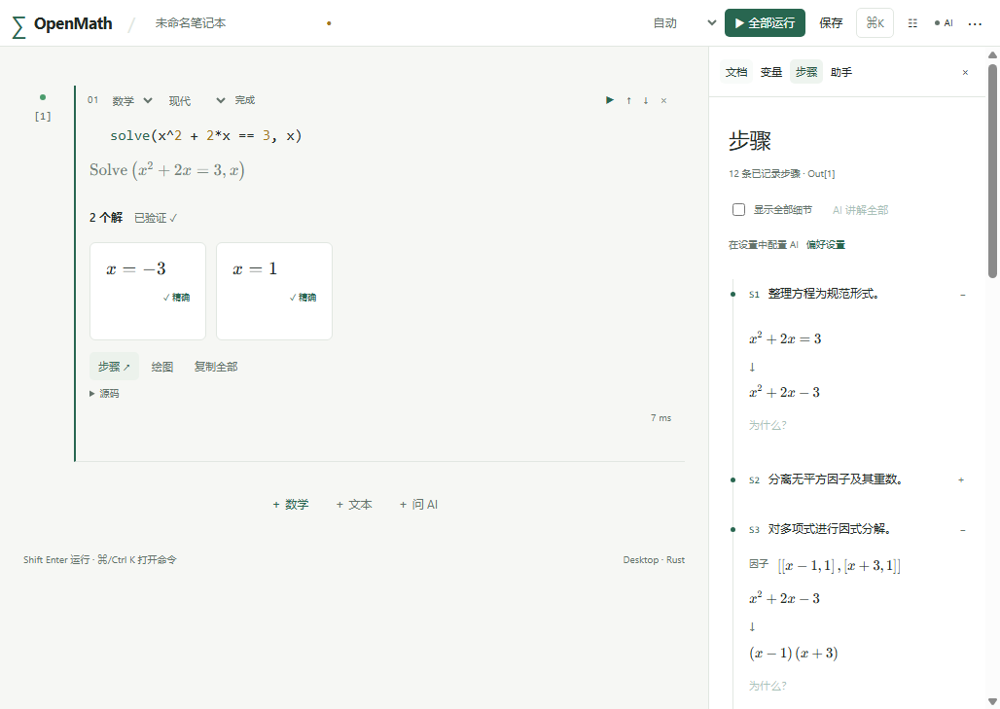

# OpenMath

[English](README.en.md) · [下载安装包](https://github.com/He-RT/om-openmath/releases) · [使用文档](docs/README.md)

OpenMath 是以方程求解为核心的开源计算机代数系统。终端、响应式浏览器笔记本、桌面应用和原生 iOS/iPadOS 客户端共享 Rust 内核，支持现代数学写法与 Wolfram 语言子集、精确解卡片、推导步骤、交互绘图和可配置 AI。

已发布 [**0.1.0-pre-alpha.3**](https://github.com/He-RT/om-openmath/releases/tag/v0.1.0-pre-alpha.3)，保留已公开的 `.1/.2`。支持有资源边界的求解子集；无法支持的问题保留原表达式并给出诊断。兼容范围见[求解指南](docs/solve.md)。

```sh
om -e 'solve(x^2 - 5x + 6 = 0, x)'
# x = 2  │  x = 3
om -e 'Solve[x^2-5x+6==0,x]'
om --json -e 'solve(x^2=2,x)'
```

AI 提议源码，由 CAS 解析、求解和验证。建议需要明确插入或运行；密钥和对话不进入笔记本文件。



Windows MSI 安装后的实际界面：精确解 −3/1 与真实推导步骤。

## 下载与安装

在 [GitHub Releases](https://github.com/He-RT/om-openmath/releases) 选择对应文件：

| 平台 | 文件 | 使用方式 |
|---|---|---|
| Windows 10/11 x64 | `OpenMath_0.1.0-pre-alpha.3_x64-setup.exe` | 推荐；中文向导，安装到当前用户目录 |
| Windows 10/11 x64 | `OpenMath_0.1.0-pre-alpha.3_x64_zh-CN.msi` | MSI 安装包，适合系统管理员部署 |
| macOS Apple Silicon | `OpenMath_0.1.0-pre-alpha.3_aarch64.dmg` | 打开后将 OpenMath 拖入“应用程序” |
| macOS Apple Silicon | `OpenMath_0.1.0-pre-alpha.3_macos_arm64.app.zip` | 解压得到 `.app` |
| Windows / macOS | `om-cli_…_windows_x64.zip` / `om-cli_…_macos_arm64.zip` | 解压后运行 `om.exe` / `om`，可加入 PATH |
| iOS/iPadOS 27 | 原生 Xcode 工程、ARM64 模拟器应用及 XCFramework | 真机通过本机自动签名安装，见[移动端指南](docs/ios.md) |
| 浏览器 | `OpenMath-web_0.1.0-pre-alpha.3.zip` | 解压到 HTTP(S) 站点根目录 |

Windows 包携带 WebView2 引导程序；系统没有 WebView2 时，首次安装需要联网下载运行时。桌面包尚未代码签名，系统可能提示未知发布者；macOS 可在确认来源后通过“隐私与安全性”允许打开。当前不提供 Intel Mac、Windows ARM64 或 Linux 安装包。详细步骤、卸载及校验见[安装指南](docs/install.md)。

每个发行版提供 `release-manifest.json`，记录同一提交构建的文件大小和 SHA256。全部分发包保留相关第三方许可文本。

## 开始使用

启动桌面版，点击“二次方程”示例，或添加数学单元格输入 `solve(x^2=2,x)`。Shift-Enter 或 Ctrl/Cmd-Enter 运行，结果卡片可查看精确值、数值近似、步骤和图像。分别运行 `let a=2` 与 `a+1`，再将定义改为 `let a=5`，依赖结果更新为 6。

原生菜单支持新建、打开、保存 `.omnb`，以及 Markdown/LaTeX 导出。`.3` 提供 [二维 SVG/PNG、纯数据 CSV/JSON 与 CLI 导出](docs/design/artifact-export.md)、[三维曲面/场景与 OBJ](docs/design/scene3d.md)。完整九类安装/应用/CLI/Web/移动内核附件已通过同提交门禁并公开，SHA256 清单随发行提供。笔记本只保存源码；导出包含当前计算结果，排除过期输出。界面提供中文和英文，默认跟随系统，可在偏好设置中切换。

AI 在设置中接入自己的模型服务，支持编辑模型、地址、能力和功能映射。Web 版需要服务允许 CORS，桌面和终端使用原生 HTTP。细节见[模型接入指南](docs/llm.md)。

## 科研计算与现代语法

`.3` 加入管道、匿名函数、范围、记录/字段、矩阵 `@` 与统一命名参数；旧现代语法、Wolfram 子集和 `.omnb` v1 继续使用。完整支持范围、参数、精度和失败语义见 [功能目录](docs/reference/README.md)。

```text
[1,2,3] |> map(fn(x)=>x^2)
integrate(exp(-x^2),x:-inf..inf,mode:"numeric")
let motion = ode(fn(t,y)=>[y[2],-y[1]],initial:[1,0],t:0..6)
sample(motion.solution,t:0..6)
plot(sin(x)*cos(y),x:-pi..pi,y:-pi..pi,view:"surface")
```

支持有边界的符号积分、极限/Taylor、机器数值积分、稠密矩阵分解、非刚性 ODE、局部优化/可认证凸二次优化、QR/LM 拟合、统计概率、可重复随机、纯数据解析和 SI 单位。新数值分析不冒充任意精度；未收敛、不可用精度、奇点、错误维度和取消明确报告。

二维曲线、参数图、隐式/区域/场/流线、密度、数据和频数图共同覆盖桌面/Web/iOS；三维网格、图元、样式、变换与旋转/光照先覆盖桌面/Web，CLI 导出 OBJ。iOS 三维明确保留源式并提示未适配。[地月 L2 与完整西瓜笔记本](docs/examples/README.md) 随仓库交付；[真实验收截图](docs/acceptance/r36b/README.md) 可查。

## 从源码运行与构建

安装 Git、仓库锁定的 Rust 1.94.0 和 Node 26.0.0。桌面构建还需要各平台系统工具，见[开发指南](docs/development.md)。

```sh
git clone https://github.com/He-RT/om-openmath.git
cd om-openmath
cargo install --path crates/om-cli --locked
cargo install wasm-bindgen-cli --version 0.2.129 --locked
npm ci --prefix app
npm run dev --prefix app             # 浏览器笔记本
npm run tauri --prefix app -- dev    # 桌面笔记本
```

```sh
npm run build --prefix app           # 静态网站：app/dist
npm run tauri --prefix app -- build # 当前平台桌面包；Windows 自动生成 EXE/MSI
# macOS 仅生成 app 与 DMG：
npm run tauri --prefix app -- build --bundles app,dmg
cargo build -p om-cli --release --locked
```

`om` 进入 REPL；`om run FILE.om` 或 `om run FILE.omnb` 顺序执行源码。使用 `:help`、`:steps`、`:latex`、`:ask`、`:explain`、`:dialect`、`:clear`，或 `om config path|show|edit` 管理原生配置。

## 文档与贡献

- [安装及常见问题](docs/install.md)、[输入语言与交互](docs/language.md)
- [求解语义与边界](docs/solve.md)、[模型接入与隐私](docs/llm.md)
- [开发与验证](docs/development.md)、[内核协议](docs/protocol.md)、[发布流程](docs/releasing.md)
- [全景功能目录](docs/reference/README.md)、[现代语言设计](docs/design/modern-language.md)、[下一版计划](docs/plan/NEXT_RELEASE.md)（规划接口尚未实现）
- [原生 iOS/iPadOS 使用与构建](docs/ios.md)、[移动端验收记录](docs/ios-acceptance.md)
- [发行说明](docs/release-0.1.0-pre-alpha.3.md)、[验收记录](docs/pre-alpha.md)、[实施进度](docs/plan/PROGRESS.md)

欢迎提交带有输入、方言、平台、期望和实际结果的 [Issue](https://github.com/He-RT/om-openmath/issues)。请不要附带 API 密钥。

以 [MIT](LICENSE-MIT) 或 [Apache-2.0](LICENSE-APACHE) 双许可证发布。[第三方声明](THIRD_PARTY_NOTICES.md)保留原许可证文本。本项目独立于 Wolfram Mathematica，也不是 OpenMath 交换标准的实现。
