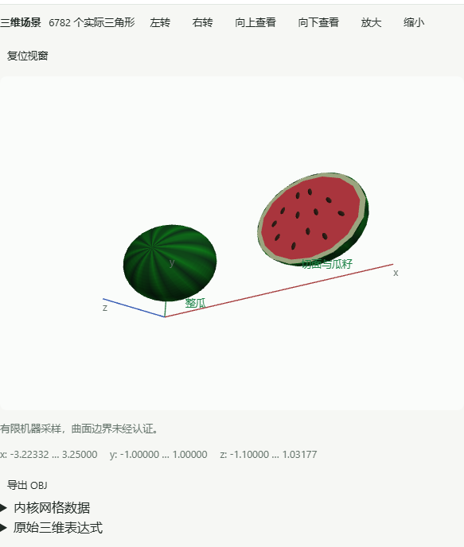

# pre-alpha.3 实际发行验收

2026-10-08（亚洲/新加坡），[公开发行版](https://github.com/He-RT/om-openmath/releases/tag/v0.1.0-pre-alpha.3) 已完成。源码提交 `0889d34e4fce9926054025ca71ea328f6cc65b39`；[同提交 CI](https://github.com/He-RT/om-openmath/actions/runs/37654889786) 和[四平台发行流程](https://github.com/He-RT/om-openmath/actions/runs/37655070652) 全部成功。标签实际回读指向该提交，历史 `.1/.2` 保留，未合并 `main`。

## 公开附件与实际程序

九类文件和 `release-manifest.json` 全部从公开 Release 下载。每个文件的字节数、清单 SHA256、GitHub 提供的 SHA256 均一致；六个 ZIP 的 CRC 和路径检查通过。移动应用为 `.3`、构建号 3、最低 27.0；XCFramework 包含真机 ARM64 与模拟器 ARM64 两个切片和许可。

[清单](../../ios-evidence/pre-alpha.3/release-manifest.json) · [逐文件回读结果](../../ios-evidence/pre-alpha.3/verified-public-assets.json)。公开 macOS CLI 实际架构为 ARM64，`--version` 返回 `.3`，精确求解返回 2/3、现代管道返回 1/4/9、1 km 转换得到 1000 m。公开 DMG 的 `hdiutil verify` 校验为 VALID；Mac 原 53 条数学与 200 ms 门槛通过，未修改期望或放宽门槛。

## Windows 实际安装

EXE/MSI 分别安装、启动真实中文 WebView2 窗口、验收后卸载。精确 −3/1、真实步骤、响应式 3→6、根式和完整西瓜 16 个网格、实际 WebGL2 像素/旋转/复位及网格 JSON 都通过。安装后的程序与各自构建输入逐字节核对，只允许既有 Tauri 安装类型标记变化，报告中 `errors=[]`。

[EXE 结果](../../ios-evidence/pre-alpha.3/windows-nsis-result.json) · [MSI 结果](../../ios-evidence/pre-alpha.3/windows-msi-result.json) · [EXE 字节核验](../../ios-evidence/pre-alpha.3/windows-nsis-payload.json) · [MSI 字节核验](../../ios-evidence/pre-alpha.3/windows-msi-payload.json)。

## 移动端、数学与范围

Xcode 27.0 / iOS 27 ARM64 模拟器：iPhone 18 Pro、iPad Pro 11-inch (M5)，各 29 项原生单元＋5 项界面流程全部通过。原 53 条数学和公式期望保持；CI 整次请求最大手机 702.975 ms、平板 374.767 ms；发行流程独立运行的最大值为 888.380 / 441.161 ms，均满足原 1 秒门槛，没有不支持的原始公式排版。整次时间包括队列、FFI、解码和恢复，不使用单独 kernel 时间冒充通过。

[同提交移动回读](../../ios-evidence/pre-alpha.3/ci-0889-summary.json) · [发行移动回读](../../ios-evidence/pre-alpha.3/release-0889-summary.json)。两 Rust ARM64 切片、XCFramework 链接与真机目标无签名构建也通过。本机未启动模拟器；云端证据不冒充本轮真机执行。

原完整科研/现代语法/二维/场景/导出实现验收见[研发账本](../../plan/PROGRESS.md)、[功能目录](../../reference/README.md)、[真实案例](../../examples/README.md)。本地最终 1085 Rust、77 前端单元、17 Python 契约、35 开发界面、34 生产界面通过；生产原 53 条最大约 180 ms 并经独立 Rust 数学期望回读。有限数值范围、精度和平台限制可查，三维先交付桌面/Web，iOS 明确保留原式与未适配提示。

原始失败与修复记录保留：Windows 网格查询选择器误读源码、设置保存提示的历史瞬态、并行构建导致的本机性能波动、旧 Mac 三次方程 207.202 ms 超限；有界定向数值共享优化后，最终同提交原门槛真实通过。用户暂缓的 VoiceOver 完整遍历、浮动键盘和真机窄窗口不计为通过，旧 iPhone 真机 UI 驱动 code 74 也不隐去。Agent/事务/幂等/撤销/框架适配仍为后续预留。
