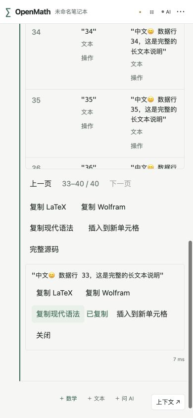
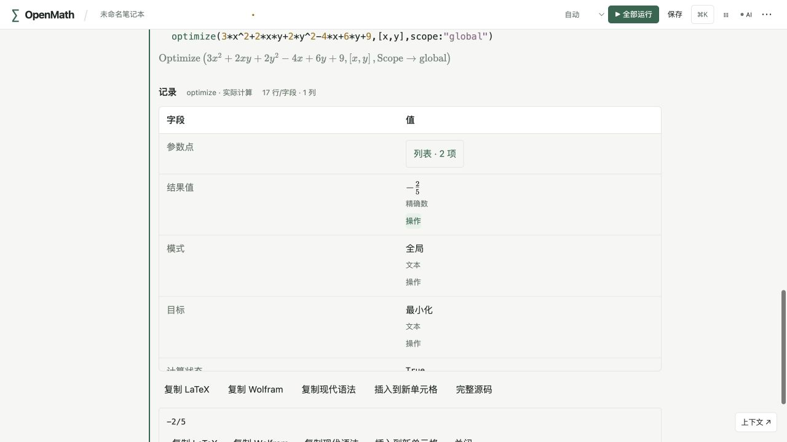

# R3.5a 结构化结果验收

本批为完整 `.3` 的数据展示基础路径，未代表二维/探索/导出/三维全部完成。

2026-10-06，真实本地Web（http://127.0.0.1:5175，实际release WASM）用40行CSV验证producer表格、1–32/33–40翻页与完整中文/emoji；在390×844 viewport核对换行、滚动与操作。实际点复制现代源式等待clipboard完成，读回为`"中文🙂 数据行 33，这是完整的长文本说明"`；不是模拟回调。记录式globalOptimize独立显示精确值−2/5/本次计算来源/精确global语义，展开参数点得到7/5、−11/5并返回上层。

图片来自Codex in-app browser真实页面，通过cua_repl截图保存，未合成或修改像素。viewport验收后已恢复默认。

内核自动测试覆盖分页行/列、producer稳定ID、文本/高精度/机器/空表、fresh来源与用户/缓存/包装记录的区别、非法/替换快照和保存源式不执行；React交互测试覆盖页返回、复制/插入、迟到回复、过期/失败及空表。本地generic iOS27无签名build已通过；新增原生协议2项与XCUITest实际表格/旋转截图在GitHub runner执行，本机未运行模拟器，运行结果以同SHA CI为准。
