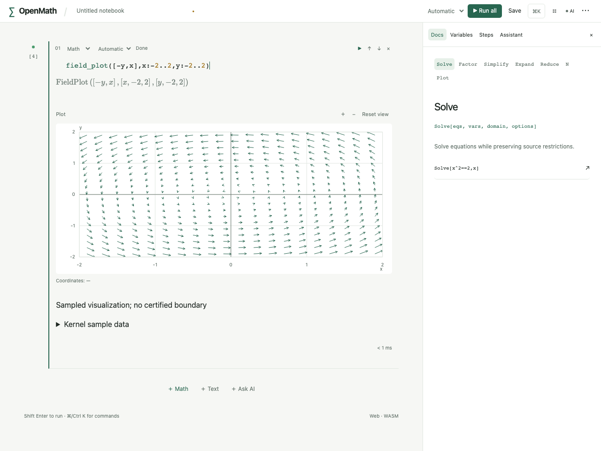
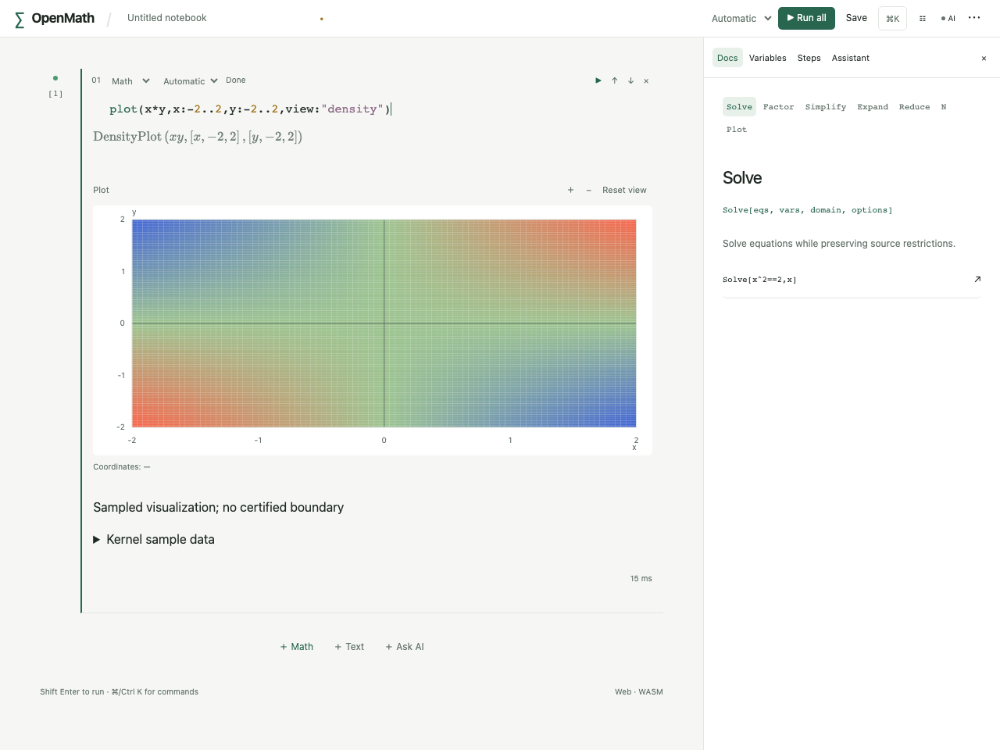
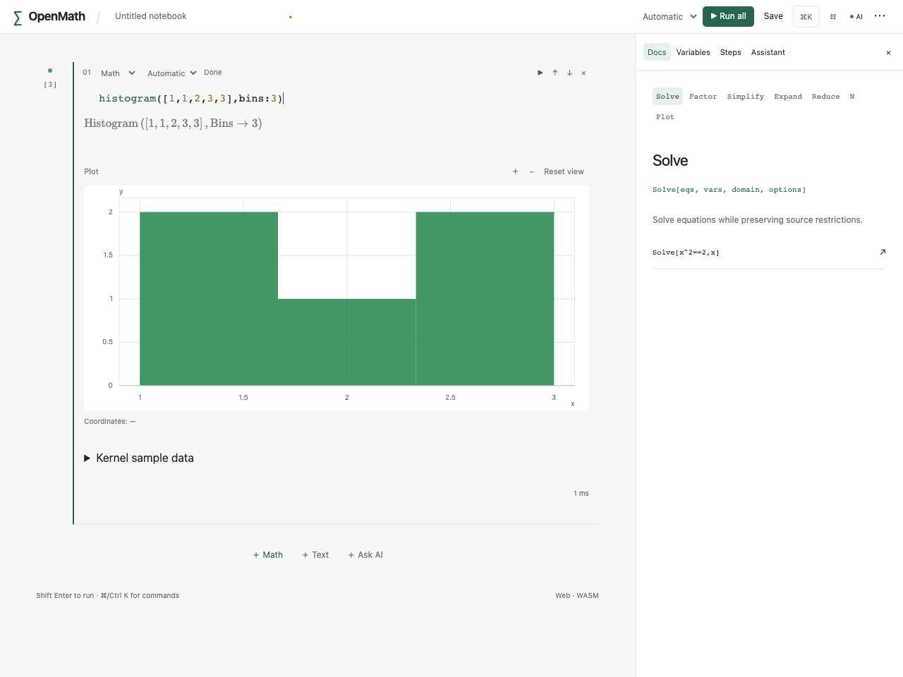
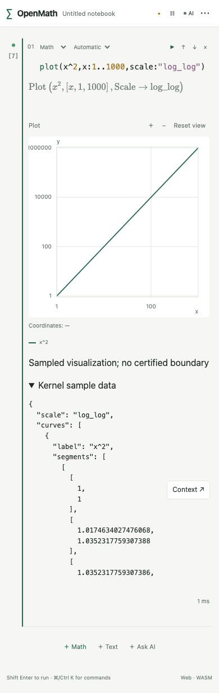

# R3.5b 二维绘图验收

本批是完整 `.3` 的二维采样和展示扩展，不代表 explore、SVG/PNG、三维或发行完成。本机没有启动模拟器。

内核 `plot_extensions.rs` 独立检查单位圆残差、布尔圆面积与真实条件、密度 x*y 值、向量 [-y,x] 与圆流线半径、直方图 [2,1,2] 计数、数据原输入顺序、热图真实值、标量等高线残差、对数原数学坐标、视窗往返、主变量隔离、高精度/非法选项/伪造请求拒绝与采样中断恢复。原绘图/解点/区域/响应式测试和53数学期望保持。

`scienceWasm.test.ts` 从实际 release WASM 取得参数圆、密度、场、频数和对数原坐标；React 测试显示真实协议字段及样本数据，原迟到/过期/取消守卫测试继续保留。Playwright 的 extended case 使用真实页面执行全部新入口，校验内核图元数量、窄390px无溢出及实际样本数据，不用合成图冒充页面。

Swift 新 `PlotExtensionTests` 使用真实 FFI 验证几何、向量原值、频数和相机；新增 XCUITest 用应用自身二维数据示例验证可访问样本与旋转。两架构 XCFramework 和 generic iOS27 ARM64 build-for-testing 在本机编译；测试执行交 GitHub CI，成功与否以新提交同SHA结果为准。

上一批 `04502f7` 的 CI `37466462251` 真实失败已核对：分页测试最后的过期请求通过 KernelClient 按契约抛错，测试错误地预期返回 error 包；SwiftUI 根标识默认下传，XCUITest误查 Other 容器。实际截图含完整表格与中文/emoji。已分别按错误契约断言和添加明确 accessibility contain 修复；不删测试、不放宽数学或1秒门禁。旧附件保留 `target/ci-evidence/r35a`。

本批完整命令和结果更新在 PROGRESS 与 P139；CI执行结果另记，未把编译当作设备UI执行通过。

实际生产 Web 页面截图（Playwright 执行内核生成几何后保存，未合成/改像素）：

最终本地门禁：1048 Rust通过、2项按原政策ignored；70前端、16Python、生产Web29项（含原53冷worker性能、最慢518ms），实际WASM结果独立读回断言通过。全Clippy/fmt/deny/纯WASM/78份TS确定生成无漂移/函数目录检查通过；两架构XCFramework与generic iOS27无签名build-for-testing成功。完整兼容回归发现并恢复implicit_plot原fn_000119/ContourPlot解析身份，原composition测试没有修改；三维fn_000220继续预留。新提交手机/平板执行以CI为准，不能拿本地编译或旧SHA结果替代。
