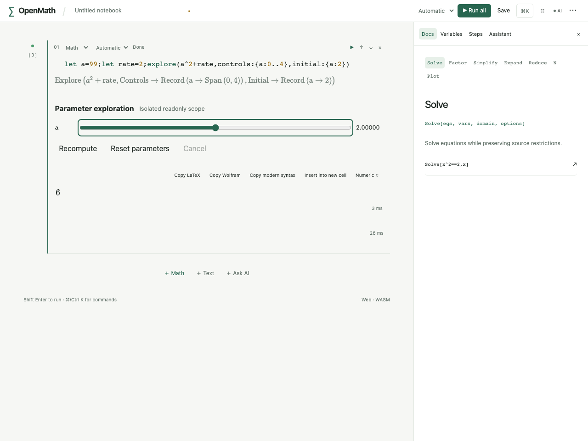
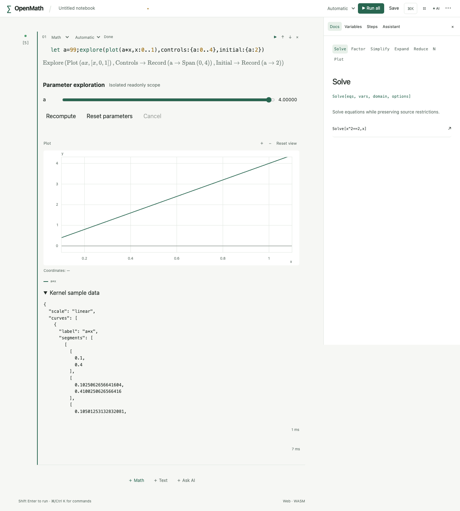
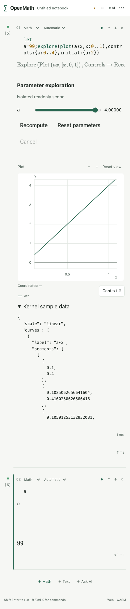

# R3.5c 参数探索验收

本批属于完整 `.3` 的探索部分；SVG/PNG/数据导出与三维仍在后续，不能宣布发行完成。本机未启动模拟器。

内核 explore.rs 用独立预期验证主变量99不变、局部a从2到3的矩阵值、y=4x曲线、冻结函数f(x)=2x与主定义改为20后的独立值8、真实高精度值/原极点/随机状态往返、Out取前一次值、正确局部/范围依赖、非法controls/写入/越界/旧ID拒绝、平坦结构图损坏/版本拒绝以及取消中途不造部分成功、下一独立任务恢复。

React任务测试验证专用Worker确实被终止，迟到回调不能更新当前结果，并检查主kernel只收到快照请求（无slider Evaluate/assign/interrupt）。实际release WASM测试从真实主会话取上下文、修改主定义再由独立Kernel计算；验证矩阵真实值和独立任务无笔记本写入。

Playwright explore.spec.ts是实际生产页面：创建a=99和探索表达式，用真实滑块/Worker计算、快速变参、二维平移、主会话探测a仍为99、390px控件/无溢出和源文件下载检查。截图与最终运行结果在本批收尾写入；未执行项目不当作通过。

Swift ExploreTests使用实际FFI主/独立会话验证真实矩阵、冻结定义和旧快照拒绝；XCUITest连接应用参数示例、滑块最大端点16与旋转。generic iOS27编译可在本机执行，iPhone/iPad运行由新提交同SHA CI验证，不能把编译成功或旧SHA绿灯替代执行结果。

实际生产页面截图（真实WASM任务完成后由Playwright保存，未合成/改像素）：

生产页面探索流程与全套30项（含原53冷worker性能，最慢556ms）已通过；开发页面完整流程另验。保存检查使用真实下载文件，不含context/view_id；新增单元格探测主变量，不使用会重新执行原单元格的Shift+Enter混淆保留状态。显式重新运行单元格将按initial复位，这是新的producer快照。

最终本地检查：完整工作区1055项Rust通过、2项按原政策ignored，随后追加已有用户explore绑定优先级用例并重跑8项探索用例通过（总覆盖1056）；73前端含真实release WASM、16Python、开发页面31+按政策略过性能例、生产页面30含原53性能/独立数学回读均通过。全Clippy/fmt/纯WASM/81份协议生成无漂移/目录/deny通过；两个ARM64切片XCFramework与generic iOS27无签名build-for-testing成功。新Swift测试未在本机执行，运行与最终发行门禁待同SHA CI。

首次回归中CLI/reflection/runtime_catalog原先把explore作为规划项的断言已改为已接通稳定ID的正向断言，并继续验证scene/Agent规划不进入执行集合；没有修改原53数学期望。日志保留target/r35c-tests*.log，完整成功以tests-complete为准，追加用例以explore-complete为准。
