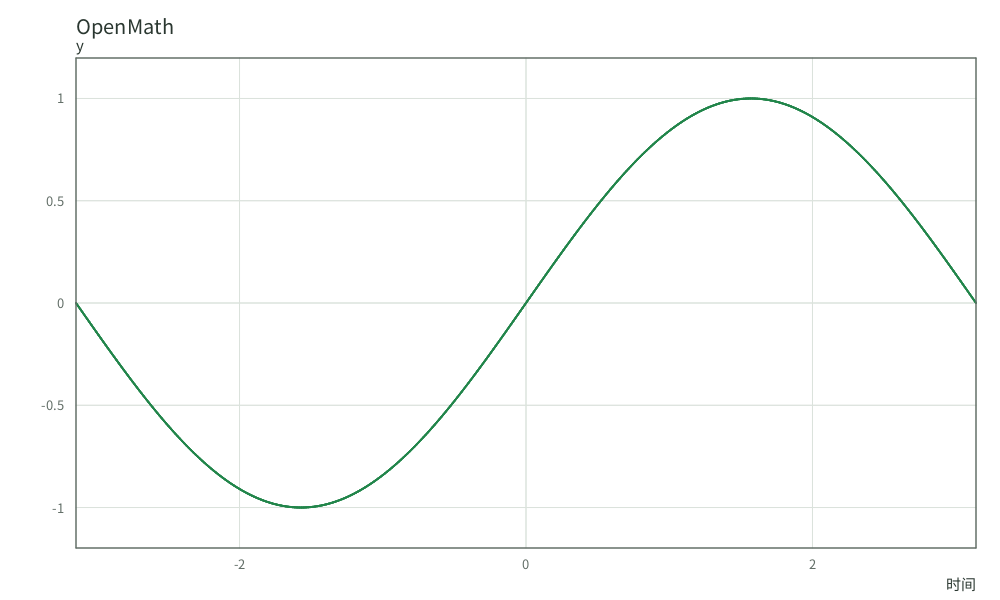
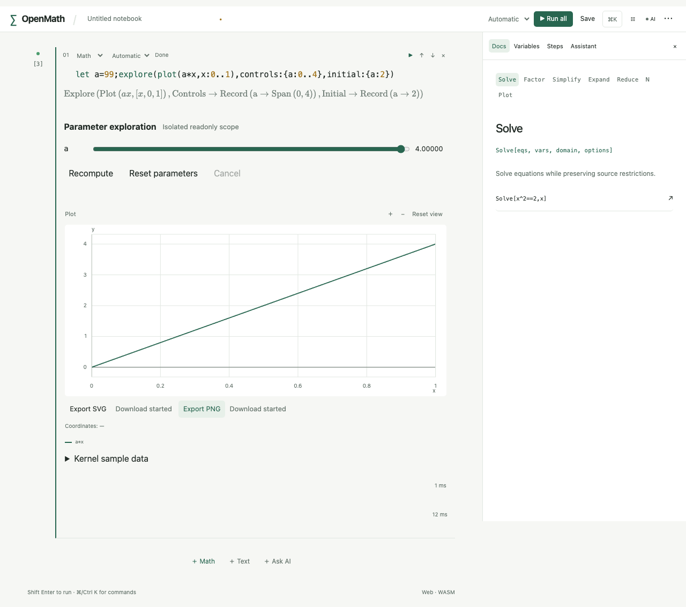

# R3.5d 产物导出验收

本批完成图形/纯数据的实际产物路径，三维/OBJ/L2/西瓜与最终发行门禁仍未完成。本机未启动模拟器。

内核artifacts.rs独立检查SVG解码后的全部原数学坐标、Unicode与XML转义、参数4；PNG逐块CRC32/存储zlib/Adler32/scanline、1000×600 RGBA、真实已知零函数像素、中文/希腊字形非空、UTF-8数学元数据；40行表格全部导出、嵌套路径、CRLF与emoji、探索参数3的真实矩阵导出、旧快照/伪造几何/颜色/非数据/取消失败。未改原53数学期望。

CLI两真实进程测试验证svg/png/csv/json写入与readback回执、既有目标不被覆盖、非法源式不写文件、source-only笔记本实际末值与仅export命令接受的选项。浏览器真实生产页面使用下载文件回读40行CSV/JSON、参数a=4的SVG原点和PNG元数据/独立Node zlib、参数a=3的探索矩阵CSV；不是合成图或只检查文件后缀。

Swift新增ArtifactTests检查真实FFI CSV字节、PNG由UIImage读取1000×600、临时文件实际write/readback；运行交同SHA CI，不能把generic build当手机/平板通过。Tauri二进制保存能力只对用户选择文件开放；GUI保存代次测试确认旧回复不触发宿主写入。

上一批969442e/CI37490647513的Rust/Web/依赖通过、iPhone UI探索测试失败已查真实附件：a=4、画面16与原生ScrollView identifier expression.16.均存在，测试错误地只查Other类型。已按真实类型通用descendants查询固定数学结果，不删测试、不放宽1秒门槛；旧附件保留target/ci-evidence/r35c。

完整本地/同SHA结果和实际CLI文件、PNG视检在本批收尾填写；没有运行的项目不当通过。

实际非交互CLI文件：sine-chinese.png（1000×600 RGBA）由Pillow独立解码，iTXt中的axis_x=时间与全部原坐标读回；人工视检曲线/数字/中文轴名完整、无空标签。field-greek.svg由XML解析器读回400真实向量及希腊坐标名。文件来自实际om命令，不是生成图片工具或截图冒充导出。

[实际希腊轴向量场SVG](field-greek.svg)

最终本地门禁：1063Rust通过、2项按原政策ignored；74前端、16Python、开发页面32（原性能例按政策略过）/生产页面31含原53冷worker最大500ms、实际WASM结果独立Rust回读数学断言；全Clippy/fmt/纯WASM/85协议TS无漂移/目录/deny通过。字体为最终Swash/Skrifa路径，ttf-parser/fontdue已从当前依赖图移除；没有加忽略规则。两ARM64切片XCFramework与generic iOS27无签名build-for-testing成功，Swift设备/模拟器测试由新同SHA CI执行，本机未启动模拟器。日志以target/r35d-tests-final.log、swash-test.log、cli.log、clippy-complete.log、frontend.log、preview-final.log、development.log、wasm-corpus-final.log、wasm-final.log、bindings-complete.log、python-final.log、deny-final.log与ios-build-final.log为准；旧字体与中途编译失败日志保留。
