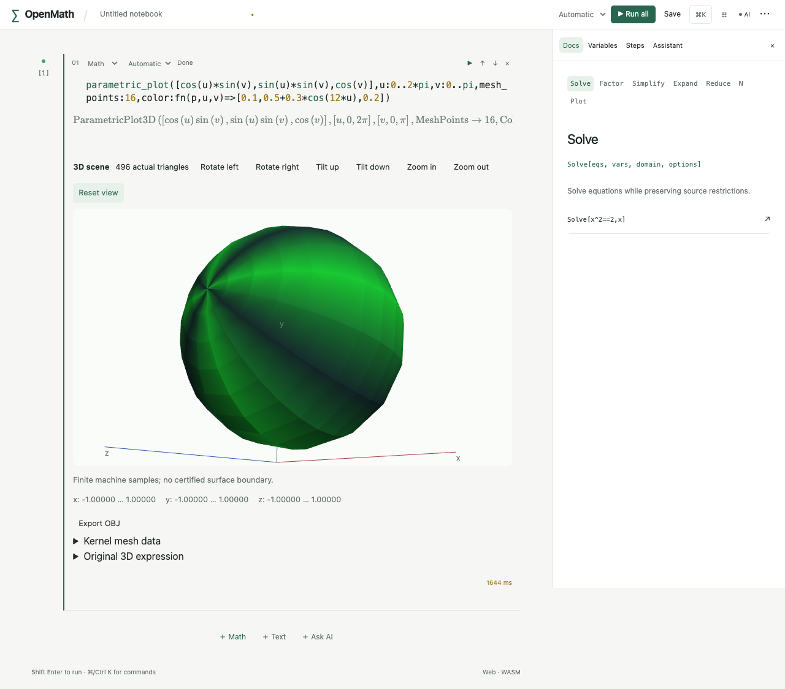
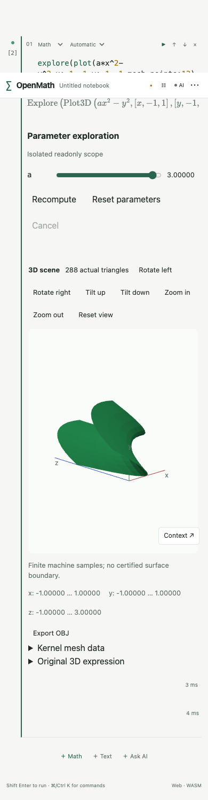

# R3.6a 三维基础验收

本批为完整 `.3` 的三维采样/显示/OBJ基础路径，场景图元/变换、L2/西瓜和发行门禁仍继续，不提前发布。没有本机模拟器。

scene3d.rs独立验证z=x²−y²残差、参数球单位球面残差/法线单位长度、真实螺线坐标与参数color函数值、常量参数曲线位置、隐式球边根残差/外向法线、1/x极点不造零曲面、主x/y/z=99/88/77不捕获、已有用户parametric_plot绑定优先、真实全轴静态依赖、高精度/维数/颜色/只读写入拒绝、冻结a从2→4只改变局部几何、iOSdata=None不自动采样与取消后恢复。

OBJ独立读回v/vn/f/l：所有世界顶点/真实RGB/法线与实际三角形/曲线对应，单位球和螺线解析残差检查，没有用前端再求数学函数。CLI真实进程导出螺线OBJ，不承诺窗口。

Playwright真实生产页面使用WebGL2 software renderer测试实际内核参数球：GPU readPixels非空/旋转像素变化、缩放面积增加、复位像素哈希相同；实际下载OBJ的世界球面残差和metadata读回，冻结探索三维更新、390px无溢出。软件GPU用于可复现图形验收，不是生成截图代替绘制；运行内容仍是实际WebGL2 shader和内核几何。无WebGL2单测保留源式/导出、隐藏空画布，不冒充显示成功。

Swift SceneTests通过真实FFI声明iOS能力并验证三个实际三维请求返回源式与明确fallback而没有网格；本机仅generic iOS27/两切片构建，执行交新同SHA CI。旧7432f5c/37501856990导出提交已全CI success含iPhone/iPad，它不能替新三维提交的执行门禁。

最终完整回归、原53性能、真实截图与CI结果随本批收尾填写；未执行项目不标通过。

实际页面截图与CLI产物（真实内核/WebGL2绘制，未合成/改像素）：

[真实CLI世界坐标螺线OBJ](helix.obj)

最终本地门禁：1073 Rust通过、2项按原政策ignored；77前端、16Python；开发Web33（旧性能例按政策略过）、生产Web32含原53冷worker整次性能（最终最大646ms），独立数学回读通过。全Clippy/fmt/纯WASM/91份TS确定生成无漂移/目录/deny通过，两ARM64切片XCFramework/generic iOS27无签名build-for-testing成功。最新surface选择器严格要求两个数学轴，原单轴surface拒绝用例保持；三坐标曲线升级为有效3D后，原“错误维数”用例改四坐标继续拒绝。显式注册清单追加三个真入口，原53数学期望没改。

完整workspace以target/r36a-tests-final3.log为最终success；前轮elementary显式清单/旧维数negative/单轴surface选择器失败日志保留，未冒充通过。最后一轮Clippy为clippy-final3，生产页面为preview-final3（终止success），源码已冻结；原生执行仍交新提交同SHA CI，不能以旧7432f5c成功替代新提交。
