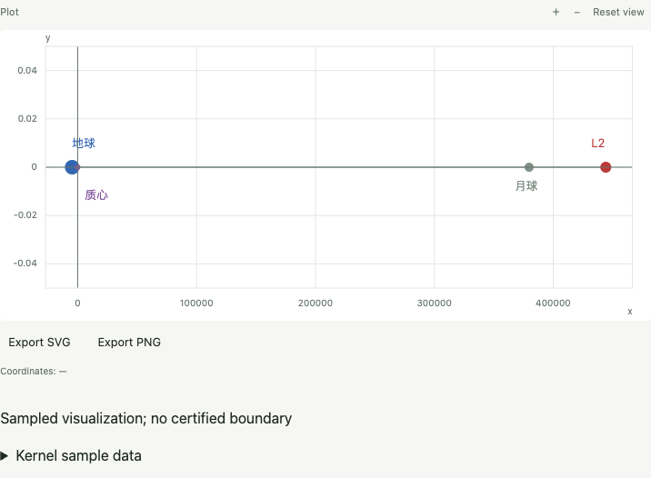
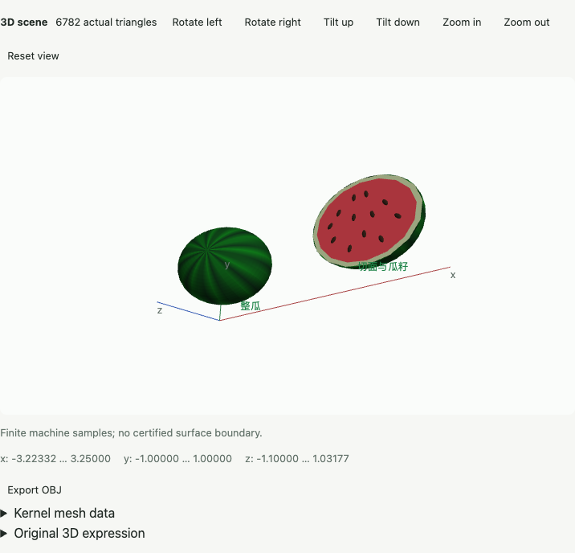
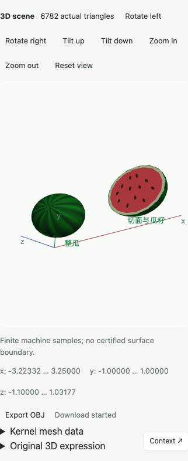

# 场景图与科研案例实际验收

日期：2026-10-07。源码见[案例目录](../../examples/README.md)，接口见[有限场景设计](../../design/scene-graph.md)。本记录中的截图来自真实生产 Web 页面；没有合成或修改像素。本机未启动模拟器，Swift 实跑交 GitHub CI。

## 两个完整案例

地月 L2：原始精确 GM 分数与 50 位局部求根得到质心 x≈444244.2226008393 km、地心 x≈448914.9072421657 km、距月球≈64514.9072421657 km，无量纲平衡残差约 −2.4055×10⁻⁵⁰。独立机器计算重新检查力平衡；二维标记的屏幕横坐标距离比与实际地月/L2 距离比一致。SVG 导出回读包含原始位置与中文标签；数值报告保留高精度，绘图边界显式转换机器数。

西瓜：16 个真实网格，包括整瓜、半瓜、皮层、切面与 12 个瓜籽；实际 6782 个三角形，两个中文标签。独立检查条纹颜色范围、半瓜 z≤0、皮层/切面/瓜籽颜色与瓜籽位于切面内部，单位法线与世界坐标变换。真实 WebGL2 framebuffer 中的绿色、红色和深色像素均达到独立阈值，旋转改变像素、复位恢复原像素。OBJ 下载后实际读取顶点/法线/面及完整数据，网格数和面数与内核一致。

生产 Web 两案例用例通过，约 25.5 秒；西瓜的完整 UI/下载约 17.7 秒。这是有限颜色/网格和图形导出的整个场景流程，不属于原 53 条单项求解的 1 秒性能断言。原 53 条冷生产 WASM 计算全部通过原门槛，并经独立 Rust 数学期望回读，不修改任何数学期望。

## 数学、协议与失败

`scene_graph` 九项独立验收覆盖所有图元、凹多边形面积、变换中心、镜像法线、圆柱/圆锥/管道法线、零缩放退化为实际线/点、总资源超限、自交/非共面/非法半径/完全折返/未知参数/高精度拒绝与只读写入隔离。`style`/RGBA `blend` 有真实分量与 alpha 验收。含下划线的变量/函数/轴/探索参数在内部 InputForm 回读中保持身份；外部 Wolfram `x_` 继续表示模式。Auto 的明确现代程序与 `p[1]` 组合真实通过。

原先将 scene 当作 planned 的目录负向断言更新为真实稳定身份正向验收，并保留 polar_plot/Agent 未执行负向门禁。Wolfram 分号仍是合法 CompoundExpression，新序列化读取器只拒绝多条独立语句；没有为通过测试删除合法语法或修改原 53 数学期望。

两 ARM64 Rust 切片、XCFramework 创建和 generic iOS 27 无签名 `build-for-testing` 成功。新增 Swift 场景源式 fallback/二维中文标签与变换 FFI 测试随 CI 执行，构建成功不计为真机/模拟器执行成功。用户已暂缓的旁白、浮动键盘和真机窄窗口组合不重新要求人工执行，也不计为通过。

## 记录位置

本轮最终日志为仓库忽略目录 `target/r36b-*`：`graph-complete`/`boundaries-closure`、`scenario-screenshots`/`preview-final`、`wasm-performance`/`wasm-corpus-final`、`ios-kernel`/`ios-build`、`frontend-final`、`clippy`/`deny`/`bindings`/`wasm-core`。中间失败日志保留；完整工作区与最终发行的真实结论继续记入[进度账本](../../plan/PROGRESS.md)，不能用旧 SHA 的成功代替最终提交门禁。

界面依据及宿主映射见[场景图设计](../../design/scene-graph.md)；截图证明真实展示，保存成功另以实际文件字节回读确认。
