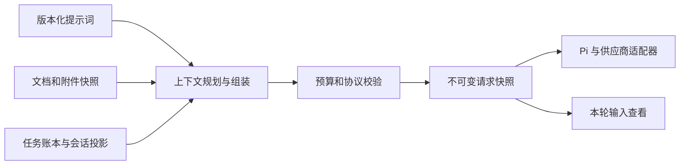

# Mac Agent 上下文和提示词管理设计

[Notebook Agent](notebook-agent.md) · [输入框与媒体](agent-composer.md) · [下一版待办](../plan/NEXT_RELEASE.md)

2026-10-08。下一版 Mac Agent 采用分层提示词、可检查的请求快照和独立任务记忆。管理界面同时回答「长期规则是什么」与「本轮实际发送了什么」；模型推理所用的上下文、完整会话记录、笔记本源码和执行权限分别管理。本方案尚未实现，运行核心仍为 Pi Agent Core。

## 调研结论

以下对照来自实际读取的官方文档和用户指定的本机页面；框架能力、可见配置与 OpenMath 的目标设计分别说明。

| 参考 | 已核对的机制 | OpenMath 采用的设计 |
|---|---|---|
| [DeepSeek Harness](https://github.com/deepseek-ai/deepseek-harness/blob/5badb15009ae1756c3afe0ae0cef1faafc290ccc/packages/core/system-prompt/README.md) | 注册有序提示词分段、作用域覆盖、变量及工具 schema；动态上下文单独组装 | 确定的层顺序、来源/作用域和变量验证，避免把实时笔记本状态拼进每轮变化的系统前缀 |
| [Codex 项目指令](https://learn.chatgpt.com/docs/agent-configuration/agents-md)与[配置](https://learn.chatgpt.com/docs/config-file/config-reference) | 全局及项目 AGENTS.md 链；附加 developer_instructions 与替换 model_instructions_file 有不同含义 | 区分产品默认、个人偏好、笔记本规则和临时任务；界面区分「添加规则」与「替换用户配置」 |
| [本机 opencodex](http://localhost:10100/#codex-set/prompt) | 提示词页列出基础、个性、上下文窗口指引、AGENTS.md、权限、模式、环境、应用/插件/工具/技能等层，部分带开关与大小；提示对新会话生效 | 按层展示来源、大小和生效时机；额外提供本轮实际输入快照，配置开关不等于发送证明 |
| [Claude Code](https://code.claude.com/docs/en/memory) | 用户维护的项目规则与 Agent 写入的 auto memory 分开；规则可按路径加载，记忆可检查/修改，详细主题按需读取 | 明确偏好和事实记忆的区别；短索引加按需内容，用户能修改/删除记忆 |
| [OpenCode 规则](https://opencode.ai/docs/rules/)与[压缩配置](https://opencode.ai/docs/config/#compaction) | 项目/全局规则及自定义 instruction 来源；自动 compaction、旧工具输出 prune 和预留窗口是独立配置 | 规则有作用范围；输出裁减与历史摘要分别处理，保留生成回复所需窗口 |
| [Pi Core](https://github.com/badlogic/pi-mono/blob/503c605528f9af993c0e37ede468cf884fb0ff5b/packages/agent/README.md)、[Coding Agent 压缩](https://github.com/badlogic/pi-mono/blob/503c605528f9af993c0e37ede468cf884fb0ff5b/packages/coding-agent/docs/compaction.md)与[技能](https://github.com/badlogic/pi-mono/blob/503c605528f9af993c0e37ede468cf884fb0ff5b/packages/coding-agent/docs/skills.md) | Agent Core 提供上下文转换与请求钩子；Coding Agent 另外实现会话压缩、分支摘要和按需技能 | 保留 Pi Core，使用 OpenMath 自己的上下文/记忆服务；不能把完整 Coding Agent 的能力当作 Core 已自动具备 |

本机页面实际标题为 opencodex proxy dashboard，显示版本 2.75.0。这里只分析其可见层配置与生效提示，没有更改开关/配置，也不将其界面宣称的层等同于本次 Codex 会话完整内部输入。OpenMath 的内置提示与实际请求快照由自己的运行时提供。

## 当前 OpenMath 基础

现有 `crates/om-llm/src/prompts.rs` 为翻译、讲解、修复和聊天渲染固定 Markdown 模板；聊天追加实际对话，并提供只读 CAS 与源码建议工具。`app/src/state/assistant.ts` 会把旧工具记录整理成聊天文本。函数能力目录已经存在，但当前没有可编辑的 Agent Prompt Registry、完整工具对话账本、ContextSnapshot 或通用会话压缩。

旧 Ask、补全、讲解和错误修复继续使用现有功能路径。新 Agent 不重复套用旧 LlmChat 工具循环；其上下文管理接入此前规划的 Mac 单轮模型请求与笔记本事务服务。

## 三类状态

1. **提示词配置**：稳定的产品行为、用户偏好、笔记本规则及工作流模板，具有独立版本。
2. **本轮上下文**：从配置、当前文档、有效结果、附件与会话投影生成的请求快照，绑定模型、任务及源码版本。
3. **任务记忆与历史**：用户目标/约束、真实修改/执行回执、未完成工作和原始会话记录。原始记录保留，进入模型的视图可以缩小。

提示词文字不能扩大宿主的执行范围；关闭某个说明层也不能改变实际可用工具或版本检查。笔记本/附件内容属于数据，只有用户明确通过规则管理入口设置的内容才成为配置规则。

## 提示词与上下文层

| 层 | 内容与来源 | 管理方式 |
|---|---|---|
| 产品基础 | OpenMath 职责、CAS 事实、精确/近似和完成状态的基本含义 | 短而稳定，可查看，随应用版本更新 |
| 模式与工具 | 当前讨论/执行模式、获准的笔记本范围、实际工具 schema | 宿主生成，只读；工具顺序和身份固定 |
| 个人偏好 | 默认语言、表达风格、通常使用的方言和显示习惯 | 用户编辑/启停，个人范围 |
| 笔记本规则 | 本文档的符号约定、单位和工作要求 | 用户管理，仅绑定当前文档，不能从全部源码自动推断成指令 |
| 工作流模板 | 解题、绘图、科研检查等专项说明 | 首版内置小集合，明确选择或按需加载，不默认展开所有模板 |
| 当前任务 | 用户原始目标、后续纠正、禁止事项、尚未完成要求 | 保留来源及消息身份；最新明确要求在相同用户作用域内优先 |
| 文档事实 | 标题/版本、当前选区、相关单元格源码、定义/依赖及过期状态 | 读取实际宿主快照，随文档变化刷新 |
| 结果和媒体 | 有效输出摘要、结果引用、实际附件或提取内容 | 按需提供，注明生产版本、页码/时间范围和处理状态 |
| 最近会话与摘要 | 真实用户/助手/工具对话及更早历史摘要 | 保持工具调用与结果配对，压缩后能追溯原记录 |

这是语义层分类，不把所有层都提升成 system 指令。产品行为与工具协议由可信宿主渲染；用户规则保持其用户来源，动态事实/附件/摘要不获得执行权限。各供应商的实际 role 转换由适配器处理，来源分类与原身份始终保留。

同一配置键按个人默认 → 当前笔记本 → 本次任务确定适用值；用户本次明确要求可改变个人/笔记本默认，数学事实和实际工具限制由内核及宿主决定。自由文本无法自动判断冲突时，展示作用范围与最终启用来源，不伪造「冲突已解决」。

产品基础的示例方向为：使用实际 CAS 与已实现函数；按事务修改笔记本；检查真实输出及版本；如实区分已修改、已执行和已保存。避免默认塞入与笔记本无关的终端、多代理或全部插件说明。

### 变量与模板

默认保存原样文本。只有标为模板的用户配置层才解析受支持变量，例如 locale、document.title、document.revision、active_cell.id 和 model.display_name。未定义变量使新版本校验失败并保留旧版本；不把变量内容再次展开，不对数学源码、附件或工具结果做模板插值。

变量没有凭据、任意路径读取、网络请求或执行脚本能力；环境事实由宿主提供。排序采用稳定的层 ID 与显式顺序，不以插件注册先后、当前时间或随机 ID 改变模型输入。

## 软件操作教学

让模型会用 OpenMath 采用短操作指引、实时能力索引、已验证例子和实际执行检查共同完成。操作指引草案见 [Notebook 操作提示词](prompts/notebook-operation.md)，不把整个科研目录、其他软件手册或规划工具默认展开到每轮输入。

宿主启动任务时提供当前 kernel_version、metadata_version、方言/语言特性、可用工具、平台展示能力和文档绑定。当前 GetCapabilities 已有版本及计算/展示信息，但没有完整语言特性字段，也没有 Agent 授权；下一版需补对应来源或提供版本化的已验证语言说明，未知项交给 Preview 核对，不能根据空权限字段授予写入。

函数接口继续取 GetFunctionCatalog 的真实回调过滤结果；签名、参数、默认值、返回限制和示例来自同一元数据/验收来源。用户已定义函数与内置别名冲突时，以实际解析/会话绑定为准。工具不确定时查文档，代码写入前检查最终源码，执行后检查真实结果与诊断。

短例覆盖赋值/等式、函数定义、列表、求解和图形；失败例覆盖未知接口、无效参数、语法问题、超限及版本冲突。完整 few-shot 只从已通过验收的工具对话生成；源码验收与模型操作验收分别记录。评估目标是实际完成任务、保留数学语义和用户编辑，不是生成看起来正确的回答。

## 界面入口

沿用底部输入框。上下文圆环打开简短用量卡片，并提供「查看本轮上下文」「管理提示词」「任务记忆」三个入口；历史回复也能打开产生该回复的上下文快照。

```text
上下文和提示词
本轮输入 | 提示词配置 | 任务记忆

本轮输入
  模型 / 请求身份 / 笔记本版本 / 用量来源
  产品基础           只读   应用版本
  个人偏好           已用   配置版本
  绘图工作流         已用   按需加载
  单元格 3           已用   源码版本
  参考图             已用   附件身份与处理方式
  更早对话           摘要   查看原记录
  查看本轮消息顺序 · 查看工具描述

提示词配置
  个人 / 当前笔记本 / 工作流
  编辑 · 启用 · 查看差异 · 恢复历史版本
  保存新版本 · 应用到当前会话下一轮
```

**本轮输入**显示源类型、作用范围、为何加入/未加入、实际消息顺序、原版本与用量估算方法。媒体展示引用及本轮提交的处理结果；HTTP 认证、Keychain 值和密钥不进入查看或导出。正式显示必须来自发送前记录的快照，不能在回复结束后用最新配置重拼一个旧请求。

**提示词配置**支持增删改、启停、个人/笔记本范围、模板选择、校验、版本差异和恢复。自动生成的事实、工具 schema 和产品基础可查看；这些字段不提供伪装成业务配置的编辑开关。首版不支持任意脚本型提示词插件。

保存成功以宿主持久化和回读确认；失败保留旧版本及编辑草稿。保存默认影响新会话，当前会话显示待应用版本，用户可以选择在下一次请求边界应用；已经发出的模型请求保留原快照。临时任务要求直接按已有追加输入机制处理。恢复旧文本仍产生新配置版本，不倒退历史记录。

**任务记忆**展示当前目标、明确约束、真实修改、待检查结果及剩余事项。用户可补充/纠正，模型建议的长期偏好先显示为候选；长期保存需要用户明确选择。删除记忆只影响后续上下文，不删除笔记本或撤销过去的修改。

## 请求组装

主提示词、全部实际暴露的原生工具声明及模型可见结果共同组成输入；具体工具描述、完整参数 schema、返回结构和错误恢复见 [工具契约](agent-tools.md)。数学函数目录按需查询，不把 12 个操作工具的声明藏在宿主或仅给出名称列表。

Mac 宿主管理 PromptRegistry、MemoryStore、文档/附件事实及授权范围；Pi 适配层负责把 OpenMath 的消息视图转换成当前版本支持的 transcript。业务状态不直接保存为 Pi 内部对象。

具体所有权和生命周期见 [原生宿主与状态契约](macos-host-state.md)：文档与操作事实由 Rust 产生，Swift 协调原生草稿/会话和系统服务，Pi 仅循环。来源版本、事件序列和已接纳 checkpoint 分开记录，计算或模型等待不阻塞 MainActor/文档控制通道。



每次请求按以下顺序准备：

1. 等待上一轮工具组结束；同步已确认草稿，读取文档代次/版本和配置版本。IME 中的目标单元格保持既有保护。
2. 获取当前模式允许的实际工具，按稳定身份排序；取短能力摘要，详细函数资料通过 get_function_docs 按需查询。
3. 选择有效偏好、笔记本规则、任务要求、相关源码/输出和附件，记录每个来源的身份、版本及适用理由。
4. 组装最近完整对话、任务摘要与新的事实变化，执行预算和工具配对校验；必要时整理视图。
5. 保存不可变 ContextSnapshot，再发起模型请求。实时追加或配置变化留到下一请求边界；修改笔记本的工具仍需检查最新文档版本。

Pi 的 prepareRequest/transformContext/convertToLlm 等接口承担转换与请求准备；采用当前固定版本的真实生命周期。编译后的消息必须实际用于 streamFn 请求，不能只生成漂亮预览。内置 system/tool 变更依 Pi 版本和供应商能力记录更新，避免直接改写只读 state 或遗漏工具声明。

## 稳定前缀和上下文预算

稳定的产品基础、模板版本和工具 schema 保持相同顺序与格式；实时文档状态和用户追加内容放在适当的后续上下文位置。只有来源真的变化时记录更新，不每轮向前缀追加当前时间、整份函数目录或完整笔记本。

DeepSeek Harness 的复用取决于渲染稳定性及适配器的 systemPromptUpdate 能力，改变早期内容可能失去前缀复用；不能把「追加消息」等同于所有模型保证缓存命中。[缓存与提示更新机制](https://github.com/deepseek-ai/deepseek-harness/blob/5badb15009ae1756c3afe0ae0cef1faafc290ccc/packages/core/system-prompt/README.md#model-experience)

预算使用实际模型上下文窗口、配置的输出预留和明确的安全余量：

```text
可用输入预算 = 上下文窗口 - 输出预留 - 安全余量
```

输出上限不能充当上下文窗口。供应商上一轮 usage、当前 tokenizer 计数和预估分别标明；图片/音视频成本依适配器规则，不把 base64 字符数或会话累计计费当作本轮 token。模型上限未知时显示未知，使用保守的有界读取策略；有可靠容量前不承诺精确百分比或自动压缩阈值。

供应商/模型/预设与实际部件来源进一步见[模型媒体契约](model-media.md)：区分 total_context_tokens、max_input_tokens、max_output_tokens，单有输入/输出上限不相加伪造总窗口；分别满足已知的输入限制与总预算约束。Pi 投影与宿主 canonical rich messages 要核对真实身份/顺序，原生音视频/文件是否发出由实际 wire 与冻结快照证明。

自动整理的初始目标为在预计下一请求接近可用输入预算时触发，并留出摘要请求空间；阈值在实际模型/媒体适配验证后确定。触发值、保留区间、摘要输出预留和单次重试上限属于配置，不能照搬某个框架面向大窗口的固定 headroom。

## 会话整理和任务摘要

原始消息、实际工具调用与结果及笔记本事务回执保留为追加记录；模型使用的是由这些记录生成的 ContextView。隐藏一条界面消息、从未来上下文排除它、压缩它以及删除原始记录是不同操作。

整理按成本从低到高进行：

1. **按需加载**：只展开当前相关工作流和函数资料，减少重复说明。详细技能不在每轮默认载入。[Pi 技能机制](https://github.com/badlogic/pi-mono/blob/503c605528f9af993c0e37ede468cf884fb0ff5b/packages/coding-agent/docs/skills.md)
2. **工具输出引用**：大表格、长解和三维网格提供有界摘要与 output_ref，原数据保留，必要时用 inspect_result 分页读取。错误、条件、精度和过期状态不能被摘要省略。
3. **附件范围**：保留实际附件及衍生资源，近期所需图片/页/时间段进入模型，其余保留引用和可读取范围；不宣称已读完未覆盖内容。
4. **历史摘要**：压缩较早的完整对话段，近期用户要求、尚未完成的工具调用及其配对结果保留。摘要只在边界有效、成功且确实缩小后提交。

DeepSeek 的工具结果 pruner 在日志中保留原内容，缩短模型可见文本；basic compaction 另用模型总结历史。OpenMath 采用这两种操作分离的原则，但数学结果优先使用结构化摘要和引用，不能简单砍掉长表达式中间的条件。[工具裁减](https://github.com/deepseek-ai/deepseek-harness/blob/5badb15009ae1756c3afe0ae0cef1faafc290ccc/packages/compaction/compaction-tool-result-pruner/README.md)、[历史压缩](https://github.com/deepseek-ai/deepseek-harness/blob/5badb15009ae1756c3afe0ae0cef1faafc290ccc/packages/compaction/compaction-basic/README.md)

任务摘要至少保留：用户目标/约束、已经确认的决定、修改单元格与事务身份、已运行源码版本/结果引用、真实错误、仍需检查的内容及下一步。来源编号与实际回执由宿主补入并校验；模型生成的摘要不能自行把未执行任务标完成，或把其推断变成内核证明。

压缩期间不写主笔记本。摘要失败、取消、不缩小、配对无效或来源发生冲突时保持原视图，不静默丢弃用户内容；对已确认的上下文超限最多做一次有界整理恢复，再不满足就给出具体预算问题。压缩不能解决一条超大的不可分割输入，应改为引用/分页。

跨模型切换先按新容量和多模态能力重新规划。供应商专用压缩对象、签名和推理回放由适配器判定可移植性，不能直接改成普通用户文本或当作长期记忆；继续携带可移植目标、源码/结果引用和真实回执。

### 长期记忆边界

首版保留用户显式保存的偏好、当前笔记本规则和自动维护的任务账本。自动学习长期偏好、跨会话检索、向量数据库或跨笔记本记忆另立后续；使用少量结构化索引与按需读取即可完成初始闭环。

数学变量定义以当前 CAS 为准，输出以当前生产版本为准，记忆不代替它们。旧任务中的 a=2 只能是历史事实，不能覆盖当前 a=5；暂时停止、模型失败和取消也不能被概括成已完成。

## 状态和存储契约

| 对象 | 必须保留的信息 |
|---|---|
| PromptRevision | 稳定 ID、作用域、版本、原文本/散列、是否启用、模板模式、保存与生效边界 |
| TaskLedger | 任务身份、原始目标、最新约束、文档绑定、真实事务/执行回执与未完成项 |
| ContextSnapshot | context_id、请求/任务/模型配置身份、文档代次/版本、提示词版本、来源清单、消息/工具顺序、计数方法及实际发送阶段 |
| CompactionCheckpoint | 覆盖的原消息范围、保留起点、摘要与证据引用、前后预算、结果及失败/取消原因 |
| MemoryEntry | 用户/笔记本范围、内容类别、来源、用户确认状态、版本及删除状态 |

ContextSnapshot 必须区分 planned 与 sent：发送前准备了快照但请求被取消，不应标作「模型已收到」。发送阶段由宿主实际请求生命周期更新，供应商确认/失败另记；这不能证明供应商完整读取或生成了正确结果。

新增 context_revision 独立于 document_revision。保存提示词不会把单元格视为已修改；恢复配置不会撤销笔记本事务。单次模型请求使用冻结的 PromptRevision、文档/附件引用和 ContextSnapshot；重试、重启与晚到事件都保留身份。

数据存于 Mac 应用支持目录，PromptRegistry、会话、ContextSnapshots 与 Attachments 保持独立的逻辑服务；实际物理格式见[存储与恢复契约](macos-storage-recovery.md)及[存储 Schema](macos-storage.schema.json)：Library SQLite 原始事件/版本记录、每文档事务库、不可变 Blob，JSONL 为可重建投影。`.omnb` v1 只保存源码；数学导出不混入 Agent 提示、会话或附件字节。模型 HTTP 凭据及会话认证不进入上下文快照/日志，媒体使用独立文件引用。

发送阶段进一步细化为 planned/dispatch_started/response_started/finished/failed/interrupted；旧设计的 sent 在界面需要注明具体发送证据，dispatch_started 不证明供应商完整收到。压缩只推进 ContextView，原事件和实际操作回执不被摘要改写；工具效果未知先查原 operation，恢复后的新请求重建授权/引用，不自动收费重发或重做写入。

从原始日志重建视图与重发模型请求、重新运行单元格是不同操作。恢复首先核对事务回执，不自动重放修改；快照可解释本轮输入，但不承诺第三方模型回答可完全复现。[DeepSeek 事件与会话投影](https://github.com/deepseek-ai/deepseek-harness/blob/5badb15009ae1756c3afe0ae0cef1faafc290ccc/packages/core/session/README.md)

## 实施顺序和验收

1. **分层和版本**：PromptRegistry、作用域、模板校验、保存回读与下一轮生效；旧模型配置继续可用。
2. **真实请求快照**：组装、来源、确定的顺序、计数和模型 wire 适配；本轮/历史查看与实际发出内容一致。
3. **任务账本与引用**：整合笔记本事务、执行、附件和大结果按需读取；目标/约束与当前事实一致。
4. **有界压缩**：完整工具组、历史摘要、失败恢复、模型容量变化和后台取消；不安装第二套完整 Harness。
5. **管理界面与 Mac 门禁**：接入输入框圆环、提示词编辑与任务记忆，验证持久化、请求和真实界面。

验收至少包括：

- 相同来源与版本组装结果确定；同名层/作用域覆盖、未知模板变量、禁用可选层、保存失败、恢复历史和运行中修改都正确。
- 讨论模式不能因提示词文字获得写入工具；本轮来源身份和工具集合与实际宿主范围一致。
- a 从 2 改为 5 后，压缩历史中的旧值不覆盖新快照，真实依赖结果仍为 3→6。
- 多轮草方块任务保留用户要求、源码版本、实际图形/错误与未完成项；长网格和多媒体进入引用路径，不冒充完整视觉覆盖。
- 「只修改此单元格」「保留精确计算」「不要运行全部单元格」等明确约束在压缩及模型切换后仍保留。
- 工具调用/结果配对、取消、文档切换、摘要失败、未知容量、必需内容超预算、并发编辑和原文件失效都有实际测试。
- 合成提供商回读真实发出的消息/工具顺序、每次配置版本和 planned/sent 状态；没有密钥/认证数据或未授权附件。
- 原 53 条数学期望与 `.omnb` 往返不变；本机不启动 iOS 模拟器，本次新功能只验收 Mac。

目前交付为上述设计和调研依据。提示词管理、ContextSnapshot、任务记忆和压缩尚未接入运行时或已安装的 `.3`。
