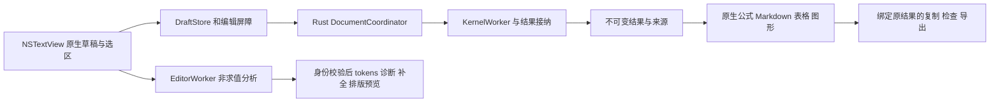

# Mac 编辑器与原生内容渲染契约

[原生 UI](macos-native-ui.md) · [工作台 UX](macos-ux.md) · [宿主状态](macos-host-state.md) · [存储](macos-storage-recovery.md) · [机器 Schema](macos-editor-rendering.schema.json) · [交互草案](prototypes/mac-editor-rendering.html)

2026-10-09。下一版 Mac 设计，**尚未实现**。源码以 NSTextView/TextKit 2 编辑，SwiftMath 排公式，swift-markdown 解析 Markdown，原生表格/树展示结构化结果，Core Graphics/Metal 消费内核几何。编辑、排版、求值、结果接纳和文件保存是不同状态；渲染不能运行数学，也不能以画面出现证明计算成功。

## 已有依据与技术裁决

| 当前代码/官方依据 | 可复用的事实 | Mac 需要补齐 |
|---|---|---|
| [内核编辑接口](../../crates/om-kernel/src/session/editor.rs)、[编辑 DTO](../../crates/om-kernel/src/views.rs)、[Span/Fix](../../crates/om-kernel/src/wire.rs) | Preview 非求值、真实 tokens/diagnostics/fix；Complete 有替换字节范围；Hover 为真实文档/未求值存储定义；cursor 校验 UTF-8 边界 | 加宿主编辑实例/源码/光标/定义代次 envelope，不改现有数学含义 |
| [现有编辑器](../../ios/OpenMath/MathEditor.swift)、[Web 位置](../../app/src/components/editor/positions.ts)、[ghost](../../app/src/components/editor/ghostText.ts) | Unicode/IME/输入合成、实际请求、候选与取消的基础实现 | Mac 原生位置/选区/撤销、严格无损映射和跨宿主竞态，不移植 UIKit 或 CodeMirror |
| [Apple NSTextView](https://developer.apple.com/documentation/appkit/nstextview)、[NSTextLayoutManager](https://developer.apple.com/documentation/appkit/nstextlayoutmanager)、[rendering attributes](https://developer.apple.com/documentation/appkit/nstextlayoutmanager/setrenderingattributes(_:for:)) | 系统编辑/选区/marked text 与 TextKit 2 布局/显示属性 | 实际 AppKit 接入、gutter/ghost/诊断、viewport 和响应链验收 |
| [MathView](../../ios/OpenMath/MathView.swift)、[SwiftMath 1.7.3](https://github.com/mgriebling/SwiftMath/blob/1.7.3/Sources/SwiftMath/MathRender/MTMathUILabel.swift) | 真实解析失败 fallback；固定库含 Mac 排版分支/数学字体 | NSViewRepresentable、基线、原式 fallback、复制/选择与实际 Mac 语料 |
| [NativeMarkdown](../../ios/OpenMath/NativeMarkdown.swift)、[swift-markdown 0.9.0](https://github.com/swiftlang/swift-markdown/blob/0.9.0/Package.swift) | AST、代码保护和数学基础 | 保留嵌套行内样式/链接/来源映射、真实段落基线与连续选区；不照搬每段 FlowLayout 的丢样式路径 |
| [现有锁文件](../../ios/OpenMath.xcodeproj/project.xcworkspace/xcshareddata/swiftpm/Package.resolved) | SwiftMath 1.7.3、swift-markdown/swift-cmark 0.9.0 的实际版本与 revision | 新 Mac 工程锁传递依赖及字体许可，当前不更新依赖/安装 |
| [值分页](result-pages.md)、[二维](plotting-2d.md)、[三维](scene3d.md)、[场景图](scene-graph.md) | `.3` 实际协议、数学范围、几何/步骤/导出 | 原生 renderer 与状态/分页/相机 owner，不改变 Web/Windows/iOS 已有展示 |

SwiftMath 固定 revision `fa8244ed032f4a1ade4cb0571bf87d2f1a9fd2d7`，swift-markdown `25cb61d3482054b09ae76ca4f281b1bfe7fe5a43`，swift-cmark `08ddb528923cc1a6527e02b7a1aee9e516ca749a`；Mac 沿用候选版本，平台/Swift 工具链及实际 package resolution 在 E0 核验。数学字体 MIT/OFL/GUST 与 Markdown/cmark 许可随包保留，不能只记录代码许可。TextKit 2 API 可用版本不是应用最低 macOS 裁决，最低系统仍由原生工程门禁确定。

## 编辑和展示的所有权

Swift MainActor 持有系统 text/marked text/selectedRanges/焦点和展示投影；Rust 持有已提交源码及真实数学事实。解析、Markdown AST、结果解码、网格上传准备、散列与缓存 IO 在后台；AppKit/UIKit/SwiftUI 控件和字体/排版器若未经线程安全验证，仍在原生 owner 线程使用，不能为了“后台排版”把 NSView 或 SwiftMath 实例跨线程操作。

建议拆分 NativeSourceEditor、EditorSession/DraftStore、SourceIndexMap、EditorRequestBroker、CompletionController、DiagnosticPresenter、NotebookLayoutCoordinator、MathRenderAdapter、MarkdownRenderDocument、ResultPresenter、Plot2DRenderer、Scene3DRenderer。路径/类均为计划，不创建另一份 Session 或把数学操作放进 View 更新。

## 编辑器布局和交互

Math 单元格由细 gutter/current marker、源码、可折叠“源码预览”、计算输出和状态组成。当前格/焦点格显示运行、停止、方言/类型和更多；文本光标与当前格选择分开，图形点击不把文字焦点强行跳到另格。源码预览默认当前编辑格可见，明确标“排版预览 · 未执行”；已执行输出在其下方注明来源/过期/部分状态。

原生源码默认系统等宽 14 pt，结果公式基准 22 pt，Markdown 系统正文 14 pt；字号是设计初值，系统/应用偏好缩放只施加一次。源码自动换行为**视觉换行**，不写入 newline；可关闭换行并横向滚动，长行不缩小到无法读。gutter 只给逻辑行号，续行不重新编号。活动源编辑容器默认增长至 360 pt，超过后内部滚动，可拖动增高/“展开编辑”；高于边界的滚轮交还笔记本，不能两层滚动永久抢同一手势。

Text 单元格默认阅读态，显式编辑为 Markdown 源码，Esc 离开编辑但先保留草稿，不自动回滚；“源码/预览/并排”保留相同源版本、光标和各自 scroll anchor。窄宽使用切换，宽度足够时按用户选择并排；Ask 旧单元格继续用文本编辑，转换/执行结果沿旧真实功能路径。首版不做数学 WYSIWYG、公式框里直接改 AST、多光标/矩形选择、自定义输入法或代码 folding engine。

数学与 Markdown 源码关 smart quotes/dashes、自动文本替换、自动大小写和系统自动接受补全；保留系统复制、选区、字/行导航、IME、查找与撤销。Text 拼写检查可显式开启且不得自动替换数学/代码；不关闭用户的系统输入法来规避竞态。

粘贴默认纯文本，保留原字符/换行与单格位置；多行不自动拆格/执行。格式化剪贴板不把 RTF/HTML 字体属性带进数学源码。图片/文件粘贴在助手按附件契约接收；Notebook 未提供该类型插入时明确给“附加到助手/取消”入口，不悄悄写路径或图片说明冒充输入。文件拖放/`.omnb` 打开走系统文档入口，不执行附件代码。

## Unicode、范围与源码身份

系统实际报告多个 selectedRanges 时保留原生选区，不伪装成单光标编辑；首版 Complete/ghost/Fix 只在单个合法范围下开放，用户显式收束选区后才提交。整格/整本文本查找与替换走系统/真实文档事务，不能把多个范围依次执行造成半次修改。

规范源是完整原 UTF-8 字符串，选区是原生 UTF-16 半开范围，lexer/Complete/Fix 为 UTF-8 半开范围。不能混用 Swift Character 数、显示列、字节位置和语言 1 起始索引；使用 `String.unicodeScalars` 或明确 scalar-boundary 表构建精确双向映射，不以 Character 枚举掩盖组合字符内部合法字节边界。

每份 SourceIndexMap 绑定 source_hash/draft_sequence，存行首与 scalar 的 UTF-8/UTF-16 对应位置。CRLF 作为一个逻辑换行但保留两个原始码元；加载时不做 Unicode 归一化/换行重写。新 Enter 使用文件已检测的换行偏好，混合原格式仍保留，统一换行只能显式作为源码事务。

转换算法：

1. 校验起止为非负精确整数、start≤end≤原文长度；u32/安全计数溢出拒绝，不 clamp。
2. 光标 UTF-16 端点必须可映射到 Unicode scalar 边界；半个代理对拒绝该请求，交系统文本引擎恢复选区，不向 parser 发送邻近字节。
3. 内核范围必须落在当前源的 UTF-8 scalar 边界；不合法 span 保留消息并标“无法定位”，不能跳到 0 或把范围随意拓宽后执行 Fix。
4. 显示下划线/选择可按原生 composed-character sequence 扩大可见范围，**显示范围不改变实际修复字节范围**。真正编辑/替换范围若切断一个字素簇且原生事务不能无损表达，则拒绝并展示手工修复，不能扩大删除范围。
5. 验证 UTF-8→UTF-16→UTF-8 往返等于原端点，再调用原生 shouldChange/文本编辑事务一次，更新 selection/undo 与 draft sequence。同时校验当前 source_hash、cell baseline 与 request 身份。

边界语料包括中文、`A🙂B`、`e`+combining accent、ZWJ 家庭 emoji、区域旗帜、CRLF、Tab/视觉换行、空文与 EOF 插入。列号用逻辑行/原生可读列，仅作为展示；诊断定位永远依据原 span，不把 tab 展开后的列数发回内核。

## IME、手工编辑和撤销

composition_begin/update/end 由 NSTextInputClient/markedRange 与实际文本事件判断。合成中 text/选区留在 EditorSession，清空 ghost/补全/旧下划线；不提交 marked text、不运行、不接受修复或替换，不刷新整份 attributed string。普通键/Enter/Escape 首先由输入法和系统响应链处理，不能用“Enter 总运行”截断中文确认。

合成结束后读取实际全文/selection，产生一次最新草稿身份并请求分析；可提交源码进入既有草稿同步屏障。Agent commit 的 fence 与原生后续输入沿[宿主竞态契约](macos-host-state.md#手工编辑与-agent-修改)，不锁键盘等模型或 CAS。关闭/切格不会通过 `.onDisappear` 假称 IME 已提交，活动合成 owner 必须保留到实际结束或用户明确离开并保存未提交草稿。

文本修改、Completion/Fix/希腊字母/缩进/显式格式化各用一个原生 undo group。语法颜色、hover、ghost、预览、结果更新和文件保存不进入文本 undo。原生 ⌘Z 优先响应当前编辑文字；已确认文档/Agent 事务由统一 UndoCoordinator 连接已有 durable inverse plan，不再重复保存一份整本文档快照。

源码确认不是每个击键一个用户可见撤销项：原生编辑组与持久化事务可以不同粒度，由 group_id/draft ack 映射。Agent 事务作为单独组；用户之后的编辑不会被该事务的整本撤销覆盖。宿主投影 echo 的已确认源码不注册第二个文本 undo；外部变更与本地未确认 draft 冲突时保留两者，显示差异而非 setter 全文覆盖。

## Preview、Complete、Hover 与高亮

EditorRequestKey 包含 runtime/document generation、cell/editor ID、draft_sequence、source_hash、requested/effective dialect、cursor/selection、analysis generation、metadata/config/definition snapshot revision。选择变化的 Complete/Hover 不复用旧光标响应，定义状态变化后 Hover 不能仍称旧变量当前有效。

分析采用 EditorWorker 的只读快照，知道已提交源码与定义来源；手工尚未执行定义可给静态符号提示，不能显示为已求值。现有 Session 的 Hover/定义摘要需增加 provenance/stale 标记，不能将记忆或未执行草稿值填入 value。Math/顺序改变导致定义失效时以 source producer 和 kernel_projection_revision 核对。

调度初值：Preview 停输入 80 ms 后请求，Completion 120 ms，鼠标 Hover 350 ms；显式菜单/快捷键立即请求，均有取消和 latest-wins。源码变化立刻撤销旧建议的“可接受”身份；旧内容最多灰显“上一版预览”，不能以旧 tokens 给新文重新定位。独立编辑通道不排在长 CAS 后面，80 ms 是去抖初值而非运行时延迟承诺。

tokens 用语义颜色 Number/String/Comment/Builtin/Keyword/Identifier/Operator/Bracket/Error，引用实际 TokenClass，颜色不决定函数含义。TextKit 2 用 transient rendering attributes 优先；若 fallback 用 text storage attributes，仅更新当前合法范围，不改字符、不污染 undo/marked text。gutter/括号配对来自当前词法/范围，字符串和注释内不做数学括号补齐。未知 token category 以普通字色显示并可查信息，不丢文本。

Preview 按光标所在 statement 返回原接口支持的 LaTeX，不宣称已经得到整格所有语句的预览。代码里的赋值/等式必须保持数学意义，预览规范化仅展示；不能写回 AST 结果替换原源码。需要选区求解/展开时，用真实 action/函数描述生成新格草稿，明确运行范围，不默认对所选任意片段自动执行。

### 补全与 ghost

本地 Complete 优先展示已实现目录和实际用户函数，候选带签名/种类/来源；用户绑定遮蔽内置别名时服从实际解析。native popover 锚定 caret 矩形，窗口裁剪时转到底部补全条/显式菜单，不离屏；list 使用稳定 candidate ID，关闭恢复源光标，不把焦点留在被回收视图。

替换严格使用服务 from/to 字节 span 和源快照，而非仅追加 label。当前 CompletionItem 的 insert_text 可能是 snippet，新 Mac 需补受控 snippet adapter：仅支持经过验收的 `$1`、`${1:default}`、`$0` 和 literal escape，按实际元数据生成；无 parser 的 snippet 不原样自动执行或显示伪占位，提供纯文本插入预览/缺能力说明。首版不加脚本 snippet，离开 source identity/IME 时终止 snippet session。

AI ghost 用已配置的 FIM route/合法授权，独立于 Agent 正文模型。idle 初值 350 ms、零选区、caret 在实际可接受行末、未合成/本地候选关闭且 source≥3 字符才自动请求；显式触发可在受支持上下文请求。prefix/suffix 和最小允许上下文冻结并在真实请求可查；切模型/设置/任务/光标/草稿或开始 IME 立即取消，迟到完成不得重新出现。

ghost 是显示装饰，**不进入 NSTextStorage、源码、保存、复制、选区、辅助文本值或 undo**；用受控 TextKit caret/line geometry 绘制，复杂 BiDi/跨行无法可靠定位时在源码下给“建议 + 接受”基础路径，不把灰文字盖在真实字符上。完整接收后才写一次源码事务；分段接收按 Unicode-safe tokenizer/字素边界取真实前缀，剩余候选重新绑定新 hash/cursor，不能沿旧源继续接收。

快捷键分层：IME/系统命令优先 → 当前本地候选/Greek shortcut → 有效 ghost → 缩进。Tab 只在当前候选已选中/明确 Greek 序列/ghost 可接收时承担接收，其余正常缩进；普通 Enter 换行，补全列表不能吞整个 Notebook 的运行键。Escape 先合成/候选，再隐藏 ghost/hover；不默认停止计算。⌘→ 保持原生行尾导航，分段 ghost 提供显式按钮和可配置快捷键，不沿用移动代码里冲突的 ⌘→。

显式补全提供菜单和可配置 ⌥Esc；⌃Space 只在系统传到应用且用户选择时处理，不抢系统输入法切换全局键。希腊 `\alpha`/`\pi` 等用真实快捷表，Tab 在字符串/注释中不转换。插入括号/缩进由词法上下文控制，单次撤销且按用户偏好禁用。需要右值的自动续行是[共享解析器下一版待办](../plan/NEXT_RELEASE.md#现代语法自动续行与连锁诊断修复)，E0 须接入真实 parser；Mac 不偷偷删换行或加分号来“修复”。

### 诊断与修复

gutter 图标/下划线配 Error/Warning/Hint 和具体 code，状态栏汇总，显式问题列表可定位；零长度 EOF 用 caret 标记，不画假覆盖字符。排序为源码位置与稳定 severity/code，不把所有 warning 变成 run blocker；源码虽有错误仍可编辑/保存，实际执行由 parser 返回真实错误。

Fix 点击前检查 source_hash/editor identity/合法 span，并显示替换差异；确定性小修复可一键应用但等待源事务确认，不自动运行。过期诊断点击给“源码已改变，重新检查”，没有当前有效 Fix 就不显示可用按钮。跨格/多项修复走 preview/原子 patch，不循环全文 setter；AI 修复走已保存功能映射、建议/Agent 范围和真实工具，不由诊断 UI 授权新供应商或写操作。

## Notebook 长文与稳定布局

NSCollectionView 或原生有界复用列表作为 Notebook scroll 宿主，自定义数学单元格容器保留原组件族。每个 cell ID 有持久 EditorSession，只有活动/近 viewport 的原生编辑视图装载；活动编辑、IME、选区拖动/原生 undo owner 必须 pin，虚拟化不能拿 offscreen 当“编辑完成”。首版用静态分页/有界渲染也可以，但必须支持完整源码访问并明确预算，不把长文本截断当保存内容。

ScrollAnchor 为 cell_id + block/result_id + 源/展示范围 + viewport 相对偏移。布局变更前捕获 anchor；高度更新后保持同一读点，caret 可见时只做必要的系统 scrollRect；不是每个公式尺寸变化就 scrollToBottom。程序定位仅用户触发，更新结果不抢输入焦点。source wrap/字号/面板/窗口/主题变化分别更新 layout_generation，保存逻辑 selection 与内格 scroll，不存失效 pixel rect。

高度缓存包含 source/result hash、width、font/scale、renderer_version；先提供保守占位和阶段，再以真实测量更新。单行文字量、千格文本和大矩阵不全部建立 NSView；渲染队列只布局 viewport 周围，解码/分页有背压。scrollTo ID 时逐步加载真实目标，找不到给明确错误，不猜行号跳格。

## 公式排版

输入优先用内核真实 latex + Modern/InputForm，Markdown 数学用该源 LaTeX；SwiftMath 只排版不求值。MathRenderAdapter 保留 original_latex、display_latex、source alternative、inline/display、renderer/字体/字号/颜色、source/result 身份和解析状态，禁止用 pretty string 重新制造精确数或条件。

`\operatorname{...}` 的适配限当前可验证 flat ASCII 名称到 `\mathrm{...}`，记录 display transform 和排版差异；不能删不认识的命令/括号/条件，或全局 regex 改变分支/矩阵意义。更多转换只按真实语料登记测试规则；不支持的命令/环境、解析失败、预算超限、字体不可用均显示**可选取的原式**和短原因，原 LaTeX/源码仍可复制，不展示空 label，也不把 fallback 称排版成功。

inline 公式使用 SwiftMath text style、真实 ascent/descent 和 baseline 插入 NSTextAttachmentViewProvider；不从包围盒高度猜居中基线。display 公式使用 display style，长式横向 NSScrollView，保留 100% 字号并提供字号/完整源式操作；不因超宽自动缩小、不随意断开分式/条件。矩阵、cases、区间/长 Root 若不能排版仍以完整原式/结构化视图提供，不用“看起来像”的分式图修数学。

公式默认整式选择/复制，菜单支持原 LaTeX、Modern、Wolfram 和只读源式。SwiftMath 本身不是字符选区编辑器，首版不承诺逐符号拖选或点击改某一个 AST 节点；Markdown 中公式附件作为一个语义单元选择，copy 包含其完整原 LaTeX。辅助标签使用实际可读源式/条件，不能凭转换文本生成“已证明”朗读。

渲染缓存 key 至少包括 latex hash、转换版本、inline/style、实际字体及规模/主题。只保留 immutable parse plan/适配结果或线程归属内实例，NSView 不共享到两处/跨线程。最长 LaTeX 初值 64 KiB、嵌套深度 128、20000 math atoms；可验证的 tokenizer/preflight 先检查，再原生排版。超过预算显示原式分块可查；Markdown/用户 LaTeX 没有严格前置预算器时不开自动复杂排版，不假装 parser 可安全处理中止任意递归。

## Markdown 与数学流

Text 单元格、助手回复、步骤讲解复用一个 MarkdownRenderDocument，但输入身份/动作权限不同。swift-markdown AST 映射为原生 paragraph/list/quote/heading/code/table/link/image_placeholder/math span；保留嵌套 strong/emphasis/strike/code/link，而不是 `plain(node)` 扁平化后丢格式。

数学扫描先从 AST 取得 code fence/inline code/链接 URL 等保护范围，再在剩余文本识别 `$...$`、`$$...$$`、`\(...\)`、`\[...\]`；不在代码/URL/HTML/raw 中解释公式。`$` 默认同段非空、开定界后非空白、闭定界前非空白且闭定界后非数字，转义保留；金额/不配对 delimiter 作为普通文本，建议用户用 `\(...\)` 避免歧义。块公式必须独立块/完整定界，未完成流式公式保留文字，不闪出错误数学。

不要用可能与用户正文碰撞的全局 OMMATHPLACEHOLDER 正则：Scanner 产生带原 span 的 typed math 节点或无碰撞内部 token/source map，移除/还原均以身份匹配。SourceMap 把 renderer 的 UTF-16 ranges/公式附件/链接和原 UTF-8 spans对应；表格等独立块按块 ID 保存，不靠全文替换查找“相同字符串”。如果 AST 行列定义/转义展开无法准确映射，显示源式并禁用基于该范围的编辑，不编造替换范围。

段落由只读 NSTextView/attributed text + TextKit 2 attachments 布局，保持连续选择/系统换行和公式基线，不以一个 SwiftUI Text 一词/FlowLayout 模拟富文本引擎。复杂表格用原生 NSTableView/有界 block renderer；跨表格/图形的通篇拖选首版不承诺，提供全段/全文复制 Markdown，表格提供实际行列复制。代码块等宽、横向滚动、复制原字节，optional language highlight 不执行代码；“插入源码”由用户点、按方言/完整代码建新格草稿，不能因 code fence 自动运行。

链接只处理已允许 scheme（https/http/mailto）和真实用户点击，用 NSWorkspace/系统菜单；内部 cell/step/result refs 由可信绑定生成且检查 scope/version。raw HTML 作为可选取文字，不创建 WKWebView、不执行脚本/任意 URL。远程图片默认不加载，显示 alt/地址/“未加载远程图片”；主动附件的内部引用由媒体服务解析，不能从 Markdown 路径读磁盘。隐藏标签/未知 block 保留 fallback 原文本，不丢结构后称完整转换。

流式助手文本 50–100 ms 有界批次更新，按完整 block 稳定 ID 与尚未闭合 tail 处理，正在选取历史的块不替换 NSTextStorage；用户不在底部不强制跟随。重点是实际回复/选择与身份，不能逐 token 重建整页布局。连接取消/断流保留实际文字尾和 interrupted 状态，不自动闭合代码/数学 delimiter 改写原始消息。

## 结果、步骤与结构化值

ResultBinding 包含 result_ref、document/cell/operation 身份、source hash/revision、execution_epoch/kernel_state_revision、out_index/view_id 和 accepted/history 状态；显示同一 result 的展开/表格 path/分页/数值投影都绑定该身份。UI 不把结果 ordinal 当新结果的稳定 ID。

| 结果状态 | 可见行为 | 操作边界 |
|---|---|---|
| 未计算 | 待计算、源码预览可用 | 运行当前范围，不能复制不存在结果 |
| 正在重算 | 保留旧输出，标“上次结果 · 正在重算” | 旧结果可历史复制，当前采样/插入须核对 |
| 编辑后过期 | 保留来源和过期提示 | 查看/复制历史合法值；当新源码插入需显式标旧来源，不默认当新结果 |
| 接纳完成 | 实际数学/条件/partial 表示不丢 | 绑定实际类型的检查、复制、插入/导出 |
| 失败/取消/部分 | 保留已接纳前缀与具体原因 | 不把部分结果标完整，不自动回滚已提交源码 |
| data_only/unavailable/fallback | 数据/原式/明确能力说明 | 不以图片假称已绘制，合法格式仍可按真实支持导出 |

解视图区分 finite/none/all/region/conditional/root，显示变量绑定、multiplicity、条件与精确/数值验证；不按格式化文字相等合并不同条件解。精确恒等/数值残差/未验证不同标签，误差估计不是严格包围证书。Root 的多项式/根序与精确原式可查，数值按钮走真实 InspectExpression 隔离请求、不推进主定义/Out/随机。

步骤用真实 rule_id、step ID、before/after/params/children/recording 来源，NSOutlineView/DisclosureGroup 保留展开/选中；没有步骤记录给“本次未记录”，不让模型补一棵数学证明树。AI 讲解属于独立内容，step links 只定位匹配 result 的真实节点；目标过期时保留历史解释并说明不能定位当前结果。

Matrix/List/Record/DataTable 复用真实 InspectValue，基础页 32×8、最多 100×32、path≤32 的现有限制；语言索引 1 起始与内部 path/offset 0 起始分别展示/使用。Table 不转换精确整数/高精度到 Double 做排序/复制；本地排序只在明确完整已取数据允许，否则展示“仅当前页排序”或不开放，不能把一页排序称全表。

默认根视图只展示真实 ScientificOrigin 的收敛/误差/残差/局部或认证全局保证，任意用户 record 的 `converged:true` 仍普通字段，不伪造成功徽标。单位、插值、模型、级数有根摘要/展开源式和实际支持操作；插值图/拟合残差只有真采样数据时显示，不根据前端名字猜一条曲线。复制等待 NSPasteboard 回执；单个显示截断值必须标 excerpt，并提供完整读取/复制，不拿省略字符串做新源码。

## 二维渲染与采样

Core Graphics/Canvas 消费 PlotData 的曲线段/点/路径/箭头/标签/色块/interval 与颜色/width/opacity。renderer 只做世界坐标→显示坐标、裁剪、tick/标签布局和相机；不在 Swift 重新求函数/统计频数/计算交点。断段/跳过计数、log 非正域与机器近似采样声明保留；标签来自已确定数据，辅助坐标网格标为视图装饰。

相机为 independent Camera2D(x_range,y_range,scale,viewport)；线性/log 变换定义单一正反函数，pan/zoom 按 pointer anchor 确定显示坐标，log 在 log-space更新，拒绝非正/非有限/零区间。不将不同单位轴归一化后改回数据。长标签用字体真实测量预留轴边距，resize 保留归一化视窗中心/scale，初始 fit 只发生于新 producer 或用户复位。

对 data/固定 scene 的相机操作重绘已存几何；函数采样 route 有真实重采样能力时可基于原 request+新视窗调用内核，其独立数学轴/参数域保持原定义（参数曲线 t 不能被 x 相机替换）。初值手势立即变相机，100 ms 合并 latest sampling、结束 flush，旧图显示更新中；返回按 producer/source/采样 generation 接纳，不继承旧 view 的空 geometry。

拖动平移、scroll/pinch 缩放、可见 +/−/Home/方向键共用相机状态；图形未焦点时不抢 Notebook 滚动/编辑键，只有明确手势/聚焦后才操作图。无手势也可完整控制。拾取只返回实际点/线段/mesh 数据与“最近采样/显示插值”标签；交点/根必须请求真实内核，不能根据两条屏幕线交叉称精确根。图例/颜色表保留服务数据，density 不换品牌绿覆盖数学数值。

## 三维 Metal 渲染

MTKView 消费 Scene3DData 的真实世界 vertices/normals/colors/triangles/lines/points；Swift 做显示归一化、相机/矩阵/裁剪和基础光照，不重新三角化数学曲面或写回世界几何。CPU 解码核对顶点/法线/RGBA长度、索引 bounds、有限数和总资源预算，失败保留源式/数据/OBJ。

基本渲染为不透明 depth pass + 透明物体/三角形按当前 view depth 的近似 back-to-front 混合；明确自交透明排序限制，不承诺物理材质或精确遮挡。基础双面 ambient+directional light 复用现有 Web 语义，法线变换/退化的 fallback 不让 undefined normals 导致假黑洞。透明度/颜色来自内核；主题仅调背景和辅助轴，不篡改物体颜色。

显示归一化在 Double 中做，Float GPU 只装显示范围值，保留原值/尺度与相对相机；极端世界坐标无法可靠表现给 data_only，不把溢出的点画在原点。Camera3D 为 quaternion/orbit target/distance/投影与 viewport，鼠标 rotate、Shift pan、scroll zoom、正视图/复位与键盘共用；默认无自动旋转。resize 改 aspect 保持 target/距离，explore 同源参数更新保留相机，新源/新 producer 重新 fit。

on-demand draw，静止/隐藏没有 display loop；相机与可见数据变化最多一帧合并。GPU completion 和 NSView liveness/result/render generation 绑定；command buffer 成功结束只说明 GPU 工作完成，rendered 还需本 renderer 的 drawable 提交/呈现证据，真实显示与截图独立核验。[Metal command buffer](https://developer.apple.com/documentation/metal/mtlcommandbuffer)、[present](https://developer.apple.com/documentation/metal/mtlcommandbuffer/present(_:))

异步 GPU 引用到 completion 才释放，不以 view disappear 立即销毁 in-flight buffer；shutdown 在后台等待 owner settled，不调用 MainActor 的 waitUntilCompleted。GPU 内存/设备/着色器/命令失败将 render_state 设 unavailable/data_only，给重试和数据/OBJ出口；不使用上一张截图冒充新 producer 绘制。截图/Agent inspect preview 只捕获当前 result+camera+实际完成 frame，签发含来源的媒体引用，过期/隐藏未绘制时明确 unavailable。

## 缓存、预算和辅助访问

RenderRequestKey 至少携带 runtime/document/result/block/source identity、renderer version、layout/theme/font/viewport/camera generation；不同来源的异步布局/采样/数值/截图都不能只按 cell ID 更新 UI。资源释放与实际操作确认分开，缓存 hit 不表示已绘制或已保存。

设计初值：活动源 ≤2 MiB 控制范围，超限提供独立分块/只读查看和源码保存出口；不为 UI 限额改变内核允许的数学语法。Markdown 自动解析预算 1 MiB/20000 nodes/深度128；大值按原分页；三维遵守原总顶点≤200000，再给总 GPU 64 MiB 工作预算；CPU 排版/缓存 64 MiB，on-demand frame GPU最多 3 个 in-flight。超预算先回收非 pin 派生缓存或降采样由用户/内核决定，不自删有效结果。真实性能目标/环境与最大资源需 E5 记录，这些不是已测指标。

E5 首轮性能目标为：10 KiB 普通活动格的本地输入到下一次可见绘制 p95≤50 ms，活动 Source/View 属性刷新不因 CAS/网络等待占住 MainActor；60 Hz 屏幕的常规图形相机操作目标一帧内响应。大文本/大矩阵/200000顶点压力场景记录输入、layout、frame、CPU/GPU内存和降级原因，不保证所有负载都达到常规目标，也不放宽原数学时限。当前没有 Mac 原生测量，数字是实施目标。

无障碍从同一状态生成：源编辑器系统角色/选区；公式原式和条件；表格行列标题/选取；步骤可访问树；2D/3D 有数据摘要与真实相机操作。ghost 隐藏装饰朗读但有“建议可接受”动作，不逐 token/顶点播报；启用/禁用动作一致，不用颜色区分唯一状态。Reduce Motion 只停装饰，结果和点击/键盘/导出保持；字号变化不再二次 scale 自绘文本。

## 实施与验收

| 批次 | 对应原生阶段 | 交付门禁 |
|---|---|---|
| E0 | N0 前置 | 固定依赖/许可，严格 SourceIndexMap、共享续行 parser、Editor envelope 与真实非求值分析 |
| E1 | N0/N1 | NSTextView/IME/undo/draft/fence，补全/Fix/ghost/gutter与查找/缩进 |
| E2 | N1 | SwiftMath 原生排版/原式 fallback，Markdown AST/source map/链接/代码/行内数学 |
| E3 | N1/N2 | 解/步骤/精度/科学诊断、分页/复制/插入/过期输出与数值隔离 |
| E4 | N1 | Core Graphics 全二维、Metal 全三维与探索/相机/GPU/截图/导出 lifecycle |
| E5 | N4 | 原生大文/长式/字号/主题/焦点/VoiceOver/Reduce Motion、实际性能与跨端回归 |

全部真实验收为 **planned**：

- ER01：UTF-8/UTF-16 scalar 精确往返、半代理/字素/ZWJ/CRLF/EOF/Fix；显示范围拓宽不改变真实替换范围。
- ER02：真实中文/日文合成、候选/运行/Tab/Esc、旋转分栏/离屏/关闭、Agent fence 的先后保留原输入，不靠模拟布尔当 IME 验收。
- ER03：长 CAS 时仍编辑/Preview/Complete/Hover；定义/metadata/source/cursor变更、迟到/重复/取消不接受旧建议。
- ER04：本地 snippets/Greek/字符串注释边界/ghost全量与分段/取消，未接收候选不入文件/剪贴板/undo，系统快捷键不被误抢。
- ER05：每类编辑/Fix/缩进一次撤销，服务 echo 不重复 undo；手工/Agent冲突、保存期间更晚草稿和 unknown commit 保留。
- ER06：原53及实际发行科研结果生成 LaTeX、Root/分式/矩阵/条件/区间/长式/大小字体/未知命令预算，SwiftMath 原生截图/源式回读，错误不空白。
- ER07：Markdown 嵌套格式/URL/代码保护、所有数学 delimiter/金额/占位碰撞/中文/表格/选择复制/source map，raw HTML/远程图片不加载，流式 tail不重写。
- ER08：解条件/重数/精确vs数值/无解vs未求值、真实步骤/科学来源、精确数字分页/完整复制、过期与partial，隔离检查不推进定义/Out/随机。
- ER09：二维全部实际 geometry/log/参数域/标签/拾取/内核交点，手势与键盘相同，快速变参/旧采样拒绝/真实导出。
- ER10：真实3D曲面/图元/切开西瓜、Float显示与世界导出、法线/透明/相机/resize/GPU资源/失败、当前截图与帧身份，缺Metal明确 data_only。
- ER11：1000格混合笔记本、活动长源/大公式/矩阵/网格的真实滚动/高度更新/caret/selection pin，内存/输入p95/layout/frame记实际设备与Release数据，不放宽数学门槛。
- ER12：各状态浅深/字体/全键盘/原生AX语义与关键可访问动作/Reduce Motion和正常/失败恢复，减少装饰不删结果，平台/包/原53/`.omnb`/Windows/Web/iOS兼容；完整人工VoiceOver遍历另列覆盖范围，不因API存在而标通过，暂缓规则按[`.4`统一门禁](../plan/PRE_ALPHA_4.md#原生ui平台与暂缓边界)。本机不启动iOS模拟器。

## Skill 与组件率

使用 [telegram-ui-reference SKILL.md](/Users/hert/.agents/skills/telegram-ui-reference/SKILL.md) 的[文本选择/编辑](/Users/hert/Documents/ChatGPT/ui-learning/05-input-and-actions/text-selection-and-editing.md)、[富文本/entities](/Users/hert/Documents/ChatGPT/ui-learning/08-media-and-rich-content/rich-text-and-entities.md)、[系统字体/长文](/Users/hert/Documents/ChatGPT/ui-learning/09-adaptation-and-accessibility/system-fonts-and-long-text.md)、[无障碍/减少动态效果](/Users/hert/Documents/ChatGPT/ui-learning/09-adaptation-and-accessibility/voiceover-and-reduced-motion.md)的 Quick recipe 至 Fallbacks；原生编辑/一次事务/Unicode、typed spans/未知块、稳定焦点/完整可读值和相同语义静态路径映射到真实宿主。数学、CAS/Fix/结果证明/存储/Metal并非 Skill 已实现能力，不复制 Telegram 类体系。

复用原40组件族：NSTextView/查找/菜单/表格/树等仍 Apple 标准，gutter/ghost/单元格布局/混合Markdown/2D/3D自绘仍 custom_native，SwiftMath 为 third_party_native。设计占比仍 **30/40=75% Apple 标准、原生技术目标100%**，不是当前 `.3`/HTML 实现测量。新的 custom renderer/选择职责如果实际增加，必须更新清单。

本次交付到设计、机器契约与 HTML 评审为止，不创建新 Mac 原生工程或改现有 `.3` 的编辑器/数学/公开标签。HTML 数学示意不是 SwiftMath，演示完成按钮不连接 CAS；真实 ER01–ER12 与性能仍待实施。

本轮实际设计检查：14个Schema合成正例/26反例、26项浏览器状态/范围/候选/失败/复制/布局检查通过；过程与截图见[评审记录](prototypes/editor-rendering-review.json)和[说明](prototypes/README.md#原生编辑器与内容渲染草案)。浏览器组合事件与范围辅助算法不证明 AppKit IME/撤销，静态数学/GPU示例也不证明排版/CAS/采样/Metal已实现。
