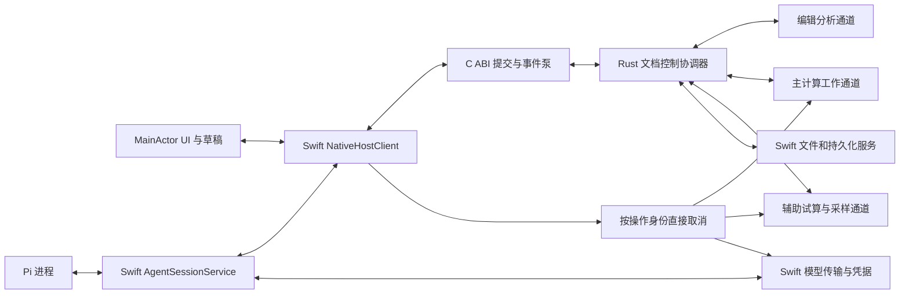

# Mac 原生宿主与状态契约

[原生客户端](macos-native-ui.md) · [UX](macos-ux.md) · [Agent 工具](agent-tools.md) · [上下文](agent-context.md) · [状态 Schema](macos-host-state.schema.json)

2026-10-08。Swift/AppKit 负责原生交互和系统服务，Rust 负责权威文档/事务/计算状态，Pi 负责模型与工具循环。文档控制和耗时计算使用独立执行通道；UI 持有确认状态的投影及原生编辑草稿，不维护第二份权威笔记本。

本契约针对下一版 Mac 单活动文档与单活动 Agent 任务，尚未实现。新包名、类型、ABI 和消息为计划接口；不改变 `.3`、现有 iOS ABI 或其数学语义。物理存储格式、模型/媒体具体路由和发行打包另行设计，但本层明确它们的操作与回执边界。

## 现有实现依据

- [Tauri KernelHost](../../app/src-tauri/src/host.rs) 创建专用 Session 线程，原生 HTTP 独立运行，中断直接设置共享标志；但 Session.handle 的同步计算与文档请求仍在同一队列。
- [iOS Host](../../crates/om-ios-ffi/src/host.rs) 同样使用 Session owner 与独立取消；[C ABI](../../crates/om-ios-ffi/src/ffi.rs) 管句柄、输入复制与返回缓冲。创建时固定为 HostPlatform::Ios，不可原样充当 Mac 三维宿主。
- [Swift KernelClient](../../ios/OpenMath/KernelClient.swift) 把阻塞桥接放到专用队列，校验关联身份并释放缓冲；控制器在 MainActor 更新 UI。
- [Session](../../crates/om-kernel/src/session.rs) 目前同时持有源码、Evaluator、定义拥有者、历史和 LLM 状态；[编辑](../../crates/om-kernel/src/session/editing.rs)的 DeleteCell 可能触发依赖计算，不能简单循环它来实现原子 Patch。
- [Evaluator](../../crates/om-eval/src/evaluator.rs) 的 readonly fork 不能作为主笔记本的可写事务副本。[探索快照](../../crates/om-eval/src/explore.rs)已有定义/属性/历史/随机状态冻结基础，但不等于完整 Session checkpoint 或文档提交接口。

因此需要抽出可独立处理文档事务的服务、可检查的计算工作状态及其接纳协议。仅把请求搬到后台线程不能满足「计算时继续编辑」和「旧计算不污染新状态」。

## 职责与权威状态

| 所有者 | 独占职责 | 不承担的职责 |
|---|---|---|
| Swift AppHost | 窗口生命周期、系统菜单/响应链、Pi 进程、宿主服务路由 | 不决定 CAS 数学结果或直接标记事务提交成功 |
| Swift MainActor UI | NSTextView 草稿/IME/选区、焦点、面板/滚动/相机、已确认文档投影 | 不修改 Rust 权威文档，也不从模型文本推断执行成功 |
| Swift SystemServices | NSDocument/文件面板、文件协调和持久化回执、Keychain、URLSession、附件入口 | 不把任意模型路径/认证字段用于文件或网络操作 |
| Rust DocumentCoordinator | 源码/顺序/标题、文档版本、冻结预览、权限绑定、事务/撤销/结果接纳 | 不在其控制队列执行长计算、网络等待或大文件转换 |
| Rust KernelWorker | 私有计算 checkpoint 存储、实际数学求值/历史/随机状态、结果/步骤 | 活跃 checkpoint 由协调器引用决定，不凭工作副本自行发布，也不持有 UI 或凭据 |
| Rust EditorWorker | 解析/静态依赖/Preview/Complete/Hover，返回绑定源码身份的建议 | 不执行主笔记本或更改其随机/定义状态 |
| Rust AuxiliaryWorker | 隔离试算、探索/图形采样等有界任务 | 不发布主计算 checkpoint，也不运行任意宿主 IO |
| Swift AgentSessionService | 当前任务/模式/用户输入、规范化会话事件与请求快照的协调 | 不信任 Pi 上报的业务成功作为事务/执行事实 |
| Pi 本地进程 | Agent 循环、流式助手消息、已暴露工具调用、追加输入 | 不直接读写主笔记本、凭据、文件或替宿主授予权限 |

Agent 会话日志写入走宿主持久化接口；DocumentCoordinator 持有规范化任务绑定/权限和操作账本事实。UI 的聊天内容、Pi 的执行循环以及原始日志投影具有不同职责，不各自更新同一个业务状态。

所有者是逻辑边界，不要求每个服务一条线程。首版只开启一个主计算任务和一个辅助计算任务，编辑分析使用独立轻量通道；并发数是设计初值，实际 CPU/内存预算另测。阻塞 IO、缓冲解码和图片处理不占 MainActor。

## 建议模块组织

```text
macos/OpenMathNative/
  AppHost.swift              原生生命周期和服务装配
  NotebookViewModel.swift   MainActor 已确认投影
  DraftStore.swift           原生草稿、IME 和编辑屏障
  NativeHostClient.swift    请求关联/事件泵/直接取消
  NativeDocument.swift      文件 URL 和保存回执
  ProviderTransport.swift  Keychain + URLSession
  AgentProcess.swift        Process/Pipe 与 Pi IPC
  AgentSessionService.swift 会话事件/上下文请求/任务绑定

crates/om-host-service/       安全 Rust 协调器、版本、事务和调度
crates/om-apple-ffi/          独立 C ABI 边界
agent/                       Pi 适配器及模型/工具格式转换
```

这些路径目前不是已建立模块。om-host-service 使用禁止 unsafe 的约束，必要 unsafe 只位于独立 om-apple-ffi 的指针/缓冲边界。om-ios-ffi 保持原 ABI，通过内部共享组件渐进复用；不通过替换其函数含义让旧 iOS 包误接 Mac 宿主。

数学求值、依赖、精度和原结果类型继续由 om-kernel/底层 crates 提供。新的宿主文档 DTO 不能把 omnb v1 改成 Pi 会话格式；Windows/Web/CLI 原协议继续兼容。

## 执行通道



DocumentCoordinator 在短控制步骤中完成接收、校验、版本读取及接纳判断。Preview 的解析和复制、复杂依赖规划、CAS 求值、大结果序列化和持久化等待移到相应工作通道；文档写入有逻辑提交门，但不阻塞 UI 事件循环。

主计算工作通道每次仅执行一个 notebook job。辅助和编辑任务独立，更新频繁的 Preview/补全/参数采样按作用域保留最新待处理任务，过期任务取消或丢弃；文件/媒体处理不能在内核线程插入任意模型代码。

## 状态分类与身份

| 状态 | 内容 | 更新身份 |
|---|---|---|
| DocumentState | 已提交源码/顺序/标题，当前文件保存状态 | document_id + generation + document_revision |
| DraftState | 尚未确认的文本、marked text、选区、原生撤销分组 | cell_id + editor_generation + draft_sequence + base_cell_revision |
| KernelState | 已接纳定义/历史/随机状态及其生产证据 | kernel_state_revision + execution_epoch |
| ResultState | 不可变输出/步骤/几何及生产来源 | result_ref + source_hash + execution_epoch + operation_ref |
| AgentTaskState | 用户目标/模式/绑定、运行/等待/取消及真实操作进展 | task_id + task_generation + operation refs |
| ViewState | 面板目的地、滚动、焦点、相机/视窗 | 稳定 view/cell_id，独立于文档修订 |
| SaveSnapshot | 此次实际写入的源码快照与 URL 绑定 | save_operation_ref + saved_revision + file_binding_revision |

document_revision 只因成功源码/顺序/标题事务单调增长；选择单元格、工具进度、聊天 token 和保存回执不增加它。cell_revision 按该格成功内容/类型/方言变化增长。

execution_epoch 在可能改变主数学执行的源码/Math 类型、顺序或计算设置变化时增长。纯标题/Text 内容变化不必取消数学 job；无法确认数学无关的变更按保守路径增长。kernel_state_revision 每次接纳实际执行状态后增长，包含 Out/history/random 变化，即使源码未变。

document generation 在打开、关闭后重开或替换文档时增长；runtime_instance_id 在 Rust 宿主重启后更新。任务、连接、编辑器和操作还有独立代次，不能用一个 global busy 或一个 revision 代替所有生命周期。

身份使用宿主分配的字符串，计数必须在 JS/Swift/Rust 共同可精确表示范围内校验；溢出明确失败，不回绕。scope/grants 由宿主绑定，不从 Pi 或模型参数提升；这些信息只用于操作身份，不含凭据。

## 手工编辑与 Agent 修改

### 草稿与确认投影

键盘输入立即进入 NSTextView/DraftStore，保持 marked text、选区和原生撤销。UI 随即把本地结果标为过期，未确认草稿不能被一个新的 Rust 投影直接覆盖。

非合成文本提交为带 base_cell_revision 和 draft_sequence 的源编辑命令，在文档控制器中产生普通源码事务；输入还未完成、语法错误的手工草稿也允许保存为源码，并标为待计算/有诊断。不能要求每个打字中间态都通过 Agent 的完整语法预览。

合成期间只报告编辑状态/保护范围，不提交 marked text，不强制接受补全。读取、运行、保存和 Agent 修改前请求明确的草稿同步屏障；尚未提交的非合成草稿先等待实际回执。屏障无法完成或目标正在合成时返回 EDITING_BUSY/可重试状态，不能把旧源码假装成当前输入。

回执只确认其 draft_sequence；若 UI 已产生更晚草稿，将更晚文本保留，并用确认版本推进其基线。收到同格意外外部变更时保留草稿和冲突来源，不进行全文盲覆盖。

### Agent 提交的编辑屏障

Agent 预览后的 commit 请求先通过当前版本和权限校验，再向 Swift MainActor 请求针对目标单元格的短期 editor_fence。Swift 检查最新草稿/IME，完成必要同步后返回带 editor_generation、draft_sequence 和源版本的许可；DocumentCoordinator 同时校验许可和冻结计划。

许可期间相同目标的规范文档写入串行化。新的原生输入仍作为本地 overlay 保留；若它基于提交前源码，回执后检查基线，不能用 Agent 文本抹掉它。新开始的 IME 文本不被投影刷新强制结束；需要重新定位/合并时展示明确冲突，保留原输入。屏障不跨计算/动画/模型请求持有，超时释放并拒绝未提交操作。

此契约定义了手工输入和提交的线性化边界，必须用真实 MainActor/跨线程竞态验证。仅在预览时检查一次 isComposing 不够，也不能用键盘被锁住几十秒来避免冲突。

### 原子事务

Agent 先 preview_source 形成冻结计划，提交时只传 preview_ref；宿主补实际 operation_id、预期修订和操作。临时文档验证、解析/影响分析在工作通道完成，源/计划散列一致且 editor_fence 有效后才进入提交。

提交必须协调「新文档源码、事务回执、幂等记录」的原子持久化；DocCommitPort 返回可靠成功后才发布 committed revision。失败保留旧文档，未知提交状态先用 operation_id 查询，不开始新写入。具体数据库/日志格式在存储设计中选择，不能用三个独立文件写入冒称原子完成。

逻辑提交门保持提交顺序，控制队列仍可处理读取、取消、状态与事件；后续同文档写入等待门释放，UI 继续保留草稿。文档 reads 明确返回已提交修订与 pending 状态，Agent 的当前读需要完成草稿屏障。

提交本身不调用现有 DeleteCell 的即时 cascade，失效标记一次发布，后续计算单独发起。UI 撤销与 Agent undo 进入同一文档服务，反向操作检查当前内容；每次模型/手工修改都产生可解释的 source identity。

## 计算工作状态与结果接纳

KernelWorker 在自身通道持有不可变 checkpoint 注册表，DocumentCoordinator 记录当前 active_checkpoint_ref。每个 job 显式携带该引用、源快照、execution_epoch、计算配置、依赖计划和操作 token；从选定 checkpoint 建立可写 working state，运行使用真实现有求值器，不重新解释数学语义。

checkpoint 至少包含定义/规则/属性、history/Out、随机状态、定义生产者、真实结果记录和计算设置。不是只克隆 ownvalues，也不是重新执行所有 let 重建；其中可能有随机或有副作用的定义。新内部 staged API 需要实现和测试，现有 readonly exploration snapshot 只是复用基础。

内部 checkpoint 使用可精确还原的类型/节点表示或共享不可变结构，不用格式化字符串重新解析、不把高精度数变成 f64。注册表有容量和引用计数，当前活跃/正在运行/尚待接纳的状态禁止驱逐；未接纳候选在实际操作结束后释放。容量不足明确拒绝新工作，不牺牲保留状态或无限增长。

working state 中实际数学执行与文档事务是不同层。每个单元格/终止边界先在 worker 注册完全冻结的 candidate_checkpoint_ref 和候选结果，再由 DocumentCoordinator 判断：

1. runtime/document generation 与活动操作身份仍匹配；
2. execution_epoch 和计算配置修订仍一致；
3. 当前生产源码/必要依赖与源快照一致；
4. 此候选还未接纳，任务没有越过可接纳的取消/关闭边界。

通过时，协调器在同一个短控制步骤中推进 active_checkpoint_ref、kernel_state_revision 与结果接纳事件；下一个 job 必须显式使用这个已接纳引用。worker 不持有会自行更新的第二个活跃指针，因此不存在「UI 已拒绝、worker 仍继续使用旧 working 定义」的情况。拒绝则发送 discard/release，候选不能被后续主任务使用。

协调器与独立取消入口共用短操作生命周期同步，确定 accept 与 cancel 的线性化先后；不在这个锁内进行 CAS。引用注册完成后才发送候选，释放也等引用不再被操作使用。首版对所有数学相关变化采用 execution_epoch 的保守检查，不提前承诺依赖精确到任意动态调用。

不同单元格可以逐个接纳真实结果，因此 run_cells 出错或取消可能已经有部分结果。单元格内部错误/取消之前的实际历史和定义副作用按原 Session 语义报告，不能凭 Error 就伪造整格计算回滚；若源码/epoch 已过期，则整个未接纳 working 状态被丢弃。接纳边界、部分效果和 cancellation 的先后需要独立测试，不改原数学期望来迎合新调度。

Math 修改使相关计算定义失效，旧 checkpoint 仅作为带生产来源的历史状态；不得在新请求中把旧 a=2 当作当前 a=5 的有效定义。下一 job 在 worker 先应用到目标 source revision 的非执行 reconciliation plan：同步源码/顺序、清理删除或类型变化对应的旧定义所有权、分析依赖和标记失效，禁止调用旧 DeleteCell 的自动 cascade。kernel_projection_revision 明确表示已完成对齐的修订，尚未对齐的变量摘要不能标为当前。

依赖计划需要的定义未就绪时，在任务允许范围内执行前置或返回 DEPENDENCY_NOT_READY/CONTEXT_NOT_READY；不自动重放所有单元格。无法可靠判定受影响集合时保守标失效，不把静态依赖分析当作覆盖任意动态规则的证明。

结果的大数据保存在不可变 ResultStore，事件和模型默认携带摘要/result_ref。Swift 按需取值/步骤/网格，Metal 只消费真实几何；没采样或未绘制时保留正确 unavailable/data_only。文档状态只存引用和来源，不能每次 token 更新都复制整份三维网格。

## FFI 与 Swift 客户端

建议采用新 om_host_* ABI 前缀，JSON 控制请求与不可变结果引用作为跨语言主边界。接口名为计划：

| ABI | 语义 |
|---|---|
| om_host_abi_version | 返回 ABI 版本，与工具/文件/内核版本分开 |
| om_host_create | 拷贝已校验初始化数据，建立句柄/线程，回报能力与 startup 状态 |
| om_host_submit | 有界拷贝并入队，快速返回接受/拒绝及 request_ref/operation_ref，不同步等待长计算 |
| om_host_next_events | 在后台事件泵读取有序批次，有限 wait/byte/event 数，返回待释放缓冲 |
| om_host_cancel | 通过操作注册表直接设置该操作的取消信号，不排在 CAS 后面 |
| om_host_close_begin | 撤销入口与 generation、取消工作，开始异步关闭 |
| om_host_close_finish | 在后台等 owner 停止并释放资源，不能由 MainActor 阻塞 join |
| om_host_buffer_free | 恰好一次释放 Rust 交付的缓冲 |

Rust 只在调用内读取 caller-owned 输入并拷贝；返回字节独立拥有，Swift 解码后释放。FFI 不回调 Swift View，也不保存 Swift 临时指针；句柄关闭与已有请求并发时，由稳定引用/生命周期保护直到释放完毕。错误不得跨 C ABI unwind。

事件泵解码放在后台队列，仅把小的 ViewModel 更新提交 MainActor。submit 正常包上限初值 2 MiB，与已有请求限制对齐；合法大导出另走限定的产物/分块路径，不能以增加总上限掩盖传输设计。事件批次建议最多 128 项/512 KiB，等待最多 100 ms；源式、图像和网格还受各自预算约束。这些是拟定上限，不是本次性能测量。

不直接把 iOS 的阻塞 request/close 放进 MainActor；纯后台包装仍需正确 QoS、取消和所有权。Session 使用 HostPlatform::Desktop，实际 renderer/Metal 可用性由 Swift 上报，不能根据编译平台声明 GPU 展示已经可用。

## 请求与事件契约

每次提交包含 protocol_version、runtime_instance_id、request_ref、document_id/generation、任务/操作 scope 和 body。身份由可信宿主创建；工具参数中的引用不能替换这些绑定。开始处理、进度、最终响应都是关联事件，接受请求不等于编辑/执行/保存完成。

DocumentCoordinator 为 Rust 业务事件赋 rust_event_sequence；Swift AppEventRouter 汇聚这条流与本地文件/Agent/模型事件，为当前 UI 投影赋 ui_event_sequence。各原始流保留自己的 source_sequence/身份，不能把不同生产者的计数混作一条流。Router 不创造业务成功，只转换对应所有者的实际事实。

worker 的原始回复先接纳/拒绝再转换为事件；raw Session 事件不得绕过版本检查。最终 reply 与文档/结果事件在同一批次或有清楚的顺序，消费 UI 不能既处理 reply 又重复处理它包含的同一事件。

事件包括 HostReady/HostFailed、DocumentSnapshot/DocumentCommitted、EditorDiagnostics、OperationProgress/OperationFinished、ResultAccepted/ResultDiscarded、SaveCompleted/SaveFailed 和 TaskStateChanged。名称为拟定；每类保留相关 runtime/document/task/operation/source 身份。事件 envelope 和不可变结果分开，进度不存在可靠总量时为 unknown。

UI reducer 按 scope 和 sequence 处理：旧 runtime/文档事件不进入当前视图；重复 sequence 跳过；出现序列缺口则请求重同步快照和最后 sequence，不能继续应用缺少基线的 delta。旧任务可以保留到其历史视图，但不能写当前文档。

权威文档/终止回执不能静默丢弃。消费队列满时暂停相应生产或显式返回需重同步，装饰进度可合并；正文流按 request/offset 顺序追加，不随意丢 token。终止事件不依赖 UI 窗口仍订阅；新订阅先获取快照，再从对应 sequence 继续。

## Pi 进程与单轮模型传输

Pi 随应用的独立 Node 进程启动，Process/Pipe 由 Swift AppHost 拥有；只在需要 Agent 时启动。启动握手验证 IPC/core/schema 版本，进程 ready 前保留用户输入，失败提供明确状态，不影响手工数学工作。

IPC 使用 stdin/stdout 的 UTF-8 NDJSON 有界帧，stderr 为有界日志。拟定帧最大 1 MiB，超过的媒体/网格使用宿主引用或特定分块协议；逐字节处理断包与 UTF-8 边界，stdout 非协议内容为传输失败，不作为模型命令执行。

```json
{
  "protocol_version": 1,
  "connection_id": "pi-connection-demo",
  "message_id": "ipc-message-demo",
  "reply_to": null,
  "task_id": "task-demo",
  "task_generation": 1,
  "type": "tool_call",
  "payload": {
    "agent_turn_id": "turn-demo",
    "tool_call_id": "call-demo",
    "name": "apply_notebook_patch",
    "arguments": {"preview_ref":"preview-demo"}
  }
}
```

这是合成帧样例，身份不表示真实操作。类型覆盖 hello/ready、user_input、prepare_request、model_request、model_event、tool_call/tool_result、transcript_event/ack、steer/follow_up、cancel/settled、error。model_request 使用宿主冻结 ContextSnapshot 和模型配置引用，不传任意 URL/密钥。

Swift AgentSessionService 关联 Pi connection/task/turn/tool_call 身份，再通过 NativeHostClient 调用真实工具。Rust 根据绑定 scope/grants/ref 校验；模型返回的文本和 Pi streaming/tool-start 仅作展示，实际源码/计算事实来自 Rust 回执。工具结果必要身份和错误进入 Pi content，完整详情进入宿主视图，遵守此前契约。

Pi prepareRequest 从宿主取得规范投影，不凭本地 chat 数组生成第二份事实。最终用户/助手/工具事件持久化后 ack，继续工具/下一请求的边界等待对应确认，保证崩溃后对话账本能核对执行位置。partial stream 只追加展示草稿，不能冒充已经持久化的最终消息。

### 模型传输裁决

采用 Swift URLSession + Keychain，Rust om-llm/新单轮 codec 负责可复用的请求校验和流解码，Pi 只循环，不同时运行旧 LlmChat 循环。新单轮模型状态与 CAS worker 分开，模型字节处理不会因一次长求值堵在 Session owner 后。

已有 Swift HTTP 原始字节接入与 Rust 流解码可参考，但要新增/抽取真正单轮接口，不直接对旧 chat job 标记成单轮。codec 可在单独 Rust 模型通道持有状态；ProviderTransport 按实际配置快照解析认证和已批准处理服务，HTTP auth 不进入工具回执、Pi transcript 或 ContextSnapshot。

模型/提示词切换只在下一个请求边界使用新版本；正在流式输出的请求保留原身份。stdout 管道有背压时，独立 Swift 网络/CAS 取消仍可执行；不把停止寄希望于 Pi 恰好读到 cancel 帧。

## 生命周期状态机

状态 Schema 单独记录 Host、文档、操作与任务状态，业务状态为其组合，而不是单个 busy 布尔值。

| 对象 | 状态与终止规则 |
|---|---|
| Host | starting → ready → closing → closed；启动/运行失败为 failed，不把失败当 closed 正常成功 |
| Document | opening → open → switching/closing；保存状态独立，关闭失败回 open 并保留当前文档 |
| Operation | accepted → queued → running → awaiting_confirmation 或最终 completed/partial/failed；取消中为 cancelling，确认后 cancelled；未知效果为 unknown，核对后才转确定状态 |
| AgentTask | ready/running/waiting_user/paused/cancelling → completed/failed/cancelled/interrupted；终止以实际子操作核对结果为准 |
| Pi process | stopped → starting → ready/running → stopping → stopped；意外退出为 crashed，不能标已完成 |

paused 只在用户明确暂停或停止后选择等待接续时进入。停下本轮、暂停接续和回滚源码是独立动作。

### 直接取消与竞态

每个操作建立独立取消 token 和 owner scope；不能复用一个全局 flag 再由下一计算清零，使上一取消失效。队列尚未执行时，取消令 job 不启动；运行中将 signal 送到实际 CAS/辅助 worker/模型请求/媒体处理；相应终止回执汇聚后才显示 cancelled。

停止按钮的目标是 UI 当前已知任务/计算，不需要模型决定 id。Agent 的停止阻止后续工具 admission，并取消其当前计算和模型 HTTP；用户手工计算若不属于该任务不被误取消。较大的 user stop 可以按明确 scope 停止当前笔记本工作。

commit 的线性化点在真实文档提交与幂等回执确定后：其前取消不提交，其后保留 committed 修改并停止后续计算。完成先被接纳而取消晚到时保留 completed；反之收到取消尚未说明实际 worker 停止。未知提交应保留 operation_ref，查回执而非重试。

### 打开、切换和关闭

切换前同步可提交草稿并处理当前文件保存或明确未保存选择，取消/核对旧任务与计算，撤销旧 grants/ref scope，再更新 document generation。新文档就绪前不把打开面板中的候选内容替换现有文档；读取/保存失败继续显示旧文档。

关闭首先不接纳新请求，取消工作并保存草稿/已确认源码按用户选择处理。begin close 快速返回；释放/join 在后台完成，UI 不阻塞。若 worker 仍在停止，保留实际 stopping/closing 状态与资源 owner，不能因为面板关闭就释放正在使用的句柄。

Pi 意外退出后手工笔记本继续可用，任务标 interrupted，先核对已发工具的 operation_ref；恢复需要用户接续，不自动重做写入。Rust worker 失效时核对已接纳 checkpoint/回执；若有效 checkpoint 仍可恢复则重建相应状态，若已经丢失则明确标计算状态未恢复，保留源码/历史回执，等待用户允许的运行，不把内存状态恢复当作自动可用。主进程退出后的文件/账本恢复由存储设计提供，不以重放工具调用代替恢复。

## 文件保存与系统服务边界

NativeDocument 从已确认 revision 获取 immutable SaveSnapshot；存在待提交草稿则先经过同步屏障，不能在内容还不确定时宣称已保存。实际文件写入与回读在 Swift 系统服务完成，回执包含 URL/file_binding_revision、快照散列和 saved_revision。

保存期间文档推进到更高 revision 时，只确认旧 saved_revision，当前 dirty 仍为 true。重命名/另存为造成 URL 绑定变化时，迟到旧文件回执不能改新目标的保存状态。主笔记本文件成功与事务恢复记录落盘成功分别命名，不用日志写入证明 `.omnb` 已保存。

附件服务/模型设置遵循同一 actor/代次原则，但它们不增加 document_revision。物理存储格式、原配置/Keychain 迁移、附件保留期限和媒体路由在后续设计中选择；此层只消费实际成功/失败/未知回执，不提前实现占位保存。

## 首批实现与验收

### 合成时序示例

以下为设计推演，不是已经运行的测试：

| 步骤 | 权威状态与动作 | 可见结果 |
|---|---|---|
| 1 | revision=10、execution_epoch=5，a=2 的定义有效 | 旧 b=a+1 的结果为 3 |
| 2 | job-J 从该快照开始工作 | UI 显示正在计算，编辑仍可用 |
| 3 | 用户输入 a=5，尚待源码提交 | DraftStore 保留输入，旧输出立即显示过期 |
| 4 | 源事务成功：revision=11、epoch=6；按 job-J 身份取消 | 文档投影更新，旧计算不能写当前格 |
| 5 | job-J 返回 epoch=5 的候选 checkpoint 与输出 | 接纳失败；输出和未接纳定义/history/random 一起丢弃 |
| 6 | 新 job 在允许范围重算 a 及依赖 b，生产绑定匹配 epoch=6 | 接纳真实 a=5、b=6 的状态与结果 |
| 7 | 保存 revision=11 期间又编辑到 revision=12 | 回执只确认 saved_revision=11，当前仍未保存 |
| 8 | Pi 进程退出，Rust/文件回执仍可核对 | Agent 任务中断，手工数学与草稿保持可用 |

### 实施步骤

1. 建立安全 host-service 控制器与新 Mac FFI，在手工原生窗口验证 create/submit/event pump/cancel/close，原 iOS ABI 和 Windows/Web/CLI 门禁保留。
2. 实现 DocumentState/DraftStore/编辑屏障，手工编辑与 Agent 预览/提交接入统一版本，实际持久化端口到位后才开放自动写入。
3. 实现 staged kernel checkpoint 的 accept/discard、执行 epoch、结果引用和 scoped scheduler，确保计算期间读写仍可进行。
4. 实现 Pi IPC 与单轮模型传输，正式消息/工具账本 ack、请求快照和真实工具调用，不依赖 UI 渲染决定状态。
5. 覆盖并发/取消/切换/关闭/重启竞态及原生界面场景后，同版接入既有 UX/工具/上下文方案。

必须验证：

- 长计算期间读取/键入/停止都不排在该 CAS 后面；MainActor 没有阻塞 request 或 join。
- a=2 的 job 在其源码/依赖改成 a=5 后完成，其输出与 working 定义/history/random 一起拒绝；新有效任务保持真实 3→6。
- Text/标题变化不不必要地取消有效数学结果；Math/顺序/计算配置变化保守失效。
- IME 与 Agent 提交先后、多个 draft sequence、同格后续输入、冻结预览重试、提交回执未知和撤销冲突都保留用户内容。
- per-operation 取消不打断其他任务，不被新 job 清零；完成/取消竞态、partial 结果和原有数学副作用实际一致。
- 保存 revision N 期间编辑到 N+1，dirty 保持；文档/URL 切换后旧回执不进入新目标。
- 事件重复/缺口/重同步、大网格引用、队列/pipe 满、UTF-8 分段、进程崩溃和迟到回复都有真实状态。
- FFI 句柄与缓冲恰好释放，关闭并发无 UI 阻塞/悬空指针；能力区分 Desktop 与实际 renderer，不拿移动 fallback 当 Mac 完成。
- 原 53 数学语料、定义/Out/随机与原错误行为不变；结构 Schema 检查只证明形状，运行时状态与原生性能另测。

本次交付到宿主/状态架构、接口和状态契约设计为止，没有创建新 crate、安装 Pi、编译新 Mac UI 或改变现有安装。
