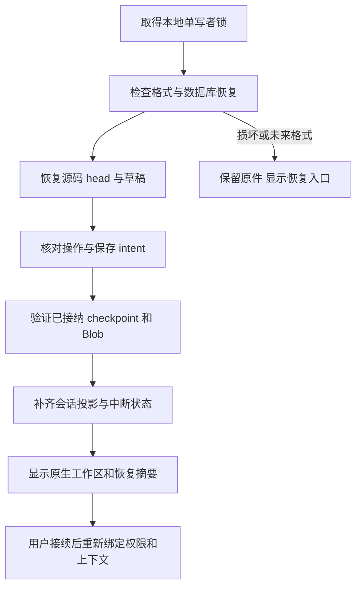

# Mac 存储、事务与恢复契约

[宿主与状态](macos-host-state.md) · [存储 Schema](macos-storage.schema.json) · [Agent](notebook-agent.md) · [上下文](agent-context.md) · [下一版](../plan/NEXT_RELEASE.md)

供应商默认/单模型覆盖、参数预设/能力证据、具体媒体准备与请求路由见[模型媒体契约](model-media.md)。本文件只规定它们的版本、存储和恢复，不另存一份失去继承来源的模型有效配置。

2026-10-08。下一版 Mac 设计，**尚未实现**。本方案补齐 DocCommitPort 的真实事务边界：源码、撤销信息、操作回执和幂等记录在同一个 SQLite 数据库事务中提交。会话、上下文和附件独立于 `.omnb` v1；重新打开应用先恢复记录和核对事实，用户接续后才启动 Agent 或计算。

2026-10-09用户排除旧版数据迁移：首个原生包创建全新通道存储，不导入旧Tauri配置/凭据/聊天/草稿；关于此前配置导入的要求以本次裁决为准。新原生以后格式升级/备份恢复仍保留，具体通道/安装/首次启动见[安装契约](macos-installation.md)。

## 调研依据与取舍

| 参考与核对范围 | 实际机制 | OpenMath 的取舍 |
|---|---|---|
| [Pi Coding Agent SessionManager，固定候选提交](https://github.com/badlogic/pi-mono/blob/503c605528f9af993c0e37ede468cf884fb0ff5b/packages/coding-agent/src/core/session-manager.ts) | JSONL 记录有 id/parentId；按当前分支构建上下文，compaction 保存 summary/firstKeptEntryId；该文件的追加路径未调用 fsync，读取会跳过 malformed lines | 采用稳定消息身份和可追溯压缩；不照搬其容错读取来处理权威事务。Coding Agent 的存储也不等于 Pi Core 自带的服务 |
| [DeepSeek Harness 持久化](https://github.com/deepseek-ai/deepseek-harness/blob/5badb15009ae1756c3afe0ae0cef1faafc290ccc/packages/session/session-persistence-jsonl/README.md) | 追加后 fsync；保留历史格式代次；区分可修复尾部与完整记录损坏；恢复区分未启动工具与效果未知的工具 | 采用不可变事件、明确提交点、不可覆盖迁移和工具效果核对；我们用数据库承担事务，不安装第二套 Agent 运行时 |
| [Codex App Server](https://developers.openai.com/codex/app-server/) | start/resume/fork/read、分页历史、归档；记录型 thread 与已加载运行状态分开；恢复使用稳定 thread id | 历史浏览、接续和运行分开；会话恢复不等于恢复旧授权或重复执行。公开接口未证明任意宿主业务事务的原子性 |
| [Claude Code 会话与 checkpoint](https://code.claude.com/docs/en/how-claude-code-works#work-with-sessions)、[记忆](https://code.claude.com/docs/en/memory) | 本地 JSONL 对话、接续/分支、编辑前文件快照；项目指令与长期记忆分开 | 分开对话、源码撤销和偏好；撤销按事务校验，不用整个旧文件覆盖后来编辑，也不从聊天文字重建数学定义 |
| [OpenCode 会话 CLI](https://opencode.ai/docs/cli/#session)、[导出](https://opencode.ai/docs/cli/#export)、[故障排查](https://opencode.ai/docs/troubleshooting/#storage) | 会话列表/删除、JSON 导出/导入，应用数据与可清缓存分开 | 提供可浏览、可导出、可删除的会话；清缓存保持笔记本/原始附件可用。这里只采用公开行为，不推断其断电事务保证 |

以上是参考机制；下文的数据库分区、保留量和恢复 UI 是 OpenMath 的设计裁决。调研未读取其他软件的私人会话或凭据，也未修改它们的设置。Pi 参考固定到既有候选提交，不据上游 main 的变化偷偷更换拟用依赖。

## 当前仓库基础

- [Notebook::to_file/from_file](../../crates/om-kernel/src/notebook.rs) 与[桌面文件层](../../app/src/state/files.ts)保持 v1 源码文件，加载后没有运行输出；桌面源码保存目前不具备本方案的事务账本。
- [原配置写入](../../crates/om-kernel/src/native/file.rs)已有相邻临时文件、sync_all 和替换；[凭据层](../../crates/om-kernel/src/native/credentials.rs)使用 service `openmath`/profile，并兼容环境变量和TOML明文。这是旧实现依据，新Mac不默认读取它们，也不把旧keyring路径接入新Registry。
- [移动文档](../../ios/OpenMath/DocumentStore.swift)使用 UIDocument；新 Mac 使用 NSDocument/文件协调，不替换移动协议。
- 当前没有文档级 durable revision、事务撤销、Agent 原始会话存储或可序列化的完整 kernel checkpoint。以下目录、表和服务均为计划接口。

## 存储分区与权威来源

```text
~/Library/Application Support/OpenMath/NativeMac/
  store.lock                        内核持有的单写者锁，文件本身不代表存活
  store.json                        格式/安装身份；不含路径授权或密钥
  Library/active.json               当前已校验库代次的选择器
  Library/Generations/000001/library.sqlite
                                    会话事件、提示词、请求快照、配置与索引
  Documents/<document_id>/
    active.json                     此文档已校验库代次的选择器
    Generations/000001/authority.sqlite
                                    源码修订、事务、操作账本、计算接纳和保存记录
  Blobs/sha256/<前2字符>/<完整散列>    不可变原附件、结果、checkpoint 和大快照
  Journals/<session_id>/             可重建 JSONL 投影，供查看/导出
  Staging/                          未发布资源、迁移临时产物；不能作为成功证据
  Backups/<backup_id>/               已校验的本地备份代次与引用清单

~/Library/Caches/OpenMath/NativeMac/  缩略图、渲染缓存与可重建搜索索引
~/Library/Logs/OpenMath/NativeMac/    有界诊断，默认不含源码/正文/媒体字节
用户选择的文件.omnb                  v1 源码，由 Swift 文件服务单独保存
系统 Keychain                       提供商密钥，数据库只存不透明 credential_ref
```

根路径由系统目录 API 解析；若启用 App Sandbox，落在对应容器的应用支持目录，不能硬编码开发者用户名。NativeMac 分区避免开发预览直接改写已安装 `.3` 的数据。数据库、Blob、临时和备份默认只允许当前用户访问；不声称这些业务数据已经加密。active.json 只含格式版本、store_id/generation/不可变 header 身份散列，采用相邻临时文件、同步与原子替换发布；目标只可在受控 Generations 下推导。散列不覆盖 last_clean_shutdown 等可变字段。普通读写不改 selector，不扫描“数字最大”的临时库来猜活动代次；已有库但 selector 缺失/损坏时进入显式恢复，不重新初始化空库。

| 数据 | 权威存储与责任 | 重启后的处理 |
|---|---|---|
| 源码/顺序/标题、cell revision、文档 revision | 每文档 authority.sqlite；Rust 决定内容，Swift StorageService 执行事务 | 恢复最后提交修订；比 `.omnb` 更新时显示“有本地未保存修改” |
| 修改/撤销、幂等及操作回执 | 同一文档数据库 | 查原回执；不重做写入，不因对话删除而删除回执 |
| KernelState 与已接纳结果 | 文档库的 active checkpoint/结果来源 + 已发布 Blob | 严格检查格式和生产证据后恢复；不自动求值源码 |
| 编辑/输入框草稿、选区、焦点与窗口 | 草稿在所属文档/会话库，ViewState 单独低优先级保存 | 保留基线与冲突；IME 草稿只恢复为未提交文本 |
| 原始用户/助手/工具事件、任务账本 | library.sqlite，宿主规范化，带 source sequence | 重建历史；未终止任务标 interrupted，等待接续 |
| PromptRevision、MemoryEntry、ContextSnapshot、压缩 checkpoint | library.sqlite；大载荷使用已发布 Blob | 保留实际版本/来源；新请求重新检查能力和权限 |
| 供应商模型配置 | library.sqlite 的不可变 ConfigRevision 与活动指针 | 不保存认证头；密钥引用不可用时提示重新连接 |
| 主动附加媒体、转换结果与导出产物 | 内容寻址 Blob + 所属库引用和处理状态 | 原文件消失仍可读取已接收副本；未完成转换保持中断 |
| JSONL、缩略图、索引与图形缓存 | 派生投影/缓存，无业务权威 | 可以重建；损坏不改变已提交源码或回执 |

每文档库隔离会话库故障；Library 的最近文档索引不是源码副本。跨库不使用 ATTACH 假装整体原子性：文档提交在文档库建立 outbox，Library 消费后按 event_id 去重。索引落后可以重建，不能导致一笔源码提交被撤销或重放。Blob 路径由散列推导，模型不能指定路径。

outbox 仅在 Library 的对应事件提交并回读后标记已投影；这个标记写回失败时，恢复允许重复投递同 event_id，由原始散列确认相同内容后去重。相同 ID 配不同内容是损坏/协议冲突，不能覆盖。正在发送的 payload/任务引用始终有 pin，不因索引尚未建立而被 GC 清掉。

## SQLite 事务与写入所有权

首版采用一个 Swift StorageService 调度器、每库一个串行 writer，所有写入/迁移/checkpoint/GC 进入该调度器；Rust 通过 DocCommitPort/结果接纳端口请求持久化，不直接第二次写库。读取在后台短快照中完成，MainActor 不执行 SQLite、散列或 sync。Pi 没有数据库/Blob 写入口。

数据库要求 WAL、synchronous=FULL、foreign_keys=ON；Mac 开启 fullfsync 并核对 VFS 的同步能力。journal_mode 不实际返回 wal 时拒绝启用此存储写入。业务确认等待 COMMIT 和按 operation_id 的独立读取校验；readback 校验内容，耐久性由同步提交提供，两者不能混为一个保证。设置及性能均需实施时实测。[SQLite WAL](https://sqlite.org/wal.html)、[同步设置](https://sqlite.org/pragma.html#pragma_synchronous)、[Mac fullfsync](https://sqlite.org/pragma.html#pragma_fullfsync)

SQLite 运行时要求 **3.51.3 或更新的已验证版本**；若使用较老系统库，必须有官方 WAL-reset 修复回移的证据并通过同套门禁，否则不能开放写入。官方列明 3.51.3 和回移版本修复多连接写入/checkpoint 的 WAL-reset 竞态；本设计不凭系统版本推断库已修复。具体系统/随包库及封装依赖在 N0 固定版本、许可和签名，当前不添加依赖。[修复说明](https://sqlite.org/wal.html#walreset)

根锁使用 OS advisory lock，进程退出自动释放；不通过删锁文件“抢锁”，PID 仅用于说明。第二实例前置已有窗口，或只读浏览并显示占用；不能起第二个 Pi 写同一会话。数据库仅位于已验证本地卷，不放进 iCloud/NFS/网络同步目录。用户 `.omnb` 可在系统文件提供商中，但其保存成功只代表该提供商确认本地写入/回读，不承诺云端已经同步。

写库前检查 store_version、minimum_reader_version、数据库 user_version 和记录 codec。未知未来格式只读提示或拒绝打开，绝不当“空库”重新初始化。定期使用有界 PASSIVE checkpoint，长读取分页结束后释放；备份与 checkpoint 不同。WAL 到 64 MiB 时请求维护，持续到 256 MiB 时暂停新大写入并报告占用原因，初值需测；不能通过删除 `-wal/-shm` 腾空间。

### 文档库的核心表

| 表/唯一键 | 作用与约束 |
|---|---|
| document_head(document_id) | 当前修订/源码快照散列、execution_epoch、已接纳 kernel 指针；只引用完整已提交记录 |
| document_revisions(document_id, revision) | 不可变源码快照，原 UTF-8 与稳定单元格顺序；不做 Unicode 归一化 |
| transactions(transaction_id) | base/committed revision、前后内容、完整反向计划、影响集、actor/task 与 operation_id |
| operations(document_id, operation_id) | 操作类型、规范请求散列、实际状态/结果/提交凭据；唯一键约束幂等 |
| operation_transitions(operation_id, sequence) | 追加的启动/取消/结束/核对事实；终止结果不能被迟到消息改写 |
| accepted_checkpoints(checkpoint_id) / accepted_results(result_id) | codec、生产源码/依赖/设置散列与实际接纳来源，禁止候选直接成为 active |
| save_operations(save_operation_id) / file_bindings(binding_id, revision) | 保存快照、目标绑定、expected file hash、实际读回字节散列及阶段 |
| drafts(cell_id, editor_generation, draft_sequence) | 未确认编辑基线；提交回执只清理被确认且不晚于该 sequence 的草稿 |
| blob_refs(owner_kind, owner_id, blob_hash) / outbox(event_id) | 本库引用和待投影的真实业务事件；与所属业务记录同一事务落盘 |

Library 中有 sessions/session_events、turns/tool_calls、task_ledgers、prompt_revisions、context_snapshots、compactions、memories、config_revisions、composer_drafts、blob_refs 和文档索引。事件唯一键是 session_id + event_id；source_instance_id + source_sequence 另有去重约束，序号缺口先核对来源，不补造工具完成事件。Schema 给出关键记录形状；表结构、外键、计数增长、权限和状态转移仍需真实服务校验。

### 源码提交的完整算法

1. Rust 校验当前文档、预览、源码散列、权限和 editor_fence，准备临时文档及反向计划。`operation_id` 在首次 admission 由宿主分配并落账；重连沿用它，不能由模型生成新 ID 来规避幂等。
2. 在文档逻辑提交门内，Swift writer 执行 BEGIN IMMEDIATE；重新核对 base revision 和操作唯一键。相同 ID/相同规范请求且已有确定终止回执则返回原回执，仍在运行则关联原操作，unknown 先核对；durable admission 尚未启动的操作由唯一 owner 执行，重启后必须等待用户接续并重新核验冻结计划，不能同时安排两个执行者。相同 ID/不同内容为 IDEMPOTENCY_CONFLICT。ID 散列不包含重连后变化的传输 request_ref，而包含操作类型、文档身份、原基线和冻结实际内容。
3. 把新源码快照、document_head、transaction/反向计划、operations 的确定回执、失效标记和 outbox 放进**同一个事务**。合法大快照先按后文 Blob 发布，事务只存完整引用；不得留一个可见的半新单元格集合。
4. 进入最终提交屏障前重新核对当前 generation/fence/取消。取消先胜出则 ROLLBACK。writer 进入 COMMIT 后，取消记为待核对，不能承诺撤销一个可能已经耐久提交的事务；不持有 MainActor 或 CAS 锁等待磁盘。其他规范文档写入等待此门，读取明确 pending 状态，本地新草稿照常保留。
5. COMMIT 成功并读取校验原回执后，Rust 发布新 committed revision，释放门和 fence。模型/聊天消息晚到也不重复应用。取消此时只停止后续工作。
6. IO/断连导致提交状态不明时保持 unknown，停止依赖它的新写入，重开该库并查原 operation_id；发现确定回执才发布，完整健康库证实未提交才允许重新核验后的同 ID 请求。损坏或尚不能查库不能被当作“不存在”。

Rust 仍是文档语义权威；数据库是其重启时的事实来源。Library 的工具完成记录、JSONL 和 UI 动画都不能证明第 5 步已经成功。保留至少幂等 tombstone（ID、请求散列、原结论/事务/修订）；裁减详细历史后仍不接受旧 ID 重新执行，返回 RECEIPT_DETAILS_EXPIRED 或已有精简回执。

### 撤销与执行接纳

撤销是新源码事务，校验当前相关内容/顺序与反向计划，产生新的 revision/operation_id 和 undo_of；不回退计数，不覆盖后来的手工修改。原生 UndoManager 输入分组只是交互层，实际文档撤销共用此账本。跨重启保留最近 200 个完整源码事务，已接续任务的事务和用户 pin 的记录继续保留；已裁减操作明确不能完整撤销。

KernelWorker 先冻结 candidate，精确编码 checkpoint/结果并发布 Blob；Rust 根据原[接纳契约](macos-host-state.md#计算工作状态与结果接纳)校验来源，在文档逻辑门内持久化 accepted checkpoint、active 指针、kernel_state_revision、结果与操作进展后才发布 ResultAccepted。提交期间 cancel 的先后规则与源码相同。过期候选不进 head，其未接纳定义/history/random 全部释放；持久化失败只可显示“已计算，结果未接纳（存储失败）”，不能推进主状态。此前已接纳的部分结果保留。

checkpoint codec 是独立版本的 Rust 类型化表示：表达式节点/符号/绑定、定义拥有者、属性/规则、Out/history、随机生成器类型与状态、设置、结果/步骤来源；精确整数/有理数与高精度尾数/指数/误差界用无损编码，机器浮点保留位型。不序列化指针、FFI handle、HTTP 任务或任意闭包；内置函数以稳定身份和 kernel build/registry hash 解析。仅保存漂亮 InputForm 或重新执行 let 都不能还原它。大型历史与结果用共享不可变子资源/去重引用，根 checkpoint 保留完整引用闭包，避免每个单元格再次存整份 history；编码/还原都有字节、节点、深度和时间预算，超限不截断后冒称完整恢复。

恢复 checkpoint 必须符合 codec、内核 build/目录、数学设置、源码和依赖散列；导入恢复只解码数据，不执行输入代码。不能支持的节点、丢失/损坏 Blob、容量不足或版本变化均使该状态不可恢复，保留源码/历史结果并提示“计算状态未恢复，需选择单元格重新运行”。历史结果仍标来源及 history_only，不能当有效定义。首版实现门禁覆盖 `.3` 已有精确/高精度、规则/函数、Out/随机和结构化结果，不提前宣称 serializer 已具备。

## `.omnb` 保存、文件绑定与自动保存

本地事务耐久提交与用户文件保存是独立事实。UI 分别显示“本地修改已恢复”和“文件已保存/未保存”；`.omnb` 只含 version/title/cells 的既有 v1 字段，不加 Agent ID、数据库 revision、凭据、输出或附件。

document_id 存在本地账本，不取文件名/路径/内容散列。Swift file binding 保存 bookmark 和可取得的卷/文件资源身份；移动/改名后解析并核对，另存为增加 binding revision。复制出的文件是新文档，即使 v1 cell IDs 与原文件相同。外部打开时以文件实际源码为准；仅在已核对原 binding 的恢复流程中取本地未保存修订。不把“相同文本”当作两个文档的授权等价。

每个文档的一次保存按以下阶段执行；实际 NSDocument 写入必须消费冻结 SaveSnapshot，不能临时从可变 ViewModel 取值：

1. 同步可提交草稿，取得 revision N 的源码；IME 未完成时保存已提交基线，并独立保留草稿，显示尚未保存的输入，不强制结束合成。
2. 文档库耐久记录 save intent，包含 N、binding revision、目标授权引用、预期旧文件字节散列、新文件字节/源码快照散列。目标由用户文件入口绑定。
3. Swift 文件协调检查外部修改，在同目录临时文件写完整字节、同步、替换并按该目标/绑定回读。文件提供商不能满足原子替换时给出明确保存失败/受限状态，不用直接覆盖当作等价保障。
4. 同一个文档库事务记录 SaveCompleted 与 saved_revision=N、实际 file hash；回读字节不符失败。若已编辑到 N+1，dirty 继续为 true；旧 binding 回执只记历史，不能更新另存为的新目标。
5. 替换完成但第 4 步之前崩溃：恢复按 intent 读取授权目标。字节等于新 file hash，可补 recovered save receipt；等于旧 hash，证明该快照尚未写入；第三种内容是外部冲突。无权限/离线保持 unknown，既不重写也不标已保存。

已绑定且可写的 `.omnb` 默认空闲 2 s 自动保存，持续编辑时最多 10 s 提交一次快照；手工 Cmd+S/正常关闭触发 flush，未命名文档只作本地恢复保存。自动保存复用同一 intent/回读路径，已有保存时合并待保存的最新修订；失败、外部冲突或 unknown 暂停重试并保留 dirty，不持续弹窗或静默覆盖。

已知外部变更不自动覆盖。打开并保留两份、查看差异/合并或另存为由原生文件流程处理，合并作为新源码事务。不恢复旧 bookmark 为模型的文件权限，不通过聊天要求绕过系统文件选择器。

非 IME 草稿提交采用有界合并窗口，初值 300 ms，在运行/保存/切换屏障时立即 flush；业务确认仍等待实际事务。原生草稿另每 500 ms 去抖、最多 2 s 保存，失焦/正常退出主动 flush；这是设计损失窗口，不承诺突然断电保留每个击键。未获回执的编辑留在 UI，存储失败保持“未本地备份”并允许复制/另存为，不清空草稿。恢复合成文本是独立未提交草稿，标出与 committed revision 的差异，不伪造系统 IME session。选区按 UTF-16 保存并校验当前字符串边界。

## 原始会话、上下文与压缩

会话以 Library 的不可变 session_events 为权威，消息、实际 tool admission、开始/结果、用户追加/停止、提示词变化与压缩都追加记录。事件 envelope 保留事件版本、source_instance_id/sequence、session/turn/task 身份、可选 parent_event_id、payload hash 和 owner 引用。事件 ID 是身份，sequence 是顺序，不能混用。payload 在同一数据库事务内或引用事先发布的不可变 Blob；不把每个 token 变成一次磁盘同步。

流式文字按完整 UTF-8 批次（初值 250 ms/32 KiB）持久化，最终结束/工具 admission/用户提交必须立即耐久确认；崩溃可能丢失尚未确认的文字尾部，保留“回复中断”。不完整或仅流式猜出的工具参数不调用工具。用户消息和已接收附件引用先提交再从输入框清空；网络请求还未启动时，取消可恢复该消息到草稿。

发起工具前先落完整工具调用/admission 与宿主 operation_id/目标 store ID，获得 durable ack 后才能执行。文档事实在文档库，Library 的 ToolResult 是其投影：文档 outbox 的源 event_id 保证断连后可补齐，不要求两个数据库同时提交。恢复时按可信 locator 查原库，不能从 Pi 文本中猜文档目标。

ContextSnapshot 在网络发送前持久化，包含固定 PromptRevision、实际消息/工具 schema、来源/媒体派生资源、模型配置与适配器版本、预算及 payload hash，认证数据除外。阶段为 planned → dispatch_started → response_started → finished/failed/interrupted；没有供应商确认不能声称“模型已完整收到”。发出后崩溃而没有回复标 dispatch outcome unknown，不自动重新发送计费请求。新请求使用新 context_id；旧快照只用于解释历史。

压缩提交只改变未来 ContextView：保存 covered event IDs、first_kept_event_id、原始范围散列、摘要/证据引用、生成请求与预算；成功且源范围未漂移、完整工具组配对后在同一 Library 事务中追加 compaction 事件并推进视图指针。失败/取消保持旧视图。原事件不被摘要覆盖或删除；来源过期按真实文档刷新。长期记忆只保存用户明确选择的条目，版本/删除 tombstone 与来源独立于任务摘要。

Prompt/Config 保存使用新不可变 revision + 活动指针的同库事务，回读之后显示成功。恢复历史文本产生新版本；正在运行的请求不换版本。对话归档只改列表可见性，接续保留 session ID、增加新的 turn/task/runtime 代次。首版不提供对话分支 UI；为 future fork 保留 parent_session_id/fork_event_id，历史导入分配新会话 ID 并只读，不导入执行授权或复活工具调用。

### JSONL 与损坏分类

JSONL 是带 generation、event ID、sequence 与 payload hash 的只读投影。按数据库快照在临时文件生成、同步/校验后发布，导出可分页；崩溃只恢复数据库事件前缀，不从半个导出反向写业务表。初版不实现 Zstd 双写/压缩运行时；需要压缩归档时增加独立 codec 与兼容门禁。

- 未发布临时投影中的不完整最后一行可丢弃并重新生成；已发布完整记录校验失败属于投影损坏，隔离后从权威库重建，不跳过中间坏行继续称完整。
- SQLite WAL 恢复由 SQLite 完成；应用不能模仿 JSONL 截尾来编辑 WAL。逻辑事件散列/外键/源码不符属于权威数据损坏，进入恢复模式，保留原件和诊断，不静默退回旧 revision。
- 每次事件页读取做结构/散列校验；启动 quick_check，异常后离线副本执行完整 integrity_check 与业务约束校验。历史迁移不把读不懂的数据当作可裁减噪声。

## 附件、结果和引用生命周期

媒体接收在后台复制到 Staging，受类型/大小/预算限制；读完计算 SHA256、同步完整文件，以不覆盖方式发布到 Blob 目录，再在所属数据库事务中建立 media/ref。已存在相同散列仍检查长度/内容；发布文件和父目录的持久化能力要实测。文件成功、数据库失败最多留下无引用孤儿；数据库永不引用还没发布的文件。OOM/磁盘满/取消留失败与输入草稿，不标可发送。

原附件、OCR/转写/视频采样与图形截图分别有 artifact ID、处理器版本、原 Blob、页码/时间覆盖与参数散列；相同文件名不去重，不通过缩略图散列丢弃原图。不持久化带密钥的临时上传 URL，供应商文件 ID 只能作为有期限的适配器元数据，原本地副本保持独立。移除附件撤销当前草稿引用，迟到转换不得重新挂回；已发送消息的引用保持直到明确删除该会话。

数据库 artifact/result/checkpoint ID 是稳定存储身份；工具 `*_ref` 是宿主签发的有期限 scope token，重启不直接沿用。历史面板可读取仍存的产物，接续时按新文档/task/grants 检查后签发新 token；旧 context 中的 token 明确 expired，配对恢复结果引用新身份。

| 工具引用 | 寿命与恢复规则 |
|---|---|
| snapshot_ref / cursor | 绑定冻结文档修订，最多 10 min；新代次/关闭失效。历史快照可浏览，不能成为新写入基线 |
| preview_ref | 最多 5 min；任一基线/权限/fence 变化失效，未提交预览跨重启不复活；相同 operation 的已提交回执仍可查 |
| result_ref | 任务内签发，存储结果可能更长；检查 source/epoch 与历史/有效状态，不因有 Blob 就标当前结果 |
| media_ref | 仅主动附加的任务范围与真实处理能力，任务关闭撤销；新任务需要用户附加或明确选择继续使用 |
| operation_ref / transaction_ref | 稳定账本 ID 的有范围引用；重启可重新签发查账，授权过期不删除已提交事实；撤销另做校验 |

有效期限是设计初值，不授予模型文件路径/URL或授权。缓存逐出后返回明确 expired/unavailable，不能返回一个空对象冒充数据；重新准备也需要完整真实来源。

## 启动与故障恢复



只做有界元数据检查，按需读历史/大网格；恢复期间先显示明确状态，不先启动 Pi。runtime_instance/document/task generation 更新；旧 FFI/HTTP/预览/取消令牌不复活。正常退出清理与断电走同一恢复算法，clean_shutdown 标记仅作优化，不能替代账本检查。

| 发现的持久化事实 | 恢复动作 | 明确禁止 |
|---|---|---|
| 助手提出调用，没 durable admission | TOOL_NOT_STARTED；保留原请求，接续可重新规划 | 伪造工具已经执行 |
| durable admission，无结果/终止回执 | TOOL_OUTCOME_UNKNOWN，先查实际 operation；read-only 可新请求，写入只允许按原 ID 核对 | 把超时当失败并用新 ID 重写 |
| 文档事务已提交，对话无 ToolResult | 从 outbox/原回执补 recovered result，显示实际变更 | 再插入相同单元格 |
| 计算 candidate 未接纳 | 丢弃 working state，保留已接纳前缀/中断原因 | 激活未接纳定义、Out 或随机状态 |
| 结果/checkpoint 已接纳，文件 revision 落后 | 恢复有效本地状态，文件仍 dirty | 宣称 `.omnb` 已保存 |
| 文件可能替换、缺 SaveCompleted | 按 save intent 和实际字节核对，权限缺失保持 unknown | 自动覆盖外部新内容 |
| Prompt/Context 已写，模型请求未 dispatch | planned，待用户发送或取消 | 标为模型已收到 |
| 请求开始后缺结果 | 会话中断/发送结果未知，保留用户消息/上下文 | 静默再次付费发送 |
| 仅 Pi 崩溃 | Task interrupted，核对已发工具，手工笔记本继续工作 | 把会话中断升级成源码损坏 |
| Library 损坏，文档库健康 | 文档与草稿独立可用；Agent 停用，提供会话备份恢复 | 为修复助手清空所有笔记本 |
| 文档库损坏 | 原库只读隔离，打开用户 `.omnb` 的副本或显式选择备份 | 静默用旧文件覆盖未保存源码 |

get_operation_status 在恢复后可查询旧 operation 的确定事实，但新动作需要新任务绑定。未知提交阻挡相依写入直到核对完成；不同文档不因此被锁死。恢复结论本身追加 recovery record，带证据/来源，不改写旧原始事件。

## 原生恢复交互

恢复工作区显示左侧源码/草稿、右侧历史和一条简短通知：“已恢复本地修改，文件尚未保存；助手任务已中断”。有确定事务时列“已修改 2 格、执行到第 1 格”；效果未知时列“1 项操作待核对”。没有变化不显示修复成功动画。系统 Reduce Motion 不影响结果或可用操作。

提供“查看修改”“接续”“保留草稿/另存为”“放弃未提交草稿”等与实际状态匹配的原生动作；确定已提交编辑不因点“停止”消失。接续先核对文件/当前源码和新权限、更新上下文，再允许模型循环；不再次询问已经明确授权且当前范围仍有效的可逆编辑。更换文档、失去文件权限或有内容冲突时说明具体原因。

“删除对话”删除对话/快照/会话附件引用，保留文档源码、事务回执和用户显式长期规则；“清缓存”只删可重建派生物；“恢复提示词”只改下一轮配置；“撤销修改”是新文档事务。分别显示影响，不把这些动作合成一个重置按钮。首版没有跨设备自动同步；本地应用备份也不代替用户自选文档的外部备份。

## 新配置、凭据与后续格式升级

新Mac首代Provider/Model/Preset Registry为空，分配全新稳定ID，凭据写专用NativeMac/Preview Keychain service。首次启动不扫描旧配置/环境密钥、不读service `openmath`/旧profile、不转换TOML或创建迁移映射；也不删除旧数据。新配置的Test/Save和Keychain候选写入由用户普通设置入口管理，rename不改变credential_ref；供应商模板仅是非秘密建议。

新密钥更新也采用“写候选 Keychain 项 → 核对 → 配置事务切换 credential_ref → 延迟释放无引用旧项”。Keychain 与 SQLite 无共同事务，不能承诺两者一起原子回滚。删 profile 的配置成功后再释放无引用密钥；后台/锁屏/权限拒绝时保持原引用和明确失败。

store、记录、checkpoint、tool schema、prompt template、模型适配器与 `.omnb` 各有独立版本。升级取得锁、冻结写入、先用 SQLite backup API 取得一致库快照及 Blob 引用，迁移到新代次临时库，校验计数/散列/外键/业务约束、关闭所有目标连接并同步目标目录，发布新的 generation 目录后才原子切换 active.json。崩溃若 selector 仍指旧代次就继续旧库；若指新代次只打开经过验证的新库，不把未选库自动当活动库。旧库保留但迁移完成后不再双写。多个文档按独立代次迁移，Library 只索引稳定 store_id，不决定它们的活动代次；不要让一次读打开偷偷迁移全库。

备份不能直接复制正在写的 `.sqlite` 而遗漏 WAL：在调度器暂停元数据写入且持有 Blob pin 时分别用[SQLite Backup API](https://sqlite.org/backup.html)取库快照，完成引用清单/校验后发布 BackupManifest。崩溃前未发布的 backup 是临时资源；恢复备份作为新的 store_generation，旧 operation ID/幂等 tombstone 保留且旧运行 token 全失效。退回较早备份会丢失其后的账本知识，必须标记 rollback_quarantine，禁止接续/重放旧写操作；先只读查看与另存新文档，不能声称幂等历史仍完整。

## 保留、空间预算与 GC

以下为可调整设计初值，实施时测量 UI 延迟、磁盘与实际媒体量，不是已达到的性能指标。

| 类别 | 首版默认规则 |
|---|---|
| 当前文档/草稿、明确 pin 的会话和原附件 | 保留，不因缓存清理或全局预算自动删除 |
| 未保存源码/unknown 操作、被引用 undo/checkpoint/context | 必须 pin；已完成文件保存后才能按历史策略处理 |
| 完整撤销历史 | 每文档最近 200 事务 + 活跃任务引用；更旧详细差异可裁减，幂等 tombstone 保留 |
| 原始会话/已发送附件 | 默认保留至用户删除/设保留策略；归档不删除。元数据+会话+Blob 总软预算 5 GiB，超限提示管理 |
| ContextSnapshot 与大工具结果 | 随所属会话保留；用户选择删除详细快照时保留 provenance/hash 和 unavailable，不能假装仍可回看全文 |
| 派生缓存 | LRU，默认上限 512 MiB；存在 producer/running 引用时不驱逐，原附件不是缓存 |
| 未引用 staging/孤儿 Blob | 完成恢复核对后，超过 24 h 才可回收；正在写/转换/备份资源例外 |
| 本地备份 | 正常日末最多每日一份，最近 7 份 + 最近 2 个迁移前代次，软预算 1 GiB；超预算提示，不能自动牺牲唯一健康备份 |
| 诊断日志/JSONL 投影 | 最多 10×5 MiB 日志；投影可删重建，用户导出的文件不由应用 GC 管 |

每消息附件总量初值 256 MiB/最多 16 项，单文件最大 128 MiB；转换请求另受页/帧/时长/CPU预算约束。接收任意文件类型不等于无限容量或能交给任何模型。空余低于 1 GiB 暂停新大附件/网格，低于 256 MiB 阻止新写入并保留内存草稿、展示保存出口；阈值和预留不能保证别的进程不同时耗尽空间，因此每步仍处理 ENOSPC。不会自动清理其他应用或用户下载目录。

GC 在同一调度器获得所有库的稳定引用集合/运行 pin/备份 pin，再分阶段标记待回收、取消不再被引用的派生任务、移入隔离区、重新核对后删除。发布/引用创建与 final sweep 互斥；跨库引用丢失、库损坏或格式不支持时停止原 Blob 回收，不能因为扫不到引用就判孤儿。删除会话先事务 tombstone/撤销 scope，再去掉引用；WAL/备份可能暂留旧字节，UI 不承诺取证级擦除。

## 实施顺序与验收账本

| 批次 | 交付 | 必须证明的真实行为 |
|---|---|---|
| S0，N0 前置 | 版本化 StorageService、根锁、新数据库/Blob初始化 | FULL/同步能力和库版本实际核对，未知格式不写、无旧目录/凭据读取，双实例排他，单writer与无MainActor阻塞 |
| S1，N0/N2 写入门禁 | 源码/撤销/幂等同库事务、草稿/file save intent、outbox | 每个提交阶段故障注入，没有半笔修改、重复插入或晚回执覆盖；保存 N 后 N+1 仍 dirty |
| S2，N1/N2 接纳门禁 | 无损 checkpoint/result codec 与持久化接纳 | 定义/属性/Out/随机精确恢复；过期候选全部丢弃，损坏/升级不自动运行 |
| S3，N2/N3 Agent | durable admission、会话事件、ContextSnapshot/Prompt/压缩/附件 | 调用未启动/效果未知/已提交失联分别恢复，凭据隔离与模型载荷真实一致 |
| S4，N4 发行 | 新原生后续格式升级/备份、quota/GC、原生恢复入口与打包 | 无开发环境可恢复、新配置与主动打开用户文件可用、空间满和损坏保留数据，不导入旧应用存储；其他平台回归不变 |

运行时验收编号（全部 **planned**）：

- SR01：在 BEGIN/源码写入/receipt 写入/COMMIT 前后/ack 前杀进程；只出现整笔旧态或整笔新态；同 ID 不同内容拒绝，同 ID 重连保持一次插入。
- SR02：文档提交成功而 Library/outbox 投影未完成，重启补准确 ToolResult；Library 损坏仍可编辑/保存健康文档。
- SR03：撤销后再次编辑/重启/重复撤销、200 条历史裁减，版本单调、冲突保留手工内容、旧 ID tombstone 不复执行。
- SR04：a=2→5 时旧 job 输出/定义/history/random 一起丢弃，重启恢复有效 checkpoint 后 b=6；精确/高精度/机器位型与 Out/随机序列独立核对。
- SR05：保存 N 期间编辑 N+1、另存为换 binding、外部写入、文件替换后崩溃、权限丢失/离线 provider，各自恢复正确 dirty/unknown/conflict。
- SR06：中文/emoji/IME 草稿、输入框仅附件、发送前崩溃/停止、晚转换结果、原文件消失，已接收副本和未确认编辑不丢；记录实际损失窗口。
- SR07：planned/dispatch_started/流文字未落盘/工具 durable admission 无结果/partial，均不自动收费重发、工具重写或跑全部单元格。
- SR08：Prompt 保存失败/恢复版本、压缩源漂移/配对错误/取消、跨模型继续，实际 ContextSnapshot 与 wire 相同且没有认证数据。
- SR09：完整事件/Blob 校验坏、SQLite 权威损坏/JSONL 投影截尾、未来格式，分别隔离/重建/拒写，不静默跳过 committed 记录。
- SR10：每个新原生格式升级/备份发布点中断，源代次不变；旧备份恢复quarantine，不凭缺失旧回执重新写入；首个原生安装仅初始化，不执行旧版导入。
- SR11：双实例、stale lock、WAL 长读、GC 与上传/接纳并发、跨库漏索引、低磁盘/OOM，活跃引用保留且 IO 不阻塞 UI。
- SR12：新Keychain候选/ConfigRevision半失败、锁屏拒绝、profile重命名/删除、诊断/会话导出/备份核查，密钥始终不入普通存储；旧TOML/service/env不会被自动读取或清理。

这些不是已通过的测试。本轮只进行文档/Schema 结构与引用校验；新增存储、codec、崩溃注入和原生性能需按上述批次实现。原 53 数学期望、`.omnb` 往返、Windows/Web/CLI/iOS 门禁保留；本机不启动 iOS 模拟器。

本轮实际设计检查：存储 Schema 的 14 个合成正例与 19 个缺字段/非法边界/状态组合反例通过，既有宿主/工具 Schema 结构仍有效；9 份 Markdown 的 151 个本地链接/锚点及代码围栏已核对，函数目录生成检查通过（829 语义条目、22 参考页）。这些检查只证明设计形状/引用，不能证明 SQLite 原子性、断电恢复或原生 UI 性能已经实现。
