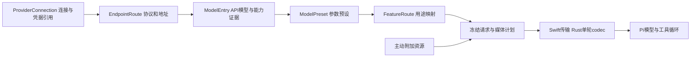

# Mac 模型、供应商与媒体服务契约

[UI/UX 规格](macos-model-media-ux.md) · [机器 Schema](model-media.schema.json) · [交互草案](prototypes/mac-model-settings.html) · [输入框](agent-composer.md) · [宿主](macos-host-state.md) · [存储](macos-storage-recovery.md)

2026-10-08。下一版 **Mac 专用设计，尚未实现**。供应商、模型、用途映射和媒体处理采用稳定身份与独立版本；Swift 管连接/凭据/文件和原生界面，Rust 单轮 codec 管请求/流校验，Pi Agent Core 管循环。设置保存、目录发现、模型探测、媒体准备、实际推理各有自己的事实和回执，不用一个“连接成功”代替所有能力。

## 当前基础和官方依据

[ProfileConfig](../../crates/om-kernel/src/config.rs)目前把供应商与单模型放在同一个 profile，具有 name/kind/base_url/model、temperature/max_tokens、tools/JSON 的布尔声明以及额外头/参数；功能按 profile name 映射。[ProviderKind](../../crates/om-llm/src/types.rs)已有 OpenAI Chat、Anthropic、OpenAI/Ollama/Mistral FIM；ChatMessage 的正文是 String，并无通用多模态消息。现有[草稿探测](../../app/src/components/settings/ProfileProbe.tsx)可传草稿配置，不能直接等同于新 Agent 的工具/媒体契约测试。

| 已读官方来源 | 与本设计有关的实际信息 | OpenMath 的裁决 |
|---|---|---|
| [DeepSeek models](https://api-docs.deepseek.com/api/list-models/)与[视觉输入](https://api-docs.deepseek.com/guides/vision/) | 目录可以返回名称、容量、输入模态、effort 和按协议区分的能力；视觉消息在 Chat/Responses 的结构不同 | 读取实际目录字段和协议；不继续把 DeepSeek 一律标为文本模型，也不因品牌支持图片就标所有模型支持 |
| [OpenAI 图像](https://developers.openai.com/api/docs/guides/images-vision)与[文件输入](https://developers.openai.com/api/docs/guides/file-inputs) | 端点、模型与文件类型共同决定输入方式；文件提取对 PDF、普通文档和表格不同 | 原生文件输入与本地提取分开，说明实际页/图/表覆盖；不承诺上传文档就理解所有内容 |
| [Claude Models API](https://platform.claude.com/docs/en/api/models/list) | 分页目录可提供 lifecycle、容量及 capability 详情，字段可能未知 | 可查询退役/弃用信息，保留用户配置；目录更新时间不是模型探测成功时间 |
| [Gemini models](https://ai.google.dev/api/models)与[视频](https://ai.google.dev/gemini-api/docs/video-understanding) | 模型有输入/输出 token 限制与 generation methods；视频有对应原生输入及处理机制 | 容量的语义原样记录；原生视频与本地抽帧分别建计划，不能把抽帧称作完整视频提交 |
| [Ollama 模型列表](https://docs.ollama.com/api/tags) | 本地服务列出模型及相关元信息 | 本机服务也是供应商连接；安装/可见不证明工具、图片或特定参数已可用 |
| [Pi 类型，既定候选提交](https://github.com/badlogic/pi-mono/blob/503c605528f9af993c0e37ede468cf884fb0ff5b/packages/ai/src/types.ts) | 既定标准 UserMessage/工具结果主要是文本与图片，不能直接承载全部音视频/文件类型 | 丰富媒体由 OpenMath canonical messages 与宿主 wire 适配提供，不能声称安装 Core 自动获得所有媒体能力 |

文档读取日期为本日，未使用真实 API Key 发起探测。官方声明是能力来源，仍须证明 OpenMath adapter 和用户连接可用；不固定当前模型名单、价格或容量为永久产品事实。

## 数据模型

| 对象 | 内容与规则 |
|---|---|
| ProviderConnection | provider_id、显示名称、模板身份、启用状态、连接修订、credential_ref/revision、非秘密头及秘密头引用、端点集合、ProviderModelDefaults |
| EndpointRoute | route_id、provider_id、协议、基础地址及受控路径、超时/上传限制、允许 origin、认证方式；不让模型填写 URL |
| ModelEntry | 稳定 model_id、provider/route_id、api_model_id、显示名、目录来源/lifecycle、容量/能力证据及逐项 ModelOverrides；默认继承 ProviderModelDefaults |
| ModelPreset | preset_id、model_id、显示名、输出预算/推理/采样等已支持参数、enabled、revision；同模型可有多个用户预设 |
| FeatureRoute | 功能 → preset_id 或明确关闭，独立 route_revision；助手当前选择是会话覆盖，不偷偷改变全局映射 |
| CapabilityEvidence | 具体能力/组合、supported/unsupported/unknown、目录/文档/用户/测试来源、协议/配置/凭据代次、日期及失败类型 |
| MediaPolicy/PreparationPlan | 本地/原生模型优先/每次选择、允许的处理服务、实际页/时间/帧范围、资源预算、产物与版本 |
| ModelRequestSnapshot | 请求身份、冻结连接/模型/预设/能力和媒体计划、ContextSnapshot、wire hash 与实际结束状态 |

连接名称/模型名称可改，不改变稳定 ID 或 Keychain 归属；API 模型字符串可以含 `/`，不能被当本地路径。不同供应商的同名模型独立，同供应商多个 endpoint/账户也独立。复制供应商默认只复制非秘密配置，凭据重新选择；复制模型预设可以复用同一个 model_id，不重复创建 API 模型身份。

目录的快照是原始发现数据，ModelEntry 是用户纳入的配置。目录里出现未选模型不自动加入助手菜单；刷新时出现/消失的差异单独列出，不删除旧映射，不覆盖手填显示名、参数或容量。api_model_id 被后台滚动升级时注明返回/served 身份可得性，不能推断已经固定模型版本。

### 供应商默认与单模型覆盖（用户补充裁决）

供应商页提供统一的 **默认模型配置**：上下文容量/输入输出上限、多模态声明（图片/PDF/音频/视频逐项）、工具/流式等声明、思考强度映射和常用参数默认。该供应商的模型新建/导入时所有项默认 inherit；目录建议与实际探测独立呈现，不自动把它们写成模型覆盖。

每个模型逐字段保存 inherit/override/auto：inherit 不复制数值，始终引用已保存的供应商默认；override 保存本模型独立值（包括明确不支持/关闭）；auto 是用户主动选择该模型的最新有效目录/adapter 建议。自动取不到值就是 unknown，不能退回一个猜测。未知数值用显式 unknown，不与 inherit/null、关闭或清空混用。

有效配置的顺序为供应商已保存默认 → 单模型显式覆盖 → 预设/本次请求可调整参数。预设不覆盖固定容量/实际输入能力，任务/模型文本不能修改设置。界面逐项显示来源和最终值，并有“恢复继承”。供应商默认保存成功后，仅继承字段变化；覆盖字段保持不变。模型页未保存草稿和运行中的 immutable request 都保持原身份，不被父配置回执覆盖。

思考强度映射按 endpoint protocol 保存：公共 UI 的关闭/低/中/高/最大 → 该协议已支持的 effort 值、thinking mode 或预算字段组合。例如“高 → reasoning_effort=high”，也可用已支持的 budget 参数；不是把所有供应商都硬写成同一字符串。未映射档位不进入选择器，多个 UI 档位映射同一个 wire 值时可见说明；映射目标/类型/伴随参数仍受 adapter descriptor 校验，不支持执行脚本或覆盖认证/工具/消息。模型可单独覆盖整套映射，其他模型继续继承。

供应商/模型设置是用户配置，**不等于实测证明**。服务对该模型的可靠容量限制、模态限制、实际参数错误与宿主接通范围继续约束发送；例如继承配置 128K、服务声明只有 64K 时显示两者与有效预算，不能默默按 128K 发。需要提高覆盖值/声明支持时允许修改并提供探测，但无法通过配置把未实现 adapter 或失败工具往返变成真实能力。相关请求/凭据/映射变化使对应证据失效，不把全部模型通用测试结果继承给子模型。

EffectiveModelConfig 是从已保存父/子/预设修订计算的不可变请求值，携带逐字段来源和 effective_config_hash；不另存会失去来源的第二份可编辑全量配置。模型保存时核对当前父修订，运行前再次解析；父草稿未保存时不会改变子模型的当前生效值。纯显示名称变化可沿用同 wire/凭据/模型/参数 hash 的证据并保留原测试来源；涉及映射/原生部件的变化必须核对相关组合证据。

## 协议与版本范围

首版目标为以下接入家族，均 **planned，真实 handler 完成后才启用**：

| 协议/模板 | 用途 | 必须完成的路径 |
|---|---|---|
| openai_chat，OpenAI compatible / DeepSeek | 对话、工具、按模型支持的图片/文件 | Chat 多块 content、tool_call 配对、UTF-8/SSE、usage/错误与媒体预算 |
| openai_responses，OpenAI / DeepSeek 等实际兼容端点 | 对话/工具及适配器已验证文件输入 | item/function_call_output、结束/不完整、推理回放和内容部件；不把名字兼容当行为兼容 |
| anthropic_messages，Anthropic 或明确兼容端点 | 对话、工具、图片/PDF 等实际能力 | message/content block 生命周期、tool_use/tool_result、effort/thinking 和签名归属 |
| gemini_generate，Google Gemini | 对话、工具、实际音视频/文件 | generate/stream methods、part/文件处理状态、function call、思考部件与 usage |
| ollama_chat，本机 Ollama | 本地对话和各模型实际工具/媒体 | NDJSON、done/错误、工具/图片契约，不拉取或安装模型 |
| openai_fim / ollama_fim / mistral_fim | 现有补全功能 | 原 prefix/suffix 和真实取消；不是 Agent 对话模型，不进入执行助手列表 |
| transcription_openai，已配置转写连接 | 音频转写服务 | multipart、时长/文本时间范围、取消与错误；不能只配置一个 Chat URL 就宣称转写已接通 |

供应商模板只填已核对的连接建议和可选协议，不保存真实密钥、不自动导入/启用模型；自定义连接允许选择上述已实现协议。AWS/Vertex/Azure 特有部署和 OAuth/网页账号登录、任意插件协议、模型下载/微调、多 Agent 自动选型、图像/音频生成作为后续功能，不放伪按钮。

现有五类 ProviderKind 保持旧含义。新 Mac DTO/版本化 ModelService 独立演进；旧平台保存的配置不突然变成新格式，单轮协议新增也不复用旧 LlmChat 循环。补全/Ask/讲解/修复继续保留，作为 FeatureRoute 接入。

## 能力、容量和参数

能力按 **model + endpoint protocol + 配置/凭据代次 + adapter version** 记录。有效可用性取服务证据、已实现 wire/媒体 adapter、任务模式/授权及本轮预算的交集；界面可以显示“目录支持图片，当前连接尚未测试”或“原生视频未接通，可抽帧”，而不是一个模糊绿色圆点。

能力范围包括 text_input、tool_calling、streaming、image_input、pdf_input、audio_input、video_input、file_upload、json_output、fim、reasoning、token_count；需要时记录组合，例如 reasoning+tool_calling 和 image+tool_calling。测试工具不证明所有多模态组合；timeout/401/限流是连接/授权/可用性问题，不自动把模型数学或模态能力标 unsupported。

执行助手必须有当前路由工具往返测试证据，讨论模式可用纯文本模型；首次使用未核验模型提供“测试工具调用/改用讨论/选择已可用模型”。测试用合成 noop 工具，不能在用户笔记本中试写。普通文本/图片可在官方/目录声明及适配器验收已明确时使用，结果仍注明连接未核验；必需参数/能力未知时给具体可选处理，不假装支持。

容量分别保存 total_context_tokens、max_input_tokens、max_output_tokens 及各自来源/时间。供应商只给 input/output 上限时，不把二者直接相加伪造共享总窗口；ContextBudget 先满足已知输入上限，再满足已知总窗口扣输出预留的约束。未知分母不显示百分比。图像/视频估算只能用该协议实际计数规则，不能用文件字节当 token；计数接口调用前注明它的网络范围。

参数 UI 由 ParameterDescriptor 生成：类型、枚举/上下界、nullable/省略、实际默认值、wire path、互斥/依赖、来源与适用协议。常用项为输出预算、推理强度/模式、temperature/top_p、超时；不支持的 temperature 不发送，不能以空值替代省略。effort 使用该模型真实列表，不能把所有模型都写成 low/medium/high。参数组合重新探测后才延用组合证据。

高级参数保留命名键编辑和完整预览，结构/类型/互斥错误阻止保存。宿主封闭 messages/input、tools/tool_choice 的宿主策略、model、stream、认证、URL/重定向、任务/文档/预算和远程文件引用；extra_body 不能覆盖它们。新增供应商扩展必须由受控 adapter descriptor 允许，拒绝任意脚本、任意 handler 或可执行模板。

## 发现、测试与保存算法

### 发现目录

用户点击“获取模型”时冻结当前连接草稿及 credential intent，后台按已接通的发现 adapter 请求；从模板/受控 route 构造地址，分页上限初值 20 页/2000 模型/4 MiB/30 s。没有发现接口仍可手动输入 API ID，不制造错误的空目录。

发现结束返回 DiscoverySnapshot/draft_hash/route_hash，列表只显示完整已读范围；分页失败保留已发现记录并标 partial，用户决定导入这些记录。已编辑地址/密钥/协议后的旧结果只留历史，不能覆盖当前列表或产生“连接可用”。获取目录不发模型推理；不同供应商是否有额外费用不在界面作通用保证。

### 分项探测

ProbeRequest 使用草稿模型/预设，不保存、不运行笔记本、不把测试文字追加到用户对话。UI 显示本次测试项目与小请求可能产生 API 用量；可取消，终止以回执为准。结果只确认被测试的内容，不给一个泛化“所有能力通过”。

| 项目 | 实际判据 |
|---|---|
| 连接与文字 | 路由/认证/模型实际返回有效文字，区分 HTTP 成功与协议有效 |
| 流式 | 分段 UTF-8/SSE/NDJSON 和真实结束码，首字节/首文字/总耗时分别记录 |
| 工具 | 真实返回指定合成工具的完整合法参数，发送配对工具结果后收到有效后续回复 |
| 图片/文件 | 自有小 fixture 的指定部件实际提交/被服务接收；回答验证是有限场景证据，不保证任意内容理解准确 |
| 推理组合/JSON/FIM/转写 | 按实际 handler 做对应请求/返回验证，不能继承普通聊天探测的结论 |

探测 token 绑定 view/model/draft/probe generation；改目标、关闭或取消使旧回调无权更新当前表单。探测期间可编辑，但旧结果明确“不适用于当前草稿”。草稿尚未保存时，成功证据只保留在该 draft；保存时只有规范内容相同且 credential intent 精确对应才能转到新 revision。

### 保存与删除

Provider/Model/Preset 表单显式保存，普通 UI 偏好即时保存。保存携带 expected_config_revision 和 operation_id；校验引用/协议/参数/密钥 intent，在存储契约的 Keychain 候选写入 + Library 单库 ConfigRevision 事务中提交，回读才显示成功。失败保留旧配置和独立草稿；unknown_commit 禁止同对象二次写入，先查回执。Test 与 Save 两个按钮不相互代替。

credential intent 明确为 keep/replace/clear/none；已保存项仅显示“已存于钥匙串”，不把 `***` 当新密钥。额外认证头同样成为秘密引用，只有非秘密头保存普通值；新配置由用户明确分类，不能保证任意名字的头天然无秘密。用户排除旧版导入，不读取旧extra_headers/Keychain。授权材料不进入 Pi、模型日志、ContextSnapshot 或导出。

停用连接/模型阻止新请求，已冻结请求可完成，用户可另点停止；删除前展示模型/预设/功能/当前请求依赖，先重新分配或显式关闭映射，再一个配置事务删除。不能静默换供应商。活动请求凭据/版本 pin 到终止，最后再释放；历史请求保留非秘密 provenance。外部更新造成冲突保留草稿并显示差异/重新载入，不盲覆盖。

## 单轮请求与模型切换

1. 同步本轮文档/会话边界，解析 FeatureRoute 或当前助手选择，取得已保存 immutable revisions 与实际 grants。
2. CapabilityResolver 检查模式、完整工具组、参数和必需媒体；MediaPlanner 给出完整 PreparationPlan。未准备/不可用/未选择的附件阻止发送，不默认丢弃后只发文字。
3. ContextPlanner 使用 OpenMath canonical rich messages 组装冻结消息。Pi 的文本/图片投影保留 event/part ID 与 media_ref；streamFn 把对应 context_ref 交宿主，宿主验证它与 Pi 实际请求视图的身份/顺序一致，再从冻结授权资源构造原生 file/audio/video parts。不能把模型生成的 media_ref 当作可读取资源。
4. 单轮 codec 编译该协议真实 request，做部件/参数/工具 schema/大小校验。存 ContextSnapshot 和 wire hash 后，Swift Keychain/URLSession 发送；密钥仅在最终传输头/允许的认证位置出现，不跨 Pi IPC。
5. 归一化文字、工具参数、可回放部件、usage、错误与 finish/incomplete，绑定 request/turn/model revision。只有完整合法 tool call 被 durable admission 后才进入业务工具；服务端内置网页/代码工具默认不开放。
6. Pi 完成当前工具组后才发下一请求。用户切换模型/预设/effort 显示“下一轮生效”，新 draft/附件保留；旧响应继续属于旧快照，不混成新模型的回复。

供应商专有签名/推理项/response_id/远程 file_id 只在兼容 provider/route/model/adapter 绑定下回放；换模型先投影可移植的用户/助手/工具事实并重新做预算和媒体计划，不把不透明签名转为普通用户文本。首版会话权威在本机，不依赖服务端 conversation state 或 response ID 才能恢复。无法可移植的上下文明确说明缺口。

传输默认拒绝重定向；https 为远程默认，http 仅显式配置的 loopback 本地服务，LAN 明文另立接入边界。凭据仅发到该 route 的受控 origin，上传/token-count/transcription 也由用户配置的 route 解析，绝不使用模型或附件内任意 URL。UI 可显示实际服务地址；返回 HTTP 错误默认裁剪/脱敏，不显示可能回显认证的完整原 body。

初值为连接 10 s、首响应 60 s、流空闲 30 s、单次总 180 s，可按已支持范围设置；媒体准备/上传另有预算，数字为拟定值。请求未 dispatch 的失败可安全再准备；dispatch_started 后 timeout/429/断连默认不自动计费重试，保留具体阶段并由用户选择重试。服务端可能仍处理已取消请求，停止只报告本机/可确认的实际状态。

## 媒体准备与发送路径

接收仍遵守存储契约的 16 附件/128 MiB 单文件/256 MiB 每消息初值，原副本完整保存；**本地接收上限不等于模型上传上限**。Planner 取应用/协议/服务/模型预算最小值，计算 base64 膨胀、multipart、像素/页/时长/帧和输入 token；不把一份 128 MiB 原附件直接塞进 2 MiB 控制 ABI。大字节由 Blob/分块上传流传输，IPC 只传引用。

| 输入 | 本地基本路径 | 原生提交与可选处理 | 必须显示的覆盖范围 |
|---|---|---|---|
| PNG/JPEG/HEIC/TIFF/可解码图片 | ImageIO 校正方向/真实尺寸，原图保留；Vision 本地文字识别按实际语言可用性 | 已支持模型/codec 用规范化图片；动图首版明确只选静态帧，不伪称分析动画 | 原图/缩放或切图、实际帧、OCR 内容与识别不确定性 |
| PDF | PDFKit 页文字/指定页渲染，扫描页可本地 OCR；加密文件需要用户解锁 | 真实 native PDF route 或选页图片/文本；不给没有 PDF adapter 的模型发送伪 file parts | 实际页号、文字/页图/原文件方式、未覆盖页和超限 |
| 音频 | AVFoundation 解码/时长/播放；支持时用本地 Speech，availability/语言/权限真实检查 | 配置的转写服务或已验证原生音频 route；没服务时保留附件等待选择 | 原生音频/转写、实际时间段、说话人仅在真实提供时显示 |
| 视频 | AVFoundation 指定时点抽帧，音轨独立处理，预览不自动播放 | 已验证 Gemini 等原生视频 route，或帧+转写；原文件上传不等于无损逐帧分析 | 原生文件与供应商已知采样规则，或明确本地帧时点/音轨覆盖 |
| 文本/源码/CSV/JSON | 受限 UTF-8/编码识别、纯数据解析和分页，不执行输入代码 | 文本内容或实际 file route | 行/字节/行列范围；截断/分页仍可追溯原件 |
| Office/未知/无法解码文件 | 原生 QuickLook 能预览则预览；缺提取器则显示原文件信息 | 经验证 native file route，或用户选导出 PDF/文本；首版不承诺完整 Office 本地解析 | 未读取/仅提取文字/嵌入图表未覆盖等真实状态 |

媒体策略提供“优先本地处理”“优先模型原生输入”“发送前选择”。推荐默认优先模型原生（已支持）与本地确定性准备，**云转写/OCR 不自动外借另一供应商**；用户在媒体服务页明确配置处理 route 后，可在既定任务范围自动使用，发送前摘要列真实接收方。没有可行路径的附件提示换模型、选择处理方式或移除，不擅自忽略。

本地 OCR 是提取结果，不能称精确数学转写；保留原图片/页图供视觉核对，模型产生的数学源码仍需 Preview/CAS 验证。Speech 的本地能力必须实际检查，不能只因存在 Apple API 就宣称离线可用。[Apple 本地识别能力](https://developer.apple.com/documentation/speech/sfspeechrecognizer/supportsondevicerecognition)

视频抽帧的默认计划初值为每 2 s 一帧、最多 24 帧/48 s 一个选定段，PDF 默认选定最多 20 页；大文件先展示全长/页数并要求选择范围或原生路线，不能从长视频最前 48 s 推断完整覆盖。OCR/文本页/音频段/帧独立记录 CoverageSpan，prepared part 与原 attachment_id/artifact hash/processor/version 参数绑定。未知时长不模拟进度百分比。

用户移除、换模型、修改处理范围或取消使 preparation_generation 增长；处理中相同内容可以复用已完成产物，但新网络提交重新校验能力/范围。迟到结果仅可进入历史缓存，不能重新出现在已移除草稿或绑定新模型。MediaPrepared 与 ModelRequestSent 是不同状态；服务接受 remote file_id 后还必须等实际 ready，不发 pending/failed 文件。

远程上传记录 provider/route/credential revision、content hash、用途/期限、处理阶段，重用前检查实际可用性；跨供应商重新上传，不能复用旧 file_id。显式删除会话/撤销附件后在接通删除 adapter 时清理自建 remote file；清理失败列待清理，不宣称服务端已删除。本地原副本仍独立，remote ID 不进入 `.omnb`。

## 全新配置与服务接口

2026-10-09用户明确无需旧版数据迁移，覆盖此前profile导入方案。新Mac第一次以空Provider/Model/Preset Registry和未配置/关闭的AI用途启动，不读取旧profile-name、TOML、环境密钥或service `openmath`。用户从模板/目录或手工重新添加；**不同账户不因base_url/品牌/掩码自动合并**。以后主动合并新连接仍检查端点/认证/参数/映射并原子调整，不删除旧应用数据。

规划服务：ProviderRegistry（CRUD/credential intent）、ModelCatalogService（bounded discovery）、CapabilityResolver（证据与有效能力）、ProbeService、RequestCompiler/StreamDecoder、FeatureRouter、MediaPlanner/MediaPreparationService、RemoteArtifactRegistry。Swift/Rust/Pi 所有权沿用宿主契约，不能把全部状态塞进 View 或 Session 同步计算队列。

宿主 API 包括 read/save_provider、discover_models、import/save_model、save_preset、probe_model、read_probe、save_feature_routes、prepare/read_media、compile/submit_model_request、cancel_operation。都是可信 UI/服务调用，不新增为首版模型的任意设置工具；Agent 仍用既定 read_attachment/prepare_attachment，并受已配置处理方式和当前任务范围限制。

机器 Schema 描述关键配置/能力/探测/媒体计划/请求形状，全部 planned；URI 格式、引用存在性、能力组合、散列一致、SecretStore、网络 origin 和实际 payload 必须由 handler 校验。Unknown 字段/能力值不可直接进入可执行补全。

## 实施与真实验收

| 批次 | 交付 | 前置与门禁 |
|---|---|---|
| M0 | 稳定全新配置、供应商和模型原生页、参数描述 | S0/S1 存储、新Keychain intent、CRUD读回/冲突与用途能力；不自动导入旧配置 |
| M1 | 单轮文本/工具/流、目录发现/分项探测与 picker | N2 Pi 桥接、12 工具声明、协议 fixture 与真实 wire、超时/取消/旧回复隔离 |
| M2 | 图片/PDF/本地提取及实际 native routes | S3 Blob/ContextSnapshot、Vision/PDFKit 真实格式、范围/成本/能力联合验证 |
| M3 | 音视频、转写/上传 ready、完整处理页 | AVFoundation/Speech 实际可用性、multipart/文件 lifecycle、时点/页数/模型切换 |
| M4 | 原生 UI/无障碍、打包与平台回归 | 非开发机依赖/权限、所有失败行为、原 53 数学与 `.omnb` 不变 |

以下验收全部 **planned**：MM01 全新Registry/新Keychain创建、无旧目录/旧凭据读取、账户不误合并；MM02 目录分页/partial/漂移/退役不删配置；MM03 草稿测试不保存，假 HTTP 成功/工具参数坏/不匹配结果拒绝；MM04 保存失败/unknown/取消晚回复保留旧配置草稿；MM05 不支持参数省略、互斥/额外参数封闭与真实 effort；MM06 UTF-8/SSE/NDJSON、HTTP/超时/限流/重定向/认证脱敏；MM07 工具与媒体组合、跨模型专有部件/remote file 不误复用；MM08 全部接收入口/类型/大小/原件丢失/迟到转换；MM09 实际页/帧/音频范围、OCR 不伪造数学与未知时长；MM10 发送实际字节/顺序/ContextSnapshot/hash，秘密不进入 IPC/存储/导出；MM11 停用/删除引用、运行中切换下一轮与默认映射；MM12 本地/云处理实际接收方与取消、remote ready/清理失败；MM13 原生焦点/IME/键盘/窄窗/主题/VoiceOver/Reduce Motion；MM14 无开发环境的模型/媒体依赖、权限/解码失败与原回归。

MM15：父默认修改只影响 inherit 项，单模型/多模态逐项 override 和 auto/unknown 互不混淆；全部恢复继承是待保存草稿；按协议的思考映射/预算/缺档/重复目标正确，effective_config_hash 与实际 wire 一致，父修订竞争不覆盖子草稿/运行中旧请求；配置声明不会生成虚假的 probe success。

本轮只设计和制作 HTML 评审表示，不调用真实供应商、不上传私人附件、不安装 Pi 或启动 iOS 模拟器。完整原生设置与媒体处理尚未接通。

本轮实际设计检查：15 Schema 合成正例/32 反例、27 浏览器状态/导航/继承/失败/布局检查通过，原三份 Schema 与 40 组件族计数仍有效。具体范围、截图与此前发现的保存提示问题见[评审记录](prototypes/model-media-review.json)和[草案说明](prototypes/README.md#供应商模型与媒体设置草案)。这些不是 MM01–MM15 的真实服务/原生验收。
