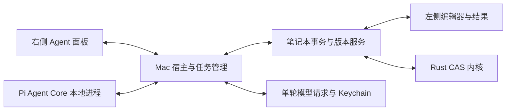

# Mac Notebook Agent 初步设计

[下一版待办](../plan/NEXT_RELEASE.md) · [现有 Agent 接入契约](../plan/NEXT_RELEASE.md#后续-notebook-agent-的接入预留) · [现代语言](modern-language.md)

2026-10-08，用户选择以 Pi Agent Core 重做右侧助手，并明确先只考虑 Mac。本文为设计草案，尚未实现；没有安装 Pi、增加运行时依赖或修改已发布 `.3`。下一版版本号仍待确定。

## 目标与当前基础

右栏成为可以连续完成任务的 Notebook Agent：读取当前笔记本、查询真实函数接口、编辑左侧单元格、执行计算、检查结果、根据真实错误修正，最后报告完成情况。用户可以随时停止、调整任务、查看修改或撤销。

当前可复用的真实基础：

- `app/src/components/assistant/AssistantPanel.tsx`：流式聊天、单元格引用、工具结果及用户主动插入建议。当前还没有 Agent 自动编辑。
- `app/src/state/notebookStore.ts`：单元格编辑/执行、写入队列、单元格 revision 和文档 generation。现有操作包含前端乐观更新；不能直接循环调用 add/edit/remove 就宣称原子事务。
- `app/src-tauri/src/host.rs`：独立内核线程、原生 HTTP/凭据管理、无需排队的计算中断。
- 函数目录、GetFunctionCatalog/GetCapabilities、现有结果分页与图形数据：用于真实能力查询和执行验证。

必须新增：文档级版本与事务、可验证的修改回执及撤销、Pi 运行进程与宿主桥接、单轮模型流接口、Agent 会话持久化。旧聊天历史将工具调用压成文本，不能直接作为新的工具对话账本。

首版范围只包含 Mac 当前打开的单个笔记本；其他平台的现有助手照常保留。通用终端、任意代码执行、外部 MCP/插件、多 Agent 调度和跨笔记本后台任务另列后续。

## 用户实际流程

以「画一个我的世界里的草方块」为例，目标流程为：

1. 读取当前单元格、方言、变量摘要和有效输出，确定插入位置。
2. 查询 scene/polygon/rotate/map 等实际接口、平台能力和预算。
3. 生成源码并检查语法，将完整修改作为一笔事务提交到左侧。
4. 运行对应单元格，读取真实诊断及场景数据；遇到解析或计算错误时，在任务范围内修正并重新运行。
5. 报告实际产生的图形与修改，提供「定位单元格」「查看修改」「撤销」；文件保存状态单独显示。

讨论模式只读取和解释；执行模式按用户任务自动编辑与运行。执行模式内可撤销的笔记本操作不逐项弹确认；「先设计」「不要修改」等明确要求继续限制本次任务。真实冲突或缺失信息需要处理时，才向用户提出具体问题。

## Mac 运行架构

建议使用随应用交付的独立 Node 进程运行 Pi；最终用户无需另装 Node。开发时对齐仓库 Node 环境，发行前固定可再分发的 Mac ARM64 运行时、SHA256 和许可证。进程启动、打包、签名/验证、退出与崩溃恢复均属于实际实施门禁，目前没有通过验证。



- Pi 负责模型与工具的循环、流式消息、用户追加输入和停止信号。OpenMath 负责文档身份、权限范围、版本、事务、数学计算及持久化事实。
- 右栏和 Pi 都通过同一个 Notebook 服务访问文档；手工编辑也进入该服务。Pi 类型只出现在适配层，不进入 CAS、公共 Notebook 协议或 `.omnb`。
- Pi 与 Rust 宿主通过私有标准输入/输出交换带版本的 JSON 消息，不开公共监听端口。stdout 专用于协议，日志另行处理；消息包含任务/请求身份和事件序号，旧回复按文档代次过滤。
- 面板关闭只影响展示，不销毁运行任务；关闭文档或应用则取消任务并处理最后回执。首版同一笔记本只允许一个活动 Agent 任务。
- 宿主中的任务和文档绑定决定可操作对象；不以模型传入的任意 document_id 扩大范围。

### Pi 依赖与适配裁决

核对时官方包已使用 `@earendil-works/pi-agent-core` 和 `@earendil-works/pi-ai`；npm 与官方源码均为 `1.0.4`，MIT，声明 Node >=22.19.0。这是候选锁定版本，不是本仓库已安装依赖。上游存在传递依赖与版本范围，实施时使用 npm lockfile 固定实际依赖并记录许可证。

官方 `Agent` 支持 `streamFn`、`AgentTool`、流式事件、上下文转换、工具前后回调及 abort。新适配器应遵守对应版本的真实接口；旧示例的包名/API 不作为实现依据。首版显式使用 sequential 工具执行，避免默认并行批次造成读写竞争。

自定义 `streamFn` 对接宿主的**单轮模型请求**：沿用模型配置及凭据入口，凭据不交给右栏、模型上下文或会话日志。Pi 负责下一轮工具循环；不能把现有带循环的 LlmChat 直接包进 Pi 再产生第二套循环。需要新增/抽取单轮请求、流式工具参数、结束状态和取消适配，并真实验证；不能假设现有 om-llm 已直接兼容 Pi。

Pi 的 steer 是按循环检查点处理追加输入，并不等于立即中断正在执行的工具。界面「停止」必须同时取消模型请求、Pi 循环及本任务的内核计算；要求立即改做另一任务时，先取消并核对已完成回执，再在最新文档上接续。

官方依据（核对源码提交 `503c605528f9af993c0e37ede468cf884fb0ff5b`）：[Agent README](https://github.com/badlogic/pi-mono/blob/503c605528f9af993c0e37ede468cf884fb0ff5b/packages/agent/README.md)、[Agent 包定义](https://github.com/badlogic/pi-mono/blob/503c605528f9af993c0e37ede468cf884fb0ff5b/packages/agent/package.json)、[StreamFn/工具类型](https://github.com/badlogic/pi-mono/blob/503c605528f9af993c0e37ede468cf884fb0ff5b/packages/agent/src/types.ts)。

## 首版工具

下列为规划工具，不是当前已开放的执行接口。参数校验和任务范围在宿主/内核执行；Pi 的前置回调用于反馈，不能替代业务校验。

| 工具 | 能力 | 返回与限制 |
|---|---|---|
| `read_notebook` | 读取标题、顺序、源码、当前选区及输出摘要 | 稳定 cell_id、文档/单元格版本、输出是否过期；大笔记本按需读取 |
| `get_function_docs` | 按名称或稳定函数 ID 查询签名、示例和边界 | 只推荐当前实际实现，标明精度和 Mac 展示能力 |
| `preview_source` | 检查待写源码的方言、语法和命名参数 | 语法通过不等于计算成功；批量新定义在临时解析环境检查 |
| `apply_notebook_patch` | 原子新增、修改、删除、移动单元格及改标题 | 预期版本、operation_id、完整操作列表；真实事务回执和差异 |
| `run_cells` | 执行指定单元格并记录实际依赖重算 | 返回执行单元格、源码版本、输出身份和真实完成/错误/取消状态 |
| `inspect_result` | 读取实际解、诊断、表格页及图形数据摘要 | 只读取匹配版本的输出；精确/近似、条件、残差与未支持情况不混淆 |

界面控制另提供 `undo_transaction` 和 `cancel_task`，复用此前预留契约。后续可增加隔离草稿计算、图形缩略图、数据导入及导出；只有真实接通后才纳入能力列表。图形缩略图须来自当前实际渲染/采样，并检查模型是否支持图像；不能仅凭源码声称已经看过图片。

## 事务、并发与停止

`apply_notebook_patch` 的草案结构：

```json
{
  "document_id": "当前宿主绑定的文档",
  "document_generation": 4,
  "expected_revision": 12,
  "operation_id": "本次修改的唯一身份",
  "operations": [
    {"type": "insert_cell", "cell_id": "稳定新ID", "after_cell_id": "已有ID", "kind": "Math", "dialect": "Modern", "source": "待写源码"}
  ]
}
```

这是业务协议草案，最终 schema 在实施前锁定；不是 Pi 专用消息。

- 读取前同步已经确认的编辑草稿；中文 IME 合成中的目标单元格保持保护，不能强制提交或覆盖。用户编辑始终可用。
- 全部操作先在临时文档上验证，成功才一次提交、增加文档 revision 并失效相关输出。禁止中途删除触发半成品依赖重算；计算由独立 run_cells 发起。
- 相同 operation_id 和相同内容返回原回执；同 ID 不同内容拒绝。跨文档、过期代次和版本冲突返回结构化结果。Agent 在最新快照上重新判断修改，不静默覆盖用户输入。
- 源码修改、执行完成、保存成功分别记录。取消只停止后续工作和计算，不自动撤销已经成功提交的源码；未知提交结果先按 operation_id 查询回执。
- 一次修改提供完整差异及反向操作；「撤销本次任务」对其事务合并检查，全部内容仍匹配才整体撤销，否则明确指出冲突。不得用旧文档快照覆盖之后的手工修改。
- 已写入内容在计算失败后保留并展示真实错误。侧栏关闭、文档切换、迟到事件和进程重启都不能把旧结果绑定到新源码。

现有 documentGeneration/cell revision/epoch 只是基础；文档级 revision、原子提交、幂等账本和事务撤销尚需实现。

## 右侧界面

保留 OpenMath 绿色强调色和原数学内容组件；建议右栏默认约 400 pt、可拖宽，窄 Mac 窗口允许收起。宽度是设计初值，需在真实窗口验收。结构草案：

```text
助手             当前笔记本 · 模型          新对话
────────────────────────────────────────────
用户：画一个草方块
助手：将新增一个图形单元格并运行检查。

✓ 读取笔记本
✓ 新增单元格       查看修改 · 定位
▶ 执行与检查       停止

完成：生成草顶和四面泥土纹理。
修改记录：新增 1 个单元格                  撤销
────────────────────────────────────────────
上下文：当前笔记本 · @选中单元格
输入任务或补充要求……
执行 / 讨论                                 发送
```

执行轨迹可折叠，默认显示短动作、工具实际状态及结果；详细参数、源码差异和错误按需展开。完成项可以定位左侧单元格或展开真实结果，不复制巨大网格到聊天区。

| 状态 | 界面行为 |
|---|---|
| 空闲 | 可发送；显示当前文档、模型和模式 |
| 读取/生成/运行 | 显示实际阶段、停止和追加要求入口；用户可以继续编辑 |
| 正在停止 | 等待实际取消/结束回执，不提前显示「已停止」 |
| 需要输入或遇到冲突 | 展示具体缺失信息或受影响单元格，保留草稿及已完成工作 |
| 完成/失败/已停止 | 显示实际修改、执行结果、未完成项及保存状态；提供查看/撤销/接续 |

运行中追加普通要求进入 Pi 队列；明确立即调整则走取消、核对回执、接续路径。停止保持独立可用，不排在正在计算的请求后面。没有可计算总量时只显示阶段，不编造百分比。

输入框随内容增长但有窗口相对上限，超出后内部滚动；中文合成时不发送。优先沿用现有 Enter/Shift+Enter 习惯并允许配置；重排、模型切换或请求失败保留未接受的输入与选区。工具执行不抢走正在编辑的焦点；只有用户点击定位才主动跳转。

界面依据为本地 [telegram-ui-reference SKILL.md](/Users/hert/.agents/skills/telegram-ui-reference/SKILL.md) 的 [输入框适配](/Users/hert/Documents/ChatGPT/ui-learning/05-input-and-actions/adaptive-composers.md)、[进度与结果](/Users/hert/Documents/ChatGPT/ui-learning/06-state-and-feedback/progress-and-result-feedback.md)、[确认与撤销](/Users/hert/Documents/ChatGPT/ui-learning/06-state-and-feedback/confirmation-and-undo.md)。采用真实回执、代次保护及有界输入算法；本方案选择已经提交后经版本检查的真实事务撤销，不采用延迟删除倒计时。没有可逆适配器前不显示可用的撤销按钮。

## 模型、上下文与会话

- 继续使用现有模型 CRUD，增加 Agent 功能映射，默认可从原 chat 配置迁移。模型必须实际支持工具调用；用合成提供商和真实配置探测验证，不能从普通聊天成功推断。
- 系统提示词组合产品职责、当前任务范围、真实能力、当前文档摘要及用户偏好；支持用户编辑工作偏好/模板，记录版本。修改提示词不扩大工具授权。
- 每次模型请求前更新文档版本与必要的单元格信息；长对话压缩时保留目标、用户约束、实际修改回执、未完成项及错误。大表格和图形使用结果引用与按需读取，不默认发送整份网格。
- 新会话存于 Mac 应用支持目录中的独立 AgentSessions，包含工具调用及结果、任务状态、提示词版本和文档绑定；`.omnb` 仍只保存 v1 源码。外部文件改变时重新核对绑定与内容，不沿用旧版本授权。
- 现有凭据机制继续管理密钥。会话日志、笔记本及导出不保存凭据；上下文只包含本任务必要的笔记本内容。
- Agent 内存随运行进程管理，会话与事务日志由宿主持久化。崩溃后先恢复和核对回执，显示可接续任务；不自动重做写入或重启全部计算。
- 保存笔记本是独立宿主动作。首个编辑闭环明确展示未保存状态；新增自动保存/导出工具前，必须完善目标文件绑定及实际持久化回执。
- 设置模型轮数、工具次数、时间和计算预算；到达上限报告已有成果及剩余工作。重试和错误修复有明确限额，完成判断依据真实回执及任务要求。

## 实施顺序与验收

| 阶段 | 工作 | 完成条件 |
|---|---|---|
| A | Pi Mac 运行进程、宿主 IPC、单轮模型流、只读工具 | 打包后无需用户安装 Node；流式工具参数、取消、进程退出及重启真实通过 |
| B | 文档级 revision、手工/Agent 同队列、原子 Patch、幂等和撤销 | 冲突、IME、重复请求、整笔失败与撤销保护都有实际回归测试 |
| C | 编辑—执行—检查—修正的 Agent 完整闭环 | 多单元格科研任务和草方块真实成功，计算失败不冒充完成 |
| D | 右栏轨迹/定位/差异、讨论/执行、会话/提示词与追加输入 | 草稿保护、停止、切文档、旧回复隔离及会话恢复真实通过 |
| E | Mac 安装包、模型兼容、回归与文档 | Release 应用启动实际子进程；原语料、旧笔记本与现有功能门禁通过 |

阶段 A 先验证候选 Pi 版本和可分发运行时，确认接口与依赖事实后再实施。阶段 B 的事务验收是开放 Agent 自动写入的前提；阶段 C 是首版交付最低闭环，不能只完成聊天 UI 就宣称 Agent 完成。

必须验收：

1. 「把 a 从 2 改成 5，并重新计算相关结果」得到真实依赖结果 3→6，保留无关单元格。
2. 草方块任务新增并运行真实三维场景；解析错误能查询诊断并修正。刚加入下一版的续行规则实现后，与单行版本保持一致。
3. 地月 L2 多单元格任务查询真实接口、运行计算并检查平衡残差；精度或计算预算不够时明确报告。
4. 人工编辑与 Agent 修改竞争、中文 IME、文档切换、停止与成功竞态、重复 IPC、未知提交及子进程崩溃不会重复插入或覆盖新源码。
5. 撤销不覆盖后来的手工修改；计算取消保留已提交修改，保存失败不宣称已保存。
6. 合成提供商覆盖分段工具 JSON/UTF-8、工具错误、模型错误、超时、停止及预算；实际 Mac 应用覆盖启动/退出、键盘和真实界面操作。
7. 原 53 条数学语料、旧现代/Wolfram源码、`.omnb` v1 往返和既有功能保持原期望；新增 Mac Agent 不阻断其他平台的现有构建。

本轮交付到此为止：形成可审阅的 Mac 设计和待办。工具实现、依赖安装、Node 分发验证和新版本发行尚未开始。
