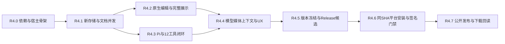

# 0.1.0-pre-alpha.4：版本、范围与验收门禁

[验收目录](../acceptance/pre-alpha.4/README.md) · [机器门禁账本](../acceptance/pre-alpha.4/gates.toml) · [报告 Schema](../acceptance/pre-alpha.4/report.schema.json) · [下一版导航](NEXT_RELEASE.md) · [.3历史发行](../acceptance/r3-release/README.md)

2026-10-09。下一版**设计目标锁定为 `0.1.0-pre-alpha.4`**：同版交付原生Mac客户端、Notebook Agent和已确定配套功能。当前代码/已装/已发布仍为`.3`，本轮不改Cargo/npm/Tauri/移动版本，不创建`.4`tag/Release。所有新增运行时与公开发行门禁均 **planned / not_run**；此前HTML/Schema检查是设计证据。

## 版本范围

| 本版必须交付 | 验收依据 |
|---|---|
| 原生Mac `.3`功能对齐 | 笔记本/文件/解/步骤/科研结果/精度/2D/完整Metal3D/探索/导出，不以WebView承载主编辑/助手/结果 |
| 新宿主与并发状态 | Swift/Rust/Pi所有权，独立文档/计算/编辑通道，原生IME/fence、按操作取消、结果/checkpoint接纳与FFI生命周期 |
| Notebook Agent完整操作闭环 | 12工具的真实handler/schema/权限，读取/查文档/Preview/事务/执行/检查/修正、隔离试算/核对/撤销/附件 |
| 存储与恢复 | 原子源码/撤销/幂等回执、草稿/保存intent、无损已接纳checkpoint、会话/上下文/媒体引用/备份/GC |
| 原生右栏、上下文和提示词 | 固定输入/流式轨迹/真实差异与回执、PromptRevision/实际wire快照/预算/任务记忆/有界压缩 |
| 供应商/模型/媒体 | 空新Registry、供应商默认→单模型覆盖、按协议思考映射、目录/探测/保存分离、接收/处理/发送覆盖正确 |
| 原生安装与维护 | macOS27+/Apple Silicon、自带Rust/Pi/Node、Preview隔离、首次本地数学、签名公证、About/手动更新/回退/诊断 |
| 共享语法修复 | `=`/`=>`/运算符/pipe后的续行与根因诊断，原Modern/Wolfram/InputForm/源码文件含义保持 |
| 跨端统一发行 | Windows/Web/CLI/iOS保留现有UI，共享内核/语法修复回归；九类资产与清单同版本/源码 |

已明确排除：旧Tauri数据/配置/凭据自动迁移与清理、Mac以外的新Agent/UI重写、Intel/Universal原生Mac包、App Store/TestFlight、自动替换应用的updater、iCloud/多窗口/手写识别、任意shell/插件/任意文件工具、自动跨笔记本长期记忆。原`.omnb`v1普通读取/保存仍必须兼容，已有完整科研计算不可静默删减。

模型媒体目标沿[既定协议表](../design/model-media.md#协议与版本范围)实施：Chat/Responses/Anthropic/Gemini/Ollama Chat与已有FIM/配置的转写路径。目录或具体模型不支持某模态时有真实fallback，但不能用“not_supported”掩盖本版应实现的adapter。产品能力查询仅列真实handler；尚未完成的目标仍会阻挡整版发行，不把先显示一个子集当完整交付。

## 版本和身份规则

| 身份 | 规则 |
|---|---|
| 公开版本/标签 | `0.1.0-pre-alpha.4` / `v0.1.0-pre-alpha.4`；保留`.1/.2/.3`，不改公开tag/资产，不合main |
| 开发Preview/候选RC | 均使用目标release_version，由channel/milestone/build_number/candidate_id区分，不创建公开`.4`tag；About明确未发行/Preview |
| Mac数字版本 | CFBundleShortVersionString=`0.1.0`，CFBundleVersion为已分配的独立递增数字build；完整版本另字段/界面保存 |
| Windows数字产品版本 | WiX `0.1.0.4`，其他版本/标签/资产保留完整pre-alpha字符串；同一公开版本不重发另一MSI当“修正” |
| iOS数字版本 | 基础版本`0.1.0`，build按既有发行映射升至4；最低27、两ARM64切片、旧ABI不改含义 |
| Rust/npm/CLI/Web | workspace/内部依赖/锁文件、app/package与锁、配置/CLI/banner/函数目录/docs/脚本统一目标；不只改窗口标题 |
| ABI/IPC/Schema/store/metadata | 独立版本，按真实兼容变更递增并校验；`.4`不意味着这些都叫4，稳定函数ID不改号 |
| source/candidate/build | 完整40字符Git SHA +构建与候选ID，锁文件/工具链/实际二进制/清单hash；短SHA仅供显示 |

SemVer构建元数据不参与优先级，不能用`+build`排序区分版本，预发行字符串也不能任意追加`-dev`然后推断公开顺序。UpdateService先按通道与实际发布身份过滤，再比较SemVer和合法build；Preview从未变成public只因为版本相同。[SemVer规则](https://semver.org/lang/zh-CN/)

版本冻结在R4.5：功能目标齐全、接口/依赖/工程可构建后一次同步运行版本，随后任意源码/参数/测试/依赖/字体/签名配置变化产生新candidate，旧证据按来源失效。冻结前`.3`开发代码不能被说明成`.4`公开包，冻结不是实际发布。公开后修复另发版本；补充验收文档可提交dev，但不能改公开source SHA或假称新文档commit已经重建验证原包。

## 交付阶段与前置关系

| 阶段 | 对应已有批次 | 完成标准 |
|---|---|---|
| R4.0 | N0/I0/E0/M0/A前置 | 锁依赖/许可、SDK27与native工程/FFI/SourceIndexMap/共享续行；原数学回归成立 |
| R4.1 | S0–S2、host、B前置 | 全新库/原子修改/幂等/undo/draft/fence/取消/checkpoint真实验证；这一阶段完成前不开放Agent文档写入 |
| R4.2 | N1/E1–E4 | 手工原生笔记本、`.3`全结果/步骤/分页/2D/Metal/导出可用；HTML不代替原生布局/IME |
| R4.3 | N2/A–C、S3 | 包内Pi与实际单轮模型/12工具、冻结提交/范围/试算/停止/恢复/真实业务闭环 |
| R4.4 | N3/M0–M4/S3–S4、context/D | 完整模型默认/覆盖、媒体/上下文/提示/压缩、原生右栏与设置/生命周期 |
| R4.5 | I1、版本冻结 | 范围目标齐全、版本/资产集合/依赖锁/许可冻结，产生Release配置candidate；不是公开承诺 |
| R4.6 | N4/E5/I2–I4/E、全平台 | 同candidate完整CI+原生Mac实际安装/签名公证/现场交互、原门槛及其他平台真实包通过 |
| R4.7 | publish-readback | 验证完整draft/tag/source/九资产最终字节后公开pre-release，公开下载再回读；完成后才标已发行 |

各阶段的最小可运行开发构建可供本机试用，但必须明确Preview、实际已接通功能和未完成范围；不装到公开app位置、不复用业务目录。并行可按接口依赖安排，不通过在一条长计算队列塞入读写来伪造并发。继续现有直接实施工作方式，不新增多Agent工作流。

## 门禁账本与证据层级

[gates.toml](../acceptance/pre-alpha.4/gates.toml)是本版唯一机器门禁目录，稳定gate ID与目标/前置、验收编号/源码依据、平台、证据种类、阶段和mandatory属性统一维护。文档SR/ER/MM/IN保持原编号，每个条目必须被覆盖，新增要求追加，删除/降级必须有范围裁决，不能只从CI删job。

| 证据层 | 能证明什么 | 不能替代 |
|---|---|---|
| D：设计/Schema/HTML | 文档形状/引用/浏览器交互与mock状态 | 实际Rust服务、AppKit、CAS、模型请求、媒体/GPU、签名/安装 |
| K：真实代码/单元/fixture | 真实handler、数学/协议/竞态/合成网络/崩溃预算 | 无开发环境安装、真实IME/GPU/独立供应商任务和包分发 |
| N：原生集成/桌面UI | Release native生命周期/渲染、实际文件/Keychain/输入/媒体/任务与控制 | Apple签名/公证、全平台/下载校验 |
| P：最终包/公开回读 | 同包启动、组件/签名/ticket/安装、最终字节与source | 未测功能的数学正确性/全部模型能力 |

每个真实EvidenceRecord包含gate/case ID、candidate/source SHA、build/config/ABI/registry/adapter版本、平台/OS/架构/设备/工具链、执行方式、命令或测试target、start/end、attempt与结论、原始artifact URI+SHA256和覆盖范围。model任务另保provider/route/api_model/参数/能力证据和实际工具/文档/结果/媒体refs；认证数据脱敏，不能导出API Key/HTTP认证头/私钥或用户私人附件。

`passed`要求该gate全部必需case与证据种类真实通过；`partial/failed/not_run/blocked/skipped/stale/unavailable`均不是通过。多个worker重试/取消必须保留全attempt；失败不能被同文件的最后一条success抹去。缺原日志/不可核对URI/hash/错误平台/source/build或空结果都是证据不足，不能从截图文字猜成功。

运行总数不是质量分数：原53条固定是数学约束，其余测试数量随实现增加，不冻结“1085/29/5”为新版本测试目标，也不以新增很多mock测试冲抵一个实际失败。现有原ignored只有在原任务规定的Release/生产路径真正显式运行后才满足对应门禁。

## 同SHA和最终包的一致性

- 公开candidate要求干净源码、完整SHA、版本/依赖锁与scope_version。开发机未提交改动、不同commit/未核验资源或上一次`.3`成功不能满足`.4`gate。
- 同一公开candidate的CI、Mac/iOS/Windows/Web/CLI、模型任务和最终包均绑定该SHA与对应artifact hash。重新签名/staple/重新打包后的字节必须单独有最终包证据，不以旧unsigned包UI截图证明signed final包。
- 证据可在Actions/本机受控目录保存，冻结source里只存规格/入口；生成记录不必先commit再改变candidate。发布后整理证据的dev commit是文档维护，公开tag仍指原candidate。
- workflow整体green不足以证明每个required gate：汇总器逐job/case核对conclusion与无skip/缺项，并核对reusable iOS/native Mac实际结果。缺SDK27时失败，不能降级SDK或省掉job。[GitHub复用workflow](https://docs.github.com/en/actions/how-tos/reuse-automations/reuse-workflows)
- 允许从同SHA的经过验证CI artifact获取包以完成后续安装/现场验收；不同SHA的artifact、当前开发本机原app或HTML只能是参考。移除测试/放宽门槛的commit必须重新审查范围，不被归成纯selector修复跳过回归。

## 数学、语法与性能门槛

原[53数学语料](../../tests/corpus/solve.toml)及期望不改；精确式/条件/重数/根域保持，数值按原独立残差/参考验证。新增续行的AST/诊断测试允许针对**确实新增为合法**的输入更新，但必须对应原计划/新正例/真正错误负例，不能为了新UI删掉独立错误或改原数学答案。

| 测量 | 保留的实际定义与门槛 |
|---|---|
| CLI native Release原53 | [实际CLI语料测试](../../crates/om-cli/tests/corpus.rs)返回真实`timing_ms`，每条严格 `<200 ms`，同时独立核对数学 |
| Web生产冷WASM原53 | [实际production worker测试](../../app/e2e/performance.spec.ts)测内核response timing，每条 `<1000 ms`，独立Rust读回原InputForm期望 |
| iPhone/iPad原53 | [原生AcceptanceTests](../../ios/OpenMathTests/AcceptanceTests.swift)从request前到await/MainActor恢复的整次时间，每条 `<1000 ms`，含队列/FFI/解码/恢复；另有kernel分项但不能替代整次 |
| 新Mac原生request原53 | 同样记录submit到MainActor接纳的整次时间，目标每条 `<1000 ms`；kernel分项与CLI原200ms另外保留，不能称新端到端等于CLI已有测量 |
| 原生输入/相机常规场景 | 按[ER性能目标](../design/macos-editor-rendering.md#缓存预算和辅助访问)，10KiB输入到可见绘制p95≤50ms，60Hz常规相机目标下一帧；1000格/大式/矩阵/200000顶点另记压力负载/内存/降级，不能保证全负载一帧 |

性能在Release、明确硬件/电源/刷新率/工具链下测，正确性仍同时成立。不得并行编译后只挑最快一次当通过，自动“重试直到低于阈值”不合法；环境异常记录原fail/invalidated理由，经根因/环境修复后的明确新attempt可重新测，原失败保留。候选间变化对比同场景，gate脚本/阈值/计时起止必须可查。

## Agent、模型和媒体验收

分三层执行，互不冒充：

1. **真实handler确定性用例**：所有12工具的参数/返回/schema/权限/refs、独立取消/超限、未知提交/重试/undo/文档草稿/只读random/history；新源码与真实CAS而非fake成功文字。
2. **合成供应商+实际Pi/单轮codec集成**：脚本化模型流仅作为provider fixture，Pi确实从包内进程运行、工具确实走服务、文档确实原子变化/计算；UTF-8/JSON/协议/HTTP/超时/重定向/媒体部件/能力映射全覆盖，抓取真实wire脱敏读回。
3. **一个真实已核验工具模型的现场闭环**：在固定Mac Release candidate配置/参数、全新合成笔记本/自有附件下验证a=2→5依赖3→6、查询并运行地月L2、创建草方块/切开西瓜且检查真实图形/结果。每场景至少3个新会话，保留全部尝试、工具/事务/源码/結果及失败，不用平均成功率遮盖违约写入。正常有限工具循环修正是真实过程，未完成/要用户输入仍如实记录，不能算成功。

现场只向已配置/本任务授权的供应商发送测试内容，费用/时间预算固定可查；未提供可用凭据/服务不可用时该live gate是blocked，不让fixture填成passed，也不为设计阶段临时索要密钥。新媒体路径的fixture实际部件/解码必测，至少一条真实视觉路线用自有测试图验证；每个声称已核验的路由组合必须有该组合证据，不从品牌或普通聊天推断全媒体。

协议目标与具体模型能力区分：模型不支持nativePDF/视频可以走已验收的提取/选页/抽帧路径，记录真实覆盖；本版应实现的adapter不能仅用降级说明跳过。供应商默认→单模型覆盖/auto、按协议思考映射、父配置变化/新请求和保存失败必须MM15真实验证。云处理服务未配置时明确needs_choice，不自动忽略附件或换收费供应商。

## 原生UI、平台与暂缓边界

Mac主编辑/助手/所有`.3`展示按原生API实际文件审计，截图不能证明NSView；Metal实测完整场景与GPU resource/frame/OBJ来源，SwiftMath实测原53/科研LaTeX及unknown fallback。NSTextView中文IME、键盘/焦点/撤销与实际文件/Keychain/窗口至少本机真实操作；XCUITest/AX fixture只覆盖其能真正触达的范围，不把composition布尔或browser事件当原生输入通过。

组件率以既有[清单](../design/macos-ui-inventory.json)为基准逐族绑定实际文件/控件/默认样式/证据，新增职责重新计数，报告真实Apple标准比例与custom/third-party项。设计75%是目标/基准，不允许通过篡改分类凑值；主UI原生技术路径100%属于功能门禁，不能用Tauri壳或WKWebView主编辑冒充完成。

原WindowsEXE/MSI实际安装+中文流程+科学场景/卸载，Web生产WASM/GPU、CLI、iPhone/iPad27CI与两ARM64/XCFramework链接门禁保留。iOS模拟器只在GitHub CI，本机继续禁止启动；共享解析器/协议变化必须跨端验证，不因新Agent只Mac而跳过内核影响。

用户曾暂缓iOS人工VoiceOver完整遍历、浮动键盘/真机窄窗，保留为历史未验证/用户暂缓，不改成passed，也不强迫重做这些旧专项。Mac基础键盘/AX语义/字体/Reduce Motion的自动和实际关键路径按新设计必验；完整人工VoiceOver遍历另列coverage/可暂缓专项，不拿已有API或旧iOS截图称完成。

## 缺陷、重测和范围变化

| 级别 | 定义 | 发布处理 |
|---|---|---|
| P0 | 错误数学/伪证、源码丢失/越权/秘密进入普通存储、未知提交重放、旧定义污染、严重不可恢复崩溃 | 必修，不可用普通waiver豁免 |
| P1 | 必交模块/架构/媒体/模型/工具/核心UI失败、取消/保存/安装不可靠、required gate缺证/未跑、签名公证缺失 | 阻挡完整`.4`公开发行 |
| P2 | 不影响必交结果/操作的局部视觉或可读性问题、明确可绕过且非核心的边界 | 记录影响/复现/范围，可在明确known limitation下评估 |
| P3 | 装饰/微文案/非关键增强 | 可后续，保持最终状态和操作一致 |

失败先归因为product/test/environment/third-party；test selector误选真实控件的修复仍保留原失败证据，修复后新SHA必须过完整相关门禁和最终同SHA集合。测试不能仅mirror实现，数学有独立验证、矩阵有重构、ODE有解析/阶、UI有真实状态/存储读回、Agent有真实事务和结果。

产品数据/安全/数学/签名以及明确必交能力不可由Agent自行waive。只有用户明确改变范围或接受非关键遗留，才能形成scope revision/deferral，记录原要求、证据、影响、用户直接授权、发行说明与被停用能力；没有人类明确决定时保持not_run/failed，而非“默认批准”。当前只有旧版迁移等已排除范围与iOS历史专项暂缓，没有本版必交gate豁免。

取消job/超时/日志丢失不算失败已修复；先记录状态，再有界新attempt，不能覆盖历史。发布证据过期或artifact变动即stale；有scope/test/protocol变更时重新核对所有依赖gate，不以“只是文档/打包小改”跳过candidate身份规则。

## CI与发行汇总设计

新增planned lanes：`contracts`（版本/目录/schema/账本/许可）；`rust-and-wasm`；`web-production`；`mac-native-build`（显式Xcode27/macOS27/arm64）；`mac-native-integration`（Swift/host/存储/editor/media/ffi）；`agent-fixtures`（真实包内Pi+合成provider）；`mac-live-and-manual-evidence`；`mac-distribution`（署名公证/真实安装/最终包）；`windows-installed`；现有reusable `ios`；`release-aggregate`；`public-readback`。

工作流可以复用既有job/结果产物，但不能只把整体CI徽章复制到每gate。manual/live证据通过相同candidate/输入hash/原件URI导入，自动aggregator校验实际范围，不让一个手填JSON自己证明所有事实。release写权限只给最后publisher，其他构建只读；发布脚本不执行报告里的任意shell命令。

公开前聚合：全部`pre_publish_required` gate最新有效attempt为passed、证据源/包/hash匹配、无P0/P1、无未授权deferral、版本/九资产/签名/许可满足 → `ready_to_publish`；不必等已经公开才能取得post_publish gate，避免循环。公开后`public-readback`核对真实tag/九下载/SHA/实际程序身份 → `released_verified`。公开回读失败是`published_unverified`，如实报告并停止继续分发/排查，不能称已完成。

拟定九资产：Windows EXE/MSI、Mac DMG/app ZIP、Windows/Mac CLI ZIP、Web ZIP、iOS模拟器app ZIP、双切片XCFramework ZIP，另有release-manifest。具体文件名在账本`asset_set`；验收原件长期附件与这九个分发类型分开，不把额外日志当第十个产品或用缺产品的日志凑齐九项。

签名公证材料当前缺失（上轮只读核对Developer ID Application为0），现场真实模型/原生工程也未接通；这些是后续前置，设计仍可以完成。当前机器账本的公开就绪状态必须为false/未执行；不能因本轮文档checker绿色宣称`.4`足够发布。

## 本轮交付与实施边界

交付本设计、稳定机器gate目录/来源覆盖、报告Schema与证据目录说明，校验ID/前置DAG/验收引用/状态/文件链接与schema正反例。运行时aggregator、CI新lane、native/live/签名/真正`.4`构建均未实现。当前`.3`公开记录和版本测试保留，下一步实施按R4.0起推进，不提前发布或修改运行版本。

本轮结构验收结果见[design-review.json](../acceptance/pre-alpha.4/design-review.json)：32 gate/133条目和原文覆盖/DAG、九资产、11 Schema正例/27反例通过，已有6份Schema保持有效。实际运行gate执行数为0，本轮没有生成候选、签名包或公开资产，因此不是`.4`功能通过或可发布的结论。
