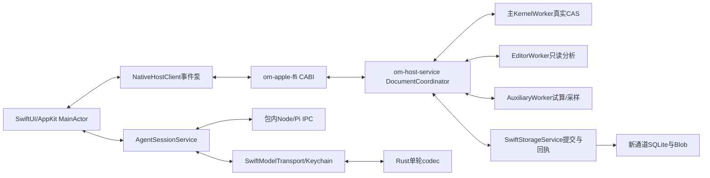
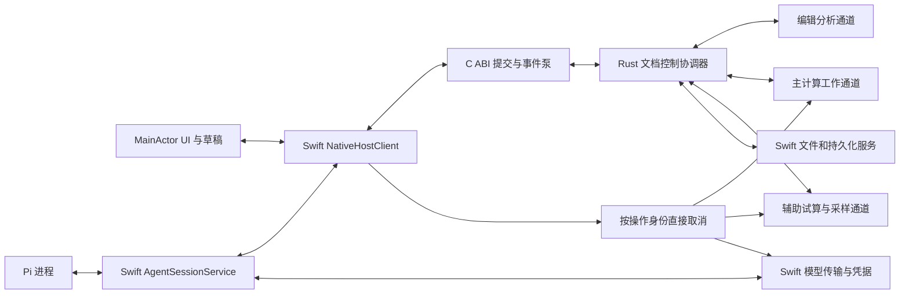
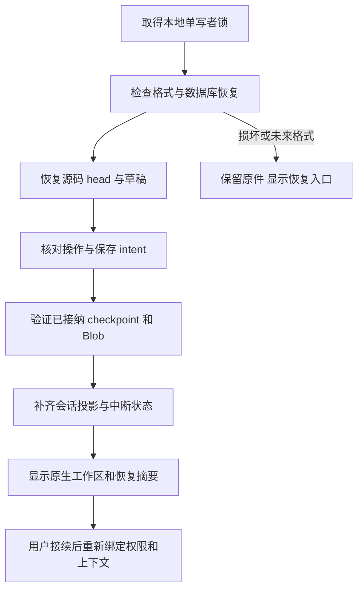
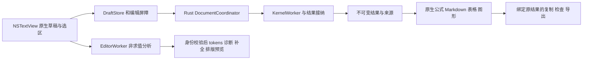
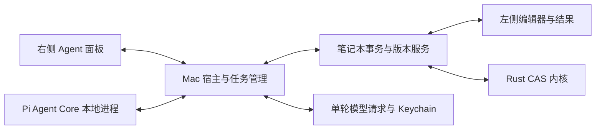
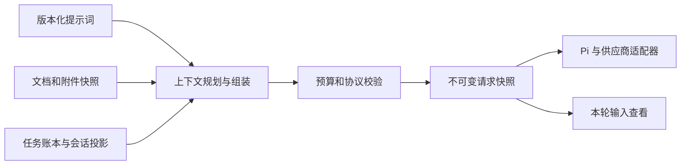
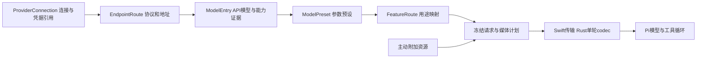
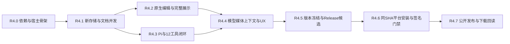

# OpenMath 0.1.0-pre-alpha.4 完整实施计划 —— 原生 Mac 与 Notebook Agent 同版发布

> **给执行者：** 先完整读第0节，再按第13节任务及前置执行。本文是`.4`的“规格＋实施＋验收＋发行”唯一主入口，沿用旧[PLAN.md](PLAN.md)的Goal/Architecture/Tech Stack与Files/Interfaces/Steps/Done模式；旧计划作为数学和历史依据，其subagent、自动合main、默认无unsafe、禁止一切现场网络等旧执行指令不覆盖本版新裁决。

**Goal（目标）：** 在现有`.3`共享Rust CAS上完成SwiftUI/AppKit原生Mac客户端、真实Pi Notebook Agent、供应商/模型/媒体与上下文管理、可恢复的文档事务和自包含安装。执行到最后得到**可下载并实际安装的Mac `0.1.0-pre-alpha.4` DMG/app ZIP，GitHub pre-release公开，公开tag/版本/字节/签名/数学/Agent结果回读通过**；不是停在原生空壳、设计草案或本机Debug窗口。

**Architecture（架构）：** Swift拥有UI/IME/文件/Keychain/URLSession/媒体/物理存储/进程；安全Rust host-service拥有权威文档/事务/操作账本/调度与数学候选接纳；KernelWorker复用现有求值器和CAS；独立C ABI管理跨语言句柄/字节；随包Node/Pi只负责模型工具循环。耗时数学、编辑分析、文档控制和网络互不堵队列。

**Tech Stack（技术栈）：** Rust1.94.0/edition2024，共享核心保持纯WASM与禁止unsafe；Xcode27.0/macOS27.0+、Apple Silicon；SwiftUI/AppKit/TextKit2/CoreGraphics/Metal/PDFKit/Vision/AVFoundation；SwiftMath1.7.3、swift-markdown/swift-cmark0.9.0；Pi Core/AI1.0.4和候选Node26.11.1随包。所有实际依赖/传递资源在任务中固定，不让用户另装Node/npm/Rust/Xcode。

**Spec（权威关系）：** 本文第1–12节集中全部产品、接口、状态和UI规格，第13节逐任务实施，第14–18节固定场景、验证、版本门禁与发行完成标准。机器Schema和[gates.toml](../acceptance/pre-alpha.4/gates.toml)保留精确字段/编号，正文不会仅把执行者转到一串链接。专题设计/HTML为来源和视觉辅助；有冲突先校对具体接口并记录裁决，不能换掉数学含义或掩盖未实现能力。

**当前基线：** 公开`.3`源码`0889d34e4fce9926054025ca71ea328f6cc65b39`，完整科研/现代语言/二维/场景/九资产已发布；当前dev运行版本仍`.3`。新Mac宿主/Pi/存储/原生UI/媒体/签名门禁尚未实现，本文件全部98项实施任务初始未勾选。目标`.4`确定，R4.5才统一运行版本并冻结候选。本文编写不是任务完成或实际包发布。

**交付范围说明：** 主产品开发聚焦Mac。共享解析器/内核仍影响Windows/Web/CLI/iOS，因此已确定的同SHA九资产和原平台门禁保留；不在其他平台重写UI或增加新Agent。用户明确不需要旧版数据迁移，首次全新Registry/存储，不导入或删除旧配置/凭据/聊天。普通`.omnb`v1打开保存仍兼容。开发继续dev，不合main、不移动旧tag、不在本机启动iOS模拟器。

## 目录

- [0. 执行守则与完成语义](#0-执行守则与完成语义)
- [1. 基线、调研和产品决策](#1-基线调研和产品决策)
- [2. 全局约束、依赖与版本冻结](#2-全局约束依赖与版本冻结)
- [3. 架构、所有权与通道](#3-架构所有权与通道)
- [4. 仓库目录与模块交付边界](#4-仓库目录与模块交付边界)
- [5. 核心DTO、FFI、服务端口与错误契约](#5-核心dtoffi服务端口与错误契约)
- [6. 原生宿主、并发、取消和计算接纳](#6-原生宿主并发取消和计算接纳)
- [7. 新存储、事务、文件、引用与恢复](#7-新存储事务文件引用与恢复)
- [8. 输入语言、编辑器与原生内容渲染](#8-输入语言编辑器与原生内容渲染)
- [9. Pi Agent、12工具、提示词与上下文](#9-pi-agent12工具提示词与上下文)
- [10. 供应商、模型、参数继承与媒体服务](#10-供应商模型参数继承与媒体服务)
- [11. 工作台UX、模型设置、主题、动效和组件率](#11-工作台ux模型设置主题动效和组件率)
- [12. 自包含安装、首次启动、签名公证和更新](#12-自包含安装首次启动签名公证和更新)
- [13. 里程碑与逐任务实施（R4.0–R4.7）](#13-里程碑与逐任务实施r40r47)
- [14. 固定场景、语法和数学验收语料](#14-固定场景语法和数学验收语料)
- [15. 验证命令、CI、真实包与现场执行](#15-验证命令ci真实包与现场执行)
- [16. 版本与验收门禁](#16-版本与验收门禁)
- [17. 风险、依赖缺失和降级策略](#17-风险依赖缺失和降级策略)
- [18. Mac `.4`公开发行完成标准](#18-mac-4公开发行完成标准)
- [19. 设计来源与机器契约清单](#19-设计来源与机器契约清单)

---

## 0. 执行守则与完成语义

1. **按任务前置连续推进。** 先读本节和[`.4`任务进度](PRE_ALPHA_4_PROGRESS.md)，找最早可执行任务。每任务有Files/Interfaces/Depends/Steps/Tests/Done/Gates；一次聚焦一个任务。当前会话由代理直接执行，不要求安装superpowers或使用子代理，也不因历史文档里的这类措辞停工。
2. **需要行为证明的实现先写有效失败用例。** 文档/低风险可逆样式不机械TDD。原数学53期望/200ms/1s门槛不改；测试必须有独立数学/实际存储/真实wire/UI/资源证据，不能只镜像实现或给Mock“成功”字符串。新续行把原本非法输入变合法时仅按明确语言裁决更新相应语法正负例，记录根因。
3. **旧执行规则不照搬。** 不自动快进main；核心仍forbid unsafe，必要unsafe仅独立C ABI；普通CI网络用fixture，必要的授权现场模型/Apple公证/公开下载由专门发行门禁真实执行。不要从旧无签名Tauri或旧只读聊天规则推断新Agent已完成。
4. **区分阶段。** 接受请求、Preview合法、源码提交、结果接纳、文件保存、模型发出、GPU完成、呈现、安装与公开下载均有独立回执。UI动画/模型文字/Schema通过不创造业务成功。
5. **接口单一来源。** 业务DTO/状态属于OpenMath，Pi/provider类型只在适配层。Schema约束/工具描述/实际handler/生成文档必须一致。必要的模块名、字段或依赖调整记录到DEVIATIONS并更新本计划/机器契约；常规实现裁决可自主处理，不每项向用户重新索权。
6. **保护原生输入。** IME/未确认草稿/选区/undo/source identity不能被晚回复、主题、布局、虚拟化或Agent覆盖。真实冲突才展示具体原因和保留内容；同一个确定授权不反复确认。
7. **取消是独立操作信号。** 不把stop排在CAS后面、不复用一个global flag；提交确定后stop只停后续，不伪称undo。未知效果先查原operation ID，不用新ID重放。
8. **主数学不得重建伪状态。** Working checkpoint与主active引用分开；source/epoch/依赖/取消不符则输出、未接纳定义/history/random一起丢弃。不能重新执行全部let来“恢复”，更不能把readonly fork冒称主文档可写副本。
9. **存储和秘密边界。** `.omnb`v1仅源码。提供商密钥仅Swift Keychain/明确transport；不进Pi、数据库、日志、上下文、笔记本或导出。新App不读取旧TOML/旧keyring/environment密钥，不扫描旧应用数据。
10. **测试和检查按影响范围。** Rust改动跑fmt/相关单元与集成/Clippy/WASM/生成检查；原生改动跑Swift及真实UI/桥接；媒体/模型跑真实codec/wire fixtures。每批集成与最终candidate必须完整既有和新门禁，不因定向通过就说全平台绿。不为同一通过结果无理由反复跑重构建。
11. **进度可续接。** 每任务实际Done后，同次提交更新本文复选框和PRE_ALPHA_4_PROGRESS记录结果/命令/证据。提交SHA在下一次记账，避免自引用。任务完成不等于gate通过；gate必须覆盖全部case/proof与最终candidate。
12. **缺前置不伪完成。** 证书/SDK/现场凭据缺失如实记录，先做不依赖它的工作。签名材料应早预检；只有该材料真正需要且具体可复核产物已准备时请求补充，不能未经授权购买账号/暴露密钥，也不能把unsigned改名为公证包。
13. **故障按证据定位。** 保存原失败/取消/超时和所有attempt，区别product/test/environment/provider。连续尝试无进展时记录问题与最小复现，继续独立任务，不靠放宽阈值/删除断言/增加无限重试抹错。
14. **Git/安装。** 每个任务或相互依赖的可验证小批次提交到dev，最终publisher只在全部门禁就绪后公开`.4`。Preview使用独立app名/Bundle ID/存储/Keychain，不覆盖用户公开安装；公开tag/旧资产保持不动。
15. **资源与环境。** 不在本机开iOS模拟器，移动端由CI。源码文件约600行以上按责任拆模块。磁盘不足时仅清本仓库已停止使用的可重建缓存，保留当前依赖、运行Release、所有发行包/源码/证据，不整删target或清其他目录。
16. **真正终点。** 不能在“全部功能本地完成”“已生成DMG”“已创建draft”或“旧SHA测试成功”时结束计划；必须满足第18节公开Mac包与下载回读，最新gate数据为released_verified。

### 0.1 当前待满足的外部前置

| 前置 | 已知状态 | 执行处理 |
|---|---|---|
| macOS/Xcode/架构 | 上轮只读核对macOS27.0、Xcode27.0、arm64 | 执行时再核对SDK/toolchain；缺SDK不降级 |
| Developer ID Application | 上轮有效身份数0，只有本地Apple Development | 先完成Preview/签名准备，再配置真实发行材料；公开门禁必须通过 |
| 现场模型/视觉路由 | 旧测试Key不自动导入新Registry，当前未接通新Agent | 完成受控设置与fixture后，用授权有效配置做真实任务；缺服务保留blocked，不伪成live通过 |
| 最终candidate | 尚未分配，版本冻结未执行 | 不从历史`.3`或本次文档SHA取现成green填新gate |

## 1. 基线、调研和产品决策

### 1.1 本版在现有项目上的增量

`.3`已有Modern/Wolfram、pipe/fn/记录/区间、函数目录、精确与高精度求根、微积分/机器数值分析、向量/矩阵、统计/单位、ODE/插值/优化/拟合、2D/场景/3D/导出。复用真实CAS、算法、源式、结果/步骤/采样协议；不为Mac UI再次实现这些算法，也不在JS/Swift端重新求数学。

| 保留功能族 | Mac必须保持的真实表现与边界 |
|---|---|
| Solve/NSolve/FindRoot/Reduce/Eliminate | 精确/近似、根域、条件、重数、Root、无解/未求值/失败分别显示；局部数值根不当全局解集 |
| 初等/特殊/精度 | 精确数/机器数/高精度区分，decimal原输入保持；Gamma/Beta已实现精度/域边界可查 |
| 符号/数值积分、limit/series | 条件/误差估计/收敛与未支持保留，不静默改精确为近似 |
| 向量/矩阵/分解/线性求解 | 原维度/奇异/病态/共轭语义和精确值，不为了Table转换Double |
| ODE/插值/优化/拟合 | 真实终止/范围/残差/局部vs认证global与迭代状态，不伪造统计性质 |
| 统计/数据/随机/单位 | 原定义、seed/state/readonly边界、纯数据CSVJSON、精确SI与未知温标限制 |
| 绘图/场景/explore | 原Rust采样/几何/颜色/法线/原域、view相机与参数作用域；真实导出与过期隔离 |
| 文件/语言/旧Ask功能 | `.omnb`源码v1，Markdown/LaTeX与SVG/PNG/CSV/JSON/OBJ；普通打开不自动执行；补全/讲解/修复仍可用 |

### 1.2 已确认决策

| 决策 | 本版取值 |
|---|---|
| Mac UI | SwiftUI/AppKit原生，不用主WebView；保留绿色强调、数学层级和原生响应链 |
| Agent核心 | Pi Core1.0.4随应用的受控Node进程，OpenMath实际工具/文档服务与Swift transport |
| 所有权 | Swift UI/OS/物理存储；Rust文档/事务/调度/CAS接纳；Pi循环，不自行成功判定 |
| 文档形态 | 单活动文档、单活动Agent；一个主CAS+一个辅助任务，编辑分析独立 |
| 支持平台 | 新UI/Agent仅Mac；Mac27+/ARM64；原Windows/Web/CLI/iOS继续共享回归与同版资产 |
| 模型配置 | 供应商默认→单模型inherit/override/auto；预设选择参数；真实能力证据独立 |
| 输入媒体 | 接收主动图片/音视频/PDF/其他文件，实际模型原生/本地提取/云处理分别声明覆盖 |
| 上下文 | 分层版本/真实ContextSnapshot/完整事件/任务账本、结果引用/有界压缩；不把全部函数目录展开每轮 |
| 用户数据 | 首次新配置，旧版迁移/清理排除；以后新数据安全升级/备份回退仍保留 |
| 发行 | 目标pre-alpha.4，同SHA九资产；Mac签名/公证DMG/appZIP；Preview独立；手动更新完整包 |
| 原生比例 | 当前设计40族中Apple标准30/custom9/第三方1，目标75%Apple、100%native；最后按实际实现审计 |

### 1.3 参考与不复制边界

Telegram本地skill/已读源码用于原生交互、状态连续性、编辑、主题和动效机制，不复制UIKit/AsyncDisplayKit体系或资产；Pi只用选定Core/AI，不把完整Coding Agent/第二个Harness装进产品；DeepSeek Harness、Codex、Claude Code、OpenCode用于提示/会话/恢复机制参考，不读取私人数据或相信框架文字替代OpenMath事务。

数学继续依原宽松许可CAS/算法。原HTML草案是可审查UI表示，不能变成Mac实现目标或用browser composition/spinner/图像宣称原生/genuine math成功。专题来源和机器Schema列在第19节。

## 2. 全局约束、依赖与版本冻结

### 2.1 固定技术候选和审计

| 范围 | 固定候选/要求 | 实施动作 |
|---|---|---|
| Rust/core | 1.94.0、edition2024、现有Cargo.lock，纯WASM/no unsafe | 新host/native边界不进入核心WASM依赖图，原fmt/Clippy/deny保持 |
| Swift/macOS | Xcode27.0/SDK27、macOS27.0、ARM64，具体Swift版本由该工具链记录 | 可复现Xcode工程、scheme、Package.resolved；缺SDK失败 |
| SwiftMath | 1.7.3 / fa8244ed032f4a1ade4cb0571bf87d2f1a9fd2d7 | Mac实际view/字体现状、MIT/OFL/GUST资源与语料核验 |
| Markdown/cmark | 0.9.0 / 25cb61d3482054b09ae76ca4f281b1bfe7fe5a43 / 08ddb528923cc1a6527e02b7a1aee9e516ca749a | 所有实际传递资源/依赖锁与许可记录，保留源码映射 |
| Pi | @earendil-works/pi-agent-core/pi-ai1.0.4，MIT、Node≥22.19.0 | agent专用npm lockfile，真实API/传递模块/生产闭包/取消校验 |
| Node helper | 官方26.11.1 darwin-arm64候选；上游tar.xzSHA 0ef9b443000681bffc062ec126d53f97933ea9b086ea73dcba0480d87e639b39 | 不用latest/PATH，不下载到用户机后补；真实签名/ABI/内置许可核验 |
| SQLite | WAL/FULL/foreign keys/Macfullfsync；3.51.3+或官方修复回移经验证 | 先实际查询嵌入库版本/VFS，不凭系统sqlite命令版本推断；不达标锁随包版本 |
| 原Web/Windows | 现有React/TS/Vite/CodeMirror/Tauri锁版本 | 新Mac不强迫迁移这些前端，保留必要共享协议/语法回归 |

核心Rust继续`#![forbid(unsafe_code)]`，om-apple-ffi独立允许必要指针/缓冲unsafe并审计。不增加第三方数学运行时/3D框架；Metal是自绘renderer而非新CAS。现有依赖白名单/真实lock和用户本版授权优先，必要存储/Node/Swift组件登记许可，不能为绕过cargo-deny加笼统ignore。

### 2.2 统一资源预算初值

| 操作 | 初值/行为 |
|---|---|
| Agent任务预算 | 默认16模型轮/64工具调用/总10分钟，可用户显式调整；原CAS独立预算不改 |
| Context压缩 | 可靠预算预计80%时在完整工具组边界整理，目标60%；预算未知不给虚假比例，超限最多一次整理恢复 |
| Control ABI普通包 | 2MiB；大源/媒体/结果走限定ref/分块，超限真实拒绝 |
| event batch | 128项/512KiB、等待≤100ms，缺口resync，不能丢终止回执 |
| 源分析/排版 | Preview80ms、Complete120ms、Hover350ms去抖；请求自身有中断预算，不堵长CAS |
| ghost | idle350ms、零选区/无IME/当前caret、受控FIM；候选不进source/undo/save/copy |
| 附件 | 每条16项、单件128MiB、合计256MiB；实际upload/token/model上限取更小值 |
| PDF/视频 | 默认所选≤20页；每2s一帧≤24帧/48s选段；长件先选范围或native route |
| 公式/Markdown | autoLaTeX64KiB/128深度/20000atoms；Markdown1MiB/20000nodes/128深度；超预算原式 |
| 精确值分页 | 基础32×8、最多100×32、path32层；语言1起始与内部0起始分离 |
| 3D/缓存 | 原顶点≤200000；GPU工作64MiB、CPU排版/缓存64MiB，in-flight≤3；真实超限降级 |
| 保存 | 非合成draft300ms合并；draft备份500ms去抖最多2s；有绑定文件idle2s/持续编辑10s保存快照 |
| 引用 | snapshot/cursor10min、preview5min、任务scope结果/媒体/操作ref；重启重签，不复活权限 |
| 本地预算 | 会话+blob软5GiB、派生缓存512MiB、备份软1GiB、10×5MiB诊断；活跃/pin不驱逐 |
| 低空间 | <1GiB暂停新大资源，<256MiB阻止新写入保留草稿；每步处理ENOSPC、不承诺预留绝对可靠 |

这些是既定设计初值，执行时测量并记录约束；不可把数值参数当已验证精度/速度。任何调整不得触碰原53/200ms/1s门槛，不能以隐藏真实错误/丢源/假数据满足限额。

### 2.3 不可变身份和完成状态

所有ID由可信宿主生成、不把路径当ID。计数在Rust/Swift/JS共同精确范围内单调增长（≤2^53−1，UTF8offset受u32限额），溢出失败不回绕；metadata/ABI/store/模型/任务/文件绑定分别修订。输出/source/string原字节散列不得因Unicode/CRLF归一化改变。`.4`版本冻结、数字build、候选/资产与CI规则完整见第16节。

## 3. 架构、所有权与通道



`.3`om-kernel的Session当前同时管Notebook/Evaluator/LLM，文档与数学请求同步进入owner线程；新层必须抽出文档控制、stage computation和独立单轮模型codec。不能只把旧Session.handle移动后台、循环Upsert/DeleteCell或把旧LlmChat套Pi就称完成。

队列上限/取消/背压是业务契约：UI只投影实际owner结果，SwiftUI重建View不重建Session；序列缺口取得resync snapshot再继续delta；Pi stdout只协议，stderr脱敏；网络/CAS取消不依赖Pi及时读stdin。具体state/fence/checkpoint与生命周期第6节全量规定。

## 4. 仓库目录与模块交付边界

```text
macos/
  OpenMathNative/                   SwiftUI/AppKit应用源码
    AppHost.swift NativeDocument.swift NativeHostClient.swift
    NotebookViewModel.swift DraftStore.swift SourceIndexMap.swift
    Storage/                        SQLite/Blob/Backup/GC/Bootstrap
    Editor/                         NSTextView/undo/completion/diagnostic
    Rendering/                      SwiftMath/Markdown/Result/2D/Metal
    Agent/                          Process/Session/Context/Prompt/Memory
    Models/                         Provider/Model/Defaults/Probe/Wire
    Media/                          Pasteboard/Prepare/Preview/Coverage
    Settings/                       原生通用/供应商/模型/映射/媒体/数据
    Resources/                      本地化/步骤/字体/许可/源码示例
  OpenMathNativeTests/              真实服务/bridge/fixture/codec/恢复
  OpenMathNativeUITests/            真UI状态/AX与截图
  OpenMathNative.xcodeproj/         可生成且无漂移
  Scripts/                         verify-env/generate/build/test/package
  native-package/                 RuntimeManifest/签名配置/包审计
  Local.xcconfig.example          非秘密示例；本地Team实际文件不跟踪

crates/om-host-service/              安全Rust DTO/协调器/refs/事务/worker
crates/om-apple-ffi/                 独立unsafe CABI边界与Mac Desktop能力
crates/om-kernel/                   受测试stage/checkpoint/非执行reconcile复用
crates/om-eval/                     无损ownedstate/readonly/internalstage
crates/om-llm/                      独立单轮rich message/codec/流解码
agent/                             固定PiCore适配器与npm lockfile
  src/                             Agent/IPC/streamFn/tools/contexts
  test/fixtures/                   合成provider/协议/task场景
  dist/                            构建生产闭包，不进源码手写占位
scripts/                           gates/版本/打包/回读编排
.github/workflows/                 native/fixtures/distribution/aggregate
docs/plan/PRE_ALPHA_4.md             本主计划
docs/plan/PRE_ALPHA_4_PROGRESS.md     仅任务进度/下一步，不是第二份规格
docs/acceptance/pre-alpha.4/         稳定gate/证据schema/场景/结果索引
```

以上新路径均尚未创建。执行时先检查实际仓库模块；每任务的Files是建议责任位置，可以按600行规则拆文件，不能靠创建全部placeholder文件提前勾选功能。现有ios工程/om-ios-ffi和app/Tauri继续作为已交付路径，不被新Mac工程替换其ABI/数学语义。

## 5. 核心DTO、FFI、服务端口与错误契约

### 5.1 框架无关数据和职责

| 对象 | 必须携带 | owner与处理 |
|---|---|---|
| RequestEnvelope | protocol/runtime/request/document+generation、任务/操作scope/body | Rust admission；合法参数不授予新scope |
| DocumentState | title/orderedcells、document/cell revisions、epoch、pending commit、保存绑定 | Rust权威，Swift小投影；draft独立 |
| DraftState | editor_generation/draft_sequence/base_cell_revision、rawtext/selection/marked | Swift原生owner；ack只确认自己的sequence |
| FrozenPreviewPlan | snapshot/base revisions/operations/assignedIDs/source hashes/plan hash | Rust临时文档非求值，ref冻结不重拼 |
| TransactionReceipt | operation/requesthash/transaction ID、base→committedrev、changed/invalidated、undo | 与新源同库持久化才发布 |
| SaveSnapshot/Receipt | saveID/source/filebindingrev/hash/savedrev/actualbytes | Swift文件服务；新编辑保持dirty |
| KernelCheckpoint/Candidate | defs/rules/attributes/history/Out/random/owners/settings/results，producer身份 | worker不可变registry，协调器显式active指针 |
| Result/FrameBinding | source/epoch/cell/out/view/operation、layout/camera/render generation | immutable result，渲染不创建业务完成 |
| Provider/Model/EffectiveConfig | stable IDs/revisions、inherit/override/auto、协议/证据/参数hash | Swift服务；真实wire快照含解析后的来源 |
| AgentTask/ContextSnapshot | usergoal/mode/grants/task/turn/tool/model/context/dispatch状态 | Host持久化；Pi只使用授权工具和本轮转换 |

DTO的精确shape以现有六份设计Schema和Agent工具Schema为准。跨语言生成并加契约测试，nullable/optional/default不同；未知字段/错联合type/超限/ref过期与跨度非法均结构化拒绝，不用serde默认丢掉关键字段。

### 5.2 Mac CABI与返回所有权（计划接口）

```c
typedef struct om_host_handle om_host_handle;
typedef struct { unsigned char *ptr; size_t len; } om_host_buffer;
typedef struct { om_host_handle *handle; om_host_buffer error; } om_host_create_result;
uint32_t om_host_abi_version(void);
const char *om_host_kernel_release_version(void);
uint32_t om_host_metadata_version(void);
om_host_create_result om_host_create(const unsigned char *json, size_t len);
om_host_buffer om_host_submit(om_host_handle *, const unsigned char *json, size_t len);
om_host_buffer om_host_next_events(om_host_handle *, uint32_t wait_ms, size_t max_bytes);
om_host_buffer om_host_read_snapshot(om_host_handle *, const unsigned char *query_json, size_t len);
int32_t om_host_cancel(om_host_handle *, const unsigned char *operation_id, size_t len);
om_host_buffer om_host_close_begin(om_host_handle *);
int32_t om_host_close_finish(om_host_handle *);
void om_host_buffer_free(om_host_buffer);
```

read_snapshot是可信宿主独立读回端口，不占操作admission或事件队列；返回实际快照及rust_event_sequence，JSON序列化在短投影锁外。event batch同时携带last_rust_event_sequence，即使事件全被字节背压抛弃也保留恢复位置。实现裁决见R4-D005。create只copy校验初始化后启动owner，submit有界入队返回request/operation接受或拒绝，不等待CAS；next_events在后台泵使用，缓冲可包含版本化错误；cancel直接触达该op生命周期。close_begin撤销admission/generation并取消；close_finish后台等owner停再释放稳定handle，MainActor不join。调用者buffer仅调用内读，Rust返回buffer由Swift decode后恰好一次free，Rust不得保存Swift临时指针/回调View或跨ABI unwind。

R4.0.04冻结create返回handle+独立error buffer：失败handle为NULL且错误缓冲必须释放，成功error为空；静态内核版本字符串不释放。C头由native-host-abi.json生成，声明不表示生命周期函数已实现或注册。正式JSON DTO由native-host-wire及状态/编辑Schema生成；如实际平台更适合给create输出error buffer，必须在同一契约记录调整，不用NULL无原因假成功。现有iOS header/函数前缀不改名或偷改含义。

### 5.3 DocCommitPort 与非阻塞物理IO

Rust产生StorageCommitRequest/BlobPrepareRequest/SaveSnapshotRequest等可信宿主事件，Swift在StorageService后台执行；完成以绑定runtime/document/operation/request的IOAck提交回Rust控制队列。端口返回durable success、known rejection或unknown，不在Rust控制线程/CABI调用里等待fsync/大量序列化。逻辑提交门只保护同文档规范写入顺序，读取/取消/当前草稿和UI可继续。

最终commit admission通过当前base/hash/fence/generation/cancel校验；writer进入真实COMMIT阶段后的stop保持待核对，不能承诺回滚。COMMIT/readback原receipt确定后Rust才发布revision；unknown先查询原op，依赖它的下一写入等待。端口承认“accepted/running”和“durable committed”不同，不能用bridge收到消息当IO完成。

### 5.4 统一错误和拒绝路径

| 错误类别 | 处理 |
|---|---|
| INVALID_ARGUMENT/INVALID_SOURCE/PATCH/RANGE | 具体字段/span/诊断，旧状态不改变 |
| STALE_SNAPSHOT/RESULT/PREVIEW_MISMATCH | 读取新快照/重新预览；不覆盖或当已运行 |
| EDITING_BUSY/UNDO_CONFLICT | 保留IME/草稿/后来编辑，明确冲突 |
| PERMISSION_DENIED/INVALID_REFERENCE | scope检查失败，不能靠模型重写ID提权 |
| DEPENDENCY_NOT_READY/CONTEXT_NOT_READY | 请求允许前置或明确未就绪，不跑全部 |
| TIMEOUT/BUDGET/CANCELLED | 报实际partial/已提交/未完成，不无限重试 |
| UNKNOWN_OUTCOME/COMMIT_UNKNOWN | 查原operation/save intent；不新ID重放 |
| MODEL_INCOMPATIBLE/NOT_SUPPORTED | 区分具体model/adapter/precision/平台限制，不伪造数学无解 |
| STORAGE/BLOB/ABI/GPU/PACKAGE_FAILED | 保留实际可用源码/历史/数据和可核对原因；恰当禁用动作 |

**规格整合规则：** 下文保留各专题的完整算法、状态表、UX、验收及依据，重新编号并修复相对链接。早期专题中的N/S/E/M/A/I批次只是来源映射；实施顺序唯一取第13节R4任务DAG。设计历史中的“本轮未实现”说明编写基线，不禁止执行本计划安装已选依赖。供应商/媒体的后续用户裁决覆盖最早草案；模型参数和工具精确shape以对应Schema为准，12工具总目标不得缩减。历史源码短例按`.3`标识保留，执行阶段换成通过`.4`验收的例子，尤其删除已经修好的旧续行限制。

## 6. 原生宿主、并发、取消和计算接纳

整合来源：[原专题](../design/macos-host-state.md)。以下行为规格全部纳入`.4`，历史设计/HTML检查仍仅是设计证据；运行时完成以第13节任务与第16节门禁为准。

[原生客户端](../design/macos-native-ui.md) · [UX](../design/macos-ux.md) · [Agent 工具](../design/agent-tools.md) · [上下文](../design/agent-context.md) · [状态 Schema](../design/macos-host-state.schema.json) · [存储与恢复](../design/macos-storage-recovery.md)

2026-10-08。Swift/AppKit 负责原生交互和系统服务，Rust 负责权威文档/事务/计算状态，Pi 负责模型与工具循环。文档控制和耗时计算使用独立执行通道；UI 持有确认状态的投影及原生编辑草稿，不维护第二份权威笔记本。

本契约针对下一版 Mac 单活动文档与单活动 Agent 任务，尚未实现。新包名、类型、ABI 和消息为计划接口；不改变 `.3`、现有 iOS ABI 或其数学语义。物理存储/事务/恢复已细化为[存储契约](../design/macos-storage-recovery.md)，模型/媒体路由细化为[服务契约](../design/model-media.md)，均待实现；完整发行打包见本计划第12节，仍待实现。

### 6.1 现有实现依据

- [Tauri KernelHost](../../app/src-tauri/src/host.rs) 创建专用 Session 线程，原生 HTTP 独立运行，中断直接设置共享标志；但 Session.handle 的同步计算与文档请求仍在同一队列。
- [iOS Host](../../crates/om-ios-ffi/src/host.rs) 同样使用 Session owner 与独立取消；[C ABI](../../crates/om-ios-ffi/src/ffi.rs) 管句柄、输入复制与返回缓冲。创建时固定为 HostPlatform::Ios，不可原样充当 Mac 三维宿主。
- [Swift KernelClient](../../ios/OpenMath/KernelClient.swift) 把阻塞桥接放到专用队列，校验关联身份并释放缓冲；控制器在 MainActor 更新 UI。
- [Session](../../crates/om-kernel/src/session.rs) 目前同时持有源码、Evaluator、定义拥有者、历史和 LLM 状态；[编辑](../../crates/om-kernel/src/session/editing.rs)的 DeleteCell 可能触发依赖计算，不能简单循环它来实现原子 Patch。
- [Evaluator](../../crates/om-eval/src/evaluator.rs) 的 readonly fork 不能作为主笔记本的可写事务副本。[探索快照](../../crates/om-eval/src/explore.rs)已有定义/属性/历史/随机状态冻结基础，但不等于完整 Session checkpoint 或文档提交接口。

因此需要抽出可独立处理文档事务的服务、可检查的计算工作状态及其接纳协议。仅把请求搬到后台线程不能满足「计算时继续编辑」和「旧计算不污染新状态」。

### 6.2 职责与权威状态

| 所有者 | 独占职责 | 不承担的职责 |
|---|---|---|
| Swift AppHost | 窗口生命周期、系统菜单/响应链、Pi 进程、宿主服务路由 | 不决定 CAS 数学结果或直接标记事务提交成功 |
| Swift MainActor UI | NSTextView 草稿/IME/选区、焦点、面板/滚动/相机、已确认文档投影 | 不修改 Rust 权威文档，也不从模型文本推断执行成功 |
| Swift SystemServices | NSDocument/文件面板、文件协调和持久化回执、Keychain、URLSession、附件入口 | 不把任意模型路径/认证字段用于文件或网络操作 |
| Rust DocumentCoordinator | 源码/顺序/标题、文档版本、冻结预览、权限绑定、事务/撤销/结果接纳 | 不在其控制队列执行长计算、网络等待或大文件转换 |
| Rust KernelWorker | 私有计算 checkpoint 存储、实际数学求值/历史/随机状态、结果/步骤 | 活跃 checkpoint 由协调器引用决定，不凭工作副本自行发布，也不持有 UI 或凭据 |
| Rust EditorWorker | 解析/静态依赖/Preview/Complete/Hover，返回绑定源码身份的建议 | 不执行主笔记本或更改其随机/定义状态 |
| Rust AuxiliaryWorker | 隔离试算、探索/图形采样等有界任务 | 不发布主计算 checkpoint，也不运行任意宿主 IO |
| Swift AgentSessionService | 当前任务/模式/用户输入、规范化会话事件与请求快照的协调 | 不信任 Pi 上报的业务成功作为事务/执行事实 |
| Pi 本地进程 | Agent 循环、流式助手消息、已暴露工具调用、追加输入 | 不直接读写主笔记本、凭据、文件或替宿主授予权限 |

Agent 会话日志写入走宿主持久化接口；DocumentCoordinator 持有规范化任务绑定/权限和操作账本事实。UI 的聊天内容、Pi 的执行循环以及原始日志投影具有不同职责，不各自更新同一个业务状态。

所有者是逻辑边界，不要求每个服务一条线程。首版只开启一个主计算任务和一个辅助计算任务，编辑分析使用独立轻量通道；并发数是设计初值，实际 CPU/内存预算另测。阻塞 IO、缓冲解码和图片处理不占 MainActor。

### 6.3 建议模块组织

```text
macos/OpenMathNative/
  AppHost.swift              原生生命周期和服务装配
  NotebookViewModel.swift   MainActor 已确认投影
  DraftStore.swift           原生草稿、IME 和编辑屏障
  NativeHostClient.swift    请求关联/事件泵/直接取消
  NativeDocument.swift      文件 URL 和保存回执
  ProviderTransport.swift  Keychain + URLSession
  AgentProcess.swift        Process/Pipe 与 Pi IPC
  AgentSessionService.swift 会话事件/上下文请求/任务绑定

crates/om-host-service/       安全 Rust 协调器、版本、事务和调度
crates/om-apple-ffi/          独立 C ABI 边界
agent/                       Pi 适配器及模型/工具格式转换
```

这些路径目前不是已建立模块。om-host-service 使用禁止 unsafe 的约束，必要 unsafe 只位于独立 om-apple-ffi 的指针/缓冲边界。om-ios-ffi 保持原 ABI，通过内部共享组件渐进复用；不通过替换其函数含义让旧 iOS 包误接 Mac 宿主。

数学求值、依赖、精度和原结果类型继续由 om-kernel/底层 crates 提供。新的宿主文档 DTO 不能把 omnb v1 改成 Pi 会话格式；Windows/Web/CLI 原协议继续兼容。

### 6.4 执行通道



DocumentCoordinator 在短控制步骤中完成接收、校验、版本读取及接纳判断。Preview 的解析和复制、复杂依赖规划、CAS 求值、大结果序列化和持久化等待移到相应工作通道；文档写入有逻辑提交门，但不阻塞 UI 事件循环。

主计算工作通道每次仅执行一个 notebook job。辅助和编辑任务独立，更新频繁的 Preview/补全/参数采样按作用域保留最新待处理任务，过期任务取消或丢弃；文件/媒体处理不能在内核线程插入任意模型代码。

### 6.5 状态分类与身份

| 状态 | 内容 | 更新身份 |
|---|---|---|
| DocumentState | 已提交源码/顺序/标题，当前文件保存状态 | document_id + generation + document_revision |
| DraftState | 尚未确认的文本、marked text、选区、原生撤销分组 | cell_id + editor_generation + draft_sequence + base_cell_revision |
| KernelState | 已接纳定义/历史/随机状态及其生产证据 | kernel_state_revision + execution_epoch |
| ResultState | 不可变输出/步骤/几何及生产来源 | result_ref + source_hash + execution_epoch + operation_ref |
| AgentTaskState | 用户目标/模式/绑定、运行/等待/取消及真实操作进展 | task_id + task_generation + operation refs |
| ViewState | 面板目的地、滚动、焦点、相机/视窗 | 稳定 view/cell_id，独立于文档修订 |
| SaveSnapshot | 此次实际写入的源码快照与 URL 绑定 | save_operation_ref + saved_revision + file_binding_revision |

document_revision 只因成功源码/顺序/标题事务单调增长；选择单元格、工具进度、聊天 token 和保存回执不增加它。cell_revision 按该格成功内容/类型/方言变化增长。

execution_epoch 在可能改变主数学执行的源码/Math 类型、顺序或计算设置变化时增长。纯标题/Text 内容变化不必取消数学 job；无法确认数学无关的变更按保守路径增长。kernel_state_revision 每次接纳实际执行状态后增长，包含 Out/history/random 变化，即使源码未变。

document generation 在打开、关闭后重开或替换文档时增长；runtime_instance_id 在 Rust 宿主重启后更新。任务、连接、编辑器和操作还有独立代次，不能用一个 global busy 或一个 revision 代替所有生命周期。

身份使用宿主分配的字符串，计数必须在 JS/Swift/Rust 共同可精确表示范围内校验；溢出明确失败，不回绕。scope/grants 由宿主绑定，不从 Pi 或模型参数提升；这些信息只用于操作身份，不含凭据。

### 6.6 手工编辑与 Agent 修改

#### 6.7 草稿与确认投影

键盘输入立即进入 NSTextView/DraftStore，保持 marked text、选区和原生撤销。UI 随即把本地结果标为过期，未确认草稿不能被一个新的 Rust 投影直接覆盖。

非合成文本提交为带 base_cell_revision 和 draft_sequence 的源编辑命令，在文档控制器中产生普通源码事务；输入还未完成、语法错误的手工草稿也允许保存为源码，并标为待计算/有诊断。不能要求每个打字中间态都通过 Agent 的完整语法预览。

合成期间只报告编辑状态/保护范围，不提交 marked text，不强制接受补全。读取、运行、保存和 Agent 修改前请求明确的草稿同步屏障；尚未提交的非合成草稿先等待实际回执。屏障无法完成或目标正在合成时返回 EDITING_BUSY/可重试状态，不能把旧源码假装成当前输入。

回执只确认其 draft_sequence；若 UI 已产生更晚草稿，将更晚文本保留，并用确认版本推进其基线。收到同格意外外部变更时保留草稿和冲突来源，不进行全文盲覆盖。

#### 6.8 Agent 提交的编辑屏障

Agent 预览后的 commit 请求先通过当前版本和权限校验，再向 Swift MainActor 请求针对目标单元格的短期 editor_fence。Swift 检查最新草稿/IME，完成必要同步后返回带 editor_generation、draft_sequence 和源版本的许可；DocumentCoordinator 同时校验许可和冻结计划。

许可期间相同目标的规范文档写入串行化。新的原生输入仍作为本地 overlay 保留；若它基于提交前源码，回执后检查基线，不能用 Agent 文本抹掉它。新开始的 IME 文本不被投影刷新强制结束；需要重新定位/合并时展示明确冲突，保留原输入。屏障不跨计算/动画/模型请求持有，超时释放并拒绝未提交操作。

此契约定义了手工输入和提交的线性化边界，必须用真实 MainActor/跨线程竞态验证。仅在预览时检查一次 isComposing 不够，也不能用键盘被锁住几十秒来避免冲突。

#### 6.9 原子事务

Agent 先 preview_source 形成冻结计划，提交时只传 preview_ref；宿主补实际 operation_id、预期修订和操作。临时文档验证、解析/影响分析在工作通道完成，源/计划散列一致且 editor_fence 有效后才进入提交。

提交必须协调「新文档源码、事务回执、幂等记录」的原子持久化；DocCommitPort 返回可靠成功后才发布 committed revision。失败保留旧文档，未知提交状态先用 operation_id 查询，不开始依赖该提交的新写入。[存储设计](../design/macos-storage-recovery.md#源码提交的完整算法)规定每文档同库 SQLite 事务、同步提交与回执读回，并将真实业务 outbox 一起提交；会话/JSONL 只投影确定事实，不能用三个独立文件写入冒称原子完成。

逻辑提交门保持提交顺序，控制队列仍可处理读取、取消、状态与事件；后续同文档写入等待门释放，UI 继续保留草稿。文档 reads 明确返回已提交修订与 pending 状态，Agent 的当前读需要完成草稿屏障。

提交本身不调用现有 DeleteCell 的即时 cascade，失效标记一次发布，后续计算单独发起。UI 撤销与 Agent undo 进入同一文档服务，反向操作检查当前内容；每次模型/手工修改都产生可解释的 source identity。

### 6.10 计算工作状态与结果接纳

KernelWorker 在自身通道持有不可变 checkpoint 注册表，DocumentCoordinator 记录当前 active_checkpoint_ref。每个 job 显式携带该引用、源快照、execution_epoch、计算配置、依赖计划和操作 token；从选定 checkpoint 建立可写 working state，运行使用真实现有求值器，不重新解释数学语义。

checkpoint 至少包含定义/规则/属性、history/Out、随机状态、定义生产者、真实结果记录和计算设置。不是只克隆 ownvalues，也不是重新执行所有 let 重建；其中可能有随机或有副作用的定义。新内部 staged API 需要实现和测试，现有 readonly exploration snapshot 只是复用基础。

内部 checkpoint 使用可精确还原的类型/节点表示或共享不可变结构，不用格式化字符串重新解析、不把高精度数变成 f64。注册表有容量和引用计数，当前活跃/正在运行/尚待接纳的状态禁止驱逐；未接纳候选在实际操作结束后释放。容量不足明确拒绝新工作，不牺牲保留状态或无限增长。

working state 中实际数学执行与文档事务是不同层。每个单元格/终止边界先在 worker 注册完全冻结的 candidate_checkpoint_ref 和候选结果，再由 DocumentCoordinator 判断：

1. runtime/document generation 与活动操作身份仍匹配；
2. execution_epoch 和计算配置修订仍一致；
3. 当前生产源码/必要依赖与源快照一致；
4. 此候选还未接纳，任务没有越过可接纳的取消/关闭边界。

通过时，协调器先经[存储接纳契约](../design/macos-storage-recovery.md#撤销与执行接纳)同步持久化候选的无损 Blob 与接纳记录，再在同一个短控制步骤中推进 active_checkpoint_ref、kernel_state_revision 与结果接纳事件；下一个 job 必须显式使用这个已接纳引用。持久化等待走后台和文档逻辑提交门，不持有控制/CAS 锁阻塞 UI；最终屏障仍核对版本/取消。worker 不持有会自行更新的第二个活跃指针，因此不存在「UI 已拒绝、worker 仍继续使用旧 working 定义」的情况。拒绝则发送 discard/release，候选不能被后续主任务使用。

协调器与独立取消入口共用短操作生命周期同步，确定 accept 与 cancel 的线性化先后；不在这个锁内进行 CAS。引用注册完成后才发送候选，释放也等引用不再被操作使用。首版对所有数学相关变化采用 execution_epoch 的保守检查，不提前承诺依赖精确到任意动态调用。

不同单元格可以逐个接纳真实结果，因此 run_cells 出错或取消可能已经有部分结果。单元格内部错误/取消之前的实际历史和定义副作用按原 Session 语义报告，不能凭 Error 就伪造整格计算回滚；若源码/epoch 已过期，则整个未接纳 working 状态被丢弃。接纳边界、部分效果和 cancellation 的先后需要独立测试，不改原数学期望来迎合新调度。

Math 修改使相关计算定义失效，旧 checkpoint 仅作为带生产来源的历史状态；不得在新请求中把旧 a=2 当作当前 a=5 的有效定义。下一 job 在 worker 先应用到目标 source revision 的非执行 reconciliation plan：同步源码/顺序、清理删除或类型变化对应的旧定义所有权、分析依赖和标记失效，禁止调用旧 DeleteCell 的自动 cascade。kernel_projection_revision 明确表示已完成对齐的修订，尚未对齐的变量摘要不能标为当前。

依赖计划需要的定义未就绪时，在任务允许范围内执行前置或返回 DEPENDENCY_NOT_READY/CONTEXT_NOT_READY；不自动重放所有单元格。无法可靠判定受影响集合时保守标失效，不把静态依赖分析当作覆盖任意动态规则的证明。

结果的大数据保存在不可变 ResultStore，事件和模型默认携带摘要/result_ref。Swift 按需取值/步骤/网格，Metal 只消费真实几何；没采样或未绘制时保留正确 unavailable/data_only。文档状态只存引用和来源，不能每次 token 更新都复制整份三维网格。

### 6.11 FFI 与 Swift 客户端

EditorWorker 的请求身份与严格源码位置、原生编辑/IME/undo、结果/布局/相机/帧 owner 和渲染资源预算已细化为[编辑与渲染契约](../design/macos-editor-rendering.md)及[机器 Schema](../design/macos-editor-rendering.schema.json)。这是 planned envelope，现有 Preview/Complete/Hover/数学返回的含义不改变；新 Mac 控制层验证其 source/cursor/definition/metadata 身份，renderer 不能自行接纳数学候选。

建议采用新 om_host_* ABI 前缀，JSON 控制请求与不可变结果引用作为跨语言主边界。接口名为计划：

| ABI | 语义 |
|---|---|
| om_host_abi_version | 返回 ABI 版本，与工具/文件/内核版本分开 |
| om_host_create | 拷贝已校验初始化数据，建立句柄/线程，回报能力与 startup 状态 |
| om_host_submit | 有界拷贝并入队，快速返回接受/拒绝及 request_ref/operation_ref，不同步等待长计算 |
| om_host_next_events | 在后台事件泵读取有序批次，有限 wait/byte/event 数，返回待释放缓冲 |
| om_host_cancel | 通过操作注册表直接设置该操作的取消信号，不排在 CAS 后面 |
| om_host_close_begin | 撤销入口与 generation、取消工作，开始异步关闭 |
| om_host_close_finish | 在后台等 owner 停止并释放资源，不能由 MainActor 阻塞 join |
| om_host_buffer_free | 恰好一次释放 Rust 交付的缓冲 |

Rust 只在调用内读取 caller-owned 输入并拷贝；返回字节独立拥有，Swift 解码后释放。FFI 不回调 Swift View，也不保存 Swift 临时指针；句柄关闭与已有请求并发时，由稳定引用/生命周期保护直到释放完毕。错误不得跨 C ABI unwind。

事件泵解码放在后台队列，仅把小的 ViewModel 更新提交 MainActor。submit 正常包上限初值 2 MiB，与已有请求限制对齐；合法大导出另走限定的产物/分块路径，不能以增加总上限掩盖传输设计。事件批次建议最多 128 项/512 KiB，等待最多 100 ms；源式、图像和网格还受各自预算约束。这些是拟定上限，不是本次性能测量。

不直接把 iOS 的阻塞 request/close 放进 MainActor；纯后台包装仍需正确 QoS、取消和所有权。Session 使用 HostPlatform::Desktop，实际 renderer/Metal 可用性由 Swift 上报，不能根据编译平台声明 GPU 展示已经可用。

### 6.12 请求与事件契约

每次提交包含 protocol_version、runtime_instance_id、request_ref、document_id/generation、任务/操作 scope 和 body。身份由可信宿主创建；工具参数中的引用不能替换这些绑定。开始处理、进度、最终响应都是关联事件，接受请求不等于编辑/执行/保存完成。

DocumentCoordinator 为 Rust 业务事件赋 rust_event_sequence；Swift AppEventRouter 汇聚这条流与本地文件/Agent/模型事件，为当前 UI 投影赋 ui_event_sequence。各原始流保留自己的 source_sequence/身份，不能把不同生产者的计数混作一条流。Router 不创造业务成功，只转换对应所有者的实际事实。

worker 的原始回复先接纳/拒绝再转换为事件；raw Session 事件不得绕过版本检查。最终 reply 与文档/结果事件在同一批次或有清楚的顺序，消费 UI 不能既处理 reply 又重复处理它包含的同一事件。

事件包括 HostReady/HostFailed、DocumentSnapshot/DocumentCommitted、EditorDiagnostics、OperationProgress/OperationFinished、ResultAccepted/ResultDiscarded、SaveCompleted/SaveFailed 和 TaskStateChanged。名称为拟定；每类保留相关 runtime/document/task/operation/source 身份。事件 envelope 和不可变结果分开，进度不存在可靠总量时为 unknown。

UI reducer 按 scope 和 sequence 处理：旧 runtime/文档事件不进入当前视图；重复 sequence 跳过；出现序列缺口则请求重同步快照和最后 sequence，不能继续应用缺少基线的 delta。旧任务可以保留到其历史视图，但不能写当前文档。

权威文档/终止回执不能静默丢弃。消费队列满时暂停相应生产或显式返回需重同步，装饰进度可合并；正文流按 request/offset 顺序追加，不随意丢 token。终止事件不依赖 UI 窗口仍订阅；新订阅先获取快照，再从对应 sequence 继续。

### 6.13 Pi 进程与单轮模型传输

Pi 随应用的独立 Node 进程启动，Process/Pipe 由 Swift AppHost 拥有；只在需要 Agent 时启动。启动握手验证 IPC/core/schema 版本，进程 ready 前保留用户输入，失败提供明确状态，不影响手工数学工作。

IPC 使用 stdin/stdout 的 UTF-8 NDJSON 有界帧，stderr 为有界日志。拟定帧最大 1 MiB，超过的媒体/网格使用宿主引用或特定分块协议；逐字节处理断包与 UTF-8 边界，stdout 非协议内容为传输失败，不作为模型命令执行。

```json
{
  "protocol_version": 1,
  "connection_id": "pi-connection-demo",
  "message_id": "ipc-message-demo",
  "reply_to": null,
  "task_id": "task-demo",
  "task_generation": 1,
  "type": "tool_call",
  "payload": {
    "agent_turn_id": "turn-demo",
    "tool_call_id": "call-demo",
    "name": "apply_notebook_patch",
    "arguments": {"preview_ref":"preview-demo"}
  }
}
```

这是合成帧样例，身份不表示真实操作。类型覆盖 hello/ready、user_input、prepare_request、model_request、model_event、tool_call/tool_result、transcript_event/ack、steer/follow_up、cancel/settled、error。model_request 使用宿主冻结 ContextSnapshot 和模型配置引用，不传任意 URL/密钥。

Swift AgentSessionService 关联 Pi connection/task/turn/tool_call 身份，再通过 NativeHostClient 调用真实工具。Rust 根据绑定 scope/grants/ref 校验；模型返回的文本和 Pi streaming/tool-start 仅作展示，实际源码/计算事实来自 Rust 回执。工具结果必要身份和错误进入 Pi content，完整详情进入宿主视图，遵守此前契约。

Pi prepareRequest 从宿主取得规范投影，不凭本地 chat 数组生成第二份事实。最终用户/助手/工具事件持久化后 ack，继续工具/下一请求的边界等待对应确认，保证崩溃后对话账本能核对执行位置。partial stream 只追加展示草稿，不能冒充已经持久化的最终消息。

#### 6.14 模型传输裁决

采用 Swift URLSession + Keychain，Rust om-llm/新单轮 codec 负责可复用的请求校验和流解码，Pi 只循环，不同时运行旧 LlmChat 循环。新单轮模型状态与 CAS worker 分开，模型字节处理不会因一次长求值堵在 Session owner 后。

稳定连接/路由/模型/预设、能力证据和发现/探测、canonical rich message 与 Pi 投影、原生音视频/文件部件、媒体准备/上传与真实覆盖见[模型与媒体契约](../design/model-media.md)。所有控制 IPC 传受控引用，大字节走宿主 Blob/流，不把多媒体塞进普通 submit 上限；尚未接通的 adapter 不进入可执行能力。

已有 Swift HTTP 原始字节接入与 Rust 流解码可参考，但要新增/抽取真正单轮接口，不直接对旧 chat job 标记成单轮。codec 可在单独 Rust 模型通道持有状态；ProviderTransport 按实际配置快照解析认证和已批准处理服务，HTTP auth 不进入工具回执、Pi transcript 或 ContextSnapshot。

模型/提示词切换只在下一个请求边界使用新版本；正在流式输出的请求保留原身份。stdout 管道有背压时，独立 Swift 网络/CAS 取消仍可执行；不把停止寄希望于 Pi 恰好读到 cancel 帧。

### 6.15 生命周期状态机

状态 Schema 单独记录 Host、文档、操作与任务状态，业务状态为其组合，而不是单个 busy 布尔值。

| 对象 | 状态与终止规则 |
|---|---|
| Host | starting → ready → closing → closed；启动/运行失败为 failed，不把失败当 closed 正常成功 |
| Document | opening → open → switching/closing；保存状态独立，关闭失败回 open 并保留当前文档 |
| Operation | accepted → queued → running → awaiting_confirmation 或最终 completed/partial/failed；取消中为 cancelling，确认后 cancelled；未知效果为 unknown，核对后才转确定状态 |
| AgentTask | ready/running/waiting_user/paused/cancelling → completed/failed/cancelled/interrupted；终止以实际子操作核对结果为准 |
| Pi process | stopped → starting → ready/running → stopping → stopped；意外退出为 crashed，不能标已完成 |

paused 只在用户明确暂停或停止后选择等待接续时进入。停下本轮、暂停接续和回滚源码是独立动作。

#### 6.16 直接取消与竞态

每个操作建立独立取消 token 和 owner scope；不能复用一个全局 flag 再由下一计算清零，使上一取消失效。队列尚未执行时，取消令 job 不启动；运行中将 signal 送到实际 CAS/辅助 worker/模型请求/媒体处理；相应终止回执汇聚后才显示 cancelled。

停止按钮的目标是 UI 当前已知任务/计算，不需要模型决定 id。Agent 的停止阻止后续工具 admission，并取消其当前计算和模型 HTTP；用户手工计算若不属于该任务不被误取消。较大的 user stop 可以按明确 scope 停止当前笔记本工作。

commit 的业务成功在真实耐久提交与幂等回执确定后发布。最终提交屏障之前取消胜出则不提交；SQLite COMMIT 已进入时的取消等待核对，不能承诺一个可能已提交的操作会回滚。确定已提交后保留 committed 修改并停止后续计算。完成先被接纳而取消晚到时保留 completed；反之收到取消尚未说明实际 worker 停止。未知提交应保留 operation_ref，查回执而非重试，具体磁盘/取消竞态见[存储契约](../design/macos-storage-recovery.md#源码提交的完整算法)。

#### 6.17 打开、切换和关闭

切换前同步可提交草稿并处理当前文件保存或明确未保存选择，取消/核对旧任务与计算，撤销旧 grants/ref scope，再更新 document generation。新文档就绪前不把打开面板中的候选内容替换现有文档；读取/保存失败继续显示旧文档。

关闭首先不接纳新请求，取消工作并保存草稿/已确认源码按用户选择处理。begin close 快速返回；释放/join 在后台完成，UI 不阻塞。若 worker 仍在停止，保留实际 stopping/closing 状态与资源 owner，不能因为面板关闭就释放正在使用的句柄。

Pi 意外退出后手工笔记本继续可用，任务标 interrupted，先核对已发工具的 operation_ref；恢复需要用户接续，不自动重做写入。Rust worker 失效时核对已接纳 checkpoint/回执；若有效 checkpoint 仍可恢复则重建相应状态，若已经丢失则明确标计算状态未恢复，保留源码/历史回执，等待用户允许的运行，不把内存状态恢复当作自动可用。主进程退出后的文件/账本恢复由存储设计提供，不以重放工具调用代替恢复。

### 6.18 文件保存与系统服务边界

NativeDocument 从已确认 revision 获取 immutable SaveSnapshot；存在待提交草稿则先经过同步屏障，不能在内容还不确定时宣称已保存。实际文件写入与回读在 Swift 系统服务完成，回执包含 URL/file_binding_revision、快照散列和 saved_revision。

保存期间文档推进到更高 revision 时，只确认旧 saved_revision，当前 dirty 仍为 true。重命名/另存为造成 URL 绑定变化时，迟到旧文件回执不能改新目标的保存状态。主笔记本文件成功与事务恢复记录落盘成功分别命名，不用日志写入证明 `.omnb` 已保存。

附件服务/模型设置遵循同一 actor/代次原则，但它们不增加 document_revision。物理格式、新Keychain配置与后续格式升级、附件保留和恢复由[存储契约](../design/macos-storage-recovery.md)定义；供应商路由、模型/能力/参数和准备/提交路径由[模型媒体契约](../design/model-media.md)定义。用户已排除旧版数据迁移，新session采用外部宿主新Registry/凭据端口，不默认读旧TOML/keyring。此层只消费实际成功/失败/未知回执，不提前实现占位保存。

### 6.19 首批实现与验收

#### 6.20 合成时序示例

以下为设计推演，不是已经运行的测试：

| 步骤 | 权威状态与动作 | 可见结果 |
|---|---|---|
| 1 | revision=10、execution_epoch=5，a=2 的定义有效 | 旧 b=a+1 的结果为 3 |
| 2 | job-J 从该快照开始工作 | UI 显示正在计算，编辑仍可用 |
| 3 | 用户输入 a=5，尚待源码提交 | DraftStore 保留输入，旧输出立即显示过期 |
| 4 | 源事务成功：revision=11、epoch=6；按 job-J 身份取消 | 文档投影更新，旧计算不能写当前格 |
| 5 | job-J 返回 epoch=5 的候选 checkpoint 与输出 | 接纳失败；输出和未接纳定义/history/random 一起丢弃 |
| 6 | 新 job 在允许范围重算 a 及依赖 b，生产绑定匹配 epoch=6 | 接纳真实 a=5、b=6 的状态与结果 |
| 7 | 保存 revision=11 期间又编辑到 revision=12 | 回执只确认 saved_revision=11，当前仍未保存 |
| 8 | Pi 进程退出，Rust/文件回执仍可核对 | Agent 任务中断，手工数学与草稿保持可用 |

#### 6.21 实施步骤

1. 建立安全 host-service 控制器与新 Mac FFI，在手工原生窗口验证 create/submit/event pump/cancel/close，原 iOS ABI 和 Windows/Web/CLI 门禁保留。
2. 实现 DocumentState/DraftStore/编辑屏障，手工编辑与 Agent 预览/提交接入统一版本，实际持久化端口到位后才开放自动写入。
3. 实现 staged kernel checkpoint 的 accept/discard、执行 epoch、结果引用和 scoped scheduler，确保计算期间读写仍可进行。
4. 实现 Pi IPC 与单轮模型传输，正式消息/工具账本 ack、请求快照和真实工具调用，不依赖 UI 渲染决定状态。
5. 覆盖并发/取消/切换/关闭/重启竞态及原生界面场景后，同版接入既有 UX/工具/上下文方案。

必须验证：

- 长计算期间读取/键入/停止都不排在该 CAS 后面；MainActor 没有阻塞 request 或 join。
- a=2 的 job 在其源码/依赖改成 a=5 后完成，其输出与 working 定义/history/random 一起拒绝；新有效任务保持真实 3→6。
- Text/标题变化不不必要地取消有效数学结果；Math/顺序/计算配置变化保守失效。
- IME 与 Agent 提交先后、多个 draft sequence、同格后续输入、冻结预览重试、提交回执未知和撤销冲突都保留用户内容。
- per-operation 取消不打断其他任务，不被新 job 清零；完成/取消竞态、partial 结果和原有数学副作用实际一致。
- 保存 revision N 期间编辑到 N+1，dirty 保持；文档/URL 切换后旧回执不进入新目标。
- 事件重复/缺口/重同步、大网格引用、队列/pipe 满、UTF-8 分段、进程崩溃和迟到回复都有真实状态。
- FFI 句柄与缓冲恰好释放，关闭并发无 UI 阻塞/悬空指针；能力区分 Desktop 与实际 renderer，不拿移动 fallback 当 Mac 完成。
- 原 53 数学语料、定义/Out/随机与原错误行为不变；结构 Schema 检查只证明形状，运行时状态与原生性能另测。

## 7. 新存储、事务、文件、引用与恢复

整合来源：[原专题](../design/macos-storage-recovery.md)。以下行为规格全部纳入`.4`，历史设计/HTML检查仍仅是设计证据；运行时完成以第13节任务与第16节门禁为准。

[宿主与状态](../design/macos-host-state.md) · [存储 Schema](../design/macos-storage.schema.json) · [Agent](../design/notebook-agent.md) · [上下文](../design/agent-context.md) · [下一版](NEXT_RELEASE.md)

供应商默认/单模型覆盖、参数预设/能力证据、具体媒体准备与请求路由见[模型媒体契约](../design/model-media.md)。本文件只规定它们的版本、存储和恢复，不另存一份失去继承来源的模型有效配置。

2026-10-08。下一版 Mac 设计，**尚未实现**。本方案补齐 DocCommitPort 的真实事务边界：源码、撤销信息、操作回执和幂等记录在同一个 SQLite 数据库事务中提交。会话、上下文和附件独立于 `.omnb` v1；重新打开应用先恢复记录和核对事实，用户接续后才启动 Agent 或计算。

2026-10-09用户排除旧版数据迁移：首个原生包创建全新通道存储，不导入旧Tauri配置/凭据/聊天/草稿；关于此前配置导入的要求以本次裁决为准。新原生以后格式升级/备份恢复仍保留，具体通道/安装/首次启动见[安装契约](../design/macos-installation.md)。

### 7.1 调研依据与取舍

| 参考与核对范围 | 实际机制 | OpenMath 的取舍 |
|---|---|---|
| [Pi Coding Agent SessionManager，固定候选提交](https://github.com/badlogic/pi-mono/blob/503c605528f9af993c0e37ede468cf884fb0ff5b/packages/coding-agent/src/core/session-manager.ts) | JSONL 记录有 id/parentId；按当前分支构建上下文，compaction 保存 summary/firstKeptEntryId；该文件的追加路径未调用 fsync，读取会跳过 malformed lines | 采用稳定消息身份和可追溯压缩；不照搬其容错读取来处理权威事务。Coding Agent 的存储也不等于 Pi Core 自带的服务 |
| [DeepSeek Harness 持久化](https://github.com/deepseek-ai/deepseek-harness/blob/5badb15009ae1756c3afe0ae0cef1faafc290ccc/packages/session/session-persistence-jsonl/README.md) | 追加后 fsync；保留历史格式代次；区分可修复尾部与完整记录损坏；恢复区分未启动工具与效果未知的工具 | 采用不可变事件、明确提交点、不可覆盖迁移和工具效果核对；我们用数据库承担事务，不安装第二套 Agent 运行时 |
| [Codex App Server](https://developers.openai.com/codex/app-server/) | start/resume/fork/read、分页历史、归档；记录型 thread 与已加载运行状态分开；恢复使用稳定 thread id | 历史浏览、接续和运行分开；会话恢复不等于恢复旧授权或重复执行。公开接口未证明任意宿主业务事务的原子性 |
| [Claude Code 会话与 checkpoint](https://code.claude.com/docs/en/how-claude-code-works#work-with-sessions)、[记忆](https://code.claude.com/docs/en/memory) | 本地 JSONL 对话、接续/分支、编辑前文件快照；项目指令与长期记忆分开 | 分开对话、源码撤销和偏好；撤销按事务校验，不用整个旧文件覆盖后来编辑，也不从聊天文字重建数学定义 |
| [OpenCode 会话 CLI](https://opencode.ai/docs/cli/#session)、[导出](https://opencode.ai/docs/cli/#export)、[故障排查](https://opencode.ai/docs/troubleshooting/#storage) | 会话列表/删除、JSON 导出/导入，应用数据与可清缓存分开 | 提供可浏览、可导出、可删除的会话；清缓存保持笔记本/原始附件可用。这里只采用公开行为，不推断其断电事务保证 |

以上是参考机制；下文的数据库分区、保留量和恢复 UI 是 OpenMath 的设计裁决。调研未读取其他软件的私人会话或凭据，也未修改它们的设置。Pi 参考固定到既有候选提交，不据上游 main 的变化偷偷更换拟用依赖。

### 7.2 当前仓库基础

- [Notebook::to_file/from_file](../../crates/om-kernel/src/notebook.rs) 与[桌面文件层](../../app/src/state/files.ts)保持 v1 源码文件，加载后没有运行输出；桌面源码保存目前不具备本方案的事务账本。
- [原配置写入](../../crates/om-kernel/src/native/file.rs)已有相邻临时文件、sync_all 和替换；[凭据层](../../crates/om-kernel/src/native/credentials.rs)使用 service `openmath`/profile，并兼容环境变量和TOML明文。这是旧实现依据，新Mac不默认读取它们，也不把旧keyring路径接入新Registry。
- [移动文档](../../ios/OpenMath/DocumentStore.swift)使用 UIDocument；新 Mac 使用 NSDocument/文件协调，不替换移动协议。
- 当前没有文档级 durable revision、事务撤销、Agent 原始会话存储或可序列化的完整 kernel checkpoint。以下目录、表和服务均为计划接口。

### 7.3 存储分区与权威来源

```text
~/Library/Application Support/OpenMath/NativeMac/
  store.lock                        内核持有的单写者锁，文件本身不代表存活
  store.json                        格式/安装身份；不含路径授权或密钥
  Library/active.json               当前已校验库代次的选择器
  Library/Generations/000001/library.sqlite
                                    会话事件、提示词、请求快照、配置与索引
  Documents/<document_id>/
    active.json                     此文档已校验库代次的选择器
    Generations/000001/authority.sqlite
                                    源码修订、事务、操作账本、计算接纳和保存记录
  Blobs/sha256/<前2字符>/<完整散列>    不可变原附件、结果、checkpoint 和大快照
  Journals/<session_id>/             可重建 JSONL 投影，供查看/导出
  Staging/                          未发布资源、迁移临时产物；不能作为成功证据
  Backups/<backup_id>/               已校验的本地备份代次与引用清单

~/Library/Caches/OpenMath/NativeMac/  缩略图、渲染缓存与可重建搜索索引
~/Library/Logs/OpenMath/NativeMac/    有界诊断，默认不含源码/正文/媒体字节
用户选择的文件.omnb                  v1 源码，由 Swift 文件服务单独保存
系统 Keychain                       提供商密钥，数据库只存不透明 credential_ref
```

根路径由系统目录 API 解析；若启用 App Sandbox，落在对应容器的应用支持目录，不能硬编码开发者用户名。NativeMac 分区避免开发预览直接改写已安装 `.3` 的数据。数据库、Blob、临时和备份默认只允许当前用户访问；不声称这些业务数据已经加密。active.json 只含格式版本、store_id/generation/不可变 header 身份散列，采用相邻临时文件、同步与原子替换发布；目标只可在受控 Generations 下推导。散列不覆盖 last_clean_shutdown 等可变字段。普通读写不改 selector，不扫描“数字最大”的临时库来猜活动代次；已有库但 selector 缺失/损坏时进入显式恢复，不重新初始化空库。

| 数据 | 权威存储与责任 | 重启后的处理 |
|---|---|---|
| 源码/顺序/标题、cell revision、文档 revision | 每文档 authority.sqlite；Rust 决定内容，Swift StorageService 执行事务 | 恢复最后提交修订；比 `.omnb` 更新时显示“有本地未保存修改” |
| 修改/撤销、幂等及操作回执 | 同一文档数据库 | 查原回执；不重做写入，不因对话删除而删除回执 |
| KernelState 与已接纳结果 | 文档库的 active checkpoint/结果来源 + 已发布 Blob | 严格检查格式和生产证据后恢复；不自动求值源码 |
| 编辑/输入框草稿、选区、焦点与窗口 | 草稿在所属文档/会话库，ViewState 单独低优先级保存 | 保留基线与冲突；IME 草稿只恢复为未提交文本 |
| 原始用户/助手/工具事件、任务账本 | library.sqlite，宿主规范化，带 source sequence | 重建历史；未终止任务标 interrupted，等待接续 |
| PromptRevision、MemoryEntry、ContextSnapshot、压缩 checkpoint | library.sqlite；大载荷使用已发布 Blob | 保留实际版本/来源；新请求重新检查能力和权限 |
| 供应商模型配置 | library.sqlite 的不可变 ConfigRevision 与活动指针 | 不保存认证头；密钥引用不可用时提示重新连接 |
| 主动附加媒体、转换结果与导出产物 | 内容寻址 Blob + 所属库引用和处理状态 | 原文件消失仍可读取已接收副本；未完成转换保持中断 |
| JSONL、缩略图、索引与图形缓存 | 派生投影/缓存，无业务权威 | 可以重建；损坏不改变已提交源码或回执 |

每文档库隔离会话库故障；Library 的最近文档索引不是源码副本。跨库不使用 ATTACH 假装整体原子性：文档提交在文档库建立 outbox，Library 消费后按 event_id 去重。索引落后可以重建，不能导致一笔源码提交被撤销或重放。Blob 路径由散列推导，模型不能指定路径。

outbox 仅在 Library 的对应事件提交并回读后标记已投影；这个标记写回失败时，恢复允许重复投递同 event_id，由原始散列确认相同内容后去重。相同 ID 配不同内容是损坏/协议冲突，不能覆盖。正在发送的 payload/任务引用始终有 pin，不因索引尚未建立而被 GC 清掉。

### 7.4 SQLite 事务与写入所有权

首版采用一个 Swift StorageService 调度器、每库一个串行 writer，所有写入/迁移/checkpoint/GC 进入该调度器；Rust 通过 DocCommitPort/结果接纳端口请求持久化，不直接第二次写库。读取在后台短快照中完成，MainActor 不执行 SQLite、散列或 sync。Pi 没有数据库/Blob 写入口。

数据库要求 WAL、synchronous=FULL、foreign_keys=ON；Mac 开启 fullfsync 并核对 VFS 的同步能力。journal_mode 不实际返回 wal 时拒绝启用此存储写入。业务确认等待 COMMIT 和按 operation_id 的独立读取校验；readback 校验内容，耐久性由同步提交提供，两者不能混为一个保证。设置及性能均需实施时实测。[SQLite WAL](https://sqlite.org/wal.html)、[同步设置](https://sqlite.org/pragma.html#pragma_synchronous)、[Mac fullfsync](https://sqlite.org/pragma.html#pragma_fullfsync)

SQLite 运行时要求 **3.51.3 或更新的已验证版本**；若使用较老系统库，必须有官方 WAL-reset 修复回移的证据并通过同套门禁，否则不能开放写入。官方列明 3.51.3 和回移版本修复多连接写入/checkpoint 的 WAL-reset 竞态；本设计不凭系统版本推断库已修复。具体系统/随包库及封装依赖在 N0 固定版本、许可和签名，当前不添加依赖。[修复说明](https://sqlite.org/wal.html#walreset)

根锁使用 OS advisory lock，进程退出自动释放；不通过删锁文件“抢锁”，PID 仅用于说明。第二实例前置已有窗口，或只读浏览并显示占用；不能起第二个 Pi 写同一会话。数据库仅位于已验证本地卷，不放进 iCloud/NFS/网络同步目录。用户 `.omnb` 可在系统文件提供商中，但其保存成功只代表该提供商确认本地写入/回读，不承诺云端已经同步。

写库前检查 store_version、minimum_reader_version、数据库 user_version 和记录 codec。未知未来格式只读提示或拒绝打开，绝不当“空库”重新初始化。定期使用有界 PASSIVE checkpoint，长读取分页结束后释放；备份与 checkpoint 不同。WAL 到 64 MiB 时请求维护，持续到 256 MiB 时暂停新大写入并报告占用原因，初值需测；不能通过删除 `-wal/-shm` 腾空间。

#### 7.5 文档库的核心表

| 表/唯一键 | 作用与约束 |
|---|---|
| document_head(document_id) | 当前修订/源码快照散列、execution_epoch、已接纳 kernel 指针；只引用完整已提交记录 |
| document_revisions(document_id, revision) | 不可变源码快照，原 UTF-8 与稳定单元格顺序；不做 Unicode 归一化 |
| transactions(transaction_id) | base/committed revision、前后内容、完整反向计划、影响集、actor/task 与 operation_id |
| operations(document_id, operation_id) | 操作类型、规范请求散列、实际状态/结果/提交凭据；唯一键约束幂等 |
| operation_transitions(operation_id, sequence) | 追加的启动/取消/结束/核对事实；终止结果不能被迟到消息改写 |
| accepted_checkpoints(checkpoint_id) / accepted_results(result_id) | codec、生产源码/依赖/设置散列与实际接纳来源，禁止候选直接成为 active |
| save_operations(save_operation_id) / file_bindings(binding_id, revision) | 保存快照、目标绑定、expected file hash、实际读回字节散列及阶段 |
| drafts(cell_id, editor_generation, draft_sequence) | 未确认编辑基线；提交回执只清理被确认且不晚于该 sequence 的草稿 |
| blob_refs(owner_kind, owner_id, blob_hash) / outbox(event_id) | 本库引用和待投影的真实业务事件；与所属业务记录同一事务落盘 |

Library 中有 sessions/session_events、turns/tool_calls、task_ledgers、prompt_revisions、context_snapshots、compactions、memories、config_revisions、composer_drafts、blob_refs 和文档索引。事件唯一键是 session_id + event_id；source_instance_id + source_sequence 另有去重约束，序号缺口先核对来源，不补造工具完成事件。Schema 给出关键记录形状；表结构、外键、计数增长、权限和状态转移仍需真实服务校验。

#### 7.6 源码提交的完整算法

1. Rust 校验当前文档、预览、源码散列、权限和 editor_fence，准备临时文档及反向计划。`operation_id` 在首次 admission 由宿主分配并落账；重连沿用它，不能由模型生成新 ID 来规避幂等。
2. 在文档逻辑提交门内，Swift writer 执行 BEGIN IMMEDIATE；重新核对 base revision 和操作唯一键。相同 ID/相同规范请求且已有确定终止回执则返回原回执，仍在运行则关联原操作，unknown 先核对；durable admission 尚未启动的操作由唯一 owner 执行，重启后必须等待用户接续并重新核验冻结计划，不能同时安排两个执行者。相同 ID/不同内容为 IDEMPOTENCY_CONFLICT。ID 散列不包含重连后变化的传输 request_ref，而包含操作类型、文档身份、原基线和冻结实际内容。
3. 把新源码快照、document_head、transaction/反向计划、operations 的确定回执、失效标记和 outbox 放进**同一个事务**。合法大快照先按后文 Blob 发布，事务只存完整引用；不得留一个可见的半新单元格集合。
4. 进入最终提交屏障前重新核对当前 generation/fence/取消。取消先胜出则 ROLLBACK。writer 进入 COMMIT 后，取消记为待核对，不能承诺撤销一个可能已经耐久提交的事务；不持有 MainActor 或 CAS 锁等待磁盘。其他规范文档写入等待此门，读取明确 pending 状态，本地新草稿照常保留。
5. COMMIT 成功并读取校验原回执后，Rust 发布新 committed revision，释放门和 fence。模型/聊天消息晚到也不重复应用。取消此时只停止后续工作。
6. IO/断连导致提交状态不明时保持 unknown，停止依赖它的新写入，重开该库并查原 operation_id；发现确定回执才发布，完整健康库证实未提交才允许重新核验后的同 ID 请求。损坏或尚不能查库不能被当作“不存在”。

Rust 仍是文档语义权威；数据库是其重启时的事实来源。Library 的工具完成记录、JSONL 和 UI 动画都不能证明第 5 步已经成功。保留至少幂等 tombstone（ID、请求散列、原结论/事务/修订）；裁减详细历史后仍不接受旧 ID 重新执行，返回 RECEIPT_DETAILS_EXPIRED 或已有精简回执。

#### 7.7 撤销与执行接纳

撤销是新源码事务，校验当前相关内容/顺序与反向计划，产生新的 revision/operation_id 和 undo_of；不回退计数，不覆盖后来的手工修改。原生 UndoManager 输入分组只是交互层，实际文档撤销共用此账本。跨重启保留最近 200 个完整源码事务，已接续任务的事务和用户 pin 的记录继续保留；已裁减操作明确不能完整撤销。

KernelWorker 先冻结 candidate，精确编码 checkpoint/结果并发布 Blob；Rust 根据原[接纳契约](../design/macos-host-state.md#计算工作状态与结果接纳)校验来源，在文档逻辑门内持久化 accepted checkpoint、active 指针、kernel_state_revision、结果与操作进展后才发布 ResultAccepted。提交期间 cancel 的先后规则与源码相同。过期候选不进 head，其未接纳定义/history/random 全部释放；持久化失败只可显示“已计算，结果未接纳（存储失败）”，不能推进主状态。此前已接纳的部分结果保留。

checkpoint codec 是独立版本的 Rust 类型化表示：表达式节点/符号/绑定、定义拥有者、属性/规则、Out/history、随机生成器类型与状态、设置、结果/步骤来源；精确整数/有理数与高精度尾数/指数/误差界用无损编码，机器浮点保留位型。不序列化指针、FFI handle、HTTP 任务或任意闭包；内置函数以稳定身份和 kernel build/registry hash 解析。仅保存漂亮 InputForm 或重新执行 let 都不能还原它。大型历史与结果用共享不可变子资源/去重引用，根 checkpoint 保留完整引用闭包，避免每个单元格再次存整份 history；编码/还原都有字节、节点、深度和时间预算，超限不截断后冒称完整恢复。

恢复 checkpoint 必须符合 codec、内核 build/目录、数学设置、源码和依赖散列；导入恢复只解码数据，不执行输入代码。不能支持的节点、丢失/损坏 Blob、容量不足或版本变化均使该状态不可恢复，保留源码/历史结果并提示“计算状态未恢复，需选择单元格重新运行”。历史结果仍标来源及 history_only，不能当有效定义。首版实现门禁覆盖 `.3` 已有精确/高精度、规则/函数、Out/随机和结构化结果，不提前宣称 serializer 已具备。

### 7.8 `.omnb` 保存、文件绑定与自动保存

本地事务耐久提交与用户文件保存是独立事实。UI 分别显示“本地修改已恢复”和“文件已保存/未保存”；`.omnb` 只含 version/title/cells 的既有 v1 字段，不加 Agent ID、数据库 revision、凭据、输出或附件。

document_id 存在本地账本，不取文件名/路径/内容散列。Swift file binding 保存 bookmark 和可取得的卷/文件资源身份；移动/改名后解析并核对，另存为增加 binding revision。复制出的文件是新文档，即使 v1 cell IDs 与原文件相同。外部打开时以文件实际源码为准；仅在已核对原 binding 的恢复流程中取本地未保存修订。不把“相同文本”当作两个文档的授权等价。

每个文档的一次保存按以下阶段执行；实际 NSDocument 写入必须消费冻结 SaveSnapshot，不能临时从可变 ViewModel 取值：

1. 同步可提交草稿，取得 revision N 的源码；IME 未完成时保存已提交基线，并独立保留草稿，显示尚未保存的输入，不强制结束合成。
2. 文档库耐久记录 save intent，包含 N、binding revision、目标授权引用、预期旧文件字节散列、新文件字节/源码快照散列。目标由用户文件入口绑定。
3. Swift 文件协调检查外部修改，在同目录临时文件写完整字节、同步、替换并按该目标/绑定回读。文件提供商不能满足原子替换时给出明确保存失败/受限状态，不用直接覆盖当作等价保障。
4. 同一个文档库事务记录 SaveCompleted 与 saved_revision=N、实际 file hash；回读字节不符失败。若已编辑到 N+1，dirty 继续为 true；旧 binding 回执只记历史，不能更新另存为的新目标。
5. 替换完成但第 4 步之前崩溃：恢复按 intent 读取授权目标。字节等于新 file hash，可补 recovered save receipt；等于旧 hash，证明该快照尚未写入；第三种内容是外部冲突。无权限/离线保持 unknown，既不重写也不标已保存。

已绑定且可写的 `.omnb` 默认空闲 2 s 自动保存，持续编辑时最多 10 s 提交一次快照；手工 Cmd+S/正常关闭触发 flush，未命名文档只作本地恢复保存。自动保存复用同一 intent/回读路径，已有保存时合并待保存的最新修订；失败、外部冲突或 unknown 暂停重试并保留 dirty，不持续弹窗或静默覆盖。

已知外部变更不自动覆盖。打开并保留两份、查看差异/合并或另存为由原生文件流程处理，合并作为新源码事务。不恢复旧 bookmark 为模型的文件权限，不通过聊天要求绕过系统文件选择器。

非 IME 草稿提交采用有界合并窗口，初值 300 ms，在运行/保存/切换屏障时立即 flush；业务确认仍等待实际事务。原生草稿另每 500 ms 去抖、最多 2 s 保存，失焦/正常退出主动 flush；这是设计损失窗口，不承诺突然断电保留每个击键。未获回执的编辑留在 UI，存储失败保持“未本地备份”并允许复制/另存为，不清空草稿。恢复合成文本是独立未提交草稿，标出与 committed revision 的差异，不伪造系统 IME session。选区按 UTF-16 保存并校验当前字符串边界。

### 7.9 原始会话、上下文与压缩

会话以 Library 的不可变 session_events 为权威，消息、实际 tool admission、开始/结果、用户追加/停止、提示词变化与压缩都追加记录。事件 envelope 保留事件版本、source_instance_id/sequence、session/turn/task 身份、可选 parent_event_id、payload hash 和 owner 引用。事件 ID 是身份，sequence 是顺序，不能混用。payload 在同一数据库事务内或引用事先发布的不可变 Blob；不把每个 token 变成一次磁盘同步。

流式文字按完整 UTF-8 批次（初值 250 ms/32 KiB）持久化，最终结束/工具 admission/用户提交必须立即耐久确认；崩溃可能丢失尚未确认的文字尾部，保留“回复中断”。不完整或仅流式猜出的工具参数不调用工具。用户消息和已接收附件引用先提交再从输入框清空；网络请求还未启动时，取消可恢复该消息到草稿。

发起工具前先落完整工具调用/admission 与宿主 operation_id/目标 store ID，获得 durable ack 后才能执行。文档事实在文档库，Library 的 ToolResult 是其投影：文档 outbox 的源 event_id 保证断连后可补齐，不要求两个数据库同时提交。恢复时按可信 locator 查原库，不能从 Pi 文本中猜文档目标。

ContextSnapshot 在网络发送前持久化，包含固定 PromptRevision、实际消息/工具 schema、来源/媒体派生资源、模型配置与适配器版本、预算及 payload hash，认证数据除外。阶段为 planned → dispatch_started → response_started → finished/failed/interrupted；没有供应商确认不能声称“模型已完整收到”。发出后崩溃而没有回复标 dispatch outcome unknown，不自动重新发送计费请求。新请求使用新 context_id；旧快照只用于解释历史。

压缩提交只改变未来 ContextView：保存 covered event IDs、first_kept_event_id、原始范围散列、摘要/证据引用、生成请求与预算；成功且源范围未漂移、完整工具组配对后在同一 Library 事务中追加 compaction 事件并推进视图指针。失败/取消保持旧视图。原事件不被摘要覆盖或删除；来源过期按真实文档刷新。长期记忆只保存用户明确选择的条目，版本/删除 tombstone 与来源独立于任务摘要。

Prompt/Config 保存使用新不可变 revision + 活动指针的同库事务，回读之后显示成功。恢复历史文本产生新版本；正在运行的请求不换版本。对话归档只改列表可见性，接续保留 session ID、增加新的 turn/task/runtime 代次。首版不提供对话分支 UI；为 future fork 保留 parent_session_id/fork_event_id，历史导入分配新会话 ID 并只读，不导入执行授权或复活工具调用。

#### 7.10 JSONL 与损坏分类

JSONL 是带 generation、event ID、sequence 与 payload hash 的只读投影。按数据库快照在临时文件生成、同步/校验后发布，导出可分页；崩溃只恢复数据库事件前缀，不从半个导出反向写业务表。初版不实现 Zstd 双写/压缩运行时；需要压缩归档时增加独立 codec 与兼容门禁。

- 未发布临时投影中的不完整最后一行可丢弃并重新生成；已发布完整记录校验失败属于投影损坏，隔离后从权威库重建，不跳过中间坏行继续称完整。
- SQLite WAL 恢复由 SQLite 完成；应用不能模仿 JSONL 截尾来编辑 WAL。逻辑事件散列/外键/源码不符属于权威数据损坏，进入恢复模式，保留原件和诊断，不静默退回旧 revision。
- 每次事件页读取做结构/散列校验；启动 quick_check，异常后离线副本执行完整 integrity_check 与业务约束校验。历史迁移不把读不懂的数据当作可裁减噪声。

### 7.11 附件、结果和引用生命周期

媒体接收在后台复制到 Staging，受类型/大小/预算限制；读完计算 SHA256、同步完整文件，以不覆盖方式发布到 Blob 目录，再在所属数据库事务中建立 media/ref。已存在相同散列仍检查长度/内容；发布文件和父目录的持久化能力要实测。文件成功、数据库失败最多留下无引用孤儿；数据库永不引用还没发布的文件。OOM/磁盘满/取消留失败与输入草稿，不标可发送。

原附件、OCR/转写/视频采样与图形截图分别有 artifact ID、处理器版本、原 Blob、页码/时间覆盖与参数散列；相同文件名不去重，不通过缩略图散列丢弃原图。不持久化带密钥的临时上传 URL，供应商文件 ID 只能作为有期限的适配器元数据，原本地副本保持独立。移除附件撤销当前草稿引用，迟到转换不得重新挂回；已发送消息的引用保持直到明确删除该会话。

数据库 artifact/result/checkpoint ID 是稳定存储身份；工具 `*_ref` 是宿主签发的有期限 scope token，重启不直接沿用。历史面板可读取仍存的产物，接续时按新文档/task/grants 检查后签发新 token；旧 context 中的 token 明确 expired，配对恢复结果引用新身份。

| 工具引用 | 寿命与恢复规则 |
|---|---|
| snapshot_ref / cursor | 绑定冻结文档修订，最多 10 min；新代次/关闭失效。历史快照可浏览，不能成为新写入基线 |
| preview_ref | 最多 5 min；任一基线/权限/fence 变化失效，未提交预览跨重启不复活；相同 operation 的已提交回执仍可查 |
| result_ref | 任务内签发，存储结果可能更长；检查 source/epoch 与历史/有效状态，不因有 Blob 就标当前结果 |
| media_ref | 仅主动附加的任务范围与真实处理能力，任务关闭撤销；新任务需要用户附加或明确选择继续使用 |
| operation_ref / transaction_ref | 稳定账本 ID 的有范围引用；重启可重新签发查账，授权过期不删除已提交事实；撤销另做校验 |

有效期限是设计初值，不授予模型文件路径/URL或授权。缓存逐出后返回明确 expired/unavailable，不能返回一个空对象冒充数据；重新准备也需要完整真实来源。

### 7.12 启动与故障恢复



只做有界元数据检查，按需读历史/大网格；恢复期间先显示明确状态，不先启动 Pi。runtime_instance/document/task generation 更新；旧 FFI/HTTP/预览/取消令牌不复活。正常退出清理与断电走同一恢复算法，clean_shutdown 标记仅作优化，不能替代账本检查。

| 发现的持久化事实 | 恢复动作 | 明确禁止 |
|---|---|---|
| 助手提出调用，没 durable admission | TOOL_NOT_STARTED；保留原请求，接续可重新规划 | 伪造工具已经执行 |
| durable admission，无结果/终止回执 | TOOL_OUTCOME_UNKNOWN，先查实际 operation；read-only 可新请求，写入只允许按原 ID 核对 | 把超时当失败并用新 ID 重写 |
| 文档事务已提交，对话无 ToolResult | 从 outbox/原回执补 recovered result，显示实际变更 | 再插入相同单元格 |
| 计算 candidate 未接纳 | 丢弃 working state，保留已接纳前缀/中断原因 | 激活未接纳定义、Out 或随机状态 |
| 结果/checkpoint 已接纳，文件 revision 落后 | 恢复有效本地状态，文件仍 dirty | 宣称 `.omnb` 已保存 |
| 文件可能替换、缺 SaveCompleted | 按 save intent 和实际字节核对，权限缺失保持 unknown | 自动覆盖外部新内容 |
| Prompt/Context 已写，模型请求未 dispatch | planned，待用户发送或取消 | 标为模型已收到 |
| 请求开始后缺结果 | 会话中断/发送结果未知，保留用户消息/上下文 | 静默再次付费发送 |
| 仅 Pi 崩溃 | Task interrupted，核对已发工具，手工笔记本继续工作 | 把会话中断升级成源码损坏 |
| Library 损坏，文档库健康 | 文档与草稿独立可用；Agent 停用，提供会话备份恢复 | 为修复助手清空所有笔记本 |
| 文档库损坏 | 原库只读隔离，打开用户 `.omnb` 的副本或显式选择备份 | 静默用旧文件覆盖未保存源码 |

get_operation_status 在恢复后可查询旧 operation 的确定事实，但新动作需要新任务绑定。未知提交阻挡相依写入直到核对完成；不同文档不因此被锁死。恢复结论本身追加 recovery record，带证据/来源，不改写旧原始事件。

### 7.13 原生恢复交互

恢复工作区显示左侧源码/草稿、右侧历史和一条简短通知：“已恢复本地修改，文件尚未保存；助手任务已中断”。有确定事务时列“已修改 2 格、执行到第 1 格”；效果未知时列“1 项操作待核对”。没有变化不显示修复成功动画。系统 Reduce Motion 不影响结果或可用操作。

提供“查看修改”“接续”“保留草稿/另存为”“放弃未提交草稿”等与实际状态匹配的原生动作；确定已提交编辑不因点“停止”消失。接续先核对文件/当前源码和新权限、更新上下文，再允许模型循环；不再次询问已经明确授权且当前范围仍有效的可逆编辑。更换文档、失去文件权限或有内容冲突时说明具体原因。

“删除对话”删除对话/快照/会话附件引用，保留文档源码、事务回执和用户显式长期规则；“清缓存”只删可重建派生物；“恢复提示词”只改下一轮配置；“撤销修改”是新文档事务。分别显示影响，不把这些动作合成一个重置按钮。首版没有跨设备自动同步；本地应用备份也不代替用户自选文档的外部备份。

### 7.14 新配置、凭据与后续格式升级

新Mac首代Provider/Model/Preset Registry为空，分配全新稳定ID，凭据写专用NativeMac/Preview Keychain service。首次启动不扫描旧配置/环境密钥、不读service `openmath`/旧profile、不转换TOML或创建迁移映射；也不删除旧数据。新配置的Test/Save和Keychain候选写入由用户普通设置入口管理，rename不改变credential_ref；供应商模板仅是非秘密建议。

新密钥更新也采用“写候选 Keychain 项 → 核对 → 配置事务切换 credential_ref → 延迟释放无引用旧项”。Keychain 与 SQLite 无共同事务，不能承诺两者一起原子回滚。删 profile 的配置成功后再释放无引用密钥；后台/锁屏/权限拒绝时保持原引用和明确失败。

store、记录、checkpoint、tool schema、prompt template、模型适配器与 `.omnb` 各有独立版本。升级取得锁、冻结写入、先用 SQLite backup API 取得一致库快照及 Blob 引用，迁移到新代次临时库，校验计数/散列/外键/业务约束、关闭所有目标连接并同步目标目录，发布新的 generation 目录后才原子切换 active.json。崩溃若 selector 仍指旧代次就继续旧库；若指新代次只打开经过验证的新库，不把未选库自动当活动库。旧库保留但迁移完成后不再双写。多个文档按独立代次迁移，Library 只索引稳定 store_id，不决定它们的活动代次；不要让一次读打开偷偷迁移全库。

备份不能直接复制正在写的 `.sqlite` 而遗漏 WAL：在调度器暂停元数据写入且持有 Blob pin 时分别用[SQLite Backup API](https://sqlite.org/backup.html)取库快照，完成引用清单/校验后发布 BackupManifest。崩溃前未发布的 backup 是临时资源；恢复备份作为新的 store_generation，旧 operation ID/幂等 tombstone 保留且旧运行 token 全失效。退回较早备份会丢失其后的账本知识，必须标记 rollback_quarantine，禁止接续/重放旧写操作；先只读查看与另存新文档，不能声称幂等历史仍完整。

### 7.15 保留、空间预算与 GC

以下为可调整设计初值，实施时测量 UI 延迟、磁盘与实际媒体量，不是已达到的性能指标。

| 类别 | 首版默认规则 |
|---|---|
| 当前文档/草稿、明确 pin 的会话和原附件 | 保留，不因缓存清理或全局预算自动删除 |
| 未保存源码/unknown 操作、被引用 undo/checkpoint/context | 必须 pin；已完成文件保存后才能按历史策略处理 |
| 完整撤销历史 | 每文档最近 200 事务 + 活跃任务引用；更旧详细差异可裁减，幂等 tombstone 保留 |
| 原始会话/已发送附件 | 默认保留至用户删除/设保留策略；归档不删除。元数据+会话+Blob 总软预算 5 GiB，超限提示管理 |
| ContextSnapshot 与大工具结果 | 随所属会话保留；用户选择删除详细快照时保留 provenance/hash 和 unavailable，不能假装仍可回看全文 |
| 派生缓存 | LRU，默认上限 512 MiB；存在 producer/running 引用时不驱逐，原附件不是缓存 |
| 未引用 staging/孤儿 Blob | 完成恢复核对后，超过 24 h 才可回收；正在写/转换/备份资源例外 |
| 本地备份 | 正常日末最多每日一份，最近 7 份 + 最近 2 个迁移前代次，软预算 1 GiB；超预算提示，不能自动牺牲唯一健康备份 |
| 诊断日志/JSONL 投影 | 最多 10×5 MiB 日志；投影可删重建，用户导出的文件不由应用 GC 管 |

每消息附件总量初值 256 MiB/最多 16 项，单文件最大 128 MiB；转换请求另受页/帧/时长/CPU预算约束。接收任意文件类型不等于无限容量或能交给任何模型。空余低于 1 GiB 暂停新大附件/网格，低于 256 MiB 阻止新写入并保留内存草稿、展示保存出口；阈值和预留不能保证别的进程不同时耗尽空间，因此每步仍处理 ENOSPC。不会自动清理其他应用或用户下载目录。

GC 在同一调度器获得所有库的稳定引用集合/运行 pin/备份 pin，再分阶段标记待回收、取消不再被引用的派生任务、移入隔离区、重新核对后删除。发布/引用创建与 final sweep 互斥；跨库引用丢失、库损坏或格式不支持时停止原 Blob 回收，不能因为扫不到引用就判孤儿。删除会话先事务 tombstone/撤销 scope，再去掉引用；WAL/备份可能暂留旧字节，UI 不承诺取证级擦除。

### 7.16 实施顺序与验收账本

| 批次 | 交付 | 必须证明的真实行为 |
|---|---|---|
| S0，N0 前置 | 版本化 StorageService、根锁、新数据库/Blob初始化 | FULL/同步能力和库版本实际核对，未知格式不写、无旧目录/凭据读取，双实例排他，单writer与无MainActor阻塞 |
| S1，N0/N2 写入门禁 | 源码/撤销/幂等同库事务、草稿/file save intent、outbox | 每个提交阶段故障注入，没有半笔修改、重复插入或晚回执覆盖；保存 N 后 N+1 仍 dirty |
| S2，N1/N2 接纳门禁 | 无损 checkpoint/result codec 与持久化接纳 | 定义/属性/Out/随机精确恢复；过期候选全部丢弃，损坏/升级不自动运行 |
| S3，N2/N3 Agent | durable admission、会话事件、ContextSnapshot/Prompt/压缩/附件 | 调用未启动/效果未知/已提交失联分别恢复，凭据隔离与模型载荷真实一致 |
| S4，N4 发行 | 新原生后续格式升级/备份、quota/GC、原生恢复入口与打包 | 无开发环境可恢复、新配置与主动打开用户文件可用、空间满和损坏保留数据，不导入旧应用存储；其他平台回归不变 |

运行时验收编号（全部 **planned**）：

- SR01：在 BEGIN/源码写入/receipt 写入/COMMIT 前后/ack 前杀进程；只出现整笔旧态或整笔新态；同 ID 不同内容拒绝，同 ID 重连保持一次插入。
- SR02：文档提交成功而 Library/outbox 投影未完成，重启补准确 ToolResult；Library 损坏仍可编辑/保存健康文档。
- SR03：撤销后再次编辑/重启/重复撤销、200 条历史裁减，版本单调、冲突保留手工内容、旧 ID tombstone 不复执行。
- SR04：a=2→5 时旧 job 输出/定义/history/random 一起丢弃，重启恢复有效 checkpoint 后 b=6；精确/高精度/机器位型与 Out/随机序列独立核对。
- SR05：保存 N 期间编辑 N+1、另存为换 binding、外部写入、文件替换后崩溃、权限丢失/离线 provider，各自恢复正确 dirty/unknown/conflict。
- SR06：中文/emoji/IME 草稿、输入框仅附件、发送前崩溃/停止、晚转换结果、原文件消失，已接收副本和未确认编辑不丢；记录实际损失窗口。
- SR07：planned/dispatch_started/流文字未落盘/工具 durable admission 无结果/partial，均不自动收费重发、工具重写或跑全部单元格。
- SR08：Prompt 保存失败/恢复版本、压缩源漂移/配对错误/取消、跨模型继续，实际 ContextSnapshot 与 wire 相同且没有认证数据。
- SR09：完整事件/Blob 校验坏、SQLite 权威损坏/JSONL 投影截尾、未来格式，分别隔离/重建/拒写，不静默跳过 committed 记录。
- SR10：每个新原生格式升级/备份发布点中断，源代次不变；旧备份恢复quarantine，不凭缺失旧回执重新写入；首个原生安装仅初始化，不执行旧版导入。
- SR11：双实例、stale lock、WAL 长读、GC 与上传/接纳并发、跨库漏索引、低磁盘/OOM，活跃引用保留且 IO 不阻塞 UI。
- SR12：新Keychain候选/ConfigRevision半失败、锁屏拒绝、profile重命名/删除、诊断/会话导出/备份核查，密钥始终不入普通存储；旧TOML/service/env不会被自动读取或清理。

## 8. 输入语言、编辑器与原生内容渲染

### 8.0 共享续行的固定规格

2026-10-08，用户要求将草方块示例暴露的换行问题加入下一版。当前 `.3` 中，两个函数定义的 `=` 后换行会产生两条 `Parse::E022`；定义未成功登记后，后续调用又产生三条 `Parse::W002`。删除这两处换行后，同一场景正常执行。本条只记录待办，不表示解析器已经修复，也不修改已发布版本。

- **续行规则：** 现代方言在 `let` 赋值/函数定义的 `=`、匿名函数的 `=>`、管道 `|>` 及需要右操作数的行尾运算符后，允许换行继续未完成的表达式；裸 `=`/`==` 仍表示等式。括号内原有多行规则保留。
- **兼容边界：** 完整表达式后的顶层换行仍结束语句；不因下一行以运算符开头而拼接已经完成的表达式。分号保持显式结束与输出抑制语义；不越过分号或下一条 `let` 声明寻找右值。Wolfram 方言、InputForm、优先级、隐式乘法及数学含义保持原行为。
- **诊断：** 对文件末尾或显式结束符前缺少右值的输入，准确指出未完成的定义/运算及原源码位置；减少同一根因产生的连锁提示，同时保留独立语句的真实错误和真正未知函数的诊断。失败的函数定义不能被当作已成功注册。
- **宿主一致性：** 编辑器 Preview 与实际执行使用同一续行规则，覆盖桌面、Web、CLI 和 iOS；不自动改写笔记本源码，`.omnb` v1 保持不变。

验收要求：

1. `let f(x) =\n  x^2+1`、`let f = fn(x) =>\n  x^2`、`1 +\n  2` 和 `[1,2,3] |>\n  map(fn(x)=>x^2)` 与对应单行版本生成相同表达式树及实际结果；覆盖空行、行注释、LF/CRLF 和中文源码位置。
2. 草方块复现中 `noise`、`grass_mask` 的 `=` 后保留换行，整段无上述连锁错误，实际几何与单行版本一致。
3. 完整表达式换行仍分成独立语句；分号后的独立语句不被吞并。缺失右值、末尾运算符、下一行新声明和真正未知函数仍给出准确诊断，并能继续检查后续独立语句。
4. 原语言测试、原 53 条数学语料及笔记本往返保持原数学期望；在共享解析器与 Preview/执行路径加入回归测试。

设计规则同步见[现代语言的换行与续行待办](../design/modern-language.md#换行与续行下一版待办尚未实现)。

### 8.1 完整原生编辑与渲染规格

整合来源：[原专题](../design/macos-editor-rendering.md)。以下行为规格全部纳入`.4`，历史设计/HTML检查仍仅是设计证据；运行时完成以第13节任务与第16节门禁为准。

[原生 UI](../design/macos-native-ui.md) · [工作台 UX](../design/macos-ux.md) · [宿主状态](../design/macos-host-state.md) · [存储](../design/macos-storage-recovery.md) · [机器 Schema](../design/macos-editor-rendering.schema.json) · [交互草案](../design/prototypes/mac-editor-rendering.html)

2026-10-09。下一版 Mac 设计，**尚未实现**。源码以 NSTextView/TextKit 2 编辑，SwiftMath 排公式，swift-markdown 解析 Markdown，原生表格/树展示结构化结果，Core Graphics/Metal 消费内核几何。编辑、排版、求值、结果接纳和文件保存是不同状态；渲染不能运行数学，也不能以画面出现证明计算成功。

#### 8.1.1 已有依据与技术裁决

| 当前代码/官方依据 | 可复用的事实 | Mac 需要补齐 |
|---|---|---|
| [内核编辑接口](../../crates/om-kernel/src/session/editor.rs)、[编辑 DTO](../../crates/om-kernel/src/views.rs)、[Span/Fix](../../crates/om-kernel/src/wire.rs) | Preview 非求值、真实 tokens/diagnostics/fix；Complete 有替换字节范围；Hover 为真实文档/未求值存储定义；cursor 校验 UTF-8 边界 | 加宿主编辑实例/源码/光标/定义代次 envelope，不改现有数学含义 |
| [现有编辑器](../../ios/OpenMath/MathEditor.swift)、[Web 位置](../../app/src/components/editor/positions.ts)、[ghost](../../app/src/components/editor/ghostText.ts) | Unicode/IME/输入合成、实际请求、候选与取消的基础实现 | Mac 原生位置/选区/撤销、严格无损映射和跨宿主竞态，不移植 UIKit 或 CodeMirror |
| [Apple NSTextView](https://developer.apple.com/documentation/appkit/nstextview)、[NSTextLayoutManager](https://developer.apple.com/documentation/appkit/nstextlayoutmanager)、[rendering attributes](https://developer.apple.com/documentation/appkit/nstextlayoutmanager/setrenderingattributes(_:for:)) | 系统编辑/选区/marked text 与 TextKit 2 布局/显示属性 | 实际 AppKit 接入、gutter/ghost/诊断、viewport 和响应链验收 |
| [MathView](../../ios/OpenMath/MathView.swift)、[SwiftMath 1.7.3](https://github.com/mgriebling/SwiftMath/blob/1.7.3/Sources/SwiftMath/MathRender/MTMathUILabel.swift) | 真实解析失败 fallback；固定库含 Mac 排版分支/数学字体 | NSViewRepresentable、基线、原式 fallback、复制/选择与实际 Mac 语料 |
| [NativeMarkdown](../../ios/OpenMath/NativeMarkdown.swift)、[swift-markdown 0.9.0](https://github.com/swiftlang/swift-markdown/blob/0.9.0/Package.swift) | AST、代码保护和数学基础 | 保留嵌套行内样式/链接/来源映射、真实段落基线与连续选区；不照搬每段 FlowLayout 的丢样式路径 |
| [现有锁文件](../../ios/OpenMath.xcodeproj/project.xcworkspace/xcshareddata/swiftpm/Package.resolved) | SwiftMath 1.7.3、swift-markdown/swift-cmark 0.9.0 的实际版本与 revision | 新 Mac 工程锁传递依赖及字体许可，当前不更新依赖/安装 |
| [值分页](../design/result-pages.md)、[二维](../design/plotting-2d.md)、[三维](../design/scene3d.md)、[场景图](../design/scene-graph.md) | `.3` 实际协议、数学范围、几何/步骤/导出 | 原生 renderer 与状态/分页/相机 owner，不改变 Web/Windows/iOS 已有展示 |

SwiftMath 固定 revision `fa8244ed032f4a1ade4cb0571bf87d2f1a9fd2d7`，swift-markdown `25cb61d3482054b09ae76ca4f281b1bfe7fe5a43`，swift-cmark `08ddb528923cc1a6527e02b7a1aee9e516ca749a`；Mac 沿用候选版本，平台/Swift 工具链及实际 package resolution 在 E0 核验。数学字体 MIT/OFL/GUST 与 Markdown/cmark 许可随包保留，不能只记录代码许可。TextKit 2 API 可用版本不是应用最低 macOS 裁决，最低系统仍由原生工程门禁确定。

#### 8.1.2 编辑和展示的所有权



Swift MainActor 持有系统 text/marked text/selectedRanges/焦点和展示投影；Rust 持有已提交源码及真实数学事实。解析、Markdown AST、结果解码、网格上传准备、散列与缓存 IO 在后台；AppKit/UIKit/SwiftUI 控件和字体/排版器若未经线程安全验证，仍在原生 owner 线程使用，不能为了“后台排版”把 NSView 或 SwiftMath 实例跨线程操作。

建议拆分 NativeSourceEditor、EditorSession/DraftStore、SourceIndexMap、EditorRequestBroker、CompletionController、DiagnosticPresenter、NotebookLayoutCoordinator、MathRenderAdapter、MarkdownRenderDocument、ResultPresenter、Plot2DRenderer、Scene3DRenderer。路径/类均为计划，不创建另一份 Session 或把数学操作放进 View 更新。

#### 8.1.3 编辑器布局和交互

Math 单元格由细 gutter/current marker、源码、可折叠“源码预览”、计算输出和状态组成。当前格/焦点格显示运行、停止、方言/类型和更多；文本光标与当前格选择分开，图形点击不把文字焦点强行跳到另格。源码预览默认当前编辑格可见，明确标“排版预览 · 未执行”；已执行输出在其下方注明来源/过期/部分状态。

原生源码默认系统等宽 14 pt，结果公式基准 22 pt，Markdown 系统正文 14 pt；字号是设计初值，系统/应用偏好缩放只施加一次。源码自动换行为**视觉换行**，不写入 newline；可关闭换行并横向滚动，长行不缩小到无法读。gutter 只给逻辑行号，续行不重新编号。活动源编辑容器默认增长至 360 pt，超过后内部滚动，可拖动增高/“展开编辑”；高于边界的滚轮交还笔记本，不能两层滚动永久抢同一手势。

Text 单元格默认阅读态，显式编辑为 Markdown 源码，Esc 离开编辑但先保留草稿，不自动回滚；“源码/预览/并排”保留相同源版本、光标和各自 scroll anchor。窄宽使用切换，宽度足够时按用户选择并排；Ask 旧单元格继续用文本编辑，转换/执行结果沿旧真实功能路径。首版不做数学 WYSIWYG、公式框里直接改 AST、多光标/矩形选择、自定义输入法或代码 folding engine。

数学与 Markdown 源码关 smart quotes/dashes、自动文本替换、自动大小写和系统自动接受补全；保留系统复制、选区、字/行导航、IME、查找与撤销。Text 拼写检查可显式开启且不得自动替换数学/代码；不关闭用户的系统输入法来规避竞态。

粘贴默认纯文本，保留原字符/换行与单格位置；多行不自动拆格/执行。格式化剪贴板不把 RTF/HTML 字体属性带进数学源码。图片/文件粘贴在助手按附件契约接收；Notebook 未提供该类型插入时明确给“附加到助手/取消”入口，不悄悄写路径或图片说明冒充输入。文件拖放/`.omnb` 打开走系统文档入口，不执行附件代码。

#### 8.1.4 Unicode、范围与源码身份

系统实际报告多个 selectedRanges 时保留原生选区，不伪装成单光标编辑；首版 Complete/ghost/Fix 只在单个合法范围下开放，用户显式收束选区后才提交。整格/整本文本查找与替换走系统/真实文档事务，不能把多个范围依次执行造成半次修改。

规范源是完整原 UTF-8 字符串，选区是原生 UTF-16 半开范围，lexer/Complete/Fix 为 UTF-8 半开范围。不能混用 Swift Character 数、显示列、字节位置和语言 1 起始索引；使用 `String.unicodeScalars` 或明确 scalar-boundary 表构建精确双向映射，不以 Character 枚举掩盖组合字符内部合法字节边界。

每份 SourceIndexMap 绑定 source_hash/draft_sequence，存行首与 scalar 的 UTF-8/UTF-16 对应位置。CRLF 作为一个逻辑换行但保留两个原始码元；加载时不做 Unicode 归一化/换行重写。新 Enter 使用文件已检测的换行偏好，混合原格式仍保留，统一换行只能显式作为源码事务。

转换算法：

1. 校验起止为非负精确整数、start≤end≤原文长度；u32/安全计数溢出拒绝，不 clamp。
2. 光标 UTF-16 端点必须可映射到 Unicode scalar 边界；半个代理对拒绝该请求，交系统文本引擎恢复选区，不向 parser 发送邻近字节。
3. 内核范围必须落在当前源的 UTF-8 scalar 边界；不合法 span 保留消息并标“无法定位”，不能跳到 0 或把范围随意拓宽后执行 Fix。
4. 显示下划线/选择可按原生 composed-character sequence 扩大可见范围，**显示范围不改变实际修复字节范围**。真正编辑/替换范围若切断一个字素簇且原生事务不能无损表达，则拒绝并展示手工修复，不能扩大删除范围。
5. 验证 UTF-8→UTF-16→UTF-8 往返等于原端点，再调用原生 shouldChange/文本编辑事务一次，更新 selection/undo 与 draft sequence。同时校验当前 source_hash、cell baseline 与 request 身份。

边界语料包括中文、`A🙂B`、`e`+combining accent、ZWJ 家庭 emoji、区域旗帜、CRLF、Tab/视觉换行、空文与 EOF 插入。列号用逻辑行/原生可读列，仅作为展示；诊断定位永远依据原 span，不把 tab 展开后的列数发回内核。

#### 8.1.5 IME、手工编辑和撤销

composition_begin/update/end 由 NSTextInputClient/markedRange 与实际文本事件判断。合成中 text/选区留在 EditorSession，清空 ghost/补全/旧下划线；不提交 marked text、不运行、不接受修复或替换，不刷新整份 attributed string。普通键/Enter/Escape 首先由输入法和系统响应链处理，不能用“Enter 总运行”截断中文确认。

合成结束后读取实际全文/selection，产生一次最新草稿身份并请求分析；可提交源码进入既有草稿同步屏障。Agent commit 的 fence 与原生后续输入沿[宿主竞态契约](../design/macos-host-state.md#手工编辑与-agent-修改)，不锁键盘等模型或 CAS。关闭/切格不会通过 `.onDisappear` 假称 IME 已提交，活动合成 owner 必须保留到实际结束或用户明确离开并保存未提交草稿。

文本修改、Completion/Fix/希腊字母/缩进/显式格式化各用一个原生 undo group。语法颜色、hover、ghost、预览、结果更新和文件保存不进入文本 undo。原生 ⌘Z 优先响应当前编辑文字；已确认文档/Agent 事务由统一 UndoCoordinator 连接已有 durable inverse plan，不再重复保存一份整本文档快照。

源码确认不是每个击键一个用户可见撤销项：原生编辑组与持久化事务可以不同粒度，由 group_id/draft ack 映射。Agent 事务作为单独组；用户之后的编辑不会被该事务的整本撤销覆盖。宿主投影 echo 的已确认源码不注册第二个文本 undo；外部变更与本地未确认 draft 冲突时保留两者，显示差异而非 setter 全文覆盖。

#### 8.1.6 Preview、Complete、Hover 与高亮

EditorRequestKey 包含 runtime/document generation、cell/editor ID、draft_sequence、source_hash、requested/effective dialect、cursor/selection、analysis generation、metadata/config/definition snapshot revision。选择变化的 Complete/Hover 不复用旧光标响应，定义状态变化后 Hover 不能仍称旧变量当前有效。

分析采用 EditorWorker 的只读快照，知道已提交源码与定义来源；手工尚未执行定义可给静态符号提示，不能显示为已求值。现有 Session 的 Hover/定义摘要需增加 provenance/stale 标记，不能将记忆或未执行草稿值填入 value。Math/顺序改变导致定义失效时以 source producer 和 kernel_projection_revision 核对。

调度初值：Preview 停输入 80 ms 后请求，Completion 120 ms，鼠标 Hover 350 ms；显式菜单/快捷键立即请求，均有取消和 latest-wins。源码变化立刻撤销旧建议的“可接受”身份；旧内容最多灰显“上一版预览”，不能以旧 tokens 给新文重新定位。独立编辑通道不排在长 CAS 后面，80 ms 是去抖初值而非运行时延迟承诺。

tokens 用语义颜色 Number/String/Comment/Builtin/Keyword/Identifier/Operator/Bracket/Error，引用实际 TokenClass，颜色不决定函数含义。TextKit 2 用 transient rendering attributes 优先；若 fallback 用 text storage attributes，仅更新当前合法范围，不改字符、不污染 undo/marked text。gutter/括号配对来自当前词法/范围，字符串和注释内不做数学括号补齐。未知 token category 以普通字色显示并可查信息，不丢文本。

Preview 按光标所在 statement 返回原接口支持的 LaTeX，不宣称已经得到整格所有语句的预览。代码里的赋值/等式必须保持数学意义，预览规范化仅展示；不能写回 AST 结果替换原源码。需要选区求解/展开时，用真实 action/函数描述生成新格草稿，明确运行范围，不默认对所选任意片段自动执行。

##### 8.1.7 补全与 ghost

本地 Complete 优先展示已实现目录和实际用户函数，候选带签名/种类/来源；用户绑定遮蔽内置别名时服从实际解析。native popover 锚定 caret 矩形，窗口裁剪时转到底部补全条/显式菜单，不离屏；list 使用稳定 candidate ID，关闭恢复源光标，不把焦点留在被回收视图。

替换严格使用服务 from/to 字节 span 和源快照，而非仅追加 label。当前 CompletionItem 的 insert_text 可能是 snippet，新 Mac 需补受控 snippet adapter：仅支持经过验收的 `$1`、`${1:default}`、`$0` 和 literal escape，按实际元数据生成；无 parser 的 snippet 不原样自动执行或显示伪占位，提供纯文本插入预览/缺能力说明。首版不加脚本 snippet，离开 source identity/IME 时终止 snippet session。

AI ghost 用已配置的 FIM route/合法授权，独立于 Agent 正文模型。idle 初值 350 ms、零选区、caret 在实际可接受行末、未合成/本地候选关闭且 source≥3 字符才自动请求；显式触发可在受支持上下文请求。prefix/suffix 和最小允许上下文冻结并在真实请求可查；切模型/设置/任务/光标/草稿或开始 IME 立即取消，迟到完成不得重新出现。

ghost 是显示装饰，**不进入 NSTextStorage、源码、保存、复制、选区、辅助文本值或 undo**；用受控 TextKit caret/line geometry 绘制，复杂 BiDi/跨行无法可靠定位时在源码下给“建议 + 接受”基础路径，不把灰文字盖在真实字符上。完整接收后才写一次源码事务；分段接收按 Unicode-safe tokenizer/字素边界取真实前缀，剩余候选重新绑定新 hash/cursor，不能沿旧源继续接收。

快捷键分层：IME/系统命令优先 → 当前本地候选/Greek shortcut → 有效 ghost → 缩进。Tab 只在当前候选已选中/明确 Greek 序列/ghost 可接收时承担接收，其余正常缩进；普通 Enter 换行，补全列表不能吞整个 Notebook 的运行键。Escape 先合成/候选，再隐藏 ghost/hover；不默认停止计算。⌘→ 保持原生行尾导航，分段 ghost 提供显式按钮和可配置快捷键，不沿用移动代码里冲突的 ⌘→。

显式补全提供菜单和可配置 ⌥Esc；⌃Space 只在系统传到应用且用户选择时处理，不抢系统输入法切换全局键。希腊 `\alpha`/`\pi` 等用真实快捷表，Tab 在字符串/注释中不转换。插入括号/缩进由词法上下文控制，单次撤销且按用户偏好禁用。需要右值的自动续行是[共享解析器下一版待办](NEXT_RELEASE.md#现代语法自动续行与连锁诊断修复)，E0 须接入真实 parser；Mac 不偷偷删换行或加分号来“修复”。

##### 8.1.8 诊断与修复

gutter 图标/下划线配 Error/Warning/Hint 和具体 code，状态栏汇总，显式问题列表可定位；零长度 EOF 用 caret 标记，不画假覆盖字符。排序为源码位置与稳定 severity/code，不把所有 warning 变成 run blocker；源码虽有错误仍可编辑/保存，实际执行由 parser 返回真实错误。

Fix 点击前检查 source_hash/editor identity/合法 span，并显示替换差异；确定性小修复可一键应用但等待源事务确认，不自动运行。过期诊断点击给“源码已改变，重新检查”，没有当前有效 Fix 就不显示可用按钮。跨格/多项修复走 preview/原子 patch，不循环全文 setter；AI 修复走已保存功能映射、建议/Agent 范围和真实工具，不由诊断 UI 授权新供应商或写操作。

#### 8.1.9 Notebook 长文与稳定布局

NSCollectionView 或原生有界复用列表作为 Notebook scroll 宿主，自定义数学单元格容器保留原组件族。每个 cell ID 有持久 EditorSession，只有活动/近 viewport 的原生编辑视图装载；活动编辑、IME、选区拖动/原生 undo owner 必须 pin，虚拟化不能拿 offscreen 当“编辑完成”。首版用静态分页/有界渲染也可以，但必须支持完整源码访问并明确预算，不把长文本截断当保存内容。

ScrollAnchor 为 cell_id + block/result_id + 源/展示范围 + viewport 相对偏移。布局变更前捕获 anchor；高度更新后保持同一读点，caret 可见时只做必要的系统 scrollRect；不是每个公式尺寸变化就 scrollToBottom。程序定位仅用户触发，更新结果不抢输入焦点。source wrap/字号/面板/窗口/主题变化分别更新 layout_generation，保存逻辑 selection 与内格 scroll，不存失效 pixel rect。

高度缓存包含 source/result hash、width、font/scale、renderer_version；先提供保守占位和阶段，再以真实测量更新。单行文字量、千格文本和大矩阵不全部建立 NSView；渲染队列只布局 viewport 周围，解码/分页有背压。scrollTo ID 时逐步加载真实目标，找不到给明确错误，不猜行号跳格。

#### 8.1.10 公式排版

输入优先用内核真实 latex + Modern/InputForm，Markdown 数学用该源 LaTeX；SwiftMath 只排版不求值。MathRenderAdapter 保留 original_latex、display_latex、source alternative、inline/display、renderer/字体/字号/颜色、source/result 身份和解析状态，禁止用 pretty string 重新制造精确数或条件。

`\operatorname{...}` 的适配限当前可验证 flat ASCII 名称到 `\mathrm{...}`，记录 display transform 和排版差异；不能删不认识的命令/括号/条件，或全局 regex 改变分支/矩阵意义。更多转换只按真实语料登记测试规则；不支持的命令/环境、解析失败、预算超限、字体不可用均显示**可选取的原式**和短原因，原 LaTeX/源码仍可复制，不展示空 label，也不把 fallback 称排版成功。

inline 公式使用 SwiftMath text style、真实 ascent/descent 和 baseline 插入 NSTextAttachmentViewProvider；不从包围盒高度猜居中基线。display 公式使用 display style，长式横向 NSScrollView，保留 100% 字号并提供字号/完整源式操作；不因超宽自动缩小、不随意断开分式/条件。矩阵、cases、区间/长 Root 若不能排版仍以完整原式/结构化视图提供，不用“看起来像”的分式图修数学。

公式默认整式选择/复制，菜单支持原 LaTeX、Modern、Wolfram 和只读源式。SwiftMath 本身不是字符选区编辑器，首版不承诺逐符号拖选或点击改某一个 AST 节点；Markdown 中公式附件作为一个语义单元选择，copy 包含其完整原 LaTeX。辅助标签使用实际可读源式/条件，不能凭转换文本生成“已证明”朗读。

渲染缓存 key 至少包括 latex hash、转换版本、inline/style、实际字体及规模/主题。只保留 immutable parse plan/适配结果或线程归属内实例，NSView 不共享到两处/跨线程。最长 LaTeX 初值 64 KiB、嵌套深度 128、20000 math atoms；可验证的 tokenizer/preflight 先检查，再原生排版。超过预算显示原式分块可查；Markdown/用户 LaTeX 没有严格前置预算器时不开自动复杂排版，不假装 parser 可安全处理中止任意递归。

#### 8.1.11 Markdown 与数学流

Text 单元格、助手回复、步骤讲解复用一个 MarkdownRenderDocument，但输入身份/动作权限不同。swift-markdown AST 映射为原生 paragraph/list/quote/heading/code/table/link/image_placeholder/math span；保留嵌套 strong/emphasis/strike/code/link，而不是 `plain(node)` 扁平化后丢格式。

数学扫描先从 AST 取得 code fence/inline code/链接 URL 等保护范围，再在剩余文本识别 `$...$`、`$$...$$`、`\(...\)`、`\[...\]`；不在代码/URL/HTML/raw 中解释公式。`$` 默认同段非空、开定界后非空白、闭定界前非空白且闭定界后非数字，转义保留；金额/不配对 delimiter 作为普通文本，建议用户用 `\(...\)` 避免歧义。块公式必须独立块/完整定界，未完成流式公式保留文字，不闪出错误数学。

不要用可能与用户正文碰撞的全局 OMMATHPLACEHOLDER 正则：Scanner 产生带原 span 的 typed math 节点或无碰撞内部 token/source map，移除/还原均以身份匹配。SourceMap 把 renderer 的 UTF-16 ranges/公式附件/链接和原 UTF-8 spans对应；表格等独立块按块 ID 保存，不靠全文替换查找“相同字符串”。如果 AST 行列定义/转义展开无法准确映射，显示源式并禁用基于该范围的编辑，不编造替换范围。

段落由只读 NSTextView/attributed text + TextKit 2 attachments 布局，保持连续选择/系统换行和公式基线，不以一个 SwiftUI Text 一词/FlowLayout 模拟富文本引擎。复杂表格用原生 NSTableView/有界 block renderer；跨表格/图形的通篇拖选首版不承诺，提供全段/全文复制 Markdown，表格提供实际行列复制。代码块等宽、横向滚动、复制原字节，optional language highlight 不执行代码；“插入源码”由用户点、按方言/完整代码建新格草稿，不能因 code fence 自动运行。

链接只处理已允许 scheme（https/http/mailto）和真实用户点击，用 NSWorkspace/系统菜单；内部 cell/step/result refs 由可信绑定生成且检查 scope/version。raw HTML 作为可选取文字，不创建 WKWebView、不执行脚本/任意 URL。远程图片默认不加载，显示 alt/地址/“未加载远程图片”；主动附件的内部引用由媒体服务解析，不能从 Markdown 路径读磁盘。隐藏标签/未知 block 保留 fallback 原文本，不丢结构后称完整转换。

流式助手文本 50–100 ms 有界批次更新，按完整 block 稳定 ID 与尚未闭合 tail 处理，正在选取历史的块不替换 NSTextStorage；用户不在底部不强制跟随。重点是实际回复/选择与身份，不能逐 token 重建整页布局。连接取消/断流保留实际文字尾和 interrupted 状态，不自动闭合代码/数学 delimiter 改写原始消息。

#### 8.1.12 结果、步骤与结构化值

ResultBinding 包含 result_ref、document/cell/operation 身份、source hash/revision、execution_epoch/kernel_state_revision、out_index/view_id 和 accepted/history 状态；显示同一 result 的展开/表格 path/分页/数值投影都绑定该身份。UI 不把结果 ordinal 当新结果的稳定 ID。

| 结果状态 | 可见行为 | 操作边界 |
|---|---|---|
| 未计算 | 待计算、源码预览可用 | 运行当前范围，不能复制不存在结果 |
| 正在重算 | 保留旧输出，标“上次结果 · 正在重算” | 旧结果可历史复制，当前采样/插入须核对 |
| 编辑后过期 | 保留来源和过期提示 | 查看/复制历史合法值；当新源码插入需显式标旧来源，不默认当新结果 |
| 接纳完成 | 实际数学/条件/partial 表示不丢 | 绑定实际类型的检查、复制、插入/导出 |
| 失败/取消/部分 | 保留已接纳前缀与具体原因 | 不把部分结果标完整，不自动回滚已提交源码 |
| data_only/unavailable/fallback | 数据/原式/明确能力说明 | 不以图片假称已绘制，合法格式仍可按真实支持导出 |

解视图区分 finite/none/all/region/conditional/root，显示变量绑定、multiplicity、条件与精确/数值验证；不按格式化文字相等合并不同条件解。精确恒等/数值残差/未验证不同标签，误差估计不是严格包围证书。Root 的多项式/根序与精确原式可查，数值按钮走真实 InspectExpression 隔离请求、不推进主定义/Out/随机。

步骤用真实 rule_id、step ID、before/after/params/children/recording 来源，NSOutlineView/DisclosureGroup 保留展开/选中；没有步骤记录给“本次未记录”，不让模型补一棵数学证明树。AI 讲解属于独立内容，step links 只定位匹配 result 的真实节点；目标过期时保留历史解释并说明不能定位当前结果。

Matrix/List/Record/DataTable 复用真实 InspectValue，基础页 32×8、最多 100×32、path≤32 的现有限制；语言索引 1 起始与内部 path/offset 0 起始分别展示/使用。Table 不转换精确整数/高精度到 Double 做排序/复制；本地排序只在明确完整已取数据允许，否则展示“仅当前页排序”或不开放，不能把一页排序称全表。

默认根视图只展示真实 ScientificOrigin 的收敛/误差/残差/局部或认证全局保证，任意用户 record 的 `converged:true` 仍普通字段，不伪造成功徽标。单位、插值、模型、级数有根摘要/展开源式和实际支持操作；插值图/拟合残差只有真采样数据时显示，不根据前端名字猜一条曲线。复制等待 NSPasteboard 回执；单个显示截断值必须标 excerpt，并提供完整读取/复制，不拿省略字符串做新源码。

#### 8.1.13 二维渲染与采样

Core Graphics/Canvas 消费 PlotData 的曲线段/点/路径/箭头/标签/色块/interval 与颜色/width/opacity。renderer 只做世界坐标→显示坐标、裁剪、tick/标签布局和相机；不在 Swift 重新求函数/统计频数/计算交点。断段/跳过计数、log 非正域与机器近似采样声明保留；标签来自已确定数据，辅助坐标网格标为视图装饰。

相机为 independent Camera2D(x_range,y_range,scale,viewport)；线性/log 变换定义单一正反函数，pan/zoom 按 pointer anchor 确定显示坐标，log 在 log-space更新，拒绝非正/非有限/零区间。不将不同单位轴归一化后改回数据。长标签用字体真实测量预留轴边距，resize 保留归一化视窗中心/scale，初始 fit 只发生于新 producer 或用户复位。

对 data/固定 scene 的相机操作重绘已存几何；函数采样 route 有真实重采样能力时可基于原 request+新视窗调用内核，其独立数学轴/参数域保持原定义（参数曲线 t 不能被 x 相机替换）。初值手势立即变相机，100 ms 合并 latest sampling、结束 flush，旧图显示更新中；返回按 producer/source/采样 generation 接纳，不继承旧 view 的空 geometry。

拖动平移、scroll/pinch 缩放、可见 +/−/Home/方向键共用相机状态；图形未焦点时不抢 Notebook 滚动/编辑键，只有明确手势/聚焦后才操作图。无手势也可完整控制。拾取只返回实际点/线段/mesh 数据与“最近采样/显示插值”标签；交点/根必须请求真实内核，不能根据两条屏幕线交叉称精确根。图例/颜色表保留服务数据，density 不换品牌绿覆盖数学数值。

#### 8.1.14 三维 Metal 渲染

MTKView 消费 Scene3DData 的真实世界 vertices/normals/colors/triangles/lines/points；Swift 做显示归一化、相机/矩阵/裁剪和基础光照，不重新三角化数学曲面或写回世界几何。CPU 解码核对顶点/法线/RGBA长度、索引 bounds、有限数和总资源预算，失败保留源式/数据/OBJ。

基本渲染为不透明 depth pass + 透明物体/三角形按当前 view depth 的近似 back-to-front 混合；明确自交透明排序限制，不承诺物理材质或精确遮挡。基础双面 ambient+directional light 复用现有 Web 语义，法线变换/退化的 fallback 不让 undefined normals 导致假黑洞。透明度/颜色来自内核；主题仅调背景和辅助轴，不篡改物体颜色。

显示归一化在 Double 中做，Float GPU 只装显示范围值，保留原值/尺度与相对相机；极端世界坐标无法可靠表现给 data_only，不把溢出的点画在原点。Camera3D 为 quaternion/orbit target/distance/投影与 viewport，鼠标 rotate、Shift pan、scroll zoom、正视图/复位与键盘共用；默认无自动旋转。resize 改 aspect 保持 target/距离，explore 同源参数更新保留相机，新源/新 producer 重新 fit。

on-demand draw，静止/隐藏没有 display loop；相机与可见数据变化最多一帧合并。GPU completion 和 NSView liveness/result/render generation 绑定；command buffer 成功结束只说明 GPU 工作完成，rendered 还需本 renderer 的 drawable 提交/呈现证据，真实显示与截图独立核验。[Metal command buffer](https://developer.apple.com/documentation/metal/mtlcommandbuffer)、[present](https://developer.apple.com/documentation/metal/mtlcommandbuffer/present(_:))

异步 GPU 引用到 completion 才释放，不以 view disappear 立即销毁 in-flight buffer；shutdown 在后台等待 owner settled，不调用 MainActor 的 waitUntilCompleted。GPU 内存/设备/着色器/命令失败将 render_state 设 unavailable/data_only，给重试和数据/OBJ出口；不使用上一张截图冒充新 producer 绘制。截图/Agent inspect preview 只捕获当前 result+camera+实际完成 frame，签发含来源的媒体引用，过期/隐藏未绘制时明确 unavailable。

#### 8.1.15 缓存、预算和辅助访问

RenderRequestKey 至少携带 runtime/document/result/block/source identity、renderer version、layout/theme/font/viewport/camera generation；不同来源的异步布局/采样/数值/截图都不能只按 cell ID 更新 UI。资源释放与实际操作确认分开，缓存 hit 不表示已绘制或已保存。

设计初值：活动源 ≤2 MiB 控制范围，超限提供独立分块/只读查看和源码保存出口；不为 UI 限额改变内核允许的数学语法。Markdown 自动解析预算 1 MiB/20000 nodes/深度128；大值按原分页；三维遵守原总顶点≤200000，再给总 GPU 64 MiB 工作预算；CPU 排版/缓存 64 MiB，on-demand frame GPU最多 3 个 in-flight。超预算先回收非 pin 派生缓存或降采样由用户/内核决定，不自删有效结果。真实性能目标/环境与最大资源需 E5 记录，这些不是已测指标。

E5 首轮性能目标为：10 KiB 普通活动格的本地输入到下一次可见绘制 p95≤50 ms，活动 Source/View 属性刷新不因 CAS/网络等待占住 MainActor；60 Hz 屏幕的常规图形相机操作目标一帧内响应。大文本/大矩阵/200000顶点压力场景记录输入、layout、frame、CPU/GPU内存和降级原因，不保证所有负载都达到常规目标，也不放宽原数学时限。当前没有 Mac 原生测量，数字是实施目标。

无障碍从同一状态生成：源编辑器系统角色/选区；公式原式和条件；表格行列标题/选取；步骤可访问树；2D/3D 有数据摘要与真实相机操作。ghost 隐藏装饰朗读但有“建议可接受”动作，不逐 token/顶点播报；启用/禁用动作一致，不用颜色区分唯一状态。Reduce Motion 只停装饰，结果和点击/键盘/导出保持；字号变化不再二次 scale 自绘文本。

#### 8.1.16 实施与验收

| 批次 | 对应原生阶段 | 交付门禁 |
|---|---|---|
| E0 | N0 前置 | 固定依赖/许可，严格 SourceIndexMap、共享续行 parser、Editor envelope 与真实非求值分析 |
| E1 | N0/N1 | NSTextView/IME/undo/draft/fence，补全/Fix/ghost/gutter与查找/缩进 |
| E2 | N1 | SwiftMath 原生排版/原式 fallback，Markdown AST/source map/链接/代码/行内数学 |
| E3 | N1/N2 | 解/步骤/精度/科学诊断、分页/复制/插入/过期输出与数值隔离 |
| E4 | N1 | Core Graphics 全二维、Metal 全三维与探索/相机/GPU/截图/导出 lifecycle |
| E5 | N4 | 原生大文/长式/字号/主题/焦点/VoiceOver/Reduce Motion、实际性能与跨端回归 |

全部真实验收为 **planned**：

- ER01：UTF-8/UTF-16 scalar 精确往返、半代理/字素/ZWJ/CRLF/EOF/Fix；显示范围拓宽不改变真实替换范围。
- ER02：真实中文/日文合成、候选/运行/Tab/Esc、旋转分栏/离屏/关闭、Agent fence 的先后保留原输入，不靠模拟布尔当 IME 验收。
- ER03：长 CAS 时仍编辑/Preview/Complete/Hover；定义/metadata/source/cursor变更、迟到/重复/取消不接受旧建议。
- ER04：本地 snippets/Greek/字符串注释边界/ghost全量与分段/取消，未接收候选不入文件/剪贴板/undo，系统快捷键不被误抢。
- ER05：每类编辑/Fix/缩进一次撤销，服务 echo 不重复 undo；手工/Agent冲突、保存期间更晚草稿和 unknown commit 保留。
- ER06：原53及实际发行科研结果生成 LaTeX、Root/分式/矩阵/条件/区间/长式/大小字体/未知命令预算，SwiftMath 原生截图/源式回读，错误不空白。
- ER07：Markdown 嵌套格式/URL/代码保护、所有数学 delimiter/金额/占位碰撞/中文/表格/选择复制/source map，raw HTML/远程图片不加载，流式 tail不重写。
- ER08：解条件/重数/精确vs数值/无解vs未求值、真实步骤/科学来源、精确数字分页/完整复制、过期与partial，隔离检查不推进定义/Out/随机。
- ER09：二维全部实际 geometry/log/参数域/标签/拾取/内核交点，手势与键盘相同，快速变参/旧采样拒绝/真实导出。
- ER10：真实3D曲面/图元/切开西瓜、Float显示与世界导出、法线/透明/相机/resize/GPU资源/失败、当前截图与帧身份，缺Metal明确 data_only。
- ER11：1000格混合笔记本、活动长源/大公式/矩阵/网格的真实滚动/高度更新/caret/selection pin，内存/输入p95/layout/frame记实际设备与Release数据，不放宽数学门槛。
- ER12：各状态浅深/字体/全键盘/原生AX语义与关键可访问动作/Reduce Motion和正常/失败恢复，减少装饰不删结果，平台/包/原53/`.omnb`/Windows/Web/iOS兼容；完整人工VoiceOver遍历另列覆盖范围，不因API存在而标通过，暂缓规则按[`.4`统一门禁](PRE_ALPHA_4.md#原生ui平台与暂缓边界)。本机不启动iOS模拟器。

#### 8.1.17 Skill 与组件率

使用 [telegram-ui-reference SKILL.md](/Users/hert/.agents/skills/telegram-ui-reference/SKILL.md) 的[文本选择/编辑](/Users/hert/Documents/ChatGPT/ui-learning/05-input-and-actions/text-selection-and-editing.md)、[富文本/entities](/Users/hert/Documents/ChatGPT/ui-learning/08-media-and-rich-content/rich-text-and-entities.md)、[系统字体/长文](/Users/hert/Documents/ChatGPT/ui-learning/09-adaptation-and-accessibility/system-fonts-and-long-text.md)、[无障碍/减少动态效果](/Users/hert/Documents/ChatGPT/ui-learning/09-adaptation-and-accessibility/voiceover-and-reduced-motion.md)的 Quick recipe 至 Fallbacks；原生编辑/一次事务/Unicode、typed spans/未知块、稳定焦点/完整可读值和相同语义静态路径映射到真实宿主。数学、CAS/Fix/结果证明/存储/Metal并非 Skill 已实现能力，不复制 Telegram 类体系。

复用原40组件族：NSTextView/查找/菜单/表格/树等仍 Apple 标准，gutter/ghost/单元格布局/混合Markdown/2D/3D自绘仍 custom_native，SwiftMath 为 third_party_native。设计占比仍 **30/40=75% Apple 标准、原生技术目标100%**，不是当前 `.3`/HTML 实现测量。新的 custom renderer/选择职责如果实际增加，必须更新清单。

## 9. Pi Agent、12工具、提示词与上下文

R4.3先建立Pi/单轮模型和文档操作闭环，媒体工具只开放已接通子集；R4.4补齐媒体、完整声明、真实ContextSnapshot和管理界面。最终`.4`必须覆盖全部12工具和目标方法。讨论模式允许隔离试算与获准媒体准备；不能运行主文档或写源码。

### 9.1 任务流程、框架边界与Agent UX

整合来源：[原专题](../design/notebook-agent.md)。以下行为规格全部纳入`.4`，历史设计/HTML检查仍仅是设计证据；运行时完成以第13节任务与第16节门禁为准。

[下一版待办](NEXT_RELEASE.md) · [现有 Agent 接入契约](NEXT_RELEASE.md#后续-notebook-agent-的接入预留) · [现代语言](../design/modern-language.md)

2026-10-08，用户选择以Pi Agent Core重做右侧助手，并明确先只考虑Mac。本文为设计草案，尚未实现；没有安装Pi、增加运行时依赖或修改已发布`.3`。2026-10-09目标版号收敛为[`.4`统一范围与门禁](PRE_ALPHA_4.md)，运行版本仍待实施冻结。

#### 9.1.1 目标与当前基础

右栏成为可以连续完成任务的 Notebook Agent：读取当前笔记本、查询真实函数接口、编辑左侧单元格、执行计算、检查结果、根据真实错误修正，最后报告完成情况。用户可以随时停止、调整任务、查看修改或撤销。

当前可复用的真实基础：

- `app/src/components/assistant/AssistantPanel.tsx`：流式聊天、单元格引用、工具结果及用户主动插入建议。当前还没有 Agent 自动编辑。
- `app/src/state/notebookStore.ts`：单元格编辑/执行、写入队列、单元格 revision 和文档 generation。现有操作包含前端乐观更新；不能直接循环调用 add/edit/remove 就宣称原子事务。
- `app/src-tauri/src/host.rs`：独立内核线程、原生 HTTP/凭据管理、无需排队的计算中断。
- 函数目录、GetFunctionCatalog/GetCapabilities、现有结果分页与图形数据：用于真实能力查询和执行验证。

必须新增：文档级版本与事务、可验证的修改回执及撤销、Pi 运行进程与宿主桥接、单轮模型流接口、Agent 会话持久化，以及用户补充的宿主附件服务与多模态适配。旧聊天历史将工具调用压成文本，不能直接作为新的工具对话账本。

首版范围只包含 Mac 当前打开的单个笔记本及用户主动附加的媒体/文件；其他平台的现有助手照常保留。通用终端、任意代码执行、外部 MCP/插件、多 Agent 调度和跨笔记本后台任务另列后续。

#### 9.1.2 用户实际流程

以「画一个我的世界里的草方块」为例，目标流程为：

1. 读取当前单元格、方言、变量摘要和有效输出，确定插入位置。
2. 查询 scene/polygon/rotate/map 等实际接口、平台能力和预算。
3. 生成源码并检查语法，将完整修改作为一笔事务提交到左侧。
4. 运行对应单元格，读取真实诊断及场景数据；遇到解析或计算错误时，在任务范围内修正并重新运行。
5. 报告实际产生的图形与修改，提供「定位单元格」「查看修改」「撤销」；文件保存状态单独显示。

讨论模式读取/解释、隔离试算及获准媒体准备，不写源码或运行主文档；执行模式按用户任务自动编辑与运行。执行模式内可撤销的笔记本操作不逐项弹确认；「先设计」「不要修改」等明确要求继续限制本次任务。真实冲突或缺失信息需要处理时，才向用户提出具体问题。

#### 9.1.3 Mac 运行架构

用户随后提出完全原生 Mac UI。对应 [整合方案](../design/macos-native-ui.md)建议以 SwiftUI/AppKit 宿主接入同一 Rust/Pi 服务契约；现有 Tauri host 作为机制参考，原生桥接和 UI 功能对齐需要另行验收。当前仍为同版范围建议，不改变已安装 `.3`。

原生宿主设计进一步明确为 Swift MainActor/系统服务、Rust 文档控制与计算工作状态、Pi 循环三层，见 [宿主与状态契约](../design/macos-host-state.md)。模型传输选择 Swift URLSession/Keychain 与独立 Rust 单轮 codec；文档/事务事实由 Rust 提供，模型文本或 Pi 动效事件不标记业务成功。

建议使用随应用交付的独立 Node 进程运行 Pi；最终用户无需另装 Node。开发时对齐仓库 Node 环境，发行前固定可再分发的 Mac ARM64 运行时、SHA256 和许可证。进程启动、打包、签名/验证、退出与崩溃恢复均属于实际实施门禁，目前没有通过验证。

包身份/Preview通道、Node/Pi生产闭包、inside-out签名/公证、首次无AI本地计算与手工更新已细化为[安装发行契约](../design/macos-installation.md)。没有旧版数据导入，用户重新配置供应商；helper失败不使手工笔记本不可用。



- Pi 负责模型与工具的循环、流式消息、用户追加输入和停止信号。OpenMath 负责文档身份、权限范围、版本、事务、数学计算及持久化事实。
- 右栏和 Pi 都通过同一个 Notebook 服务访问文档；手工编辑也进入该服务。Pi 类型只出现在适配层，不进入 CAS、公共 Notebook 协议或 `.omnb`。
- Pi 与 Rust 宿主通过私有标准输入/输出交换带版本的 JSON 消息，不开公共监听端口。stdout 专用于协议，日志另行处理；消息包含任务/请求身份和事件序号，旧回复按文档代次过滤。
- 面板关闭只影响展示，不销毁运行任务；关闭文档或应用则取消任务并处理最后回执。首版同一笔记本只允许一个活动 Agent 任务。
- 宿主中的任务和文档绑定决定可操作对象；不以模型传入的任意 document_id 扩大范围。

##### 9.1.4 Pi 依赖与适配裁决

核对时官方包已使用 `@earendil-works/pi-agent-core` 和 `@earendil-works/pi-ai`；npm 与官方源码均为 `1.0.4`，MIT，声明 Node >=22.19.0。这是候选锁定版本，不是本仓库已安装依赖。上游存在传递依赖与版本范围，实施时使用 npm lockfile 固定实际依赖并记录许可证。

官方 `Agent` 支持 `streamFn`、`AgentTool`、流式事件、上下文转换、工具前后回调及 abort。新适配器应遵守对应版本的真实接口；旧示例的包名/API 不作为实现依据。首版显式使用 sequential 工具执行，避免默认并行批次造成读写竞争。

自定义 `streamFn` 对接宿主的**单轮模型请求**：沿用模型配置及凭据入口，凭据不交给右栏、模型上下文或会话日志。Pi 负责下一轮工具循环；不能把现有带循环的 LlmChat 直接包进 Pi 再产生第二套循环。需要新增/抽取单轮请求、流式工具参数、结束状态和取消适配，并真实验证；不能假设现有 om-llm 已直接兼容 Pi。

Pi 的 steer 是按循环检查点处理追加输入，并不等于立即中断正在执行的工具。界面「停止」必须同时取消模型请求、Pi 循环及本任务的内核计算；要求立即改做另一任务时，先取消并核对已完成回执，再在最新文档上接续。

官方依据（核对源码提交 `503c605528f9af993c0e37ede468cf884fb0ff5b`）：[Agent README](https://github.com/badlogic/pi-mono/blob/503c605528f9af993c0e37ede468cf884fb0ff5b/packages/agent/README.md)、[Agent 包定义](https://github.com/badlogic/pi-mono/blob/503c605528f9af993c0e37ede468cf884fb0ff5b/packages/agent/package.json)、[StreamFn/工具类型](https://github.com/badlogic/pi-mono/blob/503c605528f9af993c0e37ede468cf884fb0ff5b/packages/agent/src/types.ts)。

#### 9.1.5 首版工具

下列为规划工具，不是当前已开放的执行接口。完整 12 工具的用途、参数、返回、恢复和绑定上下文见 [工具契约](../design/agent-tools.md) 与 [JSON Schema](../design/agent-tools.schema.json)。参数校验和任务范围在宿主/内核执行；Pi 的前置回调用于反馈，不能替代业务校验。

| 工具 | 能力 | 返回与限制 |
|---|---|---|
| `read_notebook` | 读取标题、顺序、源码、当前选区及输出摘要 | 稳定 cell_id、文档/单元格版本、输出是否过期；大笔记本按需读取 |
| `search_functions` | 按数学目的或名称查找真实接口 | 返回稳定身份、短签名和边界；不把规划入口作为可执行工具 |
| `get_function_docs` | 按名称或稳定函数 ID 查询签名、示例和边界 | 只推荐当前实际实现，标明精度和 Mac 展示能力 |
| `preview_source` | 检查待写源码的方言、语法和命名参数 | 语法通过不等于计算成功；批量新定义在临时解析环境检查 |
| `apply_notebook_patch` | 提交已预览的原子修改计划 | 模型传 preview_ref，宿主补预期版本/operation_id/操作列表；真实事务回执 |
| `run_cells` | 执行指定单元格并记录实际依赖重算 | 返回执行单元格、源码版本、输出身份和真实完成/错误/取消状态 |
| `inspect_result` | 读取实际解、诊断、表格页及图形数据摘要 | 只读取匹配版本的输出；精确/近似、条件、残差与未支持情况不混淆 |
| `evaluate_scratch` | 在独立数学会话中试算源码 | 临时定义与随机状态不影响主笔记本，无宿主 IO；返回 scratch 结果引用 |
| `read_attachment` | 读取用户主动附加的文本/数据及来源 | 仅限本任务的 attachment_id，保留页码/时间范围与实际处理状态 |
| `prepare_attachment` | 为指定模型准备媒体输入或提取内容 | 真实能力决定原生提交/转写/抽帧/OCR，未接通的处理方式明确提示 |
| `get_operation_status` | 核对超时/断线时的实际操作结果 | 读取幂等账本，不重放；未知提交结果不能假装失败或成功 |
| `undo_transaction` | 撤销用户要求或本任务允许回退的事务 | 版本/反向操作整体检查，冲突不覆盖后续手工编辑 |

UI 撤销复用同一 undo_transaction 契约；cancel_task 为宿主直接控制，不等待模型调用。定位由用户点击触发。隔离试算和按能力读取图形预览已纳入工具规格，但仍待实现；后续可增加数据导入及导出，真实接通后才纳入能力列表。图形缩略图须来自当前实际渲染/采样，并检查模型是否支持图像；不能仅凭源码声称已经看过图片。

#### 9.1.6 事务、并发与停止

应用业务层 `apply_notebook_patch` 的草案结构如下。模型面对的是只需 preview_ref 的包装接口，宿主从冻结计划生成这些字段，不让模型重复填写或改写已检查源码：

```json
{
  "document_id": "当前宿主绑定的文档",
  "document_generation": 4,
  "expected_revision": 12,
  "operation_id": "本次修改的唯一身份",
  "operations": [
    {"type": "insert_cell", "cell_id": "稳定新ID", "after_cell_id": "已有ID", "kind": "Math", "dialect": "Modern", "source": "待写源码"}
  ]
}
```

这是业务协议草案，最终 schema 在实施前锁定；不是 Pi 专用消息。

- 读取前同步已经确认的编辑草稿；中文 IME 合成中的目标单元格保持保护，不能强制提交或覆盖。用户编辑始终可用。
- 全部操作先在临时文档上验证，成功才一次提交、增加文档 revision 并失效相关输出。禁止中途删除触发半成品依赖重算；计算由独立 run_cells 发起。
- 相同 operation_id 和相同内容返回原回执；同 ID 不同内容拒绝。跨文档、过期代次和版本冲突返回结构化结果。Agent 在最新快照上重新判断修改，不静默覆盖用户输入。
- 源码修改、执行完成、保存成功分别记录。取消只停止后续工作和计算，不自动撤销已经成功提交的源码；未知提交结果先按 operation_id 查询回执。
- 一次修改提供完整差异及反向操作；「撤销本次任务」对其事务合并检查，全部内容仍匹配才整体撤销，否则明确指出冲突。不得用旧文档快照覆盖之后的手工修改。
- 已写入内容在计算失败后保留并展示真实错误。侧栏关闭、文档切换、迟到事件和进程重启都不能把旧结果绑定到新源码。

现有 documentGeneration/cell revision/epoch 只是基础；文档级 revision、原子提交、幂等账本和事务撤销尚需实现。

#### 9.1.7 右侧界面

2026-10-08 用户进一步确定上方对话、下方固定输入框，模型选择放在输入框内，并要求粘贴任意媒体。详细布局、已配置供应商模型选择、媒体处理与上下文用量见 [输入框与媒体规格](../design/agent-composer.md)，附 [可交互界面草案](../design/prototypes/mac-agent-composer.html)。这些仍是待实现设计。

保留 OpenMath 绿色强调色和原数学内容组件；建议右栏默认约 400 pt、可拖宽，窄 Mac 窗口允许收起。宽度是设计初值，需在真实窗口验收。对话区独立滚动，输入框始终可用；结构草案：

```text
助手                                      新对话
────────────────────────────────────────────
用户：画一个草方块
助手：将新增一个图形单元格并运行检查。

✓ 读取笔记本
✓ 新增单元格       查看修改 · 定位
▶ 执行与检查       停止

完成：生成草顶和四面泥土纹理。
修改记录：新增 1 个单元格                  撤销
╭──────────────────────────────────────────╮
│ 媒体附件 · @单元格引用                    │
│ 输入任务或补充要求……                     │
│ ＋  执行⌄       ◌ 供应商 · 模型⌄     ↑   │
╰──────────────────────────────────────────╯
```

执行轨迹可折叠，默认显示短动作、工具实际状态及结果；详细参数、源码差异和错误按需展开。完成项可以定位左侧单元格或展开真实结果，不复制巨大网格到聊天区。

| 状态 | 界面行为 |
|---|---|
| 空闲 | 可发送；显示当前文档、模型和模式 |
| 读取/生成/运行 | 显示实际阶段、停止和追加要求入口；用户可以继续编辑 |
| 正在停止 | 等待实际取消/结束回执，不提前显示「已停止」 |
| 需要输入或遇到冲突 | 展示具体缺失信息或受影响单元格，保留草稿及已完成工作 |
| 完成/失败/已停止 | 显示实际修改、执行结果、未完成项及保存状态；提供查看/撤销/接续 |

运行中追加普通要求进入 Pi 队列；明确立即调整则走取消、核对回执、接续路径。停止保持独立可用，不排在正在计算的请求后面。没有可计算总量时只显示阶段，不编造百分比。

输入框随内容增长但有窗口相对上限，超出后内部滚动；中文合成时不发送。优先沿用现有 Enter/Shift+Enter 习惯并允许配置；重排、模型切换或请求失败保留未接受的输入与选区。工具执行不抢走正在编辑的焦点；只有用户点击定位才主动跳转。

界面依据为本地 [telegram-ui-reference SKILL.md](/Users/hert/.agents/skills/telegram-ui-reference/SKILL.md) 的 [输入框适配](/Users/hert/Documents/ChatGPT/ui-learning/05-input-and-actions/adaptive-composers.md)、[进度与结果](/Users/hert/Documents/ChatGPT/ui-learning/06-state-and-feedback/progress-and-result-feedback.md)、[确认与撤销](/Users/hert/Documents/ChatGPT/ui-learning/06-state-and-feedback/confirmation-and-undo.md)。采用真实回执、代次保护及有界输入算法；本方案选择已经提交后经版本检查的真实事务撤销，不采用延迟删除倒计时。没有可逆适配器前不显示可用的撤销按钮。

#### 9.1.8 模型、上下文与会话

提示词分层、实际请求快照、任务账本、上下文预算及会话压缩细化见 [上下文和提示词管理设计](../design/agent-context.md)。该规格承接 Pi Core 架构，当前仍未实现。

供应商/模型/参数预设、功能映射、真实能力证据、单轮协议和图片/PDF/音视频计划见[模型媒体服务](../design/model-media.md)，对应的供应商与模型原生设置见[UI/UX](../design/macos-model-media-ux.md)。Pi 使用同一受控宿主 streamFn，不持有密钥或任意文件/URL，不新增第二套模型循环。

源码选择/修复/原生编辑和结果/公式/步骤/表格/图形的完整来源/渲染规则见[编辑与渲染](../design/macos-editor-rendering.md)：Agent 修改不驱走 marked text 或覆写新草稿，inspect preview 只返回实际完成且匹配结果/相机的帧，data_only 不能说“已看到图形”。

- 复用已审计模型CRUD机制，但新Mac以空Registry重新配置模型/Agent用途，不从旧chat配置自动迁移。执行模式所选模型必须实际支持工具调用，讨论模式允许纯聊天模型；用合成提供商和真实配置探测验证，不能从普通聊天成功推断工具或媒体能力。
- 系统提示词组合产品职责、当前任务范围、真实能力、当前文档摘要及用户偏好；支持用户编辑工作偏好/模板，记录版本。修改提示词不扩大工具授权。
- 每次模型请求前更新文档版本与必要的单元格信息；长对话压缩时保留目标、用户约束、实际修改回执、未完成项及错误。大表格和图形使用结果引用与按需读取，不默认发送整份网格。
- 新会话存于 Mac 应用支持目录中的独立会话服务，包含工具调用及结果、任务状态、提示词版本和文档绑定；具体由[存储与恢复契约](../design/macos-storage-recovery.md)规定 Library SQLite 原始事件、每文档事务库、内容寻址 Blob 与派生 JSONL。`.omnb` 仍只保存 v1 源码。外部文件改变时重新核对绑定与内容，不沿用旧版本授权。
- 现有凭据机制继续管理密钥。会话日志、笔记本及导出不保存凭据；上下文只包含本任务必要的笔记本和用户主动附加的内容。
- Agent 内存随运行进程管理，会话与事务日志由宿主持久化。崩溃后先恢复和核对回执，显示可接续任务；不自动重做写入或重启全部计算。
- 保存笔记本是独立宿主动作。首个编辑闭环明确展示未保存状态；新增自动保存/导出工具前，必须完善目标文件绑定及实际持久化回执。
- 设置模型轮数、工具次数、时间和计算预算；到达上限报告已有成果及剩余工作。重试和错误修复有明确限额，完成判断依据真实回执及任务要求。

#### 9.1.9 实施顺序与验收

| 阶段 | 工作 | 完成条件 |
|---|---|---|
| A | Pi Mac 运行进程、宿主 IPC、单轮模型流、只读工具 | 打包后无需用户安装 Node；流式工具参数、取消、进程退出及重启真实通过 |
| B | 文档级 revision、手工/Agent 同队列、原子 Patch、幂等和撤销 | 冲突、IME、重复请求、整笔失败与撤销保护都有实际回归测试 |
| C | 编辑—执行—检查—修正的 Agent 完整闭环 | 多单元格科研任务和草方块真实成功，计算失败不冒充完成 |
| D | 固定输入框、供应商模型选择、媒体附件、轨迹/定位/差异、讨论/执行与会话 | 原生粘贴/拖入、真实媒体提交、草稿保护、停止、旧回复隔离及会话恢复通过 |
| E | Mac 安装包、模型兼容、回归与文档 | Release 应用启动实际子进程；原语料、旧笔记本与现有功能门禁通过 |

阶段 A 先验证候选 Pi 版本和可分发运行时，确认接口与依赖事实后再实施。阶段 B 的事务验收是开放 Agent 自动写入的前提；阶段 C 是首版交付最低闭环，不能只完成聊天 UI 就宣称 Agent 完成。

必须验收：

1. 「把 a 从 2 改成 5，并重新计算相关结果」得到真实依赖结果 3→6，保留无关单元格。
2. 草方块任务新增并运行真实三维场景；解析错误能查询诊断并修正。刚加入下一版的续行规则实现后，与单行版本保持一致。
3. 地月 L2 多单元格任务查询真实接口、运行计算并检查平衡残差；精度或计算预算不够时明确报告。
4. 人工编辑与 Agent 修改竞争、中文 IME、文档切换、停止与成功竞态、重复 IPC、未知提交及子进程崩溃不会重复插入或覆盖新源码。
5. 撤销不覆盖后来的手工修改；计算取消保留已提交修改，保存失败不宣称已保存。
6. 合成提供商覆盖分段工具 JSON/UTF-8、工具错误、模型错误、超时、停止及预算；实际 Mac 应用覆盖启动/退出、键盘和真实界面操作。
7. 原 53 条数学语料、旧现代/Wolfram源码、`.omnb` v1 往返和既有功能保持原期望；新增 Mac Agent 不阻断其他平台的现有构建。
8. 用户主动附加图片、音频、视频及文档，实际媒体处理方式与选定模型能力一致；供应商/模型切换、上下文未知值及原生粘贴验收见 [输入框与媒体规格](../design/agent-composer.md)。

### 9.2 完整12工具契约

整合来源：[原专题](../design/agent-tools.md)。以下行为规格全部纳入`.4`，历史设计/HTML检查仍仅是设计证据；运行时完成以第13节任务与第16节门禁为准。

[Agent 架构](../design/notebook-agent.md) · [上下文组装](../design/agent-context.md) · [操作指引](../design/prompts/notebook-operation.md) · [完整 JSON Schema](../design/agent-tools.schema.json)

模型输入必须同时包含主提示词、当前运行环境和全部实际暴露工具的声明。主提示词说明目标与使用顺序；工具声明说明何时调用、参数、返回结果、错误和副作用。当前设计为 12 个模型工具与独立宿主控制，尚未注册到 `.3`；机器契约逐项标为 planned，结构校验不等于实际执行或授权验收。

#### 9.2.1 模型实际收到的信息

每轮请求使用同一份已验证工具目录生成以下内容：

1. 主提示词包含软件说明、方言、工作流程、模式、版本及短工具总览。
2. 原生工具字段携带所有本轮可调用工具的 name、完整 description 和 parameters，不只提供名称列表。description 明确用途、前置条件、关键返回字段、错误恢复、副作用和是否可重复调用。
3. 工具结果的模型可见 content 含必要的版本、稳定身份、引用、成功/失败和后续动作；完整数据按需读取。
4. 详细数学函数通过 search_functions/get_function_docs 查询。CAS 函数与笔记本操作工具是不同接口，全部科研函数不各注册成一项模型工具。

不是把 schema 隐藏在程序里，也不在主提示词重复粘贴所有 schema。它们作为完整模型上下文的不同部分发送，纳入 ContextSnapshot 和预算。工具声明的实际 wire 内容、主提示词的名称与顺序以及宿主 handler 必须对应；未实现入口不得出现在原生工具集合或可调用总览中。

#### 9.2.2 完整工具目录

JSON Schema 是本设计的参数与返回结构主来源，包含输入联合类型、约束、必填项、示例和结果封装。此表给出整体用途：

| 工具 | 模式与效果 | 主要用途和结果 |
|---|---|---|
| read_notebook | 讨论/执行，读取 | 提供 outline/cells/symbols，返回 snapshot_ref、源码/版本、稳定 cell_id、分页和近期事务引用 |
| search_functions | 讨论/执行，查询 | 按目的/名称搜索真实接口，返回 function_id、短签名、支持边界和目录版本 |
| get_function_docs | 讨论/执行，查询 | 返回准确参数/默认值、返回语义、精度、平台与验证过的例子 |
| preview_source | 讨论/执行，临时检查 | 检查 source 或整个 patch，返回诊断、影响范围和冻结的预览计划 |
| apply_notebook_patch | 执行，修改源码 | 仅提交有效 patch preview_ref，返回新快照、事务和失效单元格；不运行或保存 |
| run_cells | 执行，改变计算状态 | 按目标/依赖范围运行，返回实际执行列表、结果引用和完整/部分/失败/取消状态 |
| inspect_result | 讨论/执行，读取结果 | 读取值、步骤、诊断、几何摘要或真实图形预览，保留生产版本和过期状态 |
| evaluate_scratch | 讨论/执行，隔离计算 | 临时 CAS 可定义局部变量，主笔记本/随机状态不变；返回 scratch result_ref |
| read_attachment | 讨论/执行，读取媒体 | 读取主动附加媒体的元信息、文字、图像或帧，返回真实来源与覆盖范围 |
| prepare_attachment | 讨论/执行，宿主处理 | 在已配置处理能力及任务预算内规范化/OCR/转写/抽帧，返回准备后的媒体引用 |
| get_operation_status | 讨论/执行，核对 | 查询实际操作账本，恢复超时/断线的未知结果，不重放动作 |
| undo_transaction | 执行，修改源码 | 在当前版本上撤销获准事务，整体校验反向操作，冲突不覆盖用户编辑 |

首版只声明实际已接通的子集；表中的模式不自行授予权限。讨论模式的计算使用 evaluate_scratch，不能运行主笔记本、改源码或推进主随机状态。媒体工具同样受当前附件与服务范围约束。

cancel_task 是 UI/宿主直接控制，不需要等待模型调用；focus_cell 由用户点击定位触发。模型选择、提示词设置、系统文件选择器和保存也是宿主界面操作。通用终端、任意文件路径、远程 URL 获取、外部插件和自我修改设置不在首版模型工具中。

#### 9.2.3 绑定上下文与引用

宿主注入 agent_session_id、agent_turn_id、tool_call_id、task_id、document_id、document_generation、mode、grants、model_config_revision 和预算。这些字段不是让模型自行填写的参数。

模型使用宿主返回的 snapshot_ref、preview_ref、result_ref、media_ref、operation_ref 和 transaction_ref。引用解析检查来源类型、归属、代次、版本及有效期；字符串格式合法不表示引用有效，也不表示拥有权限。分页 cursor 同样绑定原快照，不能跨文档复用。

具体引用租约、稳定账本 ID 与临时 scope token 的区别、跨重启的重新签发、冻结预览失效、幂等 tombstone 和未知效果核对见[存储与恢复契约](../design/macos-storage-recovery.md#附件结果和引用生命周期)。原始工具 admission 必须耐久确认后才执行；get_operation_status 查真实账本，不从对话文字推断修改成功。这些仍为 planned 服务。

cell_id 来自读取结果，不使用显示顺序或文件路径。新单元格用 client_key 标识计划内身份，预览时宿主分配最终 cell_id；插入位置及移动可引用先前已声明的 client_key。修改/删除/文本替换只针对已有 cell_id；若需改变计划中的新格，改其 insert 源码后重新预览。模型不手算 UTF-8 字节偏移。

所有读取结果有界且可分页。源码不完整时优先使用唯一片段 replace_text；整格 update_cell 要求完整原源码可用，防止把一个截取片段当整格替换。全文散列按实际 UTF-8 原文计算，不能因格式化或 Unicode 归一化悄悄改变内容；同一计划中多项操作的 expected_source_hash 对照原快照，片段匹配按操作顺序作用于临时文档。

#### 9.2.4 读取和接口查询

read_notebook 首次默认 outline，不把大笔记本完整源码/所有输出默认送入模型。cells 按稳定身份选择；symbols 返回实际执行定义及生产/过期状态。响应区分历史快照与当前快照，修改/运行必须使用当前有效版本。

search_functions 只搜索实际回调过滤后的目录，名称、别名和支持说明都可检索。get_function_docs 接受 function_id 或准确 name 二选一；metadata_version 不匹配时明确返回当前资料，缓存只能按同版本复用。二者不执行源码，也不把 deferred 规划条目作为当前能力返回。

函数文档结果复用真实 FunctionDescriptor，并补充来自已通过测试/发行用例的代码示例。用户函数遮蔽内置别名时，额外说明当前会话的实际解析绑定，不能仅凭目录名字覆盖用户定义。

#### 9.2.5 检查与提交修改

preview_source 的 input 分为两种：

- source 检查一个指定方言的片段，不形成可提交事务。
- patch 在实际快照的临时文档中应用全部操作、解析所有受影响源码、处理新定义并形成不可变计划。只有满足校验的 patch 才产生可提交 preview_ref。

patch 支持 insert_cell、update_cell、replace_text、delete_cell、move_cell 和 rename_notebook。新增只创建 Math/Text，保留已有 Ask；移动用 after 身份定位，null 表示开始位置；replace_text 必须匹配唯一完整片段。相互冲突、重复 client_key、越界来源或错误类型使预览失败，主文档不受影响。

apply_notebook_patch 的模型参数只有 preview_ref。宿主从冻结计划填入业务层需要的文档身份、预期版本、operation_id 和 operations；不要求模型重新发送源码，也不重新按最新草稿渲染旧计划。它与此前预留的应用层 Patch 接口是两层关系，并未去掉文档版本或幂等契约。

示例为契约演示，引用与散列是合成值，不是已执行回执：

```json
{
  "tool": "preview_source",
  "arguments": {
    "snapshot_ref": "snap-demo",
    "input": {
      "kind": "patch",
      "operations": [{
        "type": "replace_text",
        "target": {"cell_id": "cell-a"},
        "expected_source_hash": "aaaaaaaaaaaaaaaaaaaaaaaaaaaaaaaaaaaaaaaaaaaaaaaaaaaaaaaaaaaaaaaa",
        "match": "let a = 2",
        "replacement": "let a = 5"
      }]
    }
  }
}
```

返回有效 preview_ref 后提交：

```json
{"tool":"apply_notebook_patch","arguments":{"preview_ref":"preview-demo"}}
```

一次有效预览对应稳定提交身份，相同 preview_ref 重复提交返回原回执；检查幂等回执先于判断旧预期版本，避免把自己的成功提交误报成冲突。新修改必须重新预览。取消或文档变化发生在提交前时不执行；提交后取消不伪称源码已回滚。

#### 9.2.6 运行和试算

run_cells 输入 snapshot_ref、cell_ids、scope 和 continue_on_error。scope 的默认 required 仅补完成目标所需的前置；selected 不扩展目标，前置未就绪时返回 DEPENDENCY_NOT_READY；affected 进一步重算目标改变影响的下游。所有扩展仍受任务允许的单元格范围检查，实际列表明确返回；用户禁止运行其他单元格时不得借依赖扩展越界。

计算等待/进行期间通过 onUpdate 返回真实进度与操作身份；只在实际完成/失败/取消后给最终结果。默认遇到错误停止，部分已经完成的结果和已提交源码保留。每个输出绑定其生产源码散列，过期结果不作为当前结果交给模型。

evaluate_scratch 使用独立数学会话，允许临时定义但禁用宿主 IO、模型调用及主会话写入，随机状态也隔离。use_notebook_definitions=true 要求用到的执行定义与快照源码相符，否则报告 CONTEXT_NOT_READY；false 从空上下文开始。返回 origin=scratch，不能当作左侧已经执行或保存。

inspect_result 读取 result_ref 指定的原始结果，复杂值通过现有有界协议视图/分页提供，精确数不强制转成机器数。steps 必须来自记录，geometry 默认摘要；preview 只返回对应结果实际渲染/采样的媒体，检查模型与宿主能力，显示 data_only/unavailable 时不能声称已经看到图形。

#### 9.2.7 媒体处理

media_ref 只解析当前任务主动附加或处理后的资源，不接受任意路径/URL。read_attachment 先用 metadata 核对类型/状态，再读取 text/image/frames。未处理资料返回 PREPARATION_REQUIRED，而不是空内容成功。

prepare_attachment 的 method 与 selection 在完整 schema 中定义；页数、时间和帧数都受实际资源边界检查。page_end/time_end 必须不早于起点；所有选择范围须位于真实文件内。路由取宿主已配置服务和用户模型，参数没有 api_key、base_url 或任意 profile，模型不能替换认证/目标端点。

预处理保留原媒体和实际页码/时间范围，并说明抽帧/OCR/转写的限制。分段准备、转换失败、模型不兼容和取消都保留准确状态；不因只有部分内容就宣称已经理解整个附件。

#### 9.2.8 回执恢复与撤销

每次有副作用的调用在发送宿主前获得稳定操作身份。传输重试使用同一个会话/回合/tool_call_id 派生身份；模型主动发起新的 run_cells 调用是新计算，不能把内容相同就一律当重试。出现未知结果时，适配器在错误 content 中保留 operation_ref，模型先 get_operation_status，不盲目重复计算或编辑。

get_operation_status 只查询账本，返回 operation_state、outcome_known、effect_committed 及可用回执引用。查询完成不表示被查询操作完成；账本未完成恢复时保持 unknown，不能用「未找到」推断操作从未发生。

undo_transaction 可用于用户要求撤销及本任务获准回退，UI 也调用同一业务契约。transaction_refs 来自真实回执/可读取历史，宿主决定允许范围；所有反向操作在当前版本验证后原子提交。手工修改冲突返回 UNDO_CONFLICT，新修订保留用户后续内容，不自动运行或保存。

#### 9.2.9 返回结构与 Pi 映射

每个工具的 result_schema 都包含以下公共封装，data 另有该工具的明确结构：

```json
{
  "ok": true,
  "status": "completed",
  "request_ref": "request-demo",
  "operation_ref": null,
  "document": {"id":"doc-demo","generation":4,"revision":12},
  "data": {},
  "error": null,
  "pagination": {"truncated":false,"next_cursor":null}
}
```

此处 data={} 仅表示插入工具专用 payload 的位置，不是任意工具的有效成功响应。ok/status 表示本次工具请求结果，数学目标、预览 valid、执行 run_outcome、被查询 operation_state 和 render_state 另行判断。例如检查完成但 valid=false 不能提交；查询完成而 operation_state=running 不能报任务结束。

Pi 1.0.4 的 structuredContent 是程序调用者结果，不能假设自动成为模型输入。适配器必须将必要封装及引用序列化到 content 的 text 中；UI 的完整详情留在 details/structuredContent，真实图像在模型支持时另加 image 内容。[Pi 工具结果类型](https://github.com/badlogic/pi-mono/blob/503c605528f9af993c0e37ede468cf884fb0ff5b/packages/agent/src/types.ts#L392)

失败以 isError=true 及结构化 error 表示，不能只在成功文字中写「失败」。Preview valid=false、计算失败/取消等也提供正确模型错误信号；合法形式表达式/未求值状态则如实保留，不能仅按字符串未变化判断失败。摘要裁剪不能破坏 JSON、精度、错误、引用或必要条件；不足时分页而不是伪造完整结果。

#### 9.2.10 错误恢复

| 错误组 | 必须处理的动作 |
|---|---|
| INVALID_ARGUMENT / INVALID_PATCH / INVALID_SOURCE | 核对对应 schema、源码及诊断，修正后重新预览 |
| STALE_SNAPSHOT / EDITING_BUSY / PREVIEW_MISMATCH | 保留用户编辑，读取最新状态或等待合成结束，再检查 |
| NOT_AVAILABLE / NOT_SUPPORTED / MODEL_INCOMPATIBLE | 使用实际目录/模型能力选择可支持的路径，不能补造接口 |
| DEPENDENCY_NOT_READY / CONTEXT_NOT_READY / STALE_RESULT | 明确缺少或过期的生产状态，在获准范围重算/重新读取 |
| TIMEOUT / LIMIT_EXCEEDED / CANCELLED | 查看实际预算和已完成结果；不无限重试、不抹去提交 |
| UNKNOWN_OUTCOME | 先查询操作回执；未核对前不发新副作用操作 |
| UNDO_CONFLICT / PERMISSION_DENIED / INVALID_REFERENCE | 不绕过范围或覆盖现状，说明具体冲突/限制 |

恢复建议只允许本轮实际工具。数值不收敛与系统超时分别保留，不能把 unsupported 当作数学无解。

#### 9.2.11 注册与 schema 兼容

实际声明集合为：已实现且验收通过的 handler ∩ 当前任务范围 ∩ 当前模式 ∩ 当前模型/适配器可表示的 schema。描述性 effect_class 不授予权限，预处理/隔离计算中的间接调用也需宿主检查。

完整机器契约使用 Draft 2020-12 的引用与联合类型；发送供应商前展开引用、剔除本地元数据，并按已验证的 strict/optional/nullable 约束转换。不支持 oneOf 的适配器可用明确的平坦判别字段表达，再由同一业务校验器验证条件；不能删除关键参数约束后称为兼容。只接通部分媒体方法或结果视图时，按实际能力缩窄对应 enum，并记录该声明散列；不把整个计划枚举作为现有支持范围。能力不明时先做合成提供商/实际端点的兼容验收。

JSON Schema 的 default 是描述值，只有明确的宿主规范化规则才填入；默认值及规范化后的调用也记录到快照。所有计划内数组保留顺序，schema/名称有版本与散列，不用动态排序改变同一请求的工具含义。

#### 9.2.12 实施门禁

参数/输出 schema 与工具 description 从这份目录统一生成，绑定真实 handler 后才进入 Pi AgentTool。现有 GetNotebookState/GetVariables、目录、Preview 和结果视图可复用；原子事务、冻结计划存储、局部调度、隔离会话、媒体处理、幂等回执及撤销都需实际补齐，不能把现有 UpsertCell/RunAll 简单循环包装成完成。

先校验每个契约的正例、缺字段/未知字段、联合类型和模式；运行时再验证引用归属、版本、IME、唯一片段、源码覆盖完整性、预算、partial/取消、未知回执、撤销冲突以及真实多模态载荷。工具说明必须与实际回执一致；合成验证通过不意味着真实模型已完成整个任务。

### 9.3 提示词分层、请求快照、预算与记忆

整合来源：[原专题](../design/agent-context.md)。以下行为规格全部纳入`.4`，历史设计/HTML检查仍仅是设计证据；运行时完成以第13节任务与第16节门禁为准。

[Notebook Agent](../design/notebook-agent.md) · [输入框与媒体](../design/agent-composer.md) · [下一版待办](NEXT_RELEASE.md)

2026-10-08。下一版 Mac Agent 采用分层提示词、可检查的请求快照和独立任务记忆。管理界面同时回答「长期规则是什么」与「本轮实际发送了什么」；模型推理所用的上下文、完整会话记录、笔记本源码和执行权限分别管理。本方案尚未实现，运行核心仍为 Pi Agent Core。

#### 9.3.1 调研结论

以下对照来自实际读取的官方文档和用户指定的本机页面；框架能力、可见配置与 OpenMath 的目标设计分别说明。

| 参考 | 已核对的机制 | OpenMath 采用的设计 |
|---|---|---|
| [DeepSeek Harness](https://github.com/deepseek-ai/deepseek-harness/blob/5badb15009ae1756c3afe0ae0cef1faafc290ccc/packages/core/system-prompt/README.md) | 注册有序提示词分段、作用域覆盖、变量及工具 schema；动态上下文单独组装 | 确定的层顺序、来源/作用域和变量验证，避免把实时笔记本状态拼进每轮变化的系统前缀 |
| [Codex 项目指令](https://learn.chatgpt.com/docs/agent-configuration/agents-md)与[配置](https://learn.chatgpt.com/docs/config-file/config-reference) | 全局及项目 AGENTS.md 链；附加 developer_instructions 与替换 model_instructions_file 有不同含义 | 区分产品默认、个人偏好、笔记本规则和临时任务；界面区分「添加规则」与「替换用户配置」 |
| [本机 opencodex](http://localhost:10100/#codex-set/prompt) | 提示词页列出基础、个性、上下文窗口指引、AGENTS.md、权限、模式、环境、应用/插件/工具/技能等层，部分带开关与大小；提示对新会话生效 | 按层展示来源、大小和生效时机；额外提供本轮实际输入快照，配置开关不等于发送证明 |
| [Claude Code](https://code.claude.com/docs/en/memory) | 用户维护的项目规则与 Agent 写入的 auto memory 分开；规则可按路径加载，记忆可检查/修改，详细主题按需读取 | 明确偏好和事实记忆的区别；短索引加按需内容，用户能修改/删除记忆 |
| [OpenCode 规则](https://opencode.ai/docs/rules/)与[压缩配置](https://opencode.ai/docs/config/#compaction) | 项目/全局规则及自定义 instruction 来源；自动 compaction、旧工具输出 prune 和预留窗口是独立配置 | 规则有作用范围；输出裁减与历史摘要分别处理，保留生成回复所需窗口 |
| [Pi Core](https://github.com/badlogic/pi-mono/blob/503c605528f9af993c0e37ede468cf884fb0ff5b/packages/agent/README.md)、[Coding Agent 压缩](https://github.com/badlogic/pi-mono/blob/503c605528f9af993c0e37ede468cf884fb0ff5b/packages/coding-agent/docs/compaction.md)与[技能](https://github.com/badlogic/pi-mono/blob/503c605528f9af993c0e37ede468cf884fb0ff5b/packages/coding-agent/docs/skills.md) | Agent Core 提供上下文转换与请求钩子；Coding Agent 另外实现会话压缩、分支摘要和按需技能 | 保留 Pi Core，使用 OpenMath 自己的上下文/记忆服务；不能把完整 Coding Agent 的能力当作 Core 已自动具备 |

本机页面实际标题为 opencodex proxy dashboard，显示版本 2.75.0。这里只分析其可见层配置与生效提示，没有更改开关/配置，也不将其界面宣称的层等同于本次 Codex 会话完整内部输入。OpenMath 的内置提示与实际请求快照由自己的运行时提供。

#### 9.3.2 当前 OpenMath 基础

现有 `crates/om-llm/src/prompts.rs` 为翻译、讲解、修复和聊天渲染固定 Markdown 模板；聊天追加实际对话，并提供只读 CAS 与源码建议工具。`app/src/state/assistant.ts` 会把旧工具记录整理成聊天文本。函数能力目录已经存在，但当前没有可编辑的 Agent Prompt Registry、完整工具对话账本、ContextSnapshot 或通用会话压缩。

旧 Ask、补全、讲解和错误修复继续使用现有功能路径。新 Agent 不重复套用旧 LlmChat 工具循环；其上下文管理接入此前规划的 Mac 单轮模型请求与笔记本事务服务。

#### 9.3.3 三类状态

1. **提示词配置**：稳定的产品行为、用户偏好、笔记本规则及工作流模板，具有独立版本。
2. **本轮上下文**：从配置、当前文档、有效结果、附件与会话投影生成的请求快照，绑定模型、任务及源码版本。
3. **任务记忆与历史**：用户目标/约束、真实修改/执行回执、未完成工作和原始会话记录。原始记录保留，进入模型的视图可以缩小。

提示词文字不能扩大宿主的执行范围；关闭某个说明层也不能改变实际可用工具或版本检查。笔记本/附件内容属于数据，只有用户明确通过规则管理入口设置的内容才成为配置规则。

#### 9.3.4 提示词与上下文层

| 层 | 内容与来源 | 管理方式 |
|---|---|---|
| 产品基础 | OpenMath 职责、CAS 事实、精确/近似和完成状态的基本含义 | 短而稳定，可查看，随应用版本更新 |
| 模式与工具 | 当前讨论/执行模式、获准的笔记本范围、实际工具 schema | 宿主生成，只读；工具顺序和身份固定 |
| 个人偏好 | 默认语言、表达风格、通常使用的方言和显示习惯 | 用户编辑/启停，个人范围 |
| 笔记本规则 | 本文档的符号约定、单位和工作要求 | 用户管理，仅绑定当前文档，不能从全部源码自动推断成指令 |
| 工作流模板 | 解题、绘图、科研检查等专项说明 | 首版内置小集合，明确选择或按需加载，不默认展开所有模板 |
| 当前任务 | 用户原始目标、后续纠正、禁止事项、尚未完成要求 | 保留来源及消息身份；最新明确要求在相同用户作用域内优先 |
| 文档事实 | 标题/版本、当前选区、相关单元格源码、定义/依赖及过期状态 | 读取实际宿主快照，随文档变化刷新 |
| 结果和媒体 | 有效输出摘要、结果引用、实际附件或提取内容 | 按需提供，注明生产版本、页码/时间范围和处理状态 |
| 最近会话与摘要 | 真实用户/助手/工具对话及更早历史摘要 | 保持工具调用与结果配对，压缩后能追溯原记录 |

这是语义层分类，不把所有层都提升成 system 指令。产品行为与工具协议由可信宿主渲染；用户规则保持其用户来源，动态事实/附件/摘要不获得执行权限。各供应商的实际 role 转换由适配器处理，来源分类与原身份始终保留。

同一配置键按个人默认 → 当前笔记本 → 本次任务确定适用值；用户本次明确要求可改变个人/笔记本默认，数学事实和实际工具限制由内核及宿主决定。自由文本无法自动判断冲突时，展示作用范围与最终启用来源，不伪造「冲突已解决」。

产品基础的示例方向为：使用实际 CAS 与已实现函数；按事务修改笔记本；检查真实输出及版本；如实区分已修改、已执行和已保存。避免默认塞入与笔记本无关的终端、多代理或全部插件说明。

##### 9.3.5 变量与模板

默认保存原样文本。只有标为模板的用户配置层才解析受支持变量，例如 locale、document.title、document.revision、active_cell.id 和 model.display_name。未定义变量使新版本校验失败并保留旧版本；不把变量内容再次展开，不对数学源码、附件或工具结果做模板插值。

变量没有凭据、任意路径读取、网络请求或执行脚本能力；环境事实由宿主提供。排序采用稳定的层 ID 与显式顺序，不以插件注册先后、当前时间或随机 ID 改变模型输入。

#### 9.3.6 软件操作教学

让模型会用 OpenMath 采用短操作指引、实时能力索引、已验证例子和实际执行检查共同完成。操作指引草案见 [Notebook 操作提示词](../design/prompts/notebook-operation.md)，不把整个科研目录、其他软件手册或规划工具默认展开到每轮输入。

宿主启动任务时提供当前 kernel_version、metadata_version、方言/语言特性、可用工具、平台展示能力和文档绑定。当前 GetCapabilities 已有版本及计算/展示信息，但没有完整语言特性字段，也没有 Agent 授权；下一版需补对应来源或提供版本化的已验证语言说明，未知项交给 Preview 核对，不能根据空权限字段授予写入。

函数接口继续取 GetFunctionCatalog 的真实回调过滤结果；签名、参数、默认值、返回限制和示例来自同一元数据/验收来源。用户已定义函数与内置别名冲突时，以实际解析/会话绑定为准。工具不确定时查文档，代码写入前检查最终源码，执行后检查真实结果与诊断。

短例覆盖赋值/等式、函数定义、列表、求解和图形；失败例覆盖未知接口、无效参数、语法问题、超限及版本冲突。完整 few-shot 只从已通过验收的工具对话生成；源码验收与模型操作验收分别记录。评估目标是实际完成任务、保留数学语义和用户编辑，不是生成看起来正确的回答。

#### 9.3.7 界面入口

沿用底部输入框。上下文圆环打开简短用量卡片，并提供「查看本轮上下文」「管理提示词」「任务记忆」三个入口；历史回复也能打开产生该回复的上下文快照。

```text
上下文和提示词
本轮输入 | 提示词配置 | 任务记忆

本轮输入
  模型 / 请求身份 / 笔记本版本 / 用量来源
  产品基础           只读   应用版本
  个人偏好           已用   配置版本
  绘图工作流         已用   按需加载
  单元格 3           已用   源码版本
  参考图             已用   附件身份与处理方式
  更早对话           摘要   查看原记录
  查看本轮消息顺序 · 查看工具描述

提示词配置
  个人 / 当前笔记本 / 工作流
  编辑 · 启用 · 查看差异 · 恢复历史版本
  保存新版本 · 应用到当前会话下一轮
```

**本轮输入**显示源类型、作用范围、为何加入/未加入、实际消息顺序、原版本与用量估算方法。媒体展示引用及本轮提交的处理结果；HTTP 认证、Keychain 值和密钥不进入查看或导出。正式显示必须来自发送前记录的快照，不能在回复结束后用最新配置重拼一个旧请求。

**提示词配置**支持增删改、启停、个人/笔记本范围、模板选择、校验、版本差异和恢复。自动生成的事实、工具 schema 和产品基础可查看；这些字段不提供伪装成业务配置的编辑开关。首版不支持任意脚本型提示词插件。

保存成功以宿主持久化和回读确认；失败保留旧版本及编辑草稿。保存默认影响新会话，当前会话显示待应用版本，用户可以选择在下一次请求边界应用；已经发出的模型请求保留原快照。临时任务要求直接按已有追加输入机制处理。恢复旧文本仍产生新配置版本，不倒退历史记录。

**任务记忆**展示当前目标、明确约束、真实修改、待检查结果及剩余事项。用户可补充/纠正，模型建议的长期偏好先显示为候选；长期保存需要用户明确选择。删除记忆只影响后续上下文，不删除笔记本或撤销过去的修改。

#### 9.3.8 请求组装

主提示词、全部实际暴露的原生工具声明及模型可见结果共同组成输入；具体工具描述、完整参数 schema、返回结构和错误恢复见 [工具契约](../design/agent-tools.md)。数学函数目录按需查询，不把 12 个操作工具的声明藏在宿主或仅给出名称列表。

Mac 宿主管理 PromptRegistry、MemoryStore、文档/附件事实及授权范围；Pi 适配层负责把 OpenMath 的消息视图转换成当前版本支持的 transcript。业务状态不直接保存为 Pi 内部对象。

具体所有权和生命周期见 [原生宿主与状态契约](../design/macos-host-state.md)：文档与操作事实由 Rust 产生，Swift 协调原生草稿/会话和系统服务，Pi 仅循环。来源版本、事件序列和已接纳 checkpoint 分开记录，计算或模型等待不阻塞 MainActor/文档控制通道。



每次请求按以下顺序准备：

1. 等待上一轮工具组结束；同步已确认草稿，读取文档代次/版本和配置版本。IME 中的目标单元格保持既有保护。
2. 获取当前模式允许的实际工具，按稳定身份排序；取短能力摘要，详细函数资料通过 get_function_docs 按需查询。
3. 选择有效偏好、笔记本规则、任务要求、相关源码/输出和附件，记录每个来源的身份、版本及适用理由。
4. 组装最近完整对话、任务摘要与新的事实变化，执行预算和工具配对校验；必要时整理视图。
5. 保存不可变 ContextSnapshot，再发起模型请求。实时追加或配置变化留到下一请求边界；修改笔记本的工具仍需检查最新文档版本。

Pi 的 prepareRequest/transformContext/convertToLlm 等接口承担转换与请求准备；采用当前固定版本的真实生命周期。编译后的消息必须实际用于 streamFn 请求，不能只生成漂亮预览。内置 system/tool 变更依 Pi 版本和供应商能力记录更新，避免直接改写只读 state 或遗漏工具声明。

#### 9.3.9 稳定前缀和上下文预算

稳定的产品基础、模板版本和工具 schema 保持相同顺序与格式；实时文档状态和用户追加内容放在适当的后续上下文位置。只有来源真的变化时记录更新，不每轮向前缀追加当前时间、整份函数目录或完整笔记本。

DeepSeek Harness 的复用取决于渲染稳定性及适配器的 systemPromptUpdate 能力，改变早期内容可能失去前缀复用；不能把「追加消息」等同于所有模型保证缓存命中。[缓存与提示更新机制](https://github.com/deepseek-ai/deepseek-harness/blob/5badb15009ae1756c3afe0ae0cef1faafc290ccc/packages/core/system-prompt/README.md#model-experience)

预算使用实际模型上下文窗口、配置的输出预留和明确的安全余量：

```text
可用输入预算 = 上下文窗口 - 输出预留 - 安全余量
```

输出上限不能充当上下文窗口。供应商上一轮 usage、当前 tokenizer 计数和预估分别标明；图片/音视频成本依适配器规则，不把 base64 字符数或会话累计计费当作本轮 token。模型上限未知时显示未知，使用保守的有界读取策略；有可靠容量前不承诺精确百分比或自动压缩阈值。

供应商/模型/预设与实际部件来源进一步见[模型媒体契约](../design/model-media.md)：区分 total_context_tokens、max_input_tokens、max_output_tokens，单有输入/输出上限不相加伪造总窗口；分别满足已知的输入限制与总预算约束。Pi 投影与宿主 canonical rich messages 要核对真实身份/顺序，原生音视频/文件是否发出由实际 wire 与冻结快照证明。

自动整理的初始目标为在预计下一请求接近可用输入预算时触发，并留出摘要请求空间；阈值在实际模型/媒体适配验证后确定。触发值、保留区间、摘要输出预留和单次重试上限属于配置，不能照搬某个框架面向大窗口的固定 headroom。

#### 9.3.10 会话整理和任务摘要

原始消息、实际工具调用与结果及笔记本事务回执保留为追加记录；模型使用的是由这些记录生成的 ContextView。隐藏一条界面消息、从未来上下文排除它、压缩它以及删除原始记录是不同操作。

整理按成本从低到高进行：

1. **按需加载**：只展开当前相关工作流和函数资料，减少重复说明。详细技能不在每轮默认载入。[Pi 技能机制](https://github.com/badlogic/pi-mono/blob/503c605528f9af993c0e37ede468cf884fb0ff5b/packages/coding-agent/docs/skills.md)
2. **工具输出引用**：大表格、长解和三维网格提供有界摘要与 output_ref，原数据保留，必要时用 inspect_result 分页读取。错误、条件、精度和过期状态不能被摘要省略。
3. **附件范围**：保留实际附件及衍生资源，近期所需图片/页/时间段进入模型，其余保留引用和可读取范围；不宣称已读完未覆盖内容。
4. **历史摘要**：压缩较早的完整对话段，近期用户要求、尚未完成的工具调用及其配对结果保留。摘要只在边界有效、成功且确实缩小后提交。

DeepSeek 的工具结果 pruner 在日志中保留原内容，缩短模型可见文本；basic compaction 另用模型总结历史。OpenMath 采用这两种操作分离的原则，但数学结果优先使用结构化摘要和引用，不能简单砍掉长表达式中间的条件。[工具裁减](https://github.com/deepseek-ai/deepseek-harness/blob/5badb15009ae1756c3afe0ae0cef1faafc290ccc/packages/compaction/compaction-tool-result-pruner/README.md)、[历史压缩](https://github.com/deepseek-ai/deepseek-harness/blob/5badb15009ae1756c3afe0ae0cef1faafc290ccc/packages/compaction/compaction-basic/README.md)

任务摘要至少保留：用户目标/约束、已经确认的决定、修改单元格与事务身份、已运行源码版本/结果引用、真实错误、仍需检查的内容及下一步。来源编号与实际回执由宿主补入并校验；模型生成的摘要不能自行把未执行任务标完成，或把其推断变成内核证明。

压缩期间不写主笔记本。摘要失败、取消、不缩小、配对无效或来源发生冲突时保持原视图，不静默丢弃用户内容；对已确认的上下文超限最多做一次有界整理恢复，再不满足就给出具体预算问题。压缩不能解决一条超大的不可分割输入，应改为引用/分页。

跨模型切换先按新容量和多模态能力重新规划。供应商专用压缩对象、签名和推理回放由适配器判定可移植性，不能直接改成普通用户文本或当作长期记忆；继续携带可移植目标、源码/结果引用和真实回执。

##### 9.3.11 长期记忆边界

首版保留用户显式保存的偏好、当前笔记本规则和自动维护的任务账本。自动学习长期偏好、跨会话检索、向量数据库或跨笔记本记忆另立后续；使用少量结构化索引与按需读取即可完成初始闭环。

数学变量定义以当前 CAS 为准，输出以当前生产版本为准，记忆不代替它们。旧任务中的 a=2 只能是历史事实，不能覆盖当前 a=5；暂时停止、模型失败和取消也不能被概括成已完成。

#### 9.3.12 状态和存储契约

| 对象 | 必须保留的信息 |
|---|---|
| PromptRevision | 稳定 ID、作用域、版本、原文本/散列、是否启用、模板模式、保存与生效边界 |
| TaskLedger | 任务身份、原始目标、最新约束、文档绑定、真实事务/执行回执与未完成项 |
| ContextSnapshot | context_id、请求/任务/模型配置身份、文档代次/版本、提示词版本、来源清单、消息/工具顺序、计数方法及实际发送阶段 |
| CompactionCheckpoint | 覆盖的原消息范围、保留起点、摘要与证据引用、前后预算、结果及失败/取消原因 |
| MemoryEntry | 用户/笔记本范围、内容类别、来源、用户确认状态、版本及删除状态 |

ContextSnapshot 必须区分 planned 与 sent：发送前准备了快照但请求被取消，不应标作「模型已收到」。发送阶段由宿主实际请求生命周期更新，供应商确认/失败另记；这不能证明供应商完整读取或生成了正确结果。

新增 context_revision 独立于 document_revision。保存提示词不会把单元格视为已修改；恢复配置不会撤销笔记本事务。单次模型请求使用冻结的 PromptRevision、文档/附件引用和 ContextSnapshot；重试、重启与晚到事件都保留身份。

数据存于 Mac 应用支持目录，PromptRegistry、会话、ContextSnapshots 与 Attachments 保持独立的逻辑服务；实际物理格式见[存储与恢复契约](../design/macos-storage-recovery.md)及[存储 Schema](../design/macos-storage.schema.json)：Library SQLite 原始事件/版本记录、每文档事务库、不可变 Blob，JSONL 为可重建投影。`.omnb` v1 只保存源码；数学导出不混入 Agent 提示、会话或附件字节。模型 HTTP 凭据及会话认证不进入上下文快照/日志，媒体使用独立文件引用。

发送阶段进一步细化为 planned/dispatch_started/response_started/finished/failed/interrupted；旧设计的 sent 在界面需要注明具体发送证据，dispatch_started 不证明供应商完整收到。压缩只推进 ContextView，原事件和实际操作回执不被摘要改写；工具效果未知先查原 operation，恢复后的新请求重建授权/引用，不自动收费重发或重做写入。

从原始日志重建视图与重发模型请求、重新运行单元格是不同操作。恢复首先核对事务回执，不自动重放修改；快照可解释本轮输入，但不承诺第三方模型回答可完全复现。[DeepSeek 事件与会话投影](https://github.com/deepseek-ai/deepseek-harness/blob/5badb15009ae1756c3afe0ae0cef1faafc290ccc/packages/core/session/README.md)

#### 9.3.13 实施顺序和验收

1. **分层和版本**：PromptRegistry、作用域、模板校验、保存回读与下一轮生效；新原生Registry由用户重新配置，不实施旧模型/凭据导入。
2. **真实请求快照**：组装、来源、确定的顺序、计数和模型 wire 适配；本轮/历史查看与实际发出内容一致。
3. **任务账本与引用**：整合笔记本事务、执行、附件和大结果按需读取；目标/约束与当前事实一致。
4. **有界压缩**：完整工具组、历史摘要、失败恢复、模型容量变化和后台取消；不安装第二套完整 Harness。
5. **管理界面与 Mac 门禁**：接入输入框圆环、提示词编辑与任务记忆，验证持久化、请求和真实界面。

验收至少包括：

- 相同来源与版本组装结果确定；同名层/作用域覆盖、未知模板变量、禁用可选层、保存失败、恢复历史和运行中修改都正确。
- 讨论模式不能因提示词文字获得写入工具；本轮来源身份和工具集合与实际宿主范围一致。
- a 从 2 改为 5 后，压缩历史中的旧值不覆盖新快照，真实依赖结果仍为 3→6。
- 多轮草方块任务保留用户要求、源码版本、实际图形/错误与未完成项；长网格和多媒体进入引用路径，不冒充完整视觉覆盖。
- 「只修改此单元格」「保留精确计算」「不要运行全部单元格」等明确约束在压缩及模型切换后仍保留。
- 工具调用/结果配对、取消、文档切换、摘要失败、未知容量、必需内容超预算、并发编辑和原文件失效都有实际测试。
- 合成提供商回读真实发出的消息/工具顺序、每次配置版本和 planned/sent 状态；没有密钥/认证数据或未授权附件。
- 原 53 条数学期望与 `.omnb` 往返不变；本机不启动 iOS 模拟器，本次新功能只验收 Mac。

目前交付为上述设计和调研依据。提示词管理、ContextSnapshot、任务记忆和压缩尚未接入运行时或已安装的 `.3`。

### 9.4 软件操作提示与真实示例的实施要求

整合来源：[原专题](../design/prompts/notebook-operation.md)。以下行为规格全部纳入`.4`，历史设计/HTML检查仍仅是设计证据；运行时完成以第13节任务与第16节门禁为准。

[上下文管理](../design/agent-context.md) · [Agent 工具规划](../design/notebook-agent.md) · [当前函数目录](../reference/executable.md)

此层用于下一版 Mac Notebook Agent，尚未接入运行时。只有相关笔记本工具已经真实注册、宿主已绑定当前任务后才加载对应操作指引；当前 `.3` 助手仍是只读 CAS 与建议插入，不会因为载入这段文字就具备自动写入能力。

这是主提示词的行为层，不是完整模型输入。运行时必须同时发送 [实际暴露工具的完整声明](../design/agent-tools.md)，包括 description、parameters 与模型可见返回/错误约定；声明来自 [统一机器契约](../design/agent-tools.schema.json) 对应的已验证 handler。工具调用通过原生接口发起，不能把工具 JSON 当数学源码写入单元格。

#### 9.4.1 模型操作说明

你在 OpenMath 中帮助用户完成当前笔记本任务。左侧是实际源码和计算结果，右侧是任务对话。通过运行时提供的工具读取、修改、执行和检查，按用户的目标持续工作。

遵循以下操作规则：

1. 只调用本轮工具 schema 中实际提供的工具。数学函数、笔记本工具和界面操作是不同接口，不互相替代。能力目录是当前支持范围的依据；不要把 Mathematica、Python 或其他软件的接口直接当作 OpenMath 已实现接口。
2. 开始任务先读取当前笔记本、选区、变量/依赖摘要和有效输出，保留文档/单元格身份及版本。引用稳定 cell_id，不能把屏幕顺序号当作永久身份。尊重已经存在的变量和用户函数，不为方便擅自清空或重新定义它们。
3. 默认生成现代语法，用户明确指定方言时遵从。现代语法中 let 表示赋值，裸等号表示等式；函数调用用圆括号、列表用方括号、元素索引从 1 开始。推荐当前目录中的小写 snake_case 名称，函数调用的标识符与括号相邻。命名参数、范围、返回形状与精度限制按实际目录确定。
4. 新会话使用宿主提供的版本、语言特性和已验证短示例。需要寻找功能时先用 search_functions，参数/精度/输出不确定时用 get_function_docs；已在本轮核对的同版本资料可复用。不确定语言特性用 preview_source 检查，不凭印象补造功能。
5. 修改前用 preview_source 的 patch 输入检查完整操作序列及新定义，再让 apply_notebook_patch 提交返回的 preview_ref，不重写或重新排版已检查计划。宿主负责实际预期版本和幂等身份；冲突后读取最新状态并重新预览。讨论模式的计算只用 evaluate_scratch，不写入或运行主笔记本。
6. 需要实际计算时运行相关单元格，并读取 run_cells/inspect_result 的真实结果与诊断。检查返回类型、成立条件、精确/近似、数值收敛和结果是否对应当前源码；语法通过、状态 Done 或显示一段代码不能单独证明目标完成。
7. 解析或执行失败时，依据真实错误及支持范围修正，在任务预算内重新检查和运行。未知操作结果先用 get_operation_status 核对回执，不盲目重复提交或计算。不要通过删除验证、改成无关任务或伪造成功消除报错。仅有未求值原式、条件不满足或算法不支持时说明实际状态；精确请求不能静默改为近似计算。
8. 图形由内核生成，输出和展示按当前 Mac 宿主能力检查；附件按实际模型输入/预处理能力读取。生成几何、展示成功和理解整个媒体内容分别确认，不声称看过未读取或未渲染的内容。
9. 用户已明确要求执行的任务，在获准范围内连续完成可撤销编辑与计算，不逐步要求确认。缺失信息会改变数学问题或出现无法自动解决的真实冲突时，提出一个具体问题；保留已完成工作。
10. 对最终答案，区分已修改、已执行、已验证及已保存，提供实际结果和单元格定位。若给出可复制代码，直接使用最后通过检查/提交的原文；重新排版后必须重新检查该原文，不能把未验证的格式变化交给用户。

#### 9.4.2 版本相关提示

下列事实属于当前 `.3` 的已验证行为，而不是永久规则：顶层 let 定义的等号后直接换行会报 Parse::E022。可以把右侧表达式写在同一行，或在同一行开启左括号，再在括号内部换行。未来自动续行实现后，应依据语言特性更新这条提示，不把旧版本限制长期保存在模型记忆里。

变量赋值与等式必须明确区分，例如：

```text
let a = 5;
a + 1
```

不是用裸 a=5 替代赋值。多行函数定义的当前兼容写法为：

```text
let square(value) = (
  value^2
);
map(fn(value)=>square(value),[1,2,3])
```

#### 9.4.3 已验证的短例子

2026-10-08，以下源码用公开 `.3` ARM64 CLI 在无配置、现代方言模式实跑。发行提交为 `0889d34e4fce9926054025ca71ea328f6cc65b39`，CLI ZIP SHA256 为 `14874d426114917ae5439710c6d1ed9b99f04ca4ba1645ced7ebd5cad5ffa50c`。这是源码/内核验证，不是模型已自主完成任务或新 Agent 工具已接通的证明。

| 任务 | 源码 | 真实结果 |
|---|---|---|
| 精确求解 | `solve(x^2-5*x+6=0,x)` | Solutions，规则为 x→2 与 x→3，无诊断 |
| 自定义函数与列表 | `let square(value) = value^2; map(fn(value)=>square(value),[1,2,3])` | 精确列表 1、4、9，无诊断 |
| 二维函数图 | `plot(sin(x),x:-pi..pi)` | 实际 Plot 输出，无诊断 |
| Mac 三维图元 | `scene([box([0,0,0],[1,1,1],color:"green")],dimensions:3)` | 实际 Scene3D 数据，1 个网格，无诊断；CLI 不提供交互窗口 |

错误对照同时验证：等号后直接顶层换行的函数定义返回 Parse::E022/W002；同一行开启括号后换行的定义正常返回 9。实跑记录保存在 `target/agent-prompt-evidence/summary.json` 及相应结果文件。

真实的 Agent few-shot 应从通过验收的工具对话生成，包含读取身份、原子修改、运行、结果检查和失败修正；其工具调用/回执必须来自实际接口。上述源码短例只承担语法与返回形状教学，不伪装成完整工具执行轨迹。

#### 9.4.4 操作流程验收场景

| 用户任务 | Agent 必须采取的动作 | 验收依据 |
|---|---|---|
| 把 a 从 2 改成 5，并重算相关结果 | 读取实际定义/依赖、修改赋值单元格、执行相关计算、检查输出 | 原结果 3→6，无关单元格和用户编辑保留 |
| 绘制草方块 | 查询真实场景接口，提交源码、运行并检查实际几何/展示状态 | 有有效图形；错误能修正，不能只回一段未执行代码 |
| 修复刚才的换行错误 | 读取最终源码和诊断，按当前语言特性改写并重新检查/运行 | 实际错误消失，数学结果保持一致 |
| 为不存在的功能生成代码 | 查询当前目录后给出支持范围或能达到目标的替代方案 | 不执行规划接口，不伪造该函数已实现 |
| 当前模式不允许写入 | 读取/解释或提供建议源码 | 没有实际写入，答复不宣称已修改笔记本 |

这些完整 Agent 场景尚待工具实现及模型验收。评价要检查实际工具轨迹、文档版本、数学结果、恢复能力及越界/无效调用，不能仅评分回答是否像成功。不同供应商模型分别执行同一套场景；代码示例正确不等于任意模型都能可靠操作。

## 10. 供应商、模型、参数继承与媒体服务

整合来源：[原专题](../design/model-media.md)。以下行为规格全部纳入`.4`，历史设计/HTML检查仍仅是设计证据；运行时完成以第13节任务与第16节门禁为准。

[UI/UX 规格](../design/macos-model-media-ux.md) · [机器 Schema](../design/model-media.schema.json) · [交互草案](../design/prototypes/mac-model-settings.html) · [输入框](../design/agent-composer.md) · [宿主](../design/macos-host-state.md) · [存储](../design/macos-storage-recovery.md)

2026-10-08。下一版 **Mac 专用设计，尚未实现**。供应商、模型、用途映射和媒体处理采用稳定身份与独立版本；Swift 管连接/凭据/文件和原生界面，Rust 单轮 codec 管请求/流校验，Pi Agent Core 管循环。设置保存、目录发现、模型探测、媒体准备、实际推理各有自己的事实和回执，不用一个“连接成功”代替所有能力。

### 10.1 当前基础和官方依据

[ProfileConfig](../../crates/om-kernel/src/config.rs)目前把供应商与单模型放在同一个 profile，具有 name/kind/base_url/model、temperature/max_tokens、tools/JSON 的布尔声明以及额外头/参数；功能按 profile name 映射。[ProviderKind](../../crates/om-llm/src/types.rs)已有 OpenAI Chat、Anthropic、OpenAI/Ollama/Mistral FIM；ChatMessage 的正文是 String，并无通用多模态消息。现有[草稿探测](../../app/src/components/settings/ProfileProbe.tsx)可传草稿配置，不能直接等同于新 Agent 的工具/媒体契约测试。

| 已读官方来源 | 与本设计有关的实际信息 | OpenMath 的裁决 |
|---|---|---|
| [DeepSeek models](https://api-docs.deepseek.com/api/list-models/)与[视觉输入](https://api-docs.deepseek.com/guides/vision/) | 目录可以返回名称、容量、输入模态、effort 和按协议区分的能力；视觉消息在 Chat/Responses 的结构不同 | 读取实际目录字段和协议；不继续把 DeepSeek 一律标为文本模型，也不因品牌支持图片就标所有模型支持 |
| [OpenAI 图像](https://developers.openai.com/api/docs/guides/images-vision)与[文件输入](https://developers.openai.com/api/docs/guides/file-inputs) | 端点、模型与文件类型共同决定输入方式；文件提取对 PDF、普通文档和表格不同 | 原生文件输入与本地提取分开，说明实际页/图/表覆盖；不承诺上传文档就理解所有内容 |
| [Claude Models API](https://platform.claude.com/docs/en/api/models/list) | 分页目录可提供 lifecycle、容量及 capability 详情，字段可能未知 | 可查询退役/弃用信息，保留用户配置；目录更新时间不是模型探测成功时间 |
| [Gemini models](https://ai.google.dev/api/models)与[视频](https://ai.google.dev/gemini-api/docs/video-understanding) | 模型有输入/输出 token 限制与 generation methods；视频有对应原生输入及处理机制 | 容量的语义原样记录；原生视频与本地抽帧分别建计划，不能把抽帧称作完整视频提交 |
| [Ollama 模型列表](https://docs.ollama.com/api/tags) | 本地服务列出模型及相关元信息 | 本机服务也是供应商连接；安装/可见不证明工具、图片或特定参数已可用 |
| [Pi 类型，既定候选提交](https://github.com/badlogic/pi-mono/blob/503c605528f9af993c0e37ede468cf884fb0ff5b/packages/ai/src/types.ts) | 既定标准 UserMessage/工具结果主要是文本与图片，不能直接承载全部音视频/文件类型 | 丰富媒体由 OpenMath canonical messages 与宿主 wire 适配提供，不能声称安装 Core 自动获得所有媒体能力 |

文档读取日期为本日，未使用真实 API Key 发起探测。官方声明是能力来源，仍须证明 OpenMath adapter 和用户连接可用；不固定当前模型名单、价格或容量为永久产品事实。

### 10.2 数据模型



| 对象 | 内容与规则 |
|---|---|
| ProviderConnection | provider_id、显示名称、模板身份、启用状态、连接修订、credential_ref/revision、非秘密头及秘密头引用、端点集合、ProviderModelDefaults |
| EndpointRoute | route_id、provider_id、协议、基础地址及受控路径、超时/上传限制、允许 origin、认证方式；不让模型填写 URL |
| ModelEntry | 稳定 model_id、provider/route_id、api_model_id、显示名、目录来源/lifecycle、容量/能力证据及逐项 ModelOverrides；默认继承 ProviderModelDefaults |
| ModelPreset | preset_id、model_id、显示名、输出预算/推理/采样等已支持参数、enabled、revision；同模型可有多个用户预设 |
| FeatureRoute | 功能 → preset_id 或明确关闭，独立 route_revision；助手当前选择是会话覆盖，不偷偷改变全局映射 |
| CapabilityEvidence | 具体能力/组合、supported/unsupported/unknown、目录/文档/用户/测试来源、协议/配置/凭据代次、日期及失败类型 |
| MediaPolicy/PreparationPlan | 本地/原生模型优先/每次选择、允许的处理服务、实际页/时间/帧范围、资源预算、产物与版本 |
| ModelRequestSnapshot | 请求身份、冻结连接/模型/预设/能力和媒体计划、ContextSnapshot、wire hash 与实际结束状态 |

连接名称/模型名称可改，不改变稳定 ID 或 Keychain 归属；API 模型字符串可以含 `/`，不能被当本地路径。不同供应商的同名模型独立，同供应商多个 endpoint/账户也独立。复制供应商默认只复制非秘密配置，凭据重新选择；复制模型预设可以复用同一个 model_id，不重复创建 API 模型身份。

目录的快照是原始发现数据，ModelEntry 是用户纳入的配置。目录里出现未选模型不自动加入助手菜单；刷新时出现/消失的差异单独列出，不删除旧映射，不覆盖手填显示名、参数或容量。api_model_id 被后台滚动升级时注明返回/served 身份可得性，不能推断已经固定模型版本。

#### 10.3 供应商默认与单模型覆盖（用户补充裁决）

供应商页提供统一的 **默认模型配置**：上下文容量/输入输出上限、多模态声明（图片/PDF/音频/视频逐项）、工具/流式等声明、思考强度映射和常用参数默认。该供应商的模型新建/导入时所有项默认 inherit；目录建议与实际探测独立呈现，不自动把它们写成模型覆盖。

每个模型逐字段保存 inherit/override/auto：inherit 不复制数值，始终引用已保存的供应商默认；override 保存本模型独立值（包括明确不支持/关闭）；auto 是用户主动选择该模型的最新有效目录/adapter 建议。自动取不到值就是 unknown，不能退回一个猜测。未知数值用显式 unknown，不与 inherit/null、关闭或清空混用。

有效配置的顺序为供应商已保存默认 → 单模型显式覆盖 → 预设/本次请求可调整参数。预设不覆盖固定容量/实际输入能力，任务/模型文本不能修改设置。界面逐项显示来源和最终值，并有“恢复继承”。供应商默认保存成功后，仅继承字段变化；覆盖字段保持不变。模型页未保存草稿和运行中的 immutable request 都保持原身份，不被父配置回执覆盖。

思考强度映射按 endpoint protocol 保存：公共 UI 的关闭/低/中/高/最大 → 该协议已支持的 effort 值、thinking mode 或预算字段组合。例如“高 → reasoning_effort=high”，也可用已支持的 budget 参数；不是把所有供应商都硬写成同一字符串。未映射档位不进入选择器，多个 UI 档位映射同一个 wire 值时可见说明；映射目标/类型/伴随参数仍受 adapter descriptor 校验，不支持执行脚本或覆盖认证/工具/消息。模型可单独覆盖整套映射，其他模型继续继承。

供应商/模型设置是用户配置，**不等于实测证明**。服务对该模型的可靠容量限制、模态限制、实际参数错误与宿主接通范围继续约束发送；例如继承配置 128K、服务声明只有 64K 时显示两者与有效预算，不能默默按 128K 发。需要提高覆盖值/声明支持时允许修改并提供探测，但无法通过配置把未实现 adapter 或失败工具往返变成真实能力。相关请求/凭据/映射变化使对应证据失效，不把全部模型通用测试结果继承给子模型。

EffectiveModelConfig 是从已保存父/子/预设修订计算的不可变请求值，携带逐字段来源和 effective_config_hash；不另存会失去来源的第二份可编辑全量配置。模型保存时核对当前父修订，运行前再次解析；父草稿未保存时不会改变子模型的当前生效值。纯显示名称变化可沿用同 wire/凭据/模型/参数 hash 的证据并保留原测试来源；涉及映射/原生部件的变化必须核对相关组合证据。

### 10.4 协议与版本范围

首版目标为以下接入家族，均 **planned，真实 handler 完成后才启用**：

| 协议/模板 | 用途 | 必须完成的路径 |
|---|---|---|
| openai_chat，OpenAI compatible / DeepSeek | 对话、工具、按模型支持的图片/文件 | Chat 多块 content、tool_call 配对、UTF-8/SSE、usage/错误与媒体预算 |
| openai_responses，OpenAI / DeepSeek 等实际兼容端点 | 对话/工具及适配器已验证文件输入 | item/function_call_output、结束/不完整、推理回放和内容部件；不把名字兼容当行为兼容 |
| anthropic_messages，Anthropic 或明确兼容端点 | 对话、工具、图片/PDF 等实际能力 | message/content block 生命周期、tool_use/tool_result、effort/thinking 和签名归属 |
| gemini_generate，Google Gemini | 对话、工具、实际音视频/文件 | generate/stream methods、part/文件处理状态、function call、思考部件与 usage |
| ollama_chat，本机 Ollama | 本地对话和各模型实际工具/媒体 | NDJSON、done/错误、工具/图片契约，不拉取或安装模型 |
| openai_fim / ollama_fim / mistral_fim | 现有补全功能 | 原 prefix/suffix 和真实取消；不是 Agent 对话模型，不进入执行助手列表 |
| transcription_openai，已配置转写连接 | 音频转写服务 | multipart、时长/文本时间范围、取消与错误；不能只配置一个 Chat URL 就宣称转写已接通 |

供应商模板只填已核对的连接建议和可选协议，不保存真实密钥、不自动导入/启用模型；自定义连接允许选择上述已实现协议。AWS/Vertex/Azure 特有部署和 OAuth/网页账号登录、任意插件协议、模型下载/微调、多 Agent 自动选型、图像/音频生成作为后续功能，不放伪按钮。

现有五类 ProviderKind 保持旧含义。新 Mac DTO/版本化 ModelService 独立演进；旧平台保存的配置不突然变成新格式，单轮协议新增也不复用旧 LlmChat 循环。补全/Ask/讲解/修复继续保留，作为 FeatureRoute 接入。

### 10.5 能力、容量和参数

能力按 **model + endpoint protocol + 配置/凭据代次 + adapter version** 记录。有效可用性取服务证据、已实现 wire/媒体 adapter、任务模式/授权及本轮预算的交集；界面可以显示“目录支持图片，当前连接尚未测试”或“原生视频未接通，可抽帧”，而不是一个模糊绿色圆点。

能力范围包括 text_input、tool_calling、streaming、image_input、pdf_input、audio_input、video_input、file_upload、json_output、fim、reasoning、token_count；需要时记录组合，例如 reasoning+tool_calling 和 image+tool_calling。测试工具不证明所有多模态组合；timeout/401/限流是连接/授权/可用性问题，不自动把模型数学或模态能力标 unsupported。

执行助手必须有当前路由工具往返测试证据，讨论模式可用纯文本模型；首次使用未核验模型提供“测试工具调用/改用讨论/选择已可用模型”。测试用合成 noop 工具，不能在用户笔记本中试写。普通文本/图片可在官方/目录声明及适配器验收已明确时使用，结果仍注明连接未核验；必需参数/能力未知时给具体可选处理，不假装支持。

容量分别保存 total_context_tokens、max_input_tokens、max_output_tokens 及各自来源/时间。供应商只给 input/output 上限时，不把二者直接相加伪造共享总窗口；ContextBudget 先满足已知输入上限，再满足已知总窗口扣输出预留的约束。未知分母不显示百分比。图像/视频估算只能用该协议实际计数规则，不能用文件字节当 token；计数接口调用前注明它的网络范围。

参数 UI 由 ParameterDescriptor 生成：类型、枚举/上下界、nullable/省略、实际默认值、wire path、互斥/依赖、来源与适用协议。常用项为输出预算、推理强度/模式、temperature/top_p、超时；不支持的 temperature 不发送，不能以空值替代省略。effort 使用该模型真实列表，不能把所有模型都写成 low/medium/high。参数组合重新探测后才延用组合证据。

高级参数保留命名键编辑和完整预览，结构/类型/互斥错误阻止保存。宿主封闭 messages/input、tools/tool_choice 的宿主策略、model、stream、认证、URL/重定向、任务/文档/预算和远程文件引用；extra_body 不能覆盖它们。新增供应商扩展必须由受控 adapter descriptor 允许，拒绝任意脚本、任意 handler 或可执行模板。

### 10.6 发现、测试与保存算法

#### 10.7 发现目录

用户点击“获取模型”时冻结当前连接草稿及 credential intent，后台按已接通的发现 adapter 请求；从模板/受控 route 构造地址，分页上限初值 20 页/2000 模型/4 MiB/30 s。没有发现接口仍可手动输入 API ID，不制造错误的空目录。

发现结束返回 DiscoverySnapshot/draft_hash/route_hash，列表只显示完整已读范围；分页失败保留已发现记录并标 partial，用户决定导入这些记录。已编辑地址/密钥/协议后的旧结果只留历史，不能覆盖当前列表或产生“连接可用”。获取目录不发模型推理；不同供应商是否有额外费用不在界面作通用保证。

#### 10.8 分项探测

ProbeRequest 使用草稿模型/预设，不保存、不运行笔记本、不把测试文字追加到用户对话。UI 显示本次测试项目与小请求可能产生 API 用量；可取消，终止以回执为准。结果只确认被测试的内容，不给一个泛化“所有能力通过”。

| 项目 | 实际判据 |
|---|---|
| 连接与文字 | 路由/认证/模型实际返回有效文字，区分 HTTP 成功与协议有效 |
| 流式 | 分段 UTF-8/SSE/NDJSON 和真实结束码，首字节/首文字/总耗时分别记录 |
| 工具 | 真实返回指定合成工具的完整合法参数，发送配对工具结果后收到有效后续回复 |
| 图片/文件 | 自有小 fixture 的指定部件实际提交/被服务接收；回答验证是有限场景证据，不保证任意内容理解准确 |
| 推理组合/JSON/FIM/转写 | 按实际 handler 做对应请求/返回验证，不能继承普通聊天探测的结论 |

探测 token 绑定 view/model/draft/probe generation；改目标、关闭或取消使旧回调无权更新当前表单。探测期间可编辑，但旧结果明确“不适用于当前草稿”。草稿尚未保存时，成功证据只保留在该 draft；保存时只有规范内容相同且 credential intent 精确对应才能转到新 revision。

#### 10.9 保存与删除

Provider/Model/Preset 表单显式保存，普通 UI 偏好即时保存。保存携带 expected_config_revision 和 operation_id；校验引用/协议/参数/密钥 intent，在存储契约的 Keychain 候选写入 + Library 单库 ConfigRevision 事务中提交，回读才显示成功。失败保留旧配置和独立草稿；unknown_commit 禁止同对象二次写入，先查回执。Test 与 Save 两个按钮不相互代替。

credential intent 明确为 keep/replace/clear/none；已保存项仅显示“已存于钥匙串”，不把 `***` 当新密钥。额外认证头同样成为秘密引用，只有非秘密头保存普通值；新配置由用户明确分类，不能保证任意名字的头天然无秘密。用户排除旧版导入，不读取旧extra_headers/Keychain。授权材料不进入 Pi、模型日志、ContextSnapshot 或导出。

停用连接/模型阻止新请求，已冻结请求可完成，用户可另点停止；删除前展示模型/预设/功能/当前请求依赖，先重新分配或显式关闭映射，再一个配置事务删除。不能静默换供应商。活动请求凭据/版本 pin 到终止，最后再释放；历史请求保留非秘密 provenance。外部更新造成冲突保留草稿并显示差异/重新载入，不盲覆盖。

### 10.10 单轮请求与模型切换

1. 同步本轮文档/会话边界，解析 FeatureRoute 或当前助手选择，取得已保存 immutable revisions 与实际 grants。
2. CapabilityResolver 检查模式、完整工具组、参数和必需媒体；MediaPlanner 给出完整 PreparationPlan。未准备/不可用/未选择的附件阻止发送，不默认丢弃后只发文字。
3. ContextPlanner 使用 OpenMath canonical rich messages 组装冻结消息。Pi 的文本/图片投影保留 event/part ID 与 media_ref；streamFn 把对应 context_ref 交宿主，宿主验证它与 Pi 实际请求视图的身份/顺序一致，再从冻结授权资源构造原生 file/audio/video parts。不能把模型生成的 media_ref 当作可读取资源。
4. 单轮 codec 编译该协议真实 request，做部件/参数/工具 schema/大小校验。存 ContextSnapshot 和 wire hash 后，Swift Keychain/URLSession 发送；密钥仅在最终传输头/允许的认证位置出现，不跨 Pi IPC。
5. 归一化文字、工具参数、可回放部件、usage、错误与 finish/incomplete，绑定 request/turn/model revision。只有完整合法 tool call 被 durable admission 后才进入业务工具；服务端内置网页/代码工具默认不开放。
6. Pi 完成当前工具组后才发下一请求。用户切换模型/预设/effort 显示“下一轮生效”，新 draft/附件保留；旧响应继续属于旧快照，不混成新模型的回复。

供应商专有签名/推理项/response_id/远程 file_id 只在兼容 provider/route/model/adapter 绑定下回放；换模型先投影可移植的用户/助手/工具事实并重新做预算和媒体计划，不把不透明签名转为普通用户文本。首版会话权威在本机，不依赖服务端 conversation state 或 response ID 才能恢复。无法可移植的上下文明确说明缺口。

传输默认拒绝重定向；https 为远程默认，http 仅显式配置的 loopback 本地服务，LAN 明文另立接入边界。凭据仅发到该 route 的受控 origin，上传/token-count/transcription 也由用户配置的 route 解析，绝不使用模型或附件内任意 URL。UI 可显示实际服务地址；返回 HTTP 错误默认裁剪/脱敏，不显示可能回显认证的完整原 body。

初值为连接 10 s、首响应 60 s、流空闲 30 s、单次总 180 s，可按已支持范围设置；媒体准备/上传另有预算，数字为拟定值。请求未 dispatch 的失败可安全再准备；dispatch_started 后 timeout/429/断连默认不自动计费重试，保留具体阶段并由用户选择重试。服务端可能仍处理已取消请求，停止只报告本机/可确认的实际状态。

### 10.11 媒体准备与发送路径

接收仍遵守存储契约的 16 附件/128 MiB 单文件/256 MiB 每消息初值，原副本完整保存；**本地接收上限不等于模型上传上限**。Planner 取应用/协议/服务/模型预算最小值，计算 base64 膨胀、multipart、像素/页/时长/帧和输入 token；不把一份 128 MiB 原附件直接塞进 2 MiB 控制 ABI。大字节由 Blob/分块上传流传输，IPC 只传引用。

| 输入 | 本地基本路径 | 原生提交与可选处理 | 必须显示的覆盖范围 |
|---|---|---|---|
| PNG/JPEG/HEIC/TIFF/可解码图片 | ImageIO 校正方向/真实尺寸，原图保留；Vision 本地文字识别按实际语言可用性 | 已支持模型/codec 用规范化图片；动图首版明确只选静态帧，不伪称分析动画 | 原图/缩放或切图、实际帧、OCR 内容与识别不确定性 |
| PDF | PDFKit 页文字/指定页渲染，扫描页可本地 OCR；加密文件需要用户解锁 | 真实 native PDF route 或选页图片/文本；不给没有 PDF adapter 的模型发送伪 file parts | 实际页号、文字/页图/原文件方式、未覆盖页和超限 |
| 音频 | AVFoundation 解码/时长/播放；支持时用本地 Speech，availability/语言/权限真实检查 | 配置的转写服务或已验证原生音频 route；没服务时保留附件等待选择 | 原生音频/转写、实际时间段、说话人仅在真实提供时显示 |
| 视频 | AVFoundation 指定时点抽帧，音轨独立处理，预览不自动播放 | 已验证 Gemini 等原生视频 route，或帧+转写；原文件上传不等于无损逐帧分析 | 原生文件与供应商已知采样规则，或明确本地帧时点/音轨覆盖 |
| 文本/源码/CSV/JSON | 受限 UTF-8/编码识别、纯数据解析和分页，不执行输入代码 | 文本内容或实际 file route | 行/字节/行列范围；截断/分页仍可追溯原件 |
| Office/未知/无法解码文件 | 原生 QuickLook 能预览则预览；缺提取器则显示原文件信息 | 经验证 native file route，或用户选导出 PDF/文本；首版不承诺完整 Office 本地解析 | 未读取/仅提取文字/嵌入图表未覆盖等真实状态 |

媒体策略提供“优先本地处理”“优先模型原生输入”“发送前选择”。推荐默认优先模型原生（已支持）与本地确定性准备，**云转写/OCR 不自动外借另一供应商**；用户在媒体服务页明确配置处理 route 后，可在既定任务范围自动使用，发送前摘要列真实接收方。没有可行路径的附件提示换模型、选择处理方式或移除，不擅自忽略。

本地 OCR 是提取结果，不能称精确数学转写；保留原图片/页图供视觉核对，模型产生的数学源码仍需 Preview/CAS 验证。Speech 的本地能力必须实际检查，不能只因存在 Apple API 就宣称离线可用。[Apple 本地识别能力](https://developer.apple.com/documentation/speech/sfspeechrecognizer/supportsondevicerecognition)

视频抽帧的默认计划初值为每 2 s 一帧、最多 24 帧/48 s 一个选定段，PDF 默认选定最多 20 页；大文件先展示全长/页数并要求选择范围或原生路线，不能从长视频最前 48 s 推断完整覆盖。OCR/文本页/音频段/帧独立记录 CoverageSpan，prepared part 与原 attachment_id/artifact hash/processor/version 参数绑定。未知时长不模拟进度百分比。

用户移除、换模型、修改处理范围或取消使 preparation_generation 增长；处理中相同内容可以复用已完成产物，但新网络提交重新校验能力/范围。迟到结果仅可进入历史缓存，不能重新出现在已移除草稿或绑定新模型。MediaPrepared 与 ModelRequestSent 是不同状态；服务接受 remote file_id 后还必须等实际 ready，不发 pending/failed 文件。

远程上传记录 provider/route/credential revision、content hash、用途/期限、处理阶段，重用前检查实际可用性；跨供应商重新上传，不能复用旧 file_id。显式删除会话/撤销附件后在接通删除 adapter 时清理自建 remote file；清理失败列待清理，不宣称服务端已删除。本地原副本仍独立，remote ID 不进入 `.omnb`。

### 10.12 全新配置与服务接口

2026-10-09用户明确无需旧版数据迁移，覆盖此前profile导入方案。新Mac第一次以空Provider/Model/Preset Registry和未配置/关闭的AI用途启动，不读取旧profile-name、TOML、环境密钥或service `openmath`。用户从模板/目录或手工重新添加；**不同账户不因base_url/品牌/掩码自动合并**。以后主动合并新连接仍检查端点/认证/参数/映射并原子调整，不删除旧应用数据。

规划服务：ProviderRegistry（CRUD/credential intent）、ModelCatalogService（bounded discovery）、CapabilityResolver（证据与有效能力）、ProbeService、RequestCompiler/StreamDecoder、FeatureRouter、MediaPlanner/MediaPreparationService、RemoteArtifactRegistry。Swift/Rust/Pi 所有权沿用宿主契约，不能把全部状态塞进 View 或 Session 同步计算队列。

宿主 API 包括 read/save_provider、discover_models、import/save_model、save_preset、probe_model、read_probe、save_feature_routes、prepare/read_media、compile/submit_model_request、cancel_operation。都是可信 UI/服务调用，不新增为首版模型的任意设置工具；Agent 仍用既定 read_attachment/prepare_attachment，并受已配置处理方式和当前任务范围限制。

机器 Schema 描述关键配置/能力/探测/媒体计划/请求形状，全部 planned；URI 格式、引用存在性、能力组合、散列一致、SecretStore、网络 origin 和实际 payload 必须由 handler 校验。Unknown 字段/能力值不可直接进入可执行补全。

### 10.13 实施与真实验收

| 批次 | 交付 | 前置与门禁 |
|---|---|---|
| M0 | 稳定全新配置、供应商和模型原生页、参数描述 | S0/S1 存储、新Keychain intent、CRUD读回/冲突与用途能力；不自动导入旧配置 |
| M1 | 单轮文本/工具/流、目录发现/分项探测与 picker | N2 Pi 桥接、12 工具声明、协议 fixture 与真实 wire、超时/取消/旧回复隔离 |
| M2 | 图片/PDF/本地提取及实际 native routes | S3 Blob/ContextSnapshot、Vision/PDFKit 真实格式、范围/成本/能力联合验证 |
| M3 | 音视频、转写/上传 ready、完整处理页 | AVFoundation/Speech 实际可用性、multipart/文件 lifecycle、时点/页数/模型切换 |
| M4 | 原生 UI/无障碍、打包与平台回归 | 非开发机依赖/权限、所有失败行为、原 53 数学与 `.omnb` 不变 |

以下验收全部 **planned**：MM01 全新Registry/新Keychain创建、无旧目录/旧凭据读取、账户不误合并；MM02 目录分页/partial/漂移/退役不删配置；MM03 草稿测试不保存，假 HTTP 成功/工具参数坏/不匹配结果拒绝；MM04 保存失败/unknown/取消晚回复保留旧配置草稿；MM05 不支持参数省略、互斥/额外参数封闭与真实 effort；MM06 UTF-8/SSE/NDJSON、HTTP/超时/限流/重定向/认证脱敏；MM07 工具与媒体组合、跨模型专有部件/remote file 不误复用；MM08 全部接收入口/类型/大小/原件丢失/迟到转换；MM09 实际页/帧/音频范围、OCR 不伪造数学与未知时长；MM10 发送实际字节/顺序/ContextSnapshot/hash，秘密不进入 IPC/存储/导出；MM11 停用/删除引用、运行中切换下一轮与默认映射；MM12 本地/云处理实际接收方与取消、remote ready/清理失败；MM13 原生焦点/IME/键盘/窄窗/主题/VoiceOver/Reduce Motion；MM14 无开发环境的模型/媒体依赖、权限/解码失败与原回归。

MM15：父默认修改只影响 inherit 项，单模型/多模态逐项 override 和 auto/unknown 互不混淆；全部恢复继承是待保存草稿；按协议的思考映射/预算/缺档/重复目标正确，effective_config_hash 与实际 wire 一致，父修订竞争不覆盖子草稿/运行中旧请求；配置声明不会生成虚假的 probe success。

目标`.4`的必交范围、证据与模型现场/原生AX/人工专项边界统一见[版本门禁](PRE_ALPHA_4.md)。MM13的基础键盘/焦点/IME/实际可访问状态必须验证；未完成的全面人工VoiceOver遍历须单独标记，不能从属性或HTML检查推断已通过。

## 11. 工作台UX、模型设置、主题、动效和组件率

以下全部是原生实现要求，HTML只辅助评审。主要编辑/助手/结果的原生技术路径为100%；Apple标准控件设计基准30/40=75%，最终按实际组件审计报告，不能用SwiftUI自绘凑Apple标准。

### 11.1 原生技术与功能对齐

整合来源：[原专题](../design/macos-native-ui.md)。以下行为规格全部纳入`.4`，历史设计/HTML检查仍仅是设计证据；运行时完成以第13节任务与第16节门禁为准。

[下一版计划](NEXT_RELEASE.md) · [Agent 架构](../design/notebook-agent.md) · [工具契约](../design/agent-tools.md) · [输入框](../design/agent-composer.md)

2026-10-08，用户提出彻底重写Mac UI，参考telegram-ui-reference，采用完全原生界面，并询问是否适合与Agent同版。原生客户端与Agent按下列阶段同版实施验收；2026-10-09已收敛为[目标`.4`范围与门禁](PRE_ALPHA_4.md)，当前仍未开始重写或生成新发行构建。

原生编辑器与 Agent 共用文档状态、事务、执行和撤销入口，统一设计可以保持手工编辑与 Agent 修改的一致性。此次属于 Mac 客户端换代，范围包括笔记本编辑和全部结果展示，不只是右侧助手样式。

用户随后要求同时重做 UX/动效，并明确允许直接研究 Telegram GitHub。完整窗口、笔记本/助手/文件/设置流程与减少动态效果见 [UX 与动效规格](../design/macos-ux.md)；[40 组件族清单](../design/macos-ui-inventory.json)的设计占比为 Apple 标准 75%、原生自定义 22.5%、第三方原生数学排版 2.5%，平台原生 UI 目标 100%。当前仅为设计统计，尚无原生实现测量。

#### 11.1.1 原生技术方向

| 部分 | 建议实现 | 必须保持的行为 |
|---|---|---|
| 窗口、分栏、工具栏和设置 | SwiftUI 与 AppKit 的原生窗口/控件 | 实际窗口尺寸决定布局，状态/草稿/选区/滚动不随重排丢失 |
| 数学编辑器与助手输入 | NSTextView 与 TextKit 2，接入 SwiftUI | 原生选区、IME、UndoManager、复制粘贴、键盘、补全及诊断 |
| 公式和 Markdown | 原生数学视图及 Markdown AST 映射 | Root、矩阵、区间、条件和长式正常显示，未知排版保留原式 |
| 二维图与结构化结果 | Canvas/Path 或 AppKit/Core Graphics | 显示内核采样与实际数据，缩放/平移、条件和结果引用保持 |
| 三维图 | 优先验证 Metal/MetalKit 原生渲染方案 | 使用 Rust 网格/颜色/法线，相机与展示不重新计算函数 |
| 文件、菜单、粘贴与媒体 | 原生文档/系统面板、NSPasteboard 和已接通媒体服务 | `.omnb` v1、保存/导出回执、图片/文件粘贴与处理状态保持 |
| 计算和业务服务 | 共享 Rust 内核及经过审计的原生桥接 | 数学语义、预算、中断、版本和事务不因 UI 重写改变 |
| Agent 运行 | Pi Core 本地进程，经原生 Mac 宿主连接业务接口 | 保留完整工具声明、身份绑定、上下文快照及实际回执 |

窗口、编辑器、公式、Markdown、图形和助手均采用原生视图；不以 WebView 承载主要编辑或结果内容。Rust 和 Pi 继续作为后端。原 HTML 草案只作布局/交互参考，不作为新的 Mac 运行界面。

NSTextLayoutManager 属于 macOS 原生 TextKit 网络；MetalKit 提供 MTKView 等图形组件。[Apple TextKit](https://developer.apple.com/documentation/appkit/nstextlayoutmanager)、[Apple MetalKit](https://developer.apple.com/documentation/metalkit)

SwiftMath 固定版本 1.7.3 的包声明支持 macOS 12，具有可复用基础；实际 Mac 数学视图、字体资源、许可和语料需重新验收。[SwiftMath 包定义](https://github.com/mgriebling/SwiftMath/blob/1.7.3/Package.swift) 最低应用 macOS 版本单独确定，不由单个依赖的最低版本自动决定，也不沿用旧包系统版本声明。

2026-10-09的[安装与发行设计](../design/macos-installation.md)将首版目标定为Apple Silicon/macOS27.0+、Xcode27构建、自包含Rust/Pi/Node与新原生数据目录。用户明确不需要旧版数据迁移，首次启动不读取旧配置/凭据/会话；普通`.omnb`v1打开兼容保留。公开包目标Developer ID签名/公证，当前材料和真实包门禁仍待补齐。

#### 11.1.2 可以复用与需要重做的部分

可复用 Rust CAS、协议 DTO、原数学语料、结果/导出数据、函数能力目录，以及 Swift 客户端的请求/取消机制和部分不依赖平台的排版/Markdown逻辑。iOS SwiftUI 输出视图与控制器作为参考，逐项检查平台依赖后拆出共享部分。

需要实现 AppKit 编辑器与文档层、原生 Mac 窗口/菜单/快捷键、完整结果展示和三维 renderer。当前 MathEditor/DocumentStore 等依赖 UIKit；不能只给 iOS 工程增加一个 Mac target 就宣称完成。

当前 om-ios-ffi 创建会话时设置 HostPlatform::Ios，三维展示能力因此与 Mac 不同。Mac 桥接必须明确提供 Desktop 平台能力；在独立 C ABI 边界复用或通用化请求、缓冲释放和并发中断，继续维护 iOS 原行为。只编译通过不等于两端生命周期和渲染能力都正确。

#### 11.1.3 原生宿主与 Agent 边界

Swift/AppKit 宿主负责窗口、编辑状态、文件/粘贴入口、任务展示和 Pi 进程生命周期。共享业务服务负责文档版本、冻结预览、提交、幂等回执、计算及撤销；这些契约不放在 View 的按钮回调中，也不改成由模型控制鼠标坐标。

此前 Tauri host 是当前桌面实现的可复用机制参考，新 UI 目标使用原生 Mac 宿主。是否直接复用 Rust 服务或抽出共享 host crate 在桥接阶段验证；完整工具/上下文协议保持，不用 UI 平台变化另造一套数学或 Agent 语义。

手工输入与 Agent 修改进入同一文档事务入口。原生 UndoManager 的编辑分组与 Agent 事务撤销明确协调；停止直接触达正在执行的计算与模型请求，不能依赖右栏仍打开或消息队列空闲。

Swift/Rust/Pi 的实际所有权、文档控制与计算通道分离、草稿/IME 屏障、checkpoint 接纳、事件泵及按操作取消，进一步锁定见 [原生宿主与状态契约](../design/macos-host-state.md)。这是实施设计，不表示新宿主已经接通。

本地源码/回执/幂等同库原子提交、无损计算状态、文件保存 intent、会话/上下文/附件隔离、迁移/备份与崩溃恢复见[存储与恢复契约](../design/macos-storage-recovery.md)及[存储 Schema](../design/macos-storage.schema.json)。N0/N2 开放写入前完成实际持久化与恢复门禁；此设计仍未实现。

N3 的供应商、模型、功能映射和媒体处理已进一步形成[服务契约](../design/model-media.md)、[原生 UI/UX](../design/macos-model-media-ux.md)和[交互草案](../design/prototypes/mac-model-settings.html)。列表/表单/凭据/探测/系统媒体预览复用原组件族；原生技术/组件率仍按原清单审计，不以 HTML 草案证明已实现。

N0/N1 的编辑器与全部内容展示细化见[原生编辑与渲染契约](../design/macos-editor-rendering.md)、[机器 Schema](../design/macos-editor-rendering.schema.json)及[评审草案](../design/prototypes/mac-editor-rendering.html)。严格 Unicode/IME/undo/草稿身份，真实 Preview/Complete/Hover/ghost，SwiftMath fallback、Markdown/source map、解/步骤/分页与2D/Metal lifecycle 均有独立门禁；仍未实现原生客户端。

#### 11.1.4 分阶段交付

| 阶段 | 交付 | 验收门槛 |
|---|---|---|
| N0 | Mac 原生工程、桥接、文档状态和真实计算 | Release 应用可启动，源笔记本可打开/保存，取消与会话销毁真实正确 |
| N1 | 编辑器、公式/Markdown、解与步骤、结构化结果、二维/三维 | 当前 `.3` Mac 主要功能逐项对齐，原数学期望不变，真实结果可操作 |
| N2 | Pi 运行进程、冻结预览/事务、执行/试算/检查和撤销 | 完整编辑—计算—修正闭环，手工编辑竞争、IME、停止与重复调用正确 |
| N3 | 原生助手输入、模型/媒体、上下文和提示词管理 | 既定媒体/模型能力准确，草稿/引用/实际发送快照及持久化回执正确 |
| N4 | Mac 发行和跨端回归 | 无开发环境自包含启动；全新配置/凭据、普通文档兼容、签名/公证、安装与附件门禁通过 |

每阶段产生可运行开发构建，不能只做一层原生窗口就宣布替换 Mac 客户端。Agent 和 UI 可以在服务接口稳定后交错开发；功能对齐与事务门禁仍按依赖关系验收，避免一次大提交同时改变所有路径。

同版发行要求原生 `.3` 功能对齐与已确定的 Agent 范围均通过。若实际范围/进度需要调整，另行明确版本边界，不静默削减已接受功能或用占位按钮凑齐界面。旧 `.3` 公开包与 tag 保留，开发预览不覆盖现有用户安装和数据。

#### 11.1.5 原生验收重点

- 数学源码编辑、真实 Preview/Complete/Hover、ghost 补全、诊断修复、UTF-16/UTF-8 转换、中文/emoji 和原生撤销。
- 解的条件/重数/精确/数值、Root、矩阵、步骤、表格分页、二维采样、完整西瓜三维场景与实际导出。
- 窗口宽窄、分栏拖动、浅深主题、长公式、选区/滚动恢复、响应链、菜单、键盘和基础无障碍。
- 模型配置及新 Keychain service/命名/权限、普通 `.omnb`v1 往返、打开/另存为/保存失败和未保存状态；不实施旧版数据导入或自动清理。
- Agent 与手工编辑共用版本、源码检查、事务和回执，用户编辑不被旧回复覆盖；原生媒体只声明实际接通能力。
- 原 53 数学语料、Swift 原生及 Mac 界面/桥接测试、安装包版本/依赖/许可证检查。其他平台保留原 UI并继续必要回归；本机不启动 iOS 模拟器。

#### 11.1.6 Skill 映射

使用 [telegram-ui-reference SKILL.md](/Users/hert/.agents/skills/telegram-ui-reference/SKILL.md) 的本地语言无关实现契约。Mac 控件适配到 AppKit/SwiftUI，真实业务回执和数学数据由 OpenMath 提供；不复制 Telegram UIKit 类体系或构建其源码。

具体本地依据：[窗口尺寸与方向](/Users/hert/Documents/ChatGPT/ui-learning/09-adaptation-and-accessibility/screen-size-and-orientation.md) 的状态保留与可用空间算法、[导航栈](/Users/hert/Documents/ChatGPT/ui-learning/02-layout-and-navigation/tabs-and-navigation-stacks.md) 的稳定身份/焦点/滚动恢复，以及 [文本选择和编辑](/Users/hert/Documents/ChatGPT/ui-learning/05-input-and-actions/text-selection-and-editing.md) 的原生选区、单次编辑事务与 Unicode 边界。右栏继续沿用已读的输入框、进度、菜单和撤销契约。

当前为可评审的整体方案，Mac原生重写未开始。首版安装目标macOS27+/Apple Silicon、版号目标`.4`已选；具体运行版本/候选构建/签名与门禁仍待实施，现有公开`.3`保持不变。

### 11.2 工作台、导航、交互与动效

整合来源：[原专题](../design/macos-ux.md)。以下行为规格全部纳入`.4`，历史设计/HTML检查仍仅是设计证据；运行时完成以第13节任务与第16节门禁为准。

[原生架构](../design/macos-native-ui.md) · [Agent](../design/notebook-agent.md) · [工具契约](../design/agent-tools.md) · [组件清单](../design/macos-ui-inventory.json) · [交互草案](../design/prototypes/mac-workspace-ux.html)

2026-10-08。下一版 Mac 工作台同时重做笔记本、助手、文件、设置和反馈流程。设计采用 Apple 原生组件处理窗口与高频操作，保留 OpenMath 数学内容和绿色强调色；Telegram 参考用于输入、状态连续性与动效机制。当前交付为 UX/动效规格与评审草案，原生应用尚未实现。

#### 11.2.1 工作台结构

主窗口使用系统标题栏/红黄绿窗口控件与工具栏，中央以笔记本为主。左侧是可收起的当前单元格大纲；右侧为可调整宽度的检查面板，包含助手、步骤和变量三种目的地。助手保持上方独立滚动的对话、下方固定输入框。

```text
系统窗口控件    文件名 · 已修改/保存状态    运行 · 停止 · 检查面板
─────────────────────────────────────────────────────────
可收起大纲         笔记本源码与结果          助手 / 步骤 / 变量
 单元格 1          Math 单元格              对话 / 真正工具轨迹
 单元格 2          Text 单元格              定位 / 差异 / 撤销
 单元格 3          表格、二维或三维图         固定原生输入框
```

首版维持一个活动笔记本和一个对应 Agent 任务，历史文件从系统最近文稿与打开面板进入；不把大纲伪装成已实现的项目管理器。设置和大型提示词管理可在独立窗口查看，打开设置不取消计算、不重置对话。多文档窗口另立规格，不在视觉设计中添加无法使用的窗口标签。

首次新安装/Preview并存、可跳过的本地计算欢迎页、空模型列表/About/手工更新/诊断与不读取旧版数据的规则，细化见[安装与启动契约](../design/macos-installation.md)。欢迎不是强制账号/迁移向导；未配AI不影响数学功能。

布局由内容最小宽度推导：大纲 180 pt、笔记本 520 pt、检查面板 340 pt，分隔线各 1 pt，默认偏好检查面板约 400 pt。可用宽度达到 1042 pt 才允许三栏；双栏需要 861 pt。宽度不足时先收起大纲，再由用户在笔记本/检查面板之间切换；恢复宽度不自动抢走当前操作。数值是本设计的初始容量，不是 Telegram 或 Apple 的固定阈值。

建议首个窗口 1360×860 pt，按实际屏幕可用空间限制；最小 640×560 pt 的可用性必须原生验收。分栏拖动实时跟手，不对指针位置加滞后弹簧。重排保留 cell_id、编辑器草稿/选区、各目的地滚动、图形相机与助手输入；业务任务不因视图隐藏重建。

#### 11.2.2 笔记本操作

Math 单元格分为源码与结果，当前格用细强调边或 gutter 标记，不用每格厚卡片。源码与公式区保持足够留白，单元格间以间距和轻分隔组织。运行、类型/方言和更多菜单在当前格或焦点格显示，触控板/键盘操作保持可达。

运行结果与其生产源码版本绑定。首次运行前显示「待计算」；重新计算时保留旧输出并标「上次结果 · 正在重新计算」。用户继续编辑则旧结果立即标为过期，迟到回复不能写回新源码。错误保留源式和上次有效结果，显示诊断所在行及修复入口；不把一段未求值源码当完成。

插入新格有明确落点，Math/Text 默认从当前格之后插入；Ask 兼容旧文件，通过更多操作保留。拖动用独立柄，不能从文本选区起拖；同时提供上移/下移菜单和键盘入口。拖动期间只是顺序预览，放下后事务回执确认；取消或拒绝恢复原顺序。

删除单元格遵守实际可逆事务，反馈条提供撤销；Agent 批量修改在右栏合并展示影响清单和差异。原生编辑撤销先由当前文本编辑器响应；文档/Agent 事务由同一个 Undo 协调器分组，不能先改整本快照再覆盖后来的手工输入。

数学补全依真实目录/Preview/Complete/Hover：候选弹层支持方向键和明确接受操作，ghost 只显示当前源码代次对应内容。IME 期间不提交或接受补全。诊断位置使用实际 UTF-8 与 NSTextView UTF-16 映射，emoji/组合字不能切断。

编辑器的大小/视觉换行、Text 源码/阅读态、Unicode 范围、IME/undo、snippets/Greek/ghost、诊断/复制与长笔记本 scroll anchor 进一步见[编辑渲染规格](../design/macos-editor-rendering.md)。源码排版预览明确“未执行”；真实输出另列生产版本和过期状态，不因预览出现而标计算完成。

#### 11.2.3 数学结果的交互

| 内容 | 默认行为 | 深入操作 |
|---|---|---|
| 普通表达式与长公式 | 原生排版，长式横向滚动，源式始终可读 | 复制源码/LaTeX、插入新格、数值查看 |
| 解集/条件/Root | 原生列表与展开，精确/近似和条件明确 | 查看验证、重数和真实步骤 |
| 矩阵/表格/记录 | 标准表格/树，保留行列和分页位置 | 字段查看、复制和真实 CSV/JSON 导出 |
| 二维图 | 原生绘制内核数据，平移/缩放/复位 | 数据点/交点、区域、参数探索和 SVG/PNG |
| 三维图 | 原生 Metal renderer 显示内核网格/法线/颜色 | 旋转/缩放/复位、实际数据与 OBJ |
| 参数探索 | 标准滑块、Stepper 和可编辑数值 | 快速变参取消旧采样，相机/视窗保留 |

图形手势只影响视窗，不改数学坐标；拖动和缩放直接响应，非默认自动旋转。计算/采样在独立预算下运行，UI 只解释和展示真实回复；透明度或相机动画不能补造缺失几何。复制、插入和导出按钮以结果当前性与实际可用类型判断，不凭肉眼有图就允许导出旧结果。

公式基线/未知命令原式、Markdown typed spans/源映射、完整数学数字、科学来源、二维重采样与独立参数域、Metal frame/GPU/截图身份等锁定见[内容渲染契约](../design/macos-editor-rendering.md)。历史结果可明确来源后复制；作为新结果插入/采样/导出必须遵守各操作的真实能力与当前性。

#### 11.2.4 助手与任务

保留用户指定的圆角输入容器和底部操作行，正文由 NSTextView 处理；容器最大高度按检查面板可用区域约 35% 控制，达到上限正文内部滚动。附件与单元格引用在正文上方排列，移除动作清楚可达。模型/模式/附件选择用原生菜单或系统弹层，未知能力不展示为已支持。

用户发送后，只有宿主接受正文/附件/模型/模式的冻结消息快照才清空已提交草稿；失败保留输入并提供重试。用户在 Agent 运行中继续输入的新草稿不能被上一轮接受回执清空。普通追加要求进入本任务，明确停止时走独立取消入口；停止结果确认前显示「正在停止」。

对话没有逐 token 打字特效；真实流式内容以稳定小批次更新，不频繁重新排版整段 Markdown/公式。用户处于底部时跟随新内容，向上读历史时保留阅读位置并提供「新消息」入口。VoiceOver 不逐 token 播报，阶段/最终结果按有意义的变化通知。

工具轨迹默认短句，展开查看实际参数、状态与结果。完成段聚合实际修改、执行、未完成项与保存状态；支持定位单元格和查看修改。定位只在用户点击时移动焦点，Agent 自动执行不抢手工输入。

上下文圆环通过原生弹层展示实际/估计/未知用量，进入本轮输入、提示词配置和任务记忆管理页；历史回答查看它自己的冻结快照。界面帮助不把更新后配置重拼成旧轮输入。模型与提示词变更生效边界继续遵守 [上下文设计](../design/agent-context.md)。

#### 11.2.5 文件与设置流程

新建/打开/最近文稿通过 Mac 菜单和原生面板。切文档先处理未保存编辑及进行中的任务；有绑定 URL 的文件可按设置自动保存源码，未命名文件明确显示未保存并要求选择位置。自动保存完成只确认其保存快照，期间的新编辑仍保留未保存状态。保存失败显示持久错误和重试/另存为，不能用短暂 toast 掩盖数据风险。

系统设置页按通用、编辑与计算、供应商与模型、Agent/提示词、文件与数据分组。普通偏好用系统 Picker/Toggle，即时保存与回读；模型 CRUD、密钥和长规则用独立草稿，提供测试/保存/取消。探测不保存，保存失败保留旧配置和草稿，正在保存的同一项避免重复提交；互不依赖的操作不锁住整个应用。

AI 分组现细化为供应商、模型、功能映射和媒体处理四页，见[UI/UX 细化](../design/macos-model-media-ux.md)及[交互草案](../design/prototypes/mac-model-settings.html)：连接/模型分离，标准列表与详情，目录/探测/保存独立、能力来源与未知容量可查，模型菜单在下一轮切换，附件在当前任务就地选择实际处理范围。

目录/文件附加和真实媒体能力继续按 [附件设计](../design/agent-composer.md) 验收；原生 QuickLook、PDFKit、AVKit 用于可支持资源预览，其他格式显示实际文件信息和未接通说明。原生 UI 的比例不能被当作媒体格式支持比例。

#### 11.2.6 键盘与焦点

| 操作 | 设计规则 |
|---|---|
| 运行当前 Math 格 | 保留 ⌘Return；Shift+Return 运行后到下一格，Option+Return 运行并插入 |
| 中断当前工作 | ⌘. 与明确停止按钮，直接触达正在运行的任务 |
| 查找与替换 | ⌘F 走原生查找；范围注明当前格或笔记本，按实际接通能力开放 |
| 保存/打开/新建/设置 | 保留 ⌘S / ⌘O / ⌘N / ⌘, 的系统习惯 |
| 命令入口 | ⌘K，原生弹层中搜索已接通动作，快捷键与可用性一致 |
| 撤销 | ⌘Z 由响应链和事务协调器处理；不吞掉文本输入的撤销 |
| 助手发送 | 输入框沿用 Enter 发送/Shift+Enter 换行，可切换为 ⌘Return；IME 时不发送 |
| 关闭候选/菜单/弹层 | Escape 关闭最上层展示并恢复来源焦点；不默认取消业务任务 |

菜单键盘、全键盘访问、文本选择和触控板操作均有基础路径，不能把关键动作只藏在 hover 或手势里。窄栏目的地切换保存各自滚动/选区。VoiceOver 的公式提供源码与可读标签，图形提供数据摘要和旋转/缩放/复位操作，实际测试后才标通过。

#### 11.2.7 动效规格

系统按钮、菜单、Popover、Alert、文件面板和 sheet 使用平台默认反馈，不叠加自定义缩放。以下时间为 OpenMath 自定义视图的初始设计值，单位毫秒，需在真实 Mac 窗口与性能环境调整；不是 Telegram 常量的直接复制，也不是全部控件统一延时。

| 动作 | 基本行为与可选动效 | 时长初值 | 减少动态效果 |
|---|---|---|---|
| 大纲/检查面板开合 | 系统分栏/布局过渡，目标状态先确定，可再次切换 | 180–220 | 立即定位最终布局 |
| 切换助手/步骤/变量 | 保留各页状态，轻淡入；无长距离侧滑 | 100–140 | 立即切换 |
| 插入/删除单元格 | 真实事务后轻微 opacity/高度变化，删除不做粒子碎裂 | 160–200 | 立即更新并提供文本回执 |
| 拖动/移动单元格 | 拖动直接跟手，邻格避让，结束后短稳定；拒绝恢复 | 120–160 | 无避让动画，落点和顺序明确 |
| 运行结果更新 | 旧结果标过期/更新中，真实新结果轻淡入，不整体弹跳 | 100–140 | 立即替换，保留状态标签 |
| 发送消息 | 宿主接受后，目标消息小幅淡入，可选 4 pt 过渡；不等待捕获 | 140–180 | 普通插入，消息状态相同 |
| 附件加入/移除与输入增高 | 稳定身份，布局短过渡，不缩放正文/光标 | 120–160 | 立即布局，选区与草稿不变 |
| 用户点击定位修改 | 滚动到目标后一次细边强调，无自动抢焦点 | 滚动≤200；强调≤600 | 直接定位，静态当前格标记 |
| 预览/差异展开 | 系统 disclosure/sheet 动作；自绘内容轻淡入 | 系统默认或 120 | 系统偏好或立即显示 |
| 主题切换 | 一次更新所有语义颜色；输入/图形状态保留 | 立即 | 相同 |

空白首次加载仅用明确的原生进度及静态占位，默认不持续 shimmer。已有内容刷新时保留旧内容与状态；没有总量时显示不确定进度，不制造百分比。计算完成不会用撒花/弹跳掩盖条件和未完成项。

##### 11.2.8 动效状态契约

业务回执 → 更新权威状态 → 从当前可见布局过渡到目标布局。动效只是展示副作用，不发送修改、保存或模型请求。取消动画不撤销已提交业务，动画结束也不把操作标成功。

每个动画实例绑定 document_generation、component_id 和 transition_generation；中途再次操作以当前可见状态作为新起点并取消旧播放。窗口缩放/关闭、数据身份变化和减少动态效果开启时结束到当前有效端点，释放定时器/图层；不由过期 completion 回调改变焦点或触发第二次操作。

默认不做跨窗口消息捕获 morph。未来若增加 Telegram 式输入内容到消息的共享几何转场，必须有实际 source/target 矩形、同一消息身份和有界捕获等待，缺失即使用普通插入；发送不能依赖装饰准备完成。

减少动态效果以系统偏好为最低要求，应用可进一步关闭增强，不能强行覆盖系统开启的减少动态效果。减少透明度/增强对比度使用不透明语义表面；自绘图形的控制操作保持相同，不用颜色作为唯一状态。[Apple Motion](https://developer.apple.com/design/human-interface-guidelines/motion)、[Reduce Motion](https://developer.apple.com/documentation/swiftui/environmentvalues/accessibilityreducemotion)

#### 11.2.9 视觉体系

普通文本使用系统字体，源码用系统等宽字体，公式使用实际数学字体资源；遵守原生字号/对比度设置。浅色以系统内容背景为主，深色随系统表面，绿色主要用于运行/选中和品牌强调；警告/错误保留系统语义颜色及文字。

系统材料只用于工具栏、可收起侧栏或相应平台默认控件，正文和公式优先不透明可读背景。不手绘仿 Liquid Glass，也不把所有单元格变成玻璃卡片。使用 SF Symbols 表达常见动作，状态图标配名称或可访问标签，不把第三方图标库加入客户端。

间距采用 4/8/12/16/24 pt 的有限序列，单元格的数学内容允许按尺寸调整。轮廓、背景和选中态使用语义角色；普通控件保留平台 hit area 和响应链，不为统一截图外观重写按钮、开关和菜单。

#### 11.2.10 Telegram 直接源码与本地 Skill

用户明确允许直接读取 GitHub。核对的 Telegram master 提交为 `6ad963e5b62d354da79040f388ae2b9132fb17b8`，提交时间 2026-07-17；以下为源码机制观察，并非已经移植/运行验证：

- [ChatTextInputPanelComponent](https://github.com/TelegramMessenger/Telegram-iOS/blob/6ad963e5b62d354da79040f388ae2b9132fb17b8/submodules/TelegramUI/Components/Chat/ChatTextInputPanelNode/Sources/ChatTextInputPanelComponent.swift)：外部输入状态、发送可用性、最大高度和实际布局传入；Mac 对应原生文本状态与有界容器。
- [ChatMessageTransitionNode](https://github.com/TelegramMessenger/Telegram-iOS/blob/6ad963e5b62d354da79040f388ae2b9132fb17b8/submodules/TelegramUI/Sources/ChatMessageTransitionNode.swift)：消息内容从实际输入区域向目标位置转场；Mac 首版取其身份/几何连续性，采用更短的淡入基础路径。
- [SheetComponent](https://github.com/TelegramMessenger/Telegram-iOS/blob/6ad963e5b62d354da79040f388ae2b9132fb17b8/submodules/Components/SheetComponent/Sources/SheetComponent.swift)：sheet 出入、手势速度和退出状态有独立处理；Mac 使用系统 sheet/popover，不移植手机拖拽关闭阈值。
- [HighlightTrackingButton](https://github.com/TelegramMessenger/Telegram-iOS/blob/6ad963e5b62d354da79040f388ae2b9132fb17b8/submodules/Display/Source/HighlightTrackingButton.swift)：按下/结束/取消更新高亮，应用执行仍由正常按钮语义触发；Mac 直接采用标准控件反馈。

采用 [telegram-ui-reference SKILL.md](/Users/hert/.agents/skills/telegram-ui-reference/SKILL.md) 的语言无关实现契约：窗口/导航/编辑遵守既有原生设计引用；新增 [设置](/Users/hert/Documents/ChatGPT/ui-learning/04-pages-and-flows/settings-pages.md)、[重排](/Users/hert/Documents/ChatGPT/ui-learning/05-input-and-actions/swipe-actions-and-reordering.md)、[语义主题](/Users/hert/Documents/ChatGPT/ui-learning/01-visual-system/semantic-colors-and-themes.md)、[加载](/Users/hert/Documents/ChatGPT/ui-learning/06-state-and-feedback/loading-and-skeletons.md)、[消息转场](/Users/hert/Documents/ChatGPT/ui-learning/07-motion-and-effects/message-send-morphs.md)、[按压](/Users/hert/Documents/ChatGPT/ui-learning/07-motion-and-effects/press-feedback.md)、[弹层](/Users/hert/Documents/ChatGPT/ui-learning/07-motion-and-effects/sheet-spring-motion.md)、[无障碍与减少动态效果](/Users/hert/Documents/ChatGPT/ui-learning/09-adaptation-and-accessibility/voiceover-and-reduced-motion.md)。

不复制上述 UIKit/AsyncDisplayKit 类体系或 Telegram 资源；源文件仅作本地阅读证据，记录在 `target/native-ux-source-review/`。本次不构建 Telegram。

#### 11.2.11 苹果原生组件率

统计对象是 [40 个有独立显示/交互职责的组件族](../design/macos-ui-inventory.json)，每族计一次。复用 Button/Text/SF Symbol 不按出现次数膨胀分母，也不按代码行数或像素面积统计；原生自绘宿主不是 Apple 的现成业务组件。

| 类别 | 设计组件族 | 比例 |
|---|---:|---:|
| Apple 标准组件及普通组合 | 30 | **75%** |
| 原生自绘/业务布局 | 9 | 22.5% |
| 第三方原生数学排版 | 1 | 2.5% |
| 平台原生 UI 合计 | 40 | **100% 的设计目标** |

自定义部分主要为数学单元格、ghost/诊断、混合 Markdown、二维/三维图、对话分组、助手容器/附件条和差异视图。公式采用 SwiftMath，其 Mac 原生视图计第三方原生，不计 Apple 标准。其余窗口、菜单、编辑核心、表单、列表、表格、文件面板及媒体预览采用系统组件。

**75% 是当前设计清单的 Apple 标准组件占比，100% 是原生 UI 技术路径的目标；都不是已安装 `.3` 的测量值。** HTML 评审草案同样不计入原生实现。完成后逐族绑定实际 Swift/ObjC/Rust 接口文件、控件类型/默认样式和验收证据；有新增或替换必须更新清单，届时再报告实际比例。使用 SwiftUI 写了自定义控件并不自动变成 Apple 标准控件。

#### 11.2.12 交付验收

评审草案只演示布局、导航、编辑草稿、面板/消息/插入的动效和减少动态效果，不连接 Rust/Pi，不改变安装的 `.3`。原生实施须完整验收菜单/键盘/IME/撤销、保存及失败、结果/步骤/图形、工具回执、真实媒体、可访问性和动效竞态；录屏和静态截图分别记录，不能拿 HTML 交互通过冒称原生验收。

原 53 数学期望不变，UI 性能与计算时限独立记录；采样/模型任务在后台时仍能编辑、滚动和停止。动效在正常/减少模式下最终状态及业务调用次数一致；窗口隐藏后无遗留装饰帧循环。Mac UI 的动效和组件率随实施审计更新，不重复开启本机 iOS 模拟器。

### 11.3 固定输入框、模型菜单与媒体入口

整合来源：[原专题](../design/agent-composer.md)。以下行为规格全部纳入`.4`，历史设计/HTML检查仍仅是设计证据；运行时完成以第13节任务与第16节门禁为准。

[Notebook Agent 草案](../design/notebook-agent.md) · [模型/媒体契约](../design/model-media.md) · [供应商与模型 UI](../design/macos-model-media-ux.md) · [下一版待办](NEXT_RELEASE.md) · [可交互界面草案](../design/prototypes/mac-agent-composer.html)

2026-10-08，根据用户提供的五张输入框/菜单截图补充。用户明确要求：上方对话、下方固定输入框，可选择已经配置的供应商模型，并能粘贴任意媒体文件。本文为下一版设计，当前 `.3` 未实现；截图中的浏览器附加、目标、插件和全磁盘访问选项是视觉参考，不自动成为本轮功能或权限。

#### 11.3.1 布局与视觉

视觉方向：炭灰对话区、柔灰圆角输入框、OpenMath 绿色强调，优先让对话和输入内容清楚可读。内容顺序为顶栏 → 对话与实际执行记录 → 附件/上下文 → 输入文本 → 操作行。菜单展开、附件加入与面板宽度变化使用短过渡；减少动态效果时保持相同状态和操作。

助手顶栏只保留名称、新对话和必要的会话入口。对话区独立滚动；输入框固定在右栏底部，不随消息滚出可用区域，也不遮挡最后一条消息。用户向上查看历史时，新回复不强行拉到底部，显示「新消息」入口。

```text
助手                                      新对话
──────────────────────────────────────────────
用户消息
助手回复
  读取 / 修改 / 执行记录，可折叠
  查看修改 · 定位单元格 · 撤销
                 （对话区独立滚动）
╭────────────────────────────────────────────╮
│ 图片缩略图 / 音频 / 视频 / 文档附件           │
│ @单元格引用                                 │
│ 输入任务……                                  │
│                                            │
│ ＋  执行⌄          ◌ 供应商 · 模型⌄     ↑    │
╰────────────────────────────────────────────╯
```

输入框正文自动增高，达到窗口相对上限后内部滚动，底部操作行保持可用。正文、附件和工具栏都属于同一个输入框容器；不在顶部重复放置模型选择器。

正文沿用[原生编辑与渲染](../design/macos-editor-rendering.md)的 NSTextView/IME/Unicode/一次撤销与 Markdown 阅读流，但助手的发送/模型/媒体功能保持本页 scope；不把数学 Editor 的运行或 FIM ghost 快捷键套进聊天发送。助手回复的公式/代码/表格也不能自动执行。

底部左侧「＋」提供文件/媒体选择和引用单元格；中间「执行/讨论」显示当前笔记本操作范围；右侧为上下文用量、模型与发送按钮，运行时提供独立停止入口。沿用 Enter 发送/Shift+Enter 换行的可配置习惯，中文 IME 合成期间不发送。发送入口被宿主接受前，不能清空正文或释放附件。

窄右栏允许操作行合理换行、附件横向滚动和长模型名截断，完整名称仍可查看。菜单在窗口内定位，支持搜索、方向键、Enter 和 Escape；取消关闭菜单后恢复打开按钮的焦点。

#### 11.3.2 已配置供应商与模型选择

- 模型菜单读取 OpenMath 实际保存的模型配置，按供应商分组，支持搜索、选中标记和「管理模型」。不硬编码截图中的模型名称，也不自动把 Pi 静态模型目录当作用户已配置列表。
- 对执行模式，模型必须具有真实工具调用能力；讨论模式允许纯聊天模型。菜单展示文字、图片、音频、视频/文档等实际输入能力、工具能力和可用推理档位，未知能力明确标未知。
- 存储身份使用稳定 provider_id/model_id，显示名称和 API 模型字符串分开。同名模型位于不同供应商时分别选择；API Key、地址及其他认证仍由宿主管理。
- 上下文/多模态/思考强度映射统一设置供应商默认，模型逐项 inherit 或显式 override/auto；菜单显示解析后的实际预设与相关来源。父默认变化不覆盖单模型值，也不修改已发请求；实际探测证据独立，配置声明不冒充已验证能力。
- 当前 ProfileConfig 是「一个配置对应一个模型」，且没有媒体能力或上下文上限字段。下一版 Mac 已选择 ProviderConnection/EndpointRoute/ModelEntry/ModelPreset 的独立结构，见[服务设计](../design/model-media.md)；2026-10-09用户排除旧版迁移，采用空新Registry、重新配置供应商/模型/用途，不自动读取或合并旧profile/凭据。
- 运行中的模型请求绑定其配置快照。切换模型在下一个请求边界生效并告知用户，不能把旧供应商的流拼到新模型回复中；正文、附件和选区保留。新模型不接受当前媒体或不支持执行模式时，在发送前提供具体处理方式。

#### 11.3.3 粘贴、拖入与文件选择

「任意媒体」定义为入口接收图片、音频、视频、PDF/文档和其他用户主动附加的文件，而不是所有模型都能原生理解全部格式。未识别格式保留附件卡片和原文件，明确指出可处理方式；尺寸、时长、页数及资源超限单独显示，不能静默丢弃。

三种入口进入同一宿主附件服务：

1. 输入框获得焦点时 Cmd+V：普通文字进入正文；剪贴板截图/图片数据成为附件；Finder 复制的文件通过 Mac 原生 pasteboard 的文件 URL/文件承诺处理。混合文字与文件均保留；一个图片的 PNG/TIFF 多种表示只添加一次。
2. 拖入文件：右栏显示投放区域，支持多个文件，并保留当前输入和焦点。网页提供的文本 URL不直接作为已经下载的媒体。
3. 「＋ → 文件或媒体」：系统文件选择器多选，取消不改变草稿。目录递归附加另立规格，首版不从用户未选择的目录自行收集文件。

Mac 宿主在用户主动附加后读取实际字节，创建稳定 attachment_id、原文件副本、类型/大小/散列及必要的衍生预览；不是只存一个失效路径。附件保存在独立应用支持目录，与 Agent 会话引用关联，不写入 `.omnb`。同名不同内容的文件仍是不同附件。

处理在后台进行，状态包括接收中、准备中、可提交、需要处理方式、失败和已移除。缩略图/转换迟到回复检查草稿和附件代次，移除后不能重新出现。发送时正文、模型配置、模式和附件 ID 一起生成不可变消息快照；后续草稿删除不影响已发送消息的有效引用。

原附件先完整复制/散列/同步发布，再事务建立引用；用户消息耐久保存后才清空输入框。草稿恢复、派生媒体覆盖范围、引用续期、容量和删除/GC 规则见[存储与恢复](../design/macos-storage-recovery.md)。原附件不属于可随“清缓存”删除的缩略图；接收任意类型仍遵守实际容量和处理能力。

#### 11.3.4 媒体提交与降级路径

具体协议、能力证据/组合、单轮 wire、发现/分项探测、媒体计划/覆盖和上传生命周期已细化见[模型与媒体服务契约](../design/model-media.md)；供应商/模型/映射/媒体页及输入框就地处理见[UI/UX](../design/macos-model-media-ux.md)和[设置交互草案](../design/prototypes/mac-model-settings.html)。本页仍为原输入框契约，不表示新服务已经实现。

| 输入 | 优先处理 | 无原生模型输入时 |
|---|---|---|
| 图片/截图 | 校正方向，按真实模型支持提交图片，保留原图 | 明确提供 OCR/文字提取或选择图像模型；OCR结果标为提取文本 |
| 音频 | 使用已接通的原生音频适配器 | 已配置的转写服务生成带来源/时间信息的文本；未配置时保留并说明 |
| 视频 | 使用已接通的原生视频适配器 | 在明确采样范围/预算内抽帧和转写；显示实际覆盖时间，不能声称读完未覆盖内容 |
| PDF/文档 | 文档适配器或实际文本提取，保留页码/来源 | 扫描页需要渲染/OCR；不能把空文本当作已读完整文档 |
| 表格/源码/其他文件 | 相应数据或文本解析器；未知类型保留原文件 | 显示尚未接通的处理方式，不执行附件中的代码 |

格式接收、可预览、已提取、已提交给模型分别表示真实状态。附件卡片保留文件名、类型、大小及可用的页数/时长，支持移除、打开预览和查看处理方式。图片用 contain 保留公式边缘，不能为了排版裁掉需要阅读的内容；音频/视频只在用户点击时播放。

核对的 Pi 1.0.4 标准 UserMessage 和工具结果 content 为文本/图片，未包含通用音频、视频或文档消息类型。因此新媒体能力由 OpenMath 宿主处理、附件工具和经验证的供应商适配器接入；不能仅增加一个上传按钮就宣称 Pi 已支持所有媒体。[官方消息类型](https://github.com/badlogic/pi-mono/blob/503c605528f9af993c0e37ede468cf884fb0ff5b/packages/ai/src/types.ts#L515)

现有 om-llm 文本请求同样需要增加真实多模态请求与能力验证。新增规划工具 read_attachment/prepare_attachment 只接受本任务主动附加的 attachment_id，返回提取内容及来源/范围；真实实现前不注册为可执行工具。媒体预处理与供应商请求复用取消机制。

#### 11.3.5 上下文用量与输入状态

圆环增加「查看本轮上下文」「管理提示词」「任务记忆」入口，配置与实际发送内容分开查看；层的来源、版本、生效边界和压缩契约见 [上下文和提示词管理设计](../design/agent-context.md)。现有 HTML 草案尚未接入这些管理功能。

上下文圆环参考用户截图，但数值来自所选模型的真实上限与对应请求信息。上限未知时显示「上下文上限未知」，不能拿 max_tokens 输出上限代替上下文窗口；tokenizer/近似计数用「预估」，供应商上一轮 usage 用「上次请求」，必须标明时点和覆盖范围。

当前草稿、新附件、系统提示词和工具描述是否已计入必须明确；不把整段会话累计消耗、缓存计费或工具耗时当作当前上下文占用。没有可靠分母或用量时显示未知，不画虚假百分比。供应商返回的用量按协议归一化，不能不加区分地相加输入/缓存/输出。

仅附件的消息也允许发送，但必须在当前模式/模型下有实际可提交内容。处理中、失败或不可用附件保留草稿并提供处理动作，不默认忽略附件后只发送正文。模型切换、配置删除、发送失败、窗口缩放和关闭菜单均保留可恢复的输入。

#### 11.3.6 交互草案与验收

[HTML 草案](../design/prototypes/mac-agent-composer.html)用于评审对话/输入框布局、菜单和浏览器文件附件交互。供应商模型与对话为明确标记的示例；没有连接 Pi、模型服务、Mac pasteboard 或左侧笔记本，不作为原生媒体支持通过的证据。

实施验收必须覆盖：Cmd+V 截图、Finder 多文件、混合文字/图片、拖入音视频/PDF/未知文件、同名不同内容、图片表示去重、超限与转换失败、移除期间迟到回复、原文件消失后已复制附件仍可用、仅附件发送、切换模型不兼容、IME、不强行滚动、窄栏和键盘菜单。原生供应商请求需回读实际多模态载荷，未知用量不得伪装成精确值；`.omnb`/导出/日志继续隔离附件字节与凭据。

界面依据：[输入框适配](/Users/hert/Documents/ChatGPT/ui-learning/05-input-and-actions/adaptive-composers.md)、[上下文菜单](/Users/hert/Documents/ChatGPT/ui-learning/05-input-and-actions/context-menus.md)、[图片布局](/Users/hert/Documents/ChatGPT/ui-learning/08-media-and-rich-content/image-grids-and-aspect-ratios.md)。沿用此前读过的进度/撤销契约，新增媒体不改变笔记本事务的成功与取消定义。

### 11.4 供应商、模型、映射和媒体处理界面

整合来源：[原专题](../design/macos-model-media-ux.md)。以下行为规格全部纳入`.4`，历史设计/HTML检查仍仅是设计证据；运行时完成以第13节任务与第16节门禁为准。

[服务契约](../design/model-media.md) · [交互草案](../design/prototypes/mac-model-settings.html) · [全局 UX](../design/macos-ux.md) · [组件清单](../design/macos-ui-inventory.json) · [下一版](NEXT_RELEASE.md)

2026-10-08。下一版原生 Mac UI 设计，**尚未实现**。设置以连接、模型和处理用途分开组织；用户从已有模型开始对话，遇到不兼容时在当前任务就地处理，不需要学习协议和 JSON 才能完成普通配置。

视觉主张：系统语义背景、清楚的表格与表单，绿色只强调选择和主动作。内容顺序为设置导航 → 对象列表 → 当前详情 → 保存/状态。交互主张为短淡入、系统 disclosure/popover、实际回执驱动反馈；不以完成动画代替保存。评审草案沿用 frontend-skill 的克制应用布局，正式客户端使用 AppKit/SwiftUI，不引入 HTML 设置页。

#### 11.4.1 信息架构与窗口

设置保留通用、编辑与计算、Agent/提示词、文件与数据；原“供应商与模型”细化为相邻目的地：

```text
OpenMath 设置
  通用
  编辑与计算
  AI
    供应商             连接、账户、认证、服务地址
    模型               已纳入的 API 模型、能力和参数预设
    功能映射           助手、Ask、讲解、修复、补全的默认模型
    媒体处理           本地提取、转写服务、文件/视频提交方式
  Agent 与提示词
  文件与数据
```

使用独立 Settings/NSWindow，可从 ⌘,、“管理模型”或不兼容附件入口进入并定位具体对象。设置窗口不停止笔记本/Agent，不重复创建一个配置状态。已确认配置由服务投影，草稿按稳定对象 ID 保存；切换页、搜索、窗口大小变化均保留未保存草稿。

默认窗口初值 1180×800 pt，适配屏幕；最小 760×600 pt。侧栏 188–220 pt，对象列表 220–260 pt，详情至少 430 pt；可用宽度不足 1000 pt 时列表与详情切为前后导航，返回恢复选中和滚动。最小宽度下不保留不可读三栏，不挤压密码/模型 API ID。宽度初值需原生验证。

#### 11.4.2 供应商界面

```text
供应商                       ＋ 添加供应商
搜索连接                     DeepSeek · 个人账户       已启用
──────────────────────────────────────────────────────
● DeepSeek · 个人              连接
  2 个模型                    名称       [DeepSeek · 个人]
○ Anthropic · 工作             服务模板   [DeepSeek ▾]
  未测试                      协议       [Chat Completions ▾]
○ 本机 Ollama                 API 地址   [https://api.deepseek.com]
  本地                        认证       [API Key ▾]
                              凭据       已存于钥匙串  替换 · 清除
                              [获取模型]  [测试连接]
                              ▸ 高级设置
                              上次测试/具体失败；不代替保存
──────────────────────────────────────────────────────
                              未保存修改      还原草稿    保存
```

左列表每行是连接名称、模板/本地标识、已纳入模型数及明确状态；图标不作为唯一状态。搜索只过滤显示，不丢选择/草稿；无结果给清除搜索，空列表给添加供应商。按字母/自定义排序稳定，不按测试回调突然重排。行和“更多”动作独立命中，不双重触发。

详情常用表单只显示名称、模板/协议、API 地址、启用与认证；模板初填后允许用户编辑，修改地址不继续冒称原品牌官方连接。URL 显示实际请求的受控基址和协议，路径拆解错误就地提示；普通用户不必填写逐个完整 endpoint。

供应商详情新增 **默认模型配置**，直接编辑该连接的上下文容量、输入/输出限制、多模态逐项声明和思考强度映射。显示“未单独设置的模型将继承”；保存前列出将影响的继承模型数量，不把目录建议偷偷改为子模型覆盖。思考映射用标准 Table：左列关闭/低/中/高/最大，右列当前协议实际 effort 值或 token 预算；选择其他协议时查看它自己的映射。缺映射显示“不开放此档”，不是发送空字符串。

凭据用 SecureField/NSSecureTextField，默认空输入与“已存于钥匙串”。“替换”显式进入新值草稿，“清除”形成 clear intent；取消/还原草稿不删原项。首次连接可以从已有账户凭据选取，经宿主绑定，不能复制可见密码文本。没有认证的本地连接明示“无认证 · 本机”，不能用空字符串假装已存 Key。

高级设置提供受控端点路径、普通/秘密头分类、超时和协议参数；默认折叠。关键认证/宿主字段不可覆盖。高级错误定位该字段并自动展开，不要求用户在大 JSON 框寻找错误。合法 custom endpoint 与模型身份都是数据，不让设置页提供脚本运行按钮。

##### 11.4.3 添加供应商

1. 系统 sheet 选择模板：DeepSeek、OpenAI compatible、Anthropic、Google Gemini、本机 Ollama、自定义已接通协议；无 handler 项不显示为可选。
2. 填连接和认证，提供“测试连接”和“跳过测试”，显示测试具体范围；跳过留下未核验状态。
3. 获取目录或手工添加模型；多选导入，只纳入选项，不因默认全选自动启用所有模型。若此时直接完成连接，可稍后添加模型。
4. 显示连接/模型数量与未测试项，保存实际配置后才结束；失败留 sheet/草稿，输入的秘密仅留受控内存，不进普通草稿持久化。

每步可返回且保持合法输入；sheet 关闭若有未提交输入提供保留非秘密草稿/放弃，密码在关闭后清除并注明需重填。目录发现失败提供手工输入，不把“没有目录接口”误说成密钥失效。

##### 11.4.4 停用和删除

停用是普通配置修改，影响摘要列未来请求不可用，当前冻结请求继续；立即停止是单独动作。删除 sheet 列具体模型、参数预设、功能映射和活动请求，提供替换模型/关闭受影响功能/取消。确认后原子配置回执才移除列表行，保存 unknown 时保留待核对行。无依赖删除也保留明确对象名称，不删除用户笔记本或历史消息。

#### 11.4.5 模型界面

```text
模型                           全部供应商 ▾       ＋ 添加
搜索名称或 API ID               DeepSeek-V4.1-Flash
────────────────────────────────────────────────────────
DeepSeek                        API ID   deepseek-flash
  Flash                         供应商    DeepSeek · 个人
  Pro                           路由      Chat Completions
本机 Ollama                     状态      目录声明 · 工具已测试/待测试
  我的本地模型
                                参数预设  [默认 ▾]  复制预设
                                输出预算  [8192]
                                推理模式  [开启 ▾] 强度 [实际枚举 ▾]
                                temperature [仅支持时显示]
                                ▸ 上下文与能力
                                ▸ 高级参数
                                [测试模型 ▾]   查看测试记录
────────────────────────────────────────────────────────
                                用于助手 · 查看映射    还原    保存
```

模型页显示**用户已纳入模型**，按连接分组，可过滤供应商/可用于执行/图片/本地等实际证据。选中的 API ID 可复制，显示名称可改；API ID 修改相当于新的后端身份，探测/remote refs 失效，不把只改标题当同一动作。

默认详情展示一个预设；预设 Picker 内可创建/复制/重命名/删除。一个 API 模型下多个推理/输出参数预设，不重复出现为两家供应商。助手菜单展开时可简洁显示“Flash · 默认/科研”，完整 API ID 和来源在详情可查。

“上下文与能力”用标准 Table/DisclosureGroup，行包括文本、工具、图片、PDF、音频、视频、流式、JSON、FIM、推理和 token 计数。列为服务声明、OpenMath 接通、连接测试和本轮限制；未知给“未知”，不把 unchecked Toggle 当能力不存在。手工覆盖位于高级设置，明确“用户声明”，不会伪造测试证据。

模型详情的“模型配置”在每项旁提供 **继承供应商 / 单独设置**。默认选继承，显示父配置的当前值与连接名称；单独设置只开放该项输入。上下文可单独改，多模态按图片/PDF/音频/视频分别覆盖，思考映射可改一套本模型规则。提供“全部恢复供应商默认”，形成模型草稿并显式保存；不删除原目录或测试记录。父配置改变时覆盖项显示“单模型配置”并保持原值，继承项更新来源；已发请求仍展示产生它的旧配置。

容量显示供应商给出的总窗口/输入上限/输出上限和来源；未知项可填手工值，手工值带标记。输出预算是当前预设，不是模型上下文。价格首版显示未配置或用户明确填写的来源/时点，不嵌入永久价目表，不根据模型名字猜费用。

普通推理/采样参数用 Picker/Toggle/TextField/Stepper，提供范围和默认/省略语义；被其他参数禁用时解释具体依赖。隐藏不适用项保留历史设置但不发送，若需要迁移/丢弃冲突值在保存前明确提示。未知关键参数不给成功的绿色验证。

最终思考强度 Picker 由继承/覆盖后实际映射生成，仅开放有效档位；旁边可查看“UI 强度 → 发送值”。参数预设选择高/低等强度，供应商/模型层负责该强度如何编码。这样更换连接时可以保持公共交互名称，同时明确 wire 含义不同，不能把改映射称为提高数学准确度。

##### 11.4.6 目录导入与模型测试

“添加模型”可选择已保存供应商并获取目录，或直接输入 API ID；目录 sheet 有搜索、多选、来源/更新时间、已存在标记和分页 partial 提示。导入相同 API 模型进入已有详情，不覆盖用户预设；需要不同 route 时明确选择连接。

测试按钮 Menu 选择“文字”“流式”“工具”“图片/PDF（已支持时）”“当前组合”，显示将测试的真实项目与小请求用量提示。返回后展开短结果：哪项可用、哪项不支持/未知、首文字/总时间及脱敏错误。一次通过不隐藏其他未测能力。

测试时右侧显示 ProgressView 与“停止测试”，独立于笔记本停止。测试不隐式保存、写入文档或切换当前助手。改草稿后旧结果明确“不适用于当前草稿”；保存等待期间冻结该对象保存入口，其他页仍可操作。未知提交给“核对保存状态”，不提供会重复创建配置的普通重试。

#### 11.4.7 功能映射界面

使用一列标准用途行：执行助手、讨论助手、Ask 转数学、讲解、错误修复、数学补全、可选转写。每行 Picker 选择 preset 或“关闭”，摘要显示连接/API 名/关键参数和能力缺口。

执行只列工具已核验候选；讨论不用主笔记本执行；FIM 补全只列真实 FIM adapter，不能拿 Chat 模型 ID 伪装 FIM。选项不兼容时说明原因并提供去测试/管理模型，保留原已保存映射。多行调整作为一个草稿，保存整组原子配置，避免删除供应商时短暂指向不存在的模型。

新会话采用全局用途默认；输入框本次选型是会话覆盖。UI 提供“恢复默认”，另有显式“设为此用途默认”，不因普通切换就全局改写。禁用全部 AI 不影响手工笔记本/本地非 AI 媒体预览；已有模型请求的停止独立展示。

2026-10-09安装裁决取消旧数据导入：首次真实启动供应商/模型列表为空、AI用途未配置，不显示已有DeepSeek账户或自动读取旧钥匙串。用原生空态“添加供应商”进入普通配置；现有HTML里的账户仍是明确演示数据，不是首次默认。启动/更新入口见[安装设计](../design/macos-installation.md)。

#### 11.4.8 输入框模型菜单

从底部“供应商 · 模型/预设”打开原生 searchable popover/Menu，按已启用连接分组；行带选中标记、少量相关能力和 pending/未知原因。已停止/删除模型保留当前选择的不可用提示直到用户处理，不默默换到另一收费连接。

菜单的相关性按当前模式/附件体现：有图片时显示图片输入/本地 OCR 路线；视频模型原生输入与抽帧文本分别标注；不显示十个不相关 badge。长名称优先保留模型和供应商上下文，完整值有 tooltip/辅助标签。支持方向键、Enter、Escape、搜索清空，关闭恢复底部按钮焦点，不能抢正文 IME。

运行中选择显示“下一轮：…”，当前回复上方仍能查看原模型。切换导致附件路径/预算变化，在输入框提示“2 个附件需要选择处理方式”，正文与附件保持；用户选择后才允许发送。范围与来源已明确时不重复询问许可。

#### 11.4.9 媒体处理设置与附件 UX

设置页分四组，不做第三方媒体插件市场：

- **默认处理**：优先模型原生/优先本地/发送前选择；明确原始附件与提取文本区别。
- **本地提取**：图片/PDF 文字、PDF 页图、视频选段抽帧、本地 Speech 的实际可用性与语言；当前 Mac 未提供能力时显示原因。
- **已配置处理服务**：转写/可用云处理 route 的连接、模型、接收方；默认未配置，不自动调用另一家供应商。
- **预算与范围**：接收限额、页/帧/时长、模型上传上限与输入预算分别显示；存储上限不得被解释成可一次发送量。

用户在输入框添加附件后，卡片显示名称/类型/大小、实际准备状态与明确操作：预览、选择处理方式、查看提取结果、移除。初始预览图片 contain，公式边缘不裁；其他媒体用系统 QuickLook/PDFKit/AVKit，音视频仅用户点击播放。

“处理方式”打开系统 sheet/Popover：左为资源预览，右为可用原生/本地/服务路线与页/时间范围，底部预览实际提交摘要。长视频默认只处理用户选定段；PDF 标页号和未包含页，抽帧显示时点/数量。切路线后旧产物仍可查，但不能被当新计划成功结果。

```text
实验记录.pdf · 36 页                 处理方式
预览当前页                           ◉ 指定页图片 → 当前视觉模型
                                     ○ 本地文字提取
页码 [1–8]                           ○ 原始 PDF（该 route 未接通）
                                     接收方  DeepSeek · 个人
                                     提交 8 页图 + 可用文字
                                     未包含 9–36 页
                                取消              准备所选范围
```

准备期间正文继续编辑，移除单件只取消该件处理；“停止任务”取消当前任务范围，已有本地原副本按存储策略保留。状态为接收/检查/准备/ready/needs_choice/failed/cancelled，实际已发送另标 request 身份，不以缩略图出现就称模型收到。

OCR/转写/文本读取页显示带页号/时间/行列的结果与覆盖提示，可复制/重新选择；无实际播放器/抽样数据时不画播放波形或假的覆盖图。选择“发提取文本”保留原件引用，但 UI 不声称原图片/音频也已送达模型。

不兼容是就地可解决的状态：“当前模型未接通 PDF：选页转图片 / 提取文字 / 换模型 / 移除”。未准备完的附件阻止本次发送并保留输入，不能静默漏附件。未知/损坏/加密资源给具体原因和原件出口，无处理 callback 的按钮不伪造完成。

#### 11.4.10 动效、无障碍与苹果组件

系统 sheet、Popover、按钮和 Alert 使用平台默认动画；自定义目的地/详情内容淡入 100–140 ms，附件状态/布局 120–160 ms，来自全局 OpenMath 设计初值。对象选择瞬时反馈，spinner 不延迟真实保存；已提交回执立即可用，动画可被新选择中断。禁止页面大范围弹簧、成功撒花或等待动效再保存。

减少动态效果时立即到最终布局、保留相同操作/错误/数据；减少透明度时使用不透明语义面。浅深主题使用系统字体与颜色，秘钥状态、能力和失败都同时有文字；状态播报按阶段/结束，不逐 token/帧。字段有标签、错误关联、原生菜单键盘和稳定焦点，完整 API ID/容量可读。最大字号允许字段换行/详情滚动，不固定一行裁掉失败信息。

快捷键：⌘, 设置；⌘F 当前列表搜索；⌘S 保存当前配置草稿；Escape 关最上层菜单/预览并恢复来源焦点；Enter 在普通表单不误触探测/删除，⌘Return 可提交明确有效表单，IME 时不提交。切对象时不清草稿；关闭 Settings 有未保存更改才显示保存/保留非秘密草稿/放弃。

| 区域 | 原生计划 | 清单映射 |
|---|---|---|
| 设置导航、对象列表、详情表单 | Settings/NSWindow、List/Table/Form、NSSplitView | mac.ui.31/32/05 |
| 字段、密钥、枚举和按钮 | TextField/NSSecureTextField/Picker/Toggle/Stepper/Button | mac.ui.32/33/34 |
| 目录/探测/删除及参数展开 | sheet/NSAlert/DisclosureGroup/ProgressView | mac.ui.28/35/36/40 |
| 输入框模型菜单 | NSMenu/NSPopover + searchable List | mac.ui.26 |
| 文件/媒体预览与播放 | NSOpenPanel/QuickLook/PDFKit/AVKit | mac.ui.37/39 |
| 附件条/覆盖摘要组合 | 原生自定义业务布局 | mac.ui.27/24 |

本细化复用既有组件族，没有新增独立自绘 renderer。整体清单仍为 **30/40=75% Apple 标准组件、原生技术目标 100%**；页面使用标准控件不等于全应用已经达到目标，HTML 原型不计原生实现。若实施增加自绘参数/媒体时间轴等新职责，必须重算清单；不为了报 100% Apple 控件把自定义附件布局藏起来。

#### 11.4.11 Skill 契约映射与验收

使用 [telegram-ui-reference SKILL.md](/Users/hert/.agents/skills/telegram-ui-reference/SKILL.md) 的以下语言无关章节（Quick recipe、Implementation contract、Behavior table、Complete algorithm、Worked example、Fallbacks 已读）：

- [settings-pages](/Users/hert/Documents/ChatGPT/ui-learning/04-pages-and-flows/settings-pages.md)：saved/draft 分离、保存 unknown 回读；本设计长表单采用显式整对象保存，失败保留草稿，普通 Toggle 仍按已确认状态计算依赖。
- [list-item-variants](/Users/hert/Documents/ChatGPT/ui-learning/03-components/list-item-variants.md)：目的地、动作、信息与尾部按钮不同语义，稳定 ID、长文与命中区不重叠。
- [progress-and-result-feedback](/Users/hert/Documents/ChatGPT/ui-learning/06-state-and-feedback/progress-and-result-feedback.md)：真实进度总量、取消确认及迟到回调，不从播放结束造成功。
- [media-browsing-and-zoom](/Users/hert/Documents/ChatGPT/ui-learning/08-media-and-rich-content/media-browsing-and-zoom.md)：contain 基础路径、缩放复位/关闭键盘、焦点和 resize；原生预览可用时优先平台实现。
- [image-grids-and-aspect-ratios](/Users/hert/Documents/ChatGPT/ui-learning/08-media-and-rich-content/image-grids-and-aspect-ratios.md)：原图不变形，未知尺寸保留显式 placeholder，不用假尺寸标已解码。
- [audio-video-controls-and-waveforms](/Users/hert/Documents/ChatGPT/ui-learning/08-media-and-rich-content/audio-video-controls-and-waveforms.md)：播放器负责真实时钟/seek，没 samples 不画实测波形，预览关闭只释放自身 owner。

原生实施须通过服务契约 MM01–MM14，尤其配置/目录/探测分别保存、模型切换与媒体迟到回复、能力来源/未知容量、保存失败/unknown、已存凭据不被掩码覆盖、键盘/IME/焦点、最小窗口/主题/VoiceOver/Reduce Motion。HTML 只核对可评审的 UI 状态和导航，不证明 Keychain、URLSession、解码/提取或真实 Pi 操作已完成。

用户补充的供应商默认/逐模型覆盖另加 MM15。本轮 HTML 的 27 交互检查已通过，包含父默认传播、单模型覆盖、恢复继承和映射独立；[供应商截图](../design/prototypes/mac-model-settings-providers.png)、[模型截图](../design/prototypes/mac-model-settings-models.png)、[媒体截图](../design/prototypes/mac-model-settings-media.png)与[真实评审范围](../design/prototypes/model-media-review.json)用于查看设计。原生组件与媒体 handler 仍未实现，不将 HTML 检查算为原生验收。

## 12. 自包含安装、首次启动、签名公证和更新

整合来源：[原专题](../design/macos-installation.md)。以下行为规格全部纳入`.4`，历史设计/HTML检查仍仅是设计证据；运行时完成以第13节任务与第16节门禁为准。

[原生客户端](../design/macos-native-ui.md) · [宿主](../design/macos-host-state.md) · [存储](../design/macos-storage-recovery.md) · [模型与媒体](../design/model-media.md) · [机器 Schema](../design/macos-distribution.schema.json) · [启动/更新草案](../design/prototypes/mac-installation.html)

2026-10-09。下一版 Mac 设计，**尚未实现**。用户明确不需要旧版数据迁移：采用全新原生数据目录和重新配置供应商，不实现 `.1/.2/.3` 的配置、凭据、聊天、草稿或缓存自动导入。原生首版定位 Apple Silicon、macOS 27.0+；包内自带 Rust 内核和 Pi/Node，安装与基本数学计算无需开发工具、npm 或模型密钥。

2026-10-09目标版号已收敛为[`.4`版本与门禁](PRE_ALPHA_4.md)，运行版本/数字build在实施冻结；本文件package/release正例仍仅为契约演示，不是实际包。继续`dev`，不移动公开`.1/.2/.3`标签、不合并`main`；当前公开包仍Tauri`.3`。其他平台保持既有UI/数学门禁，不重写其安装器，也不启动本机iOS模拟器。

### 12.1 范围裁决与环境依据

- 新原生客户端首次启动不扫描旧数据路径、不读取旧 service `openmath` 的 Keychain 项、不复制旧 TOML/环境密钥、不自动清理旧数据。供应商由用户重新添加；界面默认无已配置账户或已授权 AI 路由。
- `.omnb` v1 源码读取兼容保留：用户主动打开文件是普通文件功能，不需要一个数据迁移向导。解析/打开不自动执行，输出和 Agent 会话不随源码文件加载。
- **新原生版本以后的格式升级、备份和回退仍需保留**。这与导入旧 Tauri 数据是两件事，不能因为本次全新安装就以后把不认识的数据库清空。
- 本轮只读复核：本机 `arm64`、macOS `27.0`、Xcode `27.0`；有效本地签名身份统计 Developer ID Application 为0，Apple Development 为1。未导出证书/私钥，未尝试公证或替换应用。这不证明安装门禁已经通过。
- 首版最低 macOS 27.0 是本设计裁决，必须在实际 Info.plist/deployment target/包说明与最低系统机器验收一致；SwiftMath 或 TextKit 的较低 API 可用版本不自动成为应用兼容承诺。首版不发布 Intel/Universal 包，不把 Rosetta 当 ARM64原生运行通过。

### 12.2 应用身份、通道和数据目录

| 通道 | 应用/Bundle ID | 数据/钥匙串 | 分发行为 |
|---|---|---|---|
| 原生正式/预发行 | `OpenMath.app` / `org.openmath.OpenMath` | 系统 Application Support 下 `OpenMath/NativeMac`；Keychain service `org.openmath.native.release.provider` | 新原生公开包沿产品安装位置替换旧 app；不读取旧 Tauri 数据 |
| 原生开发预览 | `OpenMath Preview.app` / `org.openmath.OpenMath.Preview` | `OpenMath/NativeMacPreview`；service `org.openmath.native.preview.provider` | 可与公开 `.3` 并存；不覆盖用户安装，不成为 `.omnb` 默认处理器 |

通道由构建常量决定，启动参数/模型文本不能切到另一通道数据。store root、Caches/Logs/备份/恢复与凭据均保持通道隔离；运行时可读系统 `Bundle` URL，不能从 cwd 推导包资源。文件外部 `.omnb` 是用户自选 URL，不写进 `.app` 或作为 preview/public 共享业务数据库。

新Mac Session由外部宿主注入空/已保存新Registry和URLSession凭据端口，不能默认走旧NativeConfig路径加载TOML、环境Key或桌面keyring；现有底层KernelConfig的默认DeepSeek profile不能自动变成新UI的已配置账户。模板可以有非秘密连接建议，但纳入/测试/授权仍由真实新配置入口完成。

公开 app 延续产品 Bundle ID 便于 Finder/文档关联，**不因此复用旧 Keychain service**；新的 provider_id/revision 是独立身份。开发/Preview 同 Mac 用户仍不是操作系统上的不同安全主体，不宣称仅换数据目录就形成 sandbox。

公开 `.omnb` UTI沿用 `org.openmath.notebook`、声明 v1 source 文档与系统 NSDocument/打开面板。Preview 不抢默认关联，用户明确“打开方式”选择仍可使用；打开到错误通道时 title/about显示实际 Preview标识。重复实例前置已有窗口，锁按已选通道处理，不开第二个Pi改同库。

新原生正式包可以替换 `/Applications/OpenMath.app`；开发预览用不同文件名。普通安装支持 `/Applications` 或 `~/Applications`，Finder按实际目录权限处理；没有自装的管理员 daemon、LaunchAgent、后台自动开机进程或特权安装脚本。移除app保留用户文档与新业务数据，清缓存/删除会话/删除钥匙串由设置中的明确作用域操作，不因卸载app自动清盘。

### 12.3 自包含包结构

```text
OpenMath.app/
  Contents/
    Info.plist
    MacOS/OpenMath                         Swift原生宿主，静态链接Rust服务/FFI
    Helpers/OpenMathAgentRuntime.app/
      Contents/
        Info.plist                        隐藏辅助进程身份，非独立用户应用
        MacOS/OpenMathAgentRuntime          随包Node ARM64可执行文件
        Resources/agent-runtime/
          main.mjs                        固定OpenMath Pi适配器
          runtime modules/resources        被实际依赖引用的生产闭包
          dependency-lock.json            来自实施时锁文件的内容/许可证据
    Resources/
      RuntimeManifest.json                签名前生成的内层组件验证信息
      fonts/                              固定数学字体与原标签字体
      locales/                            中文/英文消息与真实步骤标题
      examples/                           源码示例，打开后不自动执行
      licenses/                           Rust/Pi/Node/Swift/字体完整许可
      PrivacyInfo.xcprivacy               实际适用的隐私声明
```

静态链接为首选，若实际需要 SQLite/Swift runtime 等动态组件，放在标准 Frameworks/嵌套位置并逐项核验 rpath/签名/架构，不能依赖开发机 Homebrew 路径或偶然已安装的 dylib。Mach-O `LC_BUILD_VERSION`、动态链接、字体/本地化缺失均属于包检查门禁。

Pi helper采用私有 `Process`+stdin/stdout IPC，按 Bundle绝对路径启动，不使用系统PATH的node/npm，不开公开监听端口。helper的代码身份/协议/版本/握手校验通过才能给任务上下文；模型HTTP和Keychain仍由Swift宿主处理。cwd为专用空临时/运行目录，环境是受控集合，去掉NODE_OPTIONS/NODE_PATH和供应商密钥等不需要的继承变量；不得将代理凭据/Keychain值塞进命令行。

首版为直接下载的原生应用，不启用 App Sandbox，不使用macOS私有sandbox配置；Hardened Runtime是运行时签名保护，**不是限制Node读取所有用户文件的OS隔离**。不安装Pi Coding Agent默认shell/任意文件工具/动态插件；工具权限通过可信宿主契约校验。本层不给“全磁盘访问”开关，不宣传 helper有超出实际机制的隔离保证。

### 12.4 Node/Pi 与依赖供应

既定候选 Pi Core/AI `1.0.4`（源码 `503c605528f9af993c0e37ede468cf884fb0ff5b`，MIT，Node≥22.19.0）保持；实施必须创建专用agent lockfile，固定传递依赖而非只固定top-level package。仓库当前开发`.nvmrc`为26.0.0，本次不修改它。

2026-10-09核对的运行时候选为官方Node **26.11.1 darwin-arm64**，官方tar.xz SHA256：

```text
0ef9b443000681bffc062ec126d53f97933ea9b086ea73dcba0480d87e639b39
node-v26.11.1-darwin-arm64.tar.xz
```

这是候选锁定，不是已经随包交付。依据[官方发行索引](https://nodejs.org/download/release/index.json)、[官方校验清单](https://nodejs.org/download/release/v26.11.1/SHASUMS256.txt)、[Pi固定包声明](https://github.com/badlogic/pi-mono/blob/503c605528f9af993c0e37ede468cf884fb0ff5b/packages/agent/package.json)。实施时验证上游发布校验/签名与精确版本、记录Node和其内置OpenSSL等第三方许可；若换版本必须更新记录和同套功能/签名门禁，不能在发行CI下载“latest”。

AgentAdapter编译为Node实际可执行的ESM生产闭包，不在用户机转译TS、运行npm install或下载依赖。保留动态 import/模板文件/nativeaddon真实需要的资源，未审计传递native Mach-O拒绝直接发布；所有实际native组件签名同Team。npm/开发编译器/测试fixture/源码map非必要不随用户包分发，不用“bundle一个main.mjs”假装其动态资源已经齐全。

helper冷启动失败：给准确“助手不可用/查看诊断/重启助手”，手工笔记本与CAS继续可用；不得偷偷回退系统node或网上下载安装。只有用户启动Agent或显式配置中需要模型服务时再加载helper，打开笔记本不启动收费请求；配置的供应商仍不是helper直接网络调用。

### 12.5 签名、公证和包完整性

公开原生分发目标为 **Developer ID Application签名 + Hardened Runtime + secure timestamp + Apple公证/stapled ticket**。App Store/TestFlight、自动App Store更新和PKG安装器不在此轮。Apple Development/本地ad-hoc只用于受控开发预览，不能当作公开Developer ID门禁通过。[Apple公证流程](https://developer.apple.com/documentation/security/notarizing-macos-software-before-distribution)、[Hardened Runtime](https://developer.apple.com/documentation/security/hardened-runtime)

签名顺序由实际嵌套结构自内向外：nativeaddons/dylibs → Node executable/helper → main app；不靠 `codesign --deep`盲签所有内容，deep/strict只用于校验。helper若V8的实际运行路径需要，单独配置 `com.apple.security.cs.allow-jit`，主宿主不继承该豁免；默认不关闭library validation、不开放unsigned executable memory/get-task-allow，任何额外需求须有固定runtime实测证据。[Apple JIT entitlement](https://developer.apple.com/documentation/bundleresources/entitlements/com.apple.security.cs.allow-jit)

需要的权限/entitlements以实际实现确定；网络来自URLSession、文件来自用户选择/普通权限，OCR/媒体预览不要求屏幕录制或辅助功能控制。使用本地Speech时在明确功能入口触发系统授权，不在首次启动批量请求麦克风/相册/通知/全磁盘权限。provider secret在Swift Keychain以实际Team/代码身份和service访问；换签名Team的后果不能用“Bundle ID相同”掩盖。

RuntimeManifest记录内层已签名helper/native组件及agent/font/resource的版本、原上游archiveHash、打包后componentHash、source SHA、ABI/IPC/描述版本/许可证。生成它时内层签名已经固定；**不把最终外层main executable/.app签名的hash写进它自己封存的资源**，避免自引用和签名后改文件。最终整个ZIP/DMG散列放在包外release-manifest中，package manifest与外部release manifest职责不同。

本机没有Developer ID Application材料；本轮只记录这一真实前置，未创建签名身份或触发Apple服务。缺材料时开发可继续，产物明确developer_preview，不称已公证公开原生包；公开门禁不得自动降为unsigned通过。证书/私钥/notary凭据在受控CI密钥管理，包/仓库/日志不含个人签名材料。

### 12.6 构建与发行顺序

1. 锁版本、完整提交SHA、递增build number、通道与架构。Xcode27.0及macOS27 SDK缺失失败，Rust1.94.0/锁文件与SwiftPM/agent/Node闭包均核对；不是继续跑现有Tauri macOS job就算新原生包。
2. ARM64 Release构建Rust host/FFI、Swift原生app和PiAdapter；Swift/Rust/字体许可与所有实际运行资源到位。`CFBundleShortVersionString`为数字基础版本，`CFBundleVersion`为独立单调数字build，完整pre-alpha版本在`OpenMathReleaseVersion`/About与发行资产；不把完整SemVer硬塞进数字bundle version。[Apple build version](https://developer.apple.com/documentation/bundleresources/information-property-list/cfbundleversion)、[最低系统字段](https://developer.apple.com/documentation/bundleresources/information-property-list/lsminimumsystemversion)
3. 组装app、检查无开发机绝对路径/密钥/未跟踪Local配置/调试端口；核对架构、动态库、resources、层内许可与元数据。
4. 在拥有发行材料的流程签名所有内层，再生成RuntimeManifest，最后签名main app。验证签名/Team/entitlements和真实helper启动/IPC/取消/退出，主进程不阻塞等待。
5. 将已签app的临时ZIP提交 `notarytool`，Accepted才staple app并验证ticket、strict signature/Gatekeeper；签名/公证失败保留诊断，不改变release状态为成功。
6. 从最终stapled app生成 `.app.zip`与DMG；DMG含OpenMath.app、Applications快捷链接与简短中文安装说明。DMG签名/提交公证/staple/校验完成后才计算最终字节/hash。ZIP里的app与DMG中的app必须对应相同已封存版本；不能在哈希后staple、换icon或重写plist。
7. 新用户/干净机实际下载带quarantine资产，Finder挂载/复制/启动、首启/离线本地求解、Pi打包闭包、配置持久化与模型fixture、Unicode/渲染/2D/Metal/导出/停止/重启按下文门禁验证。spctl成功不是AppKitUI/Agent成功。
8. 其他平台与原53数学/时限/Swift/WASM门禁继续同SHA通过；九资产类型不缩水，Mac两个资产内部变为新原生客户端。版本/提交统一，CLI仍独立交付；没单独改CLI就不能让app随包的内部Node充当CLI。
9. release-manifest记录最终bytes/SHA256、架构/minOS、native implementation标识、signing/notary evidence引用；公开下载再逐资产核对。完整draft再pre-release，失败不移动已公开tag或合并main。

拟新增`macos/native-package/verify`脚本、macos/工程/Xcode scheme与native CI job均是planned，当前没有修改`.3`的workflow或附件规则。原九类资产是否在最终版本继续全部由同版产出沿已接受发行范围执行，资产名称/新版本号在实施锁定；不发布一份“原生”标签却仍装旧Tauri主窗口。

构建要求从固定源码/工具链/依赖可重建；secure timestamp/签名/公证ticket可能使另一次构建字节不同，不承诺重签名后bit-for-bit相同。发行清单核对的是该次最终公开包的真实字节，不能把后来的重建散列替换为公开附件散列。

### 12.7 安装与首次启动 UX

首次安装流程为：下载对应ARM64 DMG → Finder打开 → 拖到应用程序 → 启动OpenMath。ZIP作为相同app的备用分发；不要求用户跑`xattr -dr`、关Gatekeeper或安装开发者工具。开发预览的未公证说明单独列，不让公开安装指南要求关系统保护。[当前已发行安装指南](../install.md)仍如实说明`.3`未签名，不能用本设计提前改成已公证。

若从只读DMG启动，先显示“请将OpenMath复制到应用程序”，提供实际Finder/磁盘位置入口，不打开业务数据库/Pi任务或静默修改运行中app。从用户可写固定目录/`~/Applications`也可正常启动；判断依据实际卷/Bundle位置与签名状态，不根据路径里有“Downloads”就拒绝用户。预览/非标准位置显示实际通道，about可定位包。

首次启动由原生Host/StorageBootstrap产生阶段：检查包/ABI → 建立新通道根/锁/首代库 → KernelReady → 窗口就绪。既存新NativeMac数据不按“首次启动”重置，schema未知/损坏走恢复；旧Tauri目录完全不参与判定。无可靠总量用ProgressView和文字，UI动画结束不标bootstrap成功。

```text
OpenMath
本地数学笔记本

新建、求解与绘图可直接使用。
助手可在之后连接你的模型服务。

[ 开始本地计算 ]   [ 配置助手 ]
打开笔记本…       查看示例
```

这不是强制多步账号注册/迁移向导。基本UI可用即进入新笔记本/空态，欢迎面板可关闭，后续从帮助/设置再打开。样例只加载源码，不自动运行全部计算；配置助手定位供应商页（无旧账户），密钥和探测沿既定Test/Save分离。AI没配置时右栏解释“连接模型后使用助手”，手工笔记本不受影响。

数据根不可写/磁盘满/锁被占用分别显示原因与实际恢复动作；不能将空数据视为保存成功。临时草稿/隔离试算可在明确“未保存”状态使用，Agent写入在存储契约准备好前不开放。Kernel/ABI失败给启动错误/诊断与重新安装，不能用UI空窗口冒充已就绪；Pi单独失败只影响助手，窗口与数学继续可用。

权限按实际用户动作触发：打开/另存为→系统文件面板；粘贴/拖入→主动选择资源；Speech→所选处理服务权限。初次启动没有供应商网络、后台付费探测或远程图片下载。欢迎页不放“全权限”“浏览器附加”“导入旧版”假入口。

### 12.8 更新、回退与关于界面

首版采用 **原生检查更新 + 用户手动安装完整包**，不引入Sparkle、不在退出时自改签名bundle，也不让模型自行升级app/helper。默认手动检查；可显式开“启动后每天检查一次”，无变化静默，网络失败不影响数学或反复弹窗。更新请求仅版本/通道/架构与必要客户端标识，不附文档、媒体、会话或密钥。

UpdateService只读受控官方GitHub Releases/发行清单（预发行不可用GitHub的stable-only latest来判断），筛选draft=false、所选通道、可解析SemVer/build、ARM64/minOS和完整资产；超限/结构错/网络/权限失败显示未知，不称已是最新。按照明确选项包含pre-release，Preview默认不覆盖public选择。

关于窗口用标准Form/LabeledContent，显示完整app版本/build/source SHA、实际通道、系统/架构、Rust/ABI/IPC与Pi/Node版本、包完整性/签名状态、许可、诊断和打开下载页。不展示个人Team名称/Keychain值；Developer ID缺失显示实际developer preview身份，不能由打包json的`verified:true`独自证明签名。

更新可用时显示目标版本、兼容性/说明和“打开下载页”，必要时选择实际DMG/ZIP路径；下载由系统浏览器/Finder进行，应用不执行任意URL/新代码。没有自动安装，故不展示下载进度百分比或“已安装”状态。用户装完重启后通过实际Bundle版本/build、ABI与数据格式复核才提示“更新完成”；打开GitHub不改变当前版本。

手动替换app前结束/核对文档与Agent任务、保存源码/草稿并关闭应用；同版本正式包再次安装是app替换，不重置NativeMac数据。回退app到原`.3`时旧Tauri程序只用它自己的原路径，新NativeMac数据仍保留；不导回新聊天/模型配置。新原生后续版本回退到不支持的库格式只读拒写，按备份/new-document路径恢复，不删库“兼容”。

首次新原生发行store_version=1，没有格式迁移作业；以后若必要schema upgrade，先一致备份/新代次验证/原子selector发布，保留逆向不支持提示。这是未来新数据安全升级，不是本轮旧版导入范围。开发Preview/正式通道之间的业务数据自动合并亦不交付。

### 12.9 诊断与安装故障

诊断导出默认只含版本/架构/minOS/包组件结果/ABI/操作错误类别与经过脱敏的进程退出状态；不复制源码、原始模型响应、provider头、数据库、附件或Keychain。完整诊断需用户明确选择其范围，导出预览给出文件列表，不能把随包RuntimeManifest当源码/性能成功证据。

| 现象 | 判定与恢复 |
|---|---|
| macOS低于27/Intel | 显示真实兼容性与旧版下载入口，安装器/launcher拒绝伪启动；不改系统版本或自动Rosetta通过 |
| Finder/Gatekeeper拒绝公开包 | 确认最终包签名/公证/隔离下载路径证据，重新从官方资产取得；不用“关闭保护”掩盖门禁失败 |
| 包缺Node/字体/JS资源或seal不符 | 组件错误/重新安装；不从系统PATH或网络补资源 |
| Pi启动/握手失败 | 助手不可用、查看脱敏诊断/重启助手，数学仍可用 |
| 当前库不可写/unknown version | 保留原件与草稿、存储恢复入口，不空库初始化或自动重放 |
| 模型未配置/超时 | 设置供应商/实际探测，安装成功不等于模型服务已成功 |
| 更新查询失败/目标不兼容 | 未知/不兼容与实际原因，保留当前app，不当“已是最新” |

### 12.10 实施顺序与门禁

| 阶段 | 交付 | 必须验证 |
|---|---|---|
| I0，N0前置 | 通道身份/新根/bootstrap、macOS27ARM64工程与版本规则 | 当前无旧数据读取，预览并存不抢文档关联，clean machine无开发环境启动 |
| I1，N2前置 | 固定Node/Pi生产闭包、helper身份与IPC | 不依赖PATH/npm、无包外绝对依赖、资源/协议/取消/关闭真实可用 |
| I2，N4 | 签名、公证、DMG/ZIP、RuntimeManifest与外部release manifest | inside-out、JIT仅实际需要helper、staple后最终散列、隔离下载/离线ticket/真实启动 |
| I3，N3/N4 | 欢迎/空态/About/更新与诊断 | 无强制AI设置或迁移，查询真实失败/通道/兼容/手工安装不假成功 |
| I4，发行 | 同SHA九资产/原数学和跨端门禁、公开下载回读 | 真实native安装/恢复/许可与全部已有门禁，不发布未通过/未签名假原生包 |

全部运行时验收 **planned**：IN01 首次安装/只读DMG/~/Applications/路径有空格/新用户与无网络数学；IN02 Preview/public并存/BundleID/新根/Keychain service与零旧目录/旧凭据访问；IN03 无系统node/npm/rust/xcode依赖，helper生产闭包/nativeaddon缺资源/错误架构/IPC/单任务/退出；IN04 数字build/完整SemVer/当前源码/最小系统与真实arm64/Mach-O/rpath；IN05 nested签名/Team/JIT与notary失败/Accepted/stapled ticket/最终ZIPDMGbyteshash；IN06 文件关联/主动`.omnb`打开/不自动执行/Unicode/原53/2D/完整西瓜Metal/导出；IN07 Keychain新配置Test不保存/真实凭据读取/锁屏/权限拒绝；IN08 存储满/锁/首次初始化中断/新库恢复/未知格式拒写；IN09 optional欢迎/无账号local-first/助手未配置/失败/重新启动；IN10 update网络失败/预发行/通道/版本/资产/不兼容且打开下载页不标已安装；IN11 手动替换/更晚草稿/任务停止/新数据备份/旧`.3`回退互不覆盖；IN12 脱敏诊断/包许可/新版本同SHA全部平台及公开资产回读。

### 12.11 UI依据与本轮边界

欢迎/空态/更新/About用[telegram-ui-reference SKILL.md](/Users/hert/.agents/skills/telegram-ui-reference/SKILL.md)的[空状态/权限](/Users/hert/Documents/ChatGPT/ui-learning/06-state-and-feedback/empty-states-and-permission-prompts.md)、[进度与回执](/Users/hert/Documents/ChatGPT/ui-learning/06-state-and-feedback/progress-and-result-feedback.md)、[设置页](/Users/hert/Documents/ChatGPT/ui-learning/04-pages-and-flows/settings-pages.md)基础契约：来源决定阶段、无回执不成功、失败与未配置不同、只有明确动作触发权限。使用NSWindow/standardButton/Form/ProgressView/Menu，复用原40组件族，Apple标准设计比例仍75%、原生技术目标100%；HTML只作评审，不计原生实现。

## 13. 里程碑与逐任务实施（R4.0–R4.7）

全部98任务初始`[ ] / planned`。**任务完成是开发证据，门禁通过是候选证据**；同任务与最终包测试可以复用输入，不能搬用不同SHA的结论。路径是责任建议，未知文件应在相应任务创建；不创建空文件提前打勾。

每任务先写必要的有效失败用例，实施下面步骤，跑Tests并核对Done，再更新[进度账本](PRE_ALPHA_4_PROGRESS.md)/问题与裁决，同一可验证批次提交推送dev。对文档或可逆低风险布局用结构/实际检查，不机械增测试。

| 阶段 | 任务数 | 阶段终点 |
|---|---:|---|
| R4.0 | 11 | 依赖与宿主骨架 |
| R4.1 | 13 | 新存储与文档并发 |
| R4.2 | 18 | 原生编辑与完整展示 |
| R4.3 | 12 | Pi与工具操作闭环 |
| R4.4 | 20 | 模型媒体、上下文和原生助手 |
| R4.5 | 7 | 版本同步、发行工具与候选冻结 |
| R4.6 | 12 | 同候选门禁与最终签名包 |
| R4.7 | 5 | 公开发布、下载回读与交付 |

### 13.0 R4.0 — 依赖与宿主骨架

原生工程/安全服务/新ABI/事件泵、共享续行、原数学基线及发行材料预检。先满足引用前置再执行；R4.0.08与签名预检可独立提前。

<a id="task-r4.0.01"></a>

#### R4.0.01 建立基线、任务账本和恢复入口

- [x] **R4.0.01 完成**（仅在以下Done和验证满足后勾选）

**Files：**

- `docs/plan/PRE_ALPHA_4.md`
- `docs/plan/PRE_ALPHA_4_PROGRESS.md`
- `docs/acceptance/pre-alpha.4/`

**Depends：** 无；以第0节基线为前置。

**Interfaces：** 任务ID、scope_version、基线SHA和候选状态。

**Steps：**

- [x] 1. 读本计划0节并核对dev/已发布.3/现有安装。
- [x] 2. 保存原53和已交付功能的基线索引。
- [x] 3. 建立后续任务命令/证据/问题记录，不预填通过。
- [x] 4. 执行下面Tests，核对真实输出/失败，更新任务账本与证据后提交本批次。

**Tests：** 版本/任务ID/旧tag与scope不漂移，复选框和账本一致。测试位置以Files和第15节影响范围为准，证据保存完整输入/命令/输出，不仅记录“通过”。

**Done：** 能够从新会话确定下一可做任务，旧.3历史记录完整，新gate仍not_run。

**Gates：** [R4G01](#gate-r4g01)、[R4G30](#gate-r4g30)。本任务只贡献所覆盖case/proof，不能单独把整个gate标passed。

<a id="task-r4.0.02"></a>

#### R4.0.02 依赖与许可闭包核对

- [x] **R4.0.02 完成**（仅在以下Done和验证满足后勾选）

**Files：**

- `macos/native-package/dependencies.json`
- `agent/package.json`
- `agent/package-lock.json`
- `THIRD_PARTY_NOTICES.md`

**Depends：** [R4.0.01](#task-r4.0.01)

**Interfaces：** 固定Rust/SwiftMath/Markdown/cmark/Pi/Node/SQLite及实际许可证。

**Steps：**

- [x] 1. 逐项核对固定候选的真实API/系统/版本。
- [x] 2. 为agent创建精确lock并清点生产资源/native addon。
- [x] 3. 记录字体及Node内置第三方许可和依赖调整。
- [x] 4. 执行下面Tests，核对真实输出/失败，更新任务账本与证据后提交本批次。

**Tests：** 锁文件可重装同版本，cargo-deny无笼统ignore，禁止核心依赖nativeIO。测试位置以Files和第15节影响范围为准，证据保存完整输入/命令/输出，不仅记录“通过”。

**Done：** 可构建候选闭包和许可都有来源，缺项明确登记不猜“已内置”。

**Gates：** [R4G02](#gate-r4g02)、[R4G03](#gate-r4g03)。本任务只贡献所覆盖case/proof，不能单独把整个gate标passed。

<a id="task-r4.0.03"></a>

#### R4.0.03 原生Mac工程和数学链接骨架

- [x] **R4.0.03 完成**（仅在以下Done和验证满足后勾选）

**Files：**

- `macos/OpenMathNative.xcodeproj/`
- `macos/Scripts/generate-project.py`
- `macos/OpenMathNative/AppHost.swift`

**Depends：** [R4.0.02](#task-r4.0.02)

**Interfaces：** Preview target、SDK27/ARM64、HostPlatform::Desktop。

**Steps：**

- [x] 1. 创建可复现工程/scheme与资源规则。
- [x] 2. 链接ARM64 Rust库并形成原生Preview窗口。
- [x] 3. 固定HostPlatform::Desktop的契约要求，实际新宿主求值在R4.0.07验收。
- [x] 4. 执行下面Tests，核对真实输出/失败，更新任务账本与证据后提交本批次。

**Tests：** 项目生成无漂移，Release arm64窗口启动和链接符号可查，缺SDK失败。测试位置以Files和第15节影响范围为准，证据保存完整输入/命令/输出，不仅记录“通过”。

**Done：** 原生工程可构建且Rust链接路径确定，尚未宣称桥接求值或完整UI。

**Gates：** [R4G06](#gate-r4g06)。本任务只贡献所覆盖case/proof，不能单独把整个gate标passed。

<a id="task-r4.0.04"></a>

#### R4.0.04 冻结框架无关DTO与新MacABI契约

- [x] **R4.0.04 完成**（仅在以下Done和验证满足后勾选）

**Files：**

- `crates/om-host-service/src/protocol/`
- `macos/Headers/OpenMathHost.h`
- `docs/design/*.schema.json`

**Depends：** [R4.0.01](#task-r4.0.01)、[R4.0.03](#task-r4.0.03)

**Interfaces：** RequestEnvelope、IOAck、EditorRequestKey、结果/ref/错误和om_host_*。

**Steps：**

- [x] 1. 从机器契约生成Rust/Swift/C字段。
- [x] 2. 明确scope由宿主注入和nullable/optional/default。
- [x] 3. 定义ABI/IPC/元数据/语言feature独立版本及create错误返回。
- [x] 4. 执行下面Tests，核对真实输出/失败，更新任务账本与证据后提交本批次。

**Tests：** 正反例/跨语言roundtrip、错字段/代次/预算拒绝，原iOSABI不漂移。测试位置以Files和第15节影响范围为准，证据保存完整输入/命令/输出，不仅记录“通过”。

**Done：** 所有新入口有可生成契约和错误规则，未实现handler不注册。

**Gates：** [R4G03](#gate-r4g03)、[R4G06](#gate-r4g06)。本任务只贡献所覆盖case/proof，不能单独把整个gate标passed。

<a id="task-r4.0.05"></a>

#### R4.0.05 安全host-service所有者与调度骨架

- [x] **R4.0.05 完成**（仅在以下Done和验证满足后勾选）

**Files：**

- `crates/om-host-service/src/lib.rs`
- `crates/om-host-service/src/scheduler/`

**Depends：** [R4.0.04](#task-r4.0.04)

**Interfaces：** DocumentCoordinator、KernelWorker、EditorWorker、AuxiliaryWorker。

**Steps：**

- [x] 1. 创建禁止unsafe的host服务并隔离核心WASM依赖。
- [x] 2. 建立短控制步骤/有界队列和各owner。
- [x] 3. 仅接通已实现读取与真实任务入口，不循环旧DeleteCell。
- [x] 4. 执行下面Tests，核对真实输出/失败，更新任务账本与证据后提交本批次。

**Tests：** 长任务不阻塞状态读取/取消，过载明确拒绝，关闭资源可核对。测试位置以Files和第15节影响范围为准，证据保存完整输入/命令/输出，不仅记录“通过”。

**Done：** owner职责与通道真实可用，后续事务/接纳有正确扩展点。

**Gates：** [R4G07](#gate-r4g07)。本任务只贡献所覆盖case/proof，不能单独把整个gate标passed。

<a id="task-r4.0.06"></a>

#### R4.0.06 新CABI句柄、缓冲与直接取消

- [x] **R4.0.06 完成**（仅在以下Done和验证满足后勾选）

**Files：**

- `crates/om-apple-ffi/src/ffi.rs`
- `crates/om-apple-ffi/src/registry.rs`
- `macos/Headers/OpenMathHost.h`

**Depends：** [R4.0.05](#task-r4.0.05)

**Interfaces：** create/submit/next_events/cancel/close_begin/close_finish/buffer_free。

**Steps：**

- [x] 1. 只在独立边界使用必要unsafe并复制输入。
- [x] 2. 实现稳定句柄guard/活动调用/关闭两阶段。
- [x] 3. 将取消直接接入操作registry，返回owned bytes恰好释放。
- [x] 4. 执行下面Tests，核对真实输出/失败，更新任务账本与证据后提交本批次。

**Tests：** 非法输入/null/超限/free/关闭并发/重复取消/无跨ABIunwind，实际求值后释放。测试位置以Files和第15节影响范围为准，证据保存完整输入/命令/输出，不仅记录“通过”。

**Done：** 安全跨语言生命周期成立，MainActor无阻塞join，旧iOS保留。

**Gates：** [R4G06](#gate-r4g06)、[R4G07](#gate-r4g07)。本任务只贡献所覆盖case/proof，不能单独把整个gate标passed。

<a id="task-r4.0.07"></a>

#### R4.0.07 Swift客户端、事件泵和权威投影

- [x] **R4.0.07 完成**（仅在以下Done和验证满足后勾选）

**Files：**

- `macos/OpenMathNative/NativeHostClient.swift`
- `macos/OpenMathNative/NotebookViewModel.swift`

**Depends：** [R4.0.06](#task-r4.0.06)

**Interfaces：** 后台decode、rust/source/ui序列、resync与small MainActor updates。

**Steps：**

- [x] 1. 后台submit/event pump解码并释放buffer。
- [x] 2. 用scope/liveness/sequence reducer投影。
- [x] 3. 实现重复/缺口/resync与终止回执背压，不混不同producer计数。
- [x] 4. 经新ABI运行真实2+2及错误输入，验证Desktop平台能力。
- [x] 5. 执行下面Tests，核对真实输出/失败，更新任务账本与证据后提交本批次。

**Tests：** 重复事件不双应用，旧runtime不进当前视图，队列满不丢提交/终止，长CAS仍可操作，真实2+2返回精确4。测试位置以Files和第15节影响范围为准，证据保存完整输入/命令/输出，不仅记录“通过”。

**Done：** Swift只持确认投影和草稿，不维护第二份权威笔记本。

**Gates：** [R4G06](#gate-r4g06)、[R4G07](#gate-r4g07)。本任务只贡献所覆盖case/proof，不能单独把整个gate标passed。

<a id="task-r4.0.08"></a>

#### R4.0.08 共享Modern自动续行与根因诊断

- [x] **R4.0.08 完成**（仅在以下Done和验证满足后勾选）

**Files：**

- `crates/om-parse/src/lexer.rs`
- `crates/om-parse/src/modern.rs`
- `crates/om-parse/src/parser.rs`
- `crates/om-parse/tests/`
- `docs/language.md`

**Depends：** [R4.0.01](#task-r4.0.01)

**Interfaces：** 需要右值时的newline trivia、定义登记和错误恢复。

**Steps：**

- [x] 1. 在共享parser需要操作数处允许换行/注释，不用UI删换行。
- [x] 2. 保留完整语句/分号/新let边界与Wolfram规则。
- [x] 3. 降低同根因连锁提示但失败定义不登记。
- [x] 4. 执行下面Tests，核对真实输出/失败，更新任务账本与证据后提交本批次。

**Tests：** L01–04所有AST/结果/LFCRLF/中文/真正缺右值负例，草方块保留=后换行。测试位置以Files和第15节影响范围为准，证据保存完整输入/命令/输出，不仅记录“通过”。

**Done：** 解析器、Preview、执行、CLI/WASM/移动共同得到正确续行。

**Gates：** [R4G05](#gate-r4g05)。本任务只贡献所覆盖case/proof，不能单独把整个gate标passed。

<a id="task-r4.0.09"></a>

#### R4.0.09 原语言和数学基线持续兼容

- [x] **R4.0.09 完成**（仅在以下Done和验证满足后勾选）

**Files：**

- `tests/corpus/solve.toml`
- `crates/om-cli/tests/corpus.rs`
- `app/e2e/`
- `ios/OpenMathTests/`

**Depends：** [R4.0.08](#task-r4.0.08)

**Interfaces：** 原53、InputForm、Modern/Wolfram、科学边界。

**Steps：**

- [x] 1. 运行原正确性/语言/源码往返并核对实际注册目录。
- [x] 2. 为真正变合法的续行补正反例来源。
- [x] 3. 保存旧失败和性能定义，不提前加新平台成功。
- [x] 4. 执行下面Tests，核对真实输出/失败，更新任务账本与证据后提交本批次。

**Tests：** 原数学期望未变，纯WASM/协议生成/已有CLI与UI检查保持，原负例不被误吞。测试位置以Files和第15节影响范围为准，证据保存完整输入/命令/输出，不仅记录“通过”。

**Done：** 共享语法修复没有数学/旧文档回归，后续原生有可比较基线。

**Gates：** [R4G03](#gate-r4g03)、[R4G04](#gate-r4g04)、[R4G05](#gate-r4g05)。本任务只贡献所覆盖case/proof，不能单独把整个gate标passed。

<a id="task-r4.0.10"></a>

#### R4.0.10 fixture与真实故障注入基础设施

- [x] **R4.0.10 完成**（仅在以下Done和验证满足后勾选）

**Files：**

- `macos/OpenMathNativeTests/Fixtures/`
- `agent/test/fixtures/`
- `crates/om-host-service/tests/support/`

**Depends：** [R4.0.04](#task-r4.0.04)

**Interfaces：** URLProtocol/本地HTTP、可控clock/cancel、IO故障点、真实结果读回。

**Steps：**

- [x] 1. 建立自有测试源/图/音频/PDF/视频而非用户私件。
- [x] 2. 实现分段UTF8/JSON/HTTP/重定向/超时与IO kill点。
- [x] 3. 规范原件/输入hash/attempt输出。
- [x] 4. 执行下面Tests，核对真实输出/失败，更新任务账本与证据后提交本批次。

**Tests：** fixture可确定复现且不调用真实付费服务，业务handler/CAS不被fake成功代替。测试位置以Files和第15节影响范围为准，证据保存完整输入/命令/输出，不仅记录“通过”。

**Done：** 后续每类竞态与媒体都有可追溯输入和原始输出。

**Gates：** [R4G07](#gate-r4g07)、[R4G08](#gate-r4g08)、[R4G15](#gate-r4g15)。本任务只贡献所覆盖case/proof，不能单独把整个gate标passed。

<a id="task-r4.0.11"></a>

#### R4.0.11 发行前置、签名和现场环境预检

- [x] **R4.0.11 完成**（仅在以下Done和验证满足后勾选）

**Files：**

- `macos/native-package/signing.example.json`
- `docs/plan/PRE_ALPHA_4_PROGRESS.md`
- `docs/plan/QUESTIONS.md`

**Depends：** [R4.0.01](#task-r4.0.01)

**Interfaces：** SDK/证书身份类别/CIsecret接口/现场模型入口。

**Steps：**

- [x] 1. 只读核对系统/SDK/签名材料类别，不导出私钥。
- [x] 2. 设计受控CI临时Keychain/notary凭据接口。
- [x] 3. 登记现场模型/设备预算和缺前置，只阻挡依赖任务。
- [x] 4. 执行下面Tests，核对真实输出/失败，更新任务账本与证据后提交本批次。

**Tests：** 预检无秘密日志/旧配置读取/未经授权购买，缺证不记公开签名通过。测试位置以Files和第15节影响范围为准，证据保存完整输入/命令/输出，不仅记录“通过”。

**Done：** 签名/现场缺项提早明确且独立开发继续；真实材料由R4.6.07核验到位。

**Gates：** [R4G02](#gate-r4g02)、[R4G17](#gate-r4g17)、[R4G21](#gate-r4g21)。本任务只贡献所覆盖case/proof，不能单独把整个gate标passed。

### 13.1 R4.1 — 新存储与文档并发

先实现真实持久化，再开放源码写入；原子事务、IME屏障、无损checkpoint、accept/discard、文件保存与恢复全部有独立失败证据。

<a id="task-r4.1.01"></a>

#### R4.1.01 SQLite单写者与新通道初始化

- [x] **R4.1.01 完成**（仅在以下Done和验证满足后勾选）

**Files：**

- `macos/OpenMathNative/Storage/StorageService.swift`
- `macos/OpenMathNative/Storage/Bootstrap.swift`

**Depends：** [R4.0.07](#task-r4.0.07)、[R4.0.10](#task-r4.0.10)

**Interfaces：** store/header/generation、WAL/FULL/foreign_keys/fullfsync与OS锁。

**Steps：**

- [x] 1. 核对实际嵌入SQLite版本/VFS，必要时固定随包组件。
- [x] 2. 建立public/Preview新根和每库单writer。
- [x] 3. 实现未知格式/目录不可写/双实例拒写，不读旧TOML/keyring。
- [x] 4. 执行下面Tests，核对真实输出/失败，更新任务账本与证据后提交本批次。

**Tests：** 初始化中断/锁/ENOSPC/未知version/旧目录sentinel与keyring访问隔离。测试位置以Files和第15节影响范围为准，证据保存完整输入/命令/输出，不仅记录“通过”。

**Done：** 首代新库可耐久读取，真实同步和版本有证据。

**Gates：** [R4G08](#gate-r4g08)、[R4G19](#gate-r4g19)。本任务只贡献所覆盖case/proof，不能单独把整个gate标passed。

<a id="task-r4.1.02"></a>

#### R4.1.02 权威源码、事务和幂等表

- [ ] **R4.1.02 完成**（仅在以下Done和验证满足后勾选）

**Files：**

- `macos/OpenMathNative/Storage/DocumentStore.swift`
- `crates/om-host-service/src/document/`

**Depends：** [R4.1.01](#task-r4.1.01)

**Interfaces：** document_head/revisions/transactions/operations/transitions/outbox。

**Steps：**

- [ ] 1. 按稳定ID建立文档库并保存原UTF8/顺序/标题。
- [ ] 2. 唯一operation键及请求hash/逆向计划与source同库。
- [ ] 3. 实现短revision/head校验与只读receipt query。
- [ ] 4. 执行下面Tests，核对真实输出/失败，更新任务账本与证据后提交本批次。

**Tests：** 同ID同内容一次效果/不同内容冲突、非法整笔不提交、revision单调。测试位置以Files和第15节影响范围为准，证据保存完整输入/命令/输出，不仅记录“通过”。

**Done：** 没有三个文件假原子和半新文档，可核对原操作结果。

**Gates：** [R4G08](#gate-r4g08)。本任务只贡献所覆盖case/proof，不能单独把整个gate标passed。

<a id="task-r4.1.03"></a>

#### R4.1.03 不可变Blob和资源引用发布

- [ ] **R4.1.03 完成**（仅在以下Done和验证满足后勾选）

**Files：**

- `macos/OpenMathNative/Storage/BlobStore.swift`
- `macos/OpenMathNative/Storage/BlobReferences.swift`

**Depends：** [R4.1.01](#task-r4.1.01)

**Interfaces：** SHA256内容寻址、staging/publish/ref/pin。

**Steps：**

- [ ] 1. 先复制/散列/同步/不可覆盖发布再事务建引用。
- [ ] 2. 校验既存blob长度/实际内容。
- [ ] 3. 区分孤儿/损坏/活跃pin，路径只由可信hash推导。
- [ ] 4. 执行下面Tests，核对真实输出/失败，更新任务账本与证据后提交本批次。

**Tests：** 发布前后崩溃、DB失败孤儿、同名不同内容、错误hash/缺文件不假ready。测试位置以Files和第15节影响范围为准，证据保存完整输入/命令/输出，不仅记录“通过”。

**Done：** 数据库不引用未发布字节，原附件/结果/快照可无损读取。

**Gates：** [R4G08](#gate-r4g08)。本任务只贡献所覆盖case/proof，不能单独把整个gate标passed。

<a id="task-r4.1.04"></a>

#### R4.1.04 文档操作与非执行失效计划

- [ ] **R4.1.04 完成**（仅在以下Done和验证满足后勾选）

**Files：**

- `crates/om-host-service/src/document/coordinator.rs`
- `crates/om-kernel/src/session/editing.rs`

**Depends：** [R4.1.02](#task-r4.1.02)、[R4.0.05](#task-r4.0.05)

**Interfaces：** insert/update/delete/move/rename、revisions/epoch/dependency invalidation。

**Steps：**

- [ ] 1. 抽出不触发旧DeleteCell cascade的源码操作。
- [ ] 2. 一次检查结构/定义/影响集后形成临时文档。
- [ ] 3. Math/顺序/计算设置保守epoch增长，标题/Text按真实依赖。
- [ ] 4. 执行下面Tests，核对真实输出/失败，更新任务账本与证据后提交本批次。

**Tests：** 批量删除不暴露中间计算，旧定义所有者清理，真实cycle/冲突诊断。测试位置以Files和第15节影响范围为准，证据保存完整输入/命令/输出，不仅记录“通过”。

**Done：** 源码变更和计算解耦，主控制读取仍可进行。

**Gates：** [R4G07](#gate-r4g07)、[R4G08](#gate-r4g08)。本任务只贡献所覆盖case/proof，不能单独把整个gate标passed。

<a id="task-r4.1.05"></a>

#### R4.1.05 冻结Preview与新格身份分配

- [ ] **R4.1.05 完成**（仅在以下Done和验证满足后勾选）

**Files：**

- `crates/om-host-service/src/document/preview.rs`
- `crates/om-host-service/src/references.rs`

**Depends：** [R4.1.04](#task-r4.1.04)

**Interfaces：** FrozenPreviewPlan、source/patch、client_key、plan_hash/preview_ref。

**Steps：**

- [ ] 1. 临时文档应用全部patch并非求值parse。
- [ ] 2. 分配新cell ID/校验唯一片段/全文完整性。
- [ ] 3. 冻结原内容/影响集/权限/期限，不用最新draft重拼旧plan。
- [ ] 4. 执行下面Tests，核对真实输出/失败，更新任务账本与证据后提交本批次。

**Tests：** 64操作/错kind/重复clientkey/不唯一replace/别名绑定/expired/stale/source-only不提交。测试位置以Files和第15节影响范围为准，证据保存完整输入/命令/输出，不仅记录“通过”。

**Done：** 合法patch才有可提交ref，未求值与实际CAS结果明确分开。

**Gates：** [R4G13](#gate-r4g13)、[R4G08](#gate-r4g08)。本任务只贡献所覆盖case/proof，不能单独把整个gate标passed。

<a id="task-r4.1.06"></a>

#### R4.1.06 DocCommitPort、编辑屏障与未知提交

- [ ] **R4.1.06 完成**（仅在以下Done和验证满足后勾选）

**Files：**

- `crates/om-host-service/src/document/commit.rs`
- `macos/OpenMathNative/DraftStore.swift`
- `macos/OpenMathNative/Storage/CommitPort.swift`

**Depends：** [R4.1.05](#task-r4.1.05)、[R4.0.07](#task-r4.0.07)

**Interfaces：** editor_fence、commit-admit/IOAck、pending gate/unknown/query。

**Steps：**

- [ ] 1. 同步可提交draft并短期取得原生fence。
- [ ] 2. 后台同库commit/source/receipt/outbox，ack后才发布revision。
- [ ] 3. stop/关闭/更多输入与COMMIT阶段线性化，unknown先查原ID。
- [ ] 4. 执行下面Tests，核对真实输出/失败，更新任务账本与证据后提交本批次。

**Tests：** fence过期/IME开始/新draft/commit前后取消/ack丢失，不锁键盘、不重复插入。测试位置以Files和第15节影响范围为准，证据保存完整输入/命令/输出，不仅记录“通过”。

**Done：** DocCommitPort耐久边界成立，当前源/草稿不被投影覆盖。

**Gates：** [R4G07](#gate-r4g07)、[R4G08](#gate-r4g08)、[R4G13](#gate-r4g13)。本任务只贡献所覆盖case/proof，不能单独把整个gate标passed。

<a id="task-r4.1.07"></a>

#### R4.1.07 统一源码撤销和后续编辑冲突

- [ ] **R4.1.07 完成**（仅在以下Done和验证满足后勾选）

**Files：**

- `crates/om-host-service/src/document/undo.rs`
- `macos/OpenMathNative/Editor/UndoCoordinator.swift`

**Depends：** [R4.1.06](#task-r4.1.06)

**Interfaces：** undo_transaction、group_id、inverse plan、undo_of。

**Steps：**

- [ ] 1. 校验当前相关内容/顺序再产生新revision。
- [ ] 2. 映射原生文本group与durable事务，服务echo不重复登记。
- [ ] 3. 保留近期200事务与idempotency tombstone。
- [ ] 4. 执行下面Tests，核对真实输出/失败，更新任务账本与证据后提交本批次。

**Tests：** 重启/重复undo/部分冲突/后来手工编辑，撤销不覆盖整本旧快照。测试位置以Files和第15节影响范围为准，证据保存完整输入/命令/输出，不仅记录“通过”。

**Done：** UI与Agent复用真实逆事务，取消不被称撤销。

**Gates：** [R4G08](#gate-r4g08)、[R4G13](#gate-r4g13)。本任务只贡献所覆盖case/proof，不能单独把整个gate标passed。

<a id="task-r4.1.08"></a>

#### R4.1.08 完整可写计算状态与无损codec

- [ ] **R4.1.08 完成**（仅在以下Done和验证满足后勾选）

**Files：**

- `crates/om-eval/src/state/`
- `crates/om-kernel/src/checkpoint/`
- `crates/om-host-service/src/kernel/`

**Depends：** [R4.1.04](#task-r4.1.04)、[R4.1.03](#task-r4.1.03)

**Interfaces：** KernelCheckpoint/WorkingState、Expr/defs/attrs/rules/history/Out/random/owners/settings。

**Steps：**

- [ ] 1. 审计实际Session/Evaluator状态并抽受保护的owned stage API。
- [ ] 2. 无损编码精确数/高精度/机器位型与稳定builtin身份。
- [ ] 3. 不序列化指针/闭包，不靠重跑let恢复。
- [ ] 4. 执行下面Tests，核对真实输出/失败，更新任务账本与证据后提交本批次。

**Tests：** .3函数/规则/Root/模型/插值/随机/Out精确往返、未知节点/版本/深度/容量拒绝。测试位置以Files和第15节影响范围为准，证据保存完整输入/命令/输出，不仅记录“通过”。

**Done：** 可写stage与readonly distinct，原数学副作用不被改写。

**Gates：** [R4G07](#gate-r4g07)、[R4G08](#gate-r4g08)。本任务只贡献所覆盖case/proof，不能单独把整个gate标passed。

<a id="task-r4.1.09"></a>

#### R4.1.09 主KernelWorker、候选接纳和直接取消

- [ ] **R4.1.09 完成**（仅在以下Done和验证满足后勾选）

**Files：**

- `crates/om-host-service/src/kernel/worker.rs`
- `crates/om-host-service/src/operations.rs`

**Depends：** [R4.1.08](#task-r4.1.08)、[R4.1.06](#task-r4.1.06)

**Interfaces：** active/candidate checkpoint refs、epoch/source/config/deps/cancel。

**Steps：**

- [ ] 1. 每job显式从已接纳checkpoint建立work。
- [ ] 2. 非执行reconcile当前source/定义拥有者后真CAS运行。
- [ ] 3. 冻结candidate/持久化accepted再发布，拒绝连同defs/history/random释放。
- [ ] 4. 执行下面Tests，核对真实输出/失败，更新任务账本与证据后提交本批次。

**Tests：** a2任务遇a5变更、部分错误/取消、副作用、标题变化、独立token与accept/cancel竞态。测试位置以Files和第15节影响范围为准，证据保存完整输入/命令/输出，不仅记录“通过”。

**Done：** 旧work不能污染下一job，长计算不堵文档/输入。

**Gates：** [R4G07](#gate-r4g07)、[R4G08](#gate-r4g08)。本任务只贡献所覆盖case/proof，不能单独把整个gate标passed。

<a id="task-r4.1.10"></a>

#### R4.1.10 不可变结果库和只读检查通道

- [ ] **R4.1.10 完成**（仅在以下Done和验证满足后勾选）

**Files：**

- `crates/om-host-service/src/results/`
- `crates/om-kernel/src/value_views.rs`
- `macos/OpenMathNative/Rendering/ResultClient.swift`

**Depends：** [R4.1.09](#task-r4.1.09)、[R4.1.03](#task-r4.1.03)

**Interfaces：** ResultBinding、inspect_value/steps/geometry、readonly numeric/scratch。

**Steps：**

- [ ] 1. 保留实际结果/步骤/科学来源与producer。
- [ ] 2. 大数据事件仅摘要/ref，按页读取不求值原式。
- [ ] 3. 检查明确历史/过期与完整源，数值试算不推进主状态。
- [ ] 4. 执行下面Tests，核对真实输出/失败，更新任务账本与证据后提交本批次。

**Tests：** 精确数字/分页/viewid错owner、history结果、readonlySet/随机/Out与迟到回包。测试位置以Files和第15节影响范围为准，证据保存完整输入/命令/输出，不仅记录“通过”。

**Done：** 结果动作来自真实类型和来源，不用字符串猜保证。

**Gates：** [R4G10](#gate-r4g10)、[R4G13](#gate-r4g13)。本任务只贡献所覆盖case/proof，不能单独把整个gate标passed。

<a id="task-r4.1.11"></a>

#### R4.1.11 NSDocument打开保存与冻结快照

- [ ] **R4.1.11 完成**（仅在以下Done和验证满足后勾选）

**Files：**

- `macos/OpenMathNative/NativeDocument.swift`
- `macos/OpenMathNative/Storage/SaveOperations.swift`

**Depends：** [R4.1.06](#task-r4.1.06)、[R4.1.10](#task-r4.1.10)

**Interfaces：** .omnb v1、SaveSnapshot/save intent、binding rev/bookmark。

**Steps：**

- [ ] 1. 用户面板打开/另存为并验证原源码文件。
- [ ] 2. 记录save intent/原目标hash，同目录完整写/协调替换/回读。
- [ ] 3. 保存N期间N+1保持dirty，外部冲突/unknown按真实字节核对。
- [ ] 4. 执行下面Tests，核对真实输出/失败，更新任务账本与证据后提交本批次。

**Tests：** 打开不自动运行，权限/离线/文件变更/另存为旧ack/替换后崩溃、源码语法错仍保存。测试位置以Files和第15节影响范围为准，证据保存完整输入/命令/输出，不仅记录“通过”。

**Done：** 只有实际回读确认saved_revision，新输入/文件目标不被旧回执覆盖。

**Gates：** [R4G08](#gate-r4g08)、[R4G19](#gate-r4g19)。本任务只贡献所覆盖case/proof，不能单独把整个gate标passed。

<a id="task-r4.1.12"></a>

#### R4.1.12 会话outbox、草稿与启动恢复

- [ ] **R4.1.12 完成**（仅在以下Done和验证满足后勾选）

**Files：**

- `macos/OpenMathNative/Storage/RecoveryService.swift`
- `macos/OpenMathNative/Storage/LibraryStore.swift`

**Depends：** [R4.1.02](#task-r4.1.02)、[R4.1.09](#task-r4.1.09)、[R4.1.11](#task-r4.1.11)

**Interfaces：** 规范事件/工具admission、TOOL_NOT_STARTED/UNKNOWN、draft/source/receipt restore。

**Steps：**

- [ ] 1. 同文档outbox投影Library并按eventid去重。
- [ ] 2. 保留未确认文本/IME草稿和已接纳prefix。
- [ ] 3. 启动查原op/save intent/checkpoint，失配不自动执行或付费重发。
- [ ] 4. 执行下面Tests，核对真实输出/失败，更新任务账本与证据后提交本批次。

**Tests：** 每提交/接纳/发送/ack故障点kill、Library损坏不毁健康文档、损坏记录非截尾吞掉。测试位置以Files和第15节影响范围为准，证据保存完整输入/命令/输出，不仅记录“通过”。

**Done：** 恢复历史不等于重放操作，未知状态有具体待核对出口。

**Gates：** [R4G08](#gate-r4g08)、[R4G19](#gate-r4g19)。本任务只贡献所覆盖case/proof，不能单独把整个gate标passed。

<a id="task-r4.1.13"></a>

#### R4.1.13 引用租约、备份、quota与GC

- [ ] **R4.1.13 完成**（仅在以下Done和验证满足后勾选）

**Files：**

- `crates/om-host-service/src/references.rs`
- `macos/OpenMathNative/Storage/BackupService.swift`
- `macos/OpenMathNative/Storage/GarbageCollector.swift`

**Depends：** [R4.1.03](#task-r4.1.03)、[R4.1.12](#task-r4.1.12)

**Interfaces：** scope token与stable ledger ID、全库pins/备份、new-format generations。

**Steps：**

- [ ] 1. 落实ref期限/重启重签与tombstones。
- [ ] 2. 一致SQLite backup+blob manifest、未来格式升级先验证代次再selector。
- [ ] 3. GC稳定扫引用/运行pins/备份pins，跨库异常停原Blob回收。
- [ ] 4. 执行下面Tests，核对真实输出/失败，更新任务账本与证据后提交本批次。

**Tests：** GC与上传/接纳/新ref并发，磁盘满/缓存配额/备份回退quarantine，不自动读旧应用数据。测试位置以Files和第15节影响范围为准，证据保存完整输入/命令/输出，不仅记录“通过”。

**Done：** 不会逐出活跃/唯一健康数据，恢复/升级不重放丢失账本写操作。

**Gates：** [R4G08](#gate-r4g08)、[R4G19](#gate-r4g19)。本任务只贡献所覆盖case/proof，不能单独把整个gate标passed。

### 13.2 R4.2 — 原生编辑与完整展示

交付手工笔记本所有`.3`功能；编辑、公式/Markdown、精确结构化值、真实步骤、二维/Metal和原生文件/菜单不得以HTML代替。

<a id="task-r4.2.01"></a>

#### R4.2.01 原生工作台窗口、分栏和投影

- [ ] **R4.2.01 完成**（仅在以下Done和验证满足后勾选）

**Files：**

- `macos/OpenMathNative/Views/WorkspaceView.swift`
- `macos/OpenMathNative/AppHost.swift`

**Depends：** [R4.1.04](#task-r4.1.04)、[R4.0.07](#task-r4.0.07)

**Interfaces：** 单文档窗口/outline/notebook/assistant-steps-variables、稳定ID。

**Steps：**

- [ ] 1. 建立原生标题栏/工具栏/分栏，不嵌主WebView。
- [ ] 2. 按真实宽度1042/861/640基础路径调整目的地。
- [ ] 3. 绑定已确认源与真实job状态，隐藏view不销毁owner。
- [ ] 4. 执行下面Tests，核对真实输出/失败，更新任务账本与证据后提交本批次。

**Tests：** 窗口/面板切换/拖分栏保留cell/draft/selection/scroll/camera，长CAS仍操作。测试位置以Files和第15节影响范围为准，证据保存完整输入/命令/输出，不仅记录“通过”。

**Done：** 可用原生数学工作台，不是包一层Swift外壳的Tauri。

**Gates：** [R4G06](#gate-r4g06)、[R4G18](#gate-r4g18)。本任务只贡献所覆盖case/proof，不能单独把整个gate标passed。

<a id="task-r4.2.02"></a>

#### R4.2.02 NSTextView和严格SourceIndexMap

- [ ] **R4.2.02 完成**（仅在以下Done和验证满足后勾选）

**Files：**

- `macos/OpenMathNative/Editor/NativeSourceEditor.swift`
- `macos/OpenMathNative/SourceIndexMap.swift`

**Depends：** [R4.2.01](#task-r4.2.01)、[R4.0.08](#task-r4.0.08)

**Interfaces：** UTF16原生范围↔UTF8 scalar映射、原source/hash/CRLF。

**Steps：**

- [ ] 1. 接入TextKit2真正原生text/selection/响应链。
- [ ] 2. 创建每源精确映射，逻辑CRLF/视觉列不写回。
- [ ] 3. 数学源关smart替换和自动接受，纯文本粘贴不自动拆格。
- [ ] 4. 执行下面Tests，核对真实输出/失败，更新任务账本与证据后提交本批次。

**Tests：** 中文/emoji/组合/ZWJ/旗帜/Tab/CRLF/EOF往返，半代理/非法byte拒绝非clamp。测试位置以Files和第15节影响范围为准，证据保存完整输入/命令/输出，不仅记录“通过”。

**Done：** 真实文本编辑保留原字节，诊断/补全/修复有正确边界。

**Gates：** [R4G09](#gate-r4g09)。本任务只贡献所覆盖case/proof，不能单独把整个gate标passed。

<a id="task-r4.2.03"></a>

#### R4.2.03 原生IME、UndoManager与草稿屏障

- [ ] **R4.2.03 完成**（仅在以下Done和验证满足后勾选）

**Files：**

- `macos/OpenMathNative/DraftStore.swift`
- `macos/OpenMathNative/Editor/UndoCoordinator.swift`

**Depends：** [R4.2.02](#task-r4.2.02)、[R4.1.06](#task-r4.1.06)、[R4.1.07](#task-r4.1.07)

**Interfaces：** markedRange、draft_sequence、ack/group/fence/overlay。

**Steps：**

- [ ] 1. 按系统composition事件保护marked text不提交/替换/运行。
- [ ] 2. 将真实输入组/修复/缩进映射单次undo并正确处理echo。
- [ ] 3. Agentfence后新overlay保留基线冲突，离屏pin owner。
- [ ] 4. 执行下面Tests，核对真实输出/失败，更新任务账本与证据后提交本批次。

**Tests：** 实际中文/日文候选及EnterTabEsc、晚ack/新输入/合成与Agent并发，不能用布尔mock替代。测试位置以Files和第15节影响范围为准，证据保存完整输入/命令/输出，不仅记录“通过”。

**Done：** IME和撤销真正原生，用户内容不因异步/布局丢失。

**Gates：** [R4G09](#gate-r4g09)、[R4G07](#gate-r4g07)。本任务只贡献所覆盖case/proof，不能单独把整个gate标passed。

<a id="task-r4.2.04"></a>

#### R4.2.04 非求值Preview/Complete/Hover和高亮

- [ ] **R4.2.04 完成**（仅在以下Done和验证满足后勾选）

**Files：**

- `macos/OpenMathNative/Editor/EditorRequestBroker.swift`
- `crates/om-host-service/src/editor/`

**Depends：** [R4.2.03](#task-r4.2.03)、[R4.1.09](#task-r4.1.09)

**Interfaces：** EditorRequestKey、metadata/definition provenance、token spans。

**Steps：**

- [ ] 1. 独立编辑通道请求真实parser/目录/定义快照。
- [ ] 2. source/cursor/dialect/config/definition版本守卫与latest wins。
- [ ] 3. TextKit transient颜色不改字符/undo，不合成时刷新。
- [ ] 4. 执行下面Tests，核对真实输出/失败，更新任务账本与证据后提交本批次。

**Tests：** 长CAS仍响应、定义/光标/配置变化拒旧建议、字符串注释分类/未执行定义不标已求值。测试位置以Files和第15节影响范围为准，证据保存完整输入/命令/输出，不仅记录“通过”。

**Done：** 实时分析是实际非求值服务，预览标签“未执行”。

**Gates：** [R4G09](#gate-r4g09)。本任务只贡献所覆盖case/proof，不能单独把整个gate标passed。

<a id="task-r4.2.05"></a>

#### R4.2.05 本地snippets、希腊快捷、Fix和缩进

- [ ] **R4.2.05 完成**（仅在以下Done和验证满足后勾选）

**Files：**

- `macos/OpenMathNative/Editor/CompletionController.swift`
- `macos/OpenMathNative/Editor/DiagnosticPresenter.swift`
- `macos/OpenMathNative/Editor/SnippetController.swift`

**Depends：** [R4.2.04](#task-r4.2.04)

**Interfaces：** from/to字节替换、verified snippet、诊断/Fix/Greek token。

**Steps：**

- [ ] 1. 用真实caret锚点/原生popover稳定候选。
- [ ] 2. 受控snippet stop/Greek/词法缩进，Tab与IME/系统键分层。
- [ ] 3. Fix校验source/范围并一次编辑，源码变更失效。
- [ ] 4. 执行下面Tests，核对真实输出/失败，更新任务账本与证据后提交本批次。

**Tests：** $1/${1:default}/$0和literalescape、字符串注释不转换、FixEOF/字素、旧候选/快捷冲突。测试位置以Files和第15节影响范围为准，证据保存完整输入/命令/输出，不仅记录“通过”。

**Done：** 补全/修复不改错范围、不自动运行，可一次撤销。

**Gates：** [R4G09](#gate-r4g09)。本任务只贡献所覆盖case/proof，不能单独把整个gate标passed。

<a id="task-r4.2.06"></a>

#### R4.2.06 长笔记本布局、复用与scroll anchors

- [ ] **R4.2.06 完成**（仅在以下Done和验证满足后勾选）

**Files：**

- `macos/OpenMathNative/Views/NotebookLayoutCoordinator.swift`
- `macos/OpenMathNative/Editor/EditorSession.swift`

**Depends：** [R4.2.03](#task-r4.2.03)、[R4.2.01](#task-r4.2.01)

**Interfaces：** cell/block/result anchor、height cache、active editor pin。

**Steps：**

- [ ] 1. 建立viewport附近的原生复用/静态有界路径。
- [ ] 2. 高度key含width/font/source/result/renderer版本。
- [ ] 3. 变化保持读点与caret，活动IME/选区/undo view不回收。
- [ ] 4. 执行下面Tests，核对真实输出/失败，更新任务账本与证据后提交本批次。

**Tests：** 千格混合、大源/字体/主题/窄窗/新结果高度变化，找不到ID明确失败。测试位置以Files和第15节影响范围为准，证据保存完整输入/命令/输出，不仅记录“通过”。

**Done：** 无每token整页重建/自动滚底，完整源可访问。

**Gates：** [R4G12](#gate-r4g12)、[R4G18](#gate-r4g18)。本任务只贡献所覆盖case/proof，不能单独把整个gate标passed。

<a id="task-r4.2.07"></a>

#### R4.2.07 SwiftMath原生公式和原式fallback

- [ ] **R4.2.07 完成**（仅在以下Done和验证满足后勾选）

**Files：**

- `macos/OpenMathNative/Rendering/MathRenderAdapter.swift`
- `macos/OpenMathNative/Rendering/NativeMathView.swift`
- `macos/OpenMathNative/Resources/fonts/`

**Depends：** [R4.2.01](#task-r4.2.01)、[R4.1.10](#task-r4.1.10)

**Interfaces：** original/display latex、inline基线、parse/budget/font状态。

**Steps：**

- [ ] 1. 固定Mac SwiftMath view/fonts/许可。
- [ ] 2. 核对真实atoms预算与仅受控operatorname适配。
- [ ] 3. 失败原式可选/复制，长式保持字号横滚，显示/复制源分离。
- [ ] 4. 执行下面Tests，核对真实输出/失败，更新任务账本与证据后提交本批次。

**Tests：** 原53/科研Root分式矩阵条件区间大小字号、未知命令/深度/字体缺失，原LaTex回读。测试位置以Files和第15节影响范围为准，证据保存完整输入/命令/输出，不仅记录“通过”。

**Done：** 不空白、不删命令造错数学，公式辅助源码/整式操作可用。

**Gates：** [R4G10](#gate-r4g10)。本任务只贡献所覆盖case/proof，不能单独把整个gate标passed。

<a id="task-r4.2.08"></a>

#### R4.2.08 Markdown AST、数学扫描与连续原生流

- [ ] **R4.2.08 完成**（仅在以下Done和验证满足后勾选）

**Files：**

- `macos/OpenMathNative/Rendering/MarkdownRenderDocument.swift`
- `macos/OpenMathNative/Rendering/MarkdownSourceMap.swift`

**Depends：** [R4.2.07](#task-r4.2.07)、[R4.2.06](#task-r4.2.06)

**Interfaces：** typed spans/block IDs、NSTextAttachment基线、源码映射。

**Steps：**

- [ ] 1. 保护code/URL/HTML范围后扫描数学delimiter。
- [ ] 2. 保留嵌套样式/链接/表格/原字节map，不用碰撞placeholder。
- [ ] 3. 原生paragraph和math attachments布局，rawHTML只文字/远程图不加载。
- [ ] 4. 执行下面Tests，核对真实输出/失败，更新任务账本与证据后提交本批次。

**Tests：** 金额/转义/未闭合/嵌套列表代码/中文/重复文字/表格/selectioncopy/source map，流式tail不改写。测试位置以Files和第15节影响范围为准，证据保存完整输入/命令/输出，不仅记录“通过”。

**Done：** 源码/阅读/复制和公式语义保持，code blocks不自动执行。

**Gates：** [R4G10](#gate-r4g10)。本任务只贡献所覆盖case/proof，不能单独把整个gate标passed。

<a id="task-r4.2.09"></a>

#### R4.2.09 结果状态、解条件Root与数值投影

- [ ] **R4.2.09 完成**（仅在以下Done和验证满足后勾选）

**Files：**

- `macos/OpenMathNative/Rendering/ResultPresenter.swift`
- `macos/OpenMathNative/Rendering/SolutionView.swift`

**Depends：** [R4.1.10](#task-r4.1.10)、[R4.2.07](#task-r4.2.07)

**Interfaces：** ResultBinding/freshness/partial、有限/无解/all/region/conditional/root。

**Steps：**

- [ ] 1. 真实producer决定展示，过期/重算保留历史。
- [ ] 2. 显示重数/条件/验证/精确近似和原式。
- [ ] 3. numeric按ref隔离inspect，不按格式相等合并不同条件。
- [ ] 4. 执行下面Tests，核对真实输出/失败，更新任务账本与证据后提交本批次。

**Tests：** 旧reply/新source、条件不同同文字、无解vs未求值、精度/Out/random不被查看改变。测试位置以Files和第15节影响范围为准，证据保存完整输入/命令/输出，不仅记录“通过”。

**Done：** 结果意义与操作正确，不能靠Done/一段代码判目标完成。

**Gates：** [R4G10](#gate-r4g10)。本任务只贡献所覆盖case/proof，不能单独把整个gate标passed。

<a id="task-r4.2.10"></a>

#### R4.2.10 矩阵、表格、记录与科学诊断

- [ ] **R4.2.10 完成**（仅在以下Done和验证满足后勾选）

**Files：**

- `macos/OpenMathNative/Rendering/ValueTableView.swift`
- `macos/OpenMathNative/Rendering/RecordOutlineView.swift`

**Depends：** [R4.2.09](#task-r4.2.09)

**Interfaces：** 真实InspectValue path/page/view ID、ScientificOrigin。

**Steps：**

- [ ] 1. 用系统Table/Outline有界分页。
- [ ] 2. 精确数字/highprecision不变Double排序或复制。
- [ ] 3. 只真实rootScientificOrigin显示收敛/保证，其他records普通值。
- [ ] 4. 执行下面Tests，核对真实输出/失败，更新任务账本与证据后提交本批次。

**Tests：** 页/列/深度/嵌套/错viewid、完整vsexcerpt复制、任意converged记录不冒证。测试位置以Files和第15节影响范围为准，证据保存完整输入/命令/输出，不仅记录“通过”。

**Done：** 原.3全部结构值可读，分页不执行数学，数据性质不丢。

**Gates：** [R4G10](#gate-r4g10)。本任务只贡献所覆盖case/proof，不能单独把整个gate标passed。

<a id="task-r4.2.11"></a>

#### R4.2.11 真实步骤、变量与独立讲解入口

- [ ] **R4.2.11 完成**（仅在以下Done和验证满足后勾选）

**Files：**

- `macos/OpenMathNative/Views/StepsPanel.swift`
- `macos/OpenMathNative/Views/VariablesPanel.swift`

**Depends：** [R4.2.09](#task-r4.2.09)、[R4.2.08](#task-r4.2.08)

**Interfaces：** rule_id/stepID/params/tree、定义producer与stale。

**Steps：**

- [ ] 1. 用原生树显示真记录/稳定展开，没steps说明未记录。
- [ ] 2. 变量摘要核对kernel_projection和定义来源。
- [ ] 3. 讲解入口按后续model服务配置，step refs只定位同结果。
- [ ] 4. 执行下面Tests，核对真实输出/失败，更新任务账本与证据后提交本批次。

**Tests：** 历史step解释/新结果不串、未执行草稿不是有效变量、AI没有补造证明。测试位置以Files和第15节影响范围为准，证据保存完整输入/命令/输出，不仅记录“通过”。

**Done：** 步骤与变量正确可定位，讲解尚未配置可明确不可用。

**Gates：** [R4G10](#gate-r4g10)、[R4G18](#gate-r4g18)。本任务只贡献所覆盖case/proof，不能单独把整个gate标passed。

<a id="task-r4.2.12"></a>

#### R4.2.12 CoreGraphics二维和实际采样控制

- [ ] **R4.2.12 完成**（仅在以下Done和验证满足后勾选）

**Files：**

- `macos/OpenMathNative/Rendering/Plot2DRenderer.swift`
- `macos/OpenMathNative/Rendering/Camera2D.swift`

**Depends：** [R4.2.09](#task-r4.2.09)、[R4.1.09](#task-r4.1.09)

**Interfaces：** PlotData全部几何、line/log变换、fixed参数域。

**Steps：**

- [ ] 1. 消费Rustcurve/segments/tiles/arrows/labels/intervals，布局测label。
- [ ] 2. 相机只显示变换，真正重采样由内核latest序列。
- [ ] 3. 数据/固定scene只重绘，不前端求函数。
- [ ] 4. 执行下面Tests，核对真实输出/失败，更新任务账本与证据后提交本批次。

**Tests：** 全2D类型/log非正域/断段/采样skip/交点必须内核、缩放锚点/参数域与迟到包。测试位置以Files和第15节影响范围为准，证据保存完整输入/命令/输出，不仅记录“通过”。

**Done：** 完整二维与可访问控件/数据面板/近似声明成立。

**Gates：** [R4G11](#gate-r4g11)。本任务只贡献所覆盖case/proof，不能单独把整个gate标passed。

<a id="task-r4.2.13"></a>

#### R4.2.13 Metal三维原生基础管线

- [ ] **R4.2.13 完成**（仅在以下Done和验证满足后勾选）

**Files：**

- `macos/OpenMathNative/Rendering/Scene3DRenderer.swift`
- `macos/OpenMathNative/Rendering/SceneShaders.metal`
- `macos/OpenMathNative/Rendering/Camera3D.swift`

**Depends：** [R4.2.09](#task-r4.2.09)

**Interfaces：** Scene3DData/法线RGBA索引、on-demand帧/资源owner。

**Steps：**

- [ ] 1. 严格校验实际几何并Double显示归一化、FloatGPU上传。
- [ ] 2. 不透明depth/透明近似排序、双面基础光照/相机。
- [ ] 3. completion/present/result身份守卫，失败保留source/data/OBJ。
- [ ] 4. 执行下面Tests，核对真实输出/失败，更新任务账本与证据后提交本批次。

**Tests：** 完整球面/隐式/场景图元/切开西瓜、极端尺度/透明/无GPU/错误索引/关闭inflight。测试位置以Files和第15节影响范围为准，证据保存完整输入/命令/输出，不仅记录“通过”。

**Done：** 真实Mac Metal画面与内核网格一致，不用WebGL或旧截图冒充。

**Gates：** [R4G11](#gate-r4g11)。本任务只贡献所覆盖case/proof，不能单独把整个gate标passed。

<a id="task-r4.2.14"></a>

#### R4.2.14 参数探索、视窗保留和真实图形预览

- [ ] **R4.2.14 完成**（仅在以下Done和验证满足后勾选）

**Files：**

- `macos/OpenMathNative/Rendering/ExploreView.swift`
- `macos/OpenMathNative/Rendering/FrameCaptureService.swift`

**Depends：** [R4.2.12](#task-r4.2.12)、[R4.2.13](#task-r4.2.13)、[R4.1.10](#task-r4.1.10)

**Interfaces：** explore snapshot/参数scope、camera/ref/frame/图像产物。

**Steps：**

- [ ] 1. 参数滑块/数值输入只改隔离控制值，不主变量。
- [ ] 2. 快速变化cancel旧采样，保留同源相机。
- [ ] 3. Agentpreview仅capture同result/camera实际presented帧。
- [ ] 4. 执行下面Tests，核对真实输出/失败，更新任务账本与证据后提交本批次。

**Tests：** slider快速往返/旧回复/隐藏未绘制/取消/后台、data_only不称rendered，截图hash/来源。测试位置以Files和第15节影响范围为准，证据保存完整输入/命令/输出，不仅记录“通过”。

**Done：** 探索全类型实际数据正确，图形预览可核验且无假视觉理解。

**Gates：** [R4G11](#gate-r4g11)、[R4G13](#gate-r4g13)。本任务只贡献所覆盖case/proof，不能单独把整个gate标passed。

<a id="task-r4.2.15"></a>

#### R4.2.15 原生菜单、命令、文件导出和复制

- [ ] **R4.2.15 完成**（仅在以下Done和验证满足后勾选）

**Files：**

- `macos/OpenMathNative/Commands/`
- `macos/OpenMathNative/Export/`
- `macos/OpenMathNative/Views/CommandPalette.swift`

**Depends：** [R4.2.10](#task-r4.2.10)、[R4.2.11](#task-r4.2.11)、[R4.2.14](#task-r4.2.14)、[R4.1.11](#task-r4.1.11)

**Interfaces：** 原生响应链、NSPasteboard、Artifact bytes与保存回读。

**Steps：**

- [ ] 1. 实现文件/编辑/视图/帮助菜单与已有运行快捷键。
- [ ] 2. copy现代/Wolfram/LaTex完整值并等待回执。
- [ ] 3. 按真实结果导出所有格式，用户选目录，不执行任意路径。
- [ ] 4. 执行下面Tests，核对真实输出/失败，更新任务账本与证据后提交本批次。

**Tests：** 焦点/IME/按键/只当前格or范围、取消面板、源保存和SVGPNGCSVJSONOBJMDTEX实际回读。测试位置以Files和第15节影响范围为准，证据保存完整输入/命令/输出，不仅记录“通过”。

**Done：** 原.3文件/导出完整可用，历史结果操作明确来源。

**Gates：** [R4G18](#gate-r4g18)、[R4G11](#gate-r4g11)、[R4G19](#gate-r4g19)。本任务只贡献所覆盖case/proof，不能单独把整个gate标passed。

<a id="task-r4.2.16"></a>

#### R4.2.16 原生主题、可访问语义与初步组件审计

- [ ] **R4.2.16 完成**（仅在以下Done和验证满足后勾选）

**Files：**

- `macos/OpenMathNative/Theme/`
- `macos/OpenMathNative/Accessibility/`
- `docs/design/macos-ui-inventory.json`

**Depends：** [R4.2.15](#task-r4.2.15)、[R4.2.06](#task-r4.2.06)

**Interfaces：** 系统字体/语义颜色/AX actions、40族真实API文件。

**Steps：**

- [ ] 1. 中文英文/字号只scale一次，条件/错误完整wrap。
- [ ] 2. 所有关键控件有原生键盘和状态，ReduceMotion静态同义。
- [ ] 3. 绑定每族实际文件/控件，新增族重算。
- [ ] 4. 执行下面Tests，核对真实输出/失败，更新任务账本与证据后提交本批次。

**Tests：** 浅深/高对比/大字/AX/焦点/图形操作无手势也可用，View隐藏不丢动作。测试位置以Files和第15节影响范围为准，证据保存完整输入/命令/输出，不仅记录“通过”。

**Done：** 无主WebView与伪标准分类，设计比例不充实现比例。

**Gates：** [R4G18](#gate-r4g18)、[R4G12](#gate-r4g12)。本任务只贡献所覆盖case/proof，不能单独把整个gate标passed。

<a id="task-r4.2.17"></a>

#### R4.2.17 本地计算首启、欢迎恢复与助手空态

- [ ] **R4.2.17 完成**（仅在以下Done和验证满足后勾选）

**Files：**

- `macos/OpenMathNative/Startup/StartupCoordinator.swift`
- `macos/OpenMathNative/Startup/WelcomeView.swift`
- `macos/OpenMathNative/Startup/RecoveryView.swift`

**Depends：** [R4.1.13](#task-r4.1.13)、[R4.2.16](#task-r4.2.16)

**Interfaces：** Bootstrap阶段、KernelReady、Preview身份、只读DMG、新Registry与恢复摘要。

**Steps：**

- [ ] 1. 从真实Bundle/锁/新库/ABI阶段驱动首启。
- [ ] 2. 可跳过欢迎并新建/打开/查看样例，源码不自动运行。
- [ ] 3. 只读DMG提示复制，未配模型显示设置入口，Pi失败仅影响助手。
- [ ] 4. 未知格式/磁盘满/占用/恢复partial显示实际操作。
- [ ] 5. 执行下面Tests，核对真实输出/失败，更新任务账本与证据后提交本批次。

**Tests：** IN01/02/08/09：无网络本地数学、~/Applications/路径空格、旧目录sentinel零访问、恢复有修改/unknown/无变化分开。测试位置以Files和第15节影响范围为准，证据保存完整输入/命令/输出，不仅记录“通过”。

**Done：** 新用户可不配AI直接使用数学，首启/恢复不伪就绪、不强制迁移/权限。

**Gates：** [R4G19](#gate-r4g19)、[R4G18](#gate-r4g18)。本任务只贡献所覆盖case/proof，不能单独把整个gate标passed。

<a id="task-r4.2.18"></a>

#### R4.2.18 关于、手工更新、诊断与新数据管理

- [ ] **R4.2.18 完成**（仅在以下Done和验证满足后勾选）

**Files：**

- `macos/OpenMathNative/Settings/AboutView.swift`
- `macos/OpenMathNative/Services/UpdateService.swift`
- `macos/OpenMathNative/Storage/DiagnosticsExporter.swift`
- `macos/OpenMathNative/Settings/DataSettingsView.swift`

**Depends：** [R4.2.17](#task-r4.2.17)、[R4.2.15](#task-r4.2.15)

**Interfaces：** 真实Bundle版本/build/source、官方release查询/通道/SemVer、诊断范围与缓存/会话/备份。

**Steps：**

- [ ] 1. 实现真实About/许可/组件身份和签名状态。
- [ ] 2. 默认手动更新查询，显式选择每天检查一次，筛选draft/预发行/架构/minOS和完整资产。
- [ ] 3. 只打开下载页，重启复核实际Bundle才显示更新完成。
- [ ] 4. 诊断默认脱敏且完整导出先展示范围，删除会话/清缓存/备份恢复分别调用真实服务。
- [ ] 5. 执行下面Tests，核对真实输出/失败，更新任务账本与证据后提交本批次。

**Tests：** IN10/11/12：网络失败不是最新、相同SemVer不同build/preview、错资产/平台/未来格式、打开URL不标安装；诊断无密钥/媒体/正文，数据管理不删文档和原附件。测试位置以Files和第15节影响范围为准，证据保存完整输入/命令/输出，不仅记录“通过”。

**Done：** 更新/回退/About/诊断与数据管理全部可用，无自动自改bundle或旧版数据导入。

**Gates：** [R4G19](#gate-r4g19)、[R4G18](#gate-r4g18)、[R4G30](#gate-r4g30)。本任务只贡献所覆盖case/proof，不能单独把整个gate标passed。

### 13.3 R4.3 — Pi与工具操作闭环

生产helper、规范IPC/单轮模型、真实文档工具和确定性Agent循环；媒体处理子集如实声明，全部目标由R4.4补齐。

<a id="task-r4.3.01"></a>

#### R4.3.01 规范Agent消息、任务与IPC身份

- [ ] **R4.3.01 完成**（仅在以下Done和验证满足后勾选）

**Files：**

- `agent/src/protocol.ts`
- `macos/OpenMathNative/Agent/AgentSessionService.swift`
- `crates/om-host-service/src/agent/`

**Depends：** [R4.0.04](#task-r4.0.04)、[R4.1.12](#task-r4.1.12)

**Interfaces：** session/task/turn/toolcall/request/grants/budget/source sequences。

**Steps：**

- [ ] 1. 建立OpenMath canonical message/tool/task DTO而非保存Pi内部state。
- [ ] 2. 将模型ID映射宿主admission ID，scope可信绑定。
- [ ] 3. 定义握手/ACK/steer/followup/error/settled。
- [ ] 4. 执行下面Tests，核对真实输出/失败，更新任务账本与证据后提交本批次。

**Tests：** 重复/缺帧/旧connection/task/document代次与超限JSON/UTF8流，秘密不进IPC。测试位置以Files和第15节影响范围为准，证据保存完整输入/命令/输出，不仅记录“通过”。

**Done：** 框架可替换而业务身份稳定，恢复不复活旧授权。

**Gates：** [R4G14](#gate-r4g14)、[R4G13](#gate-r4g13)。本任务只贡献所覆盖case/proof，不能单独把整个gate标passed。

<a id="task-r4.3.02"></a>

#### R4.3.02 固定Pi Core与随包生产helper

- [ ] **R4.3.02 完成**（仅在以下Done和验证满足后勾选）

**Files：**

- `agent/src/main.ts`
- `agent/src/runtime.ts`
- `macos/OpenMathNative/Agent/AgentProcess.swift`
- `macos/native-package/`

**Depends：** [R4.3.01](#task-r4.3.01)、[R4.0.02](#task-r4.0.02)、[R4.0.06](#task-r4.0.06)

**Interfaces：** 真实Agent/streamFn/hooks/sequential tools、绝对helper入口。

**Steps：**

- [ ] 1. 用固定Core/AI API做最小真实循环，不装CodingAgent/shell插件。
- [ ] 2. 编译ESM生产闭包和真实动态资源。
- [ ] 3. Swift受控env/cwd/私有pipes启动、握手/取消/退出，不fallback系统node。
- [ ] 4. 执行下面Tests，核对真实输出/失败，更新任务账本与证据后提交本批次。

**Tests：** 无npm/PATH/外部node、错架构/资源缺失/迟到stdin/进程崩溃、实际task fixture。测试位置以Files和第15节影响范围为准，证据保存完整输入/命令/输出，不仅记录“通过”。

**Done：** 包内真正Pi运行，手工笔记本不因helper崩溃停用。

**Gates：** [R4G20](#gate-r4g20)、[R4G14](#gate-r4g14)。本任务只贡献所覆盖case/proof，不能单独把整个gate标passed。

<a id="task-r4.3.03"></a>

#### R4.3.03 sans-IO单轮模型codec基础

- [ ] **R4.3.03 完成**（仅在以下Done和验证满足后勾选）

**Files：**

- `crates/om-llm/src/single_turn/`
- `crates/om-llm/tests/single_turn/`

**Depends：** [R4.3.01](#task-r4.3.01)、[R4.0.10](#task-r4.0.10)

**Interfaces：** canonical rich messages、tools、dispatch/finish/usage/errors。

**Steps：**

- [ ] 1. 从旧多轮Job抽单轮builder/decoder，不再套旧LlmChat循环。
- [ ] 2. 先真实Chat/Anthropic text-tools增量流与result配对。
- [ ] 3. 保留模型专有回放身份和结束理由。
- [ ] 4. 执行下面Tests，核对真实输出/失败，更新任务账本与证据后提交本批次。

**Tests：** UTF8切分/SSE多data/工具JSON片段/多call/HTTP错误/finish=incomplete/未知fields。测试位置以Files和第15节影响范围为准，证据保存完整输入/命令/输出，不仅记录“通过”。

**Done：** 单轮真实可驱动Pi且无第二循环，其他protocol由R4.4.11补齐。

**Gates：** [R4G15](#gate-r4g15)、[R4G14](#gate-r4g14)。本任务只贡献所覆盖case/proof，不能单独把整个gate标passed。

<a id="task-r4.3.04"></a>

#### R4.3.04 Swift URLSession和SecretStore传输

- [ ] **R4.3.04 完成**（仅在以下Done和验证满足后勾选）

**Files：**

- `macos/OpenMathNative/Models/ProviderTransport.swift`
- `macos/OpenMathNative/Models/SecretStore.swift`

**Depends：** [R4.3.03](#task-r4.3.03)、[R4.0.07](#task-r4.0.07)

**Interfaces：** 可信EndpointRoute/context_ref→wire、最终auth、原始字节反馈。

**Steps：**

- [ ] 1. Swift按冻结route/config/context构造实际请求，auth仅最终头。
- [ ] 2. 拒绝redirect、HTTPS与显式loopback策略/阶段超时/取消。
- [ ] 3. rawbytes交独立Rustcodec，控制事件不卡CAS。
- [ ] 4. 使用测试专用合成route/credential intent接通URLProtocol，不以尚未完成的生产Registry为前置。
- [ ] 5. 执行下面Tests，核对真实输出/失败，更新任务账本与证据后提交本批次。

**Tests：** URLProtocol实际载荷/401/429/超时/取消/重定向/错误回显脱敏，lockscreenKeychain拒绝。测试位置以Files和第15节影响范围为准，证据保存完整输入/命令/输出，不仅记录“通过”。

**Done：** 单轮transport具备真正凭据边界和unknown dispatch，不自动付费重试。

**Gates：** [R4G15](#gate-r4g15)、[R4G14](#gate-r4g14)。本任务只贡献所覆盖case/proof，不能单独把整个gate标passed。

<a id="task-r4.3.05"></a>

#### R4.3.05 读取笔记本与真实函数资料工具

- [ ] **R4.3.05 完成**（仅在以下Done和验证满足后勾选）

**Files：**

- `crates/om-host-service/src/tools/read.rs`
- `crates/om-host-service/src/tools/catalog.rs`

**Depends：** [R4.1.10](#task-r4.1.10)、[R4.3.01](#task-r4.3.01)

**Interfaces：** read_notebook/search_functions/get_function_docs、catalog filter。

**Steps：**

- [ ] 1. outline默认有界读取，cells完整/分页来源明确。
- [ ] 2. 查询实际实现回调+metadata/示例，不返回planned条目。
- [ ] 3. 现有用户函数绑定覆盖内置别名按真实Session。
- [ ] 4. 执行下面Tests，核对真实输出/失败，更新任务账本与证据后提交本批次。

**Tests：** 所有参数/default/unknown/refs/分页/limit、符号stale/源码excerpt不能整格覆盖。测试位置以Files和第15节影响范围为准，证据保存完整输入/命令/输出，不仅记录“通过”。

**Done：** 三个只读工具返回实际状态/支持范围，不执行源或改随机。

**Gates：** [R4G13](#gate-r4g13)。本任务只贡献所覆盖case/proof，不能单独把整个gate标passed。

<a id="task-r4.3.06"></a>

#### R4.3.06 预览与原子修改工具接入

- [ ] **R4.3.06 完成**（仅在以下Done和验证满足后勾选）

**Files：**

- `crates/om-host-service/src/tools/patch.rs`
- `agent/src/tools/notebook.ts`

**Depends：** [R4.1.06](#task-r4.1.06)、[R4.3.05](#task-r4.3.05)

**Interfaces：** preview_source/source-or-patch、apply_notebook_patch(preview_ref)。

**Steps：**

- [ ] 1. 完全复用冻结preview/DocCommitPort，模型不得重发doc/grants/source。
- [ ] 2. 把真实receipt/invalidated/saved=false返回Pi。
- [ ] 3. 冲突/IME/未知提交给结构化恢复。
- [ ] 4. 执行下面Tests，核对真实输出/失败，更新任务账本与证据后提交本批次。

**Tests：** source-only不能提交、scope非法/patch中间失败/相同ID幂等/改source时预览失效。测试位置以Files和第15节影响范围为准，证据保存完整输入/命令/输出，不仅记录“通过”。

**Done：** 真修改闭环已可测，未运行/未保存不会冒成功。

**Gates：** [R4G13](#gate-r4g13)、[R4G14](#gate-r4g14)。本任务只贡献所覆盖case/proof，不能单独把整个gate标passed。

<a id="task-r4.3.07"></a>

#### R4.3.07 执行、结果检查和隔离试算工具

- [ ] **R4.3.07 完成**（仅在以下Done和验证满足后勾选）

**Files：**

- `crates/om-host-service/src/tools/run.rs`
- `crates/om-host-service/src/tools/results.rs`
- `crates/om-host-service/src/tools/scratch.rs`

**Depends：** [R4.3.06](#task-r4.3.06)、[R4.1.09](#task-r4.1.09)、[R4.1.10](#task-r4.1.10)

**Interfaces：** run_cells(scope)/inspect_result(part)/evaluate_scratch。

**Steps：**

- [ ] 1. 按selected/required/affected和依赖就绪执行，不RunAll包装。
- [ ] 2. 返回真实executed/partial/resultrefs。
- [ ] 3. scratch继承可用只读checkpoint独立defs/Out/random/预算，不hostIO。
- [ ] 4. 执行下面Tests，核对真实输出/失败，更新任务账本与证据后提交本批次。

**Tests：** .3Solve/ODE/scene实际输出、unknown/unsupported/partial/cancel、scratchSet局部与主不变。测试位置以Files和第15节影响范围为准，证据保存完整输入/命令/输出，不仅记录“通过”。

**Done：** 三个数学工具可以验证目标结果，无假数据和主状态污染。

**Gates：** [R4G13](#gate-r4g13)、[R4G14](#gate-r4g14)。本任务只贡献所覆盖case/proof，不能单独把整个gate标passed。

<a id="task-r4.3.08"></a>

#### R4.3.08 操作核对、撤销和Host停止控制

- [ ] **R4.3.08 完成**（仅在以下Done和验证满足后勾选）

**Files：**

- `crates/om-host-service/src/tools/operations.rs`
- `macos/OpenMathNative/Agent/TaskControl.swift`

**Depends：** [R4.3.06](#task-r4.3.06)、[R4.1.07](#task-r4.1.07)、[R4.1.12](#task-r4.1.12)

**Interfaces：** get_operation_status/undo_transaction、直接cancel_task/focus UI。

**Steps：**

- [ ] 1. 真实旧operation/receipt查账，跨重启重新授权查refs。
- [ ] 2. 撤销检查当前快照和真实逆计划。
- [ ] 3. Hoststop取消模型/Pi/实际CAS/媒体及后续admission，不等模型找ID。
- [ ] 4. 执行下面Tests，核对真实输出/失败，更新任务账本与证据后提交本批次。

**Tests：** unknown写入不新ID重放、重复undo/后手动冲突、完成vs停止/不同任务互不误取消。测试位置以Files和第15节影响范围为准，证据保存完整输入/命令/输出，不仅记录“通过”。

**Done：** 操作/停止/已提交/取消/撤销分明，定位只用户点击抢焦点。

**Gates：** [R4G13](#gate-r4g13)、[R4G14](#gate-r4g14)。本任务只贡献所覆盖case/proof，不能单独把整个gate标passed。

<a id="task-r4.3.09"></a>

#### R4.3.09 附件工具与宿主处理注册接口

- [ ] **R4.3.09 完成**（仅在以下Done和验证满足后勾选）

**Files：**

- `crates/om-host-service/src/tools/media.rs`
- `macos/OpenMathNative/Media/PreparationRegistry.swift`

**Depends：** [R4.1.03](#task-r4.1.03)、[R4.3.01](#task-r4.3.01)

**Interfaces：** read_attachment/prepare_attachment、media_ref/method/selection/coverage。

**Steps：**

- [ ] 1. 先真实原件metadata/text只读路径与受控prepare调度，其他方法无实现时NOT_SUPPORTED。
- [ ] 2. 宿主注入主动附件/模型/范围。
- [ ] 3. 后续R4.4媒体逐项注册真实handler，不补空成功。
- [ ] 4. 在本任务只开放真实可用metadata/纯文本路径，OCR/转写/抽帧等在R4.4.12补齐后才注册。
- [ ] 5. 执行下面Tests，核对真实输出/失败，更新任务账本与证据后提交本批次。

**Tests：** refs归属/范围/移除代次/预算，未知格式不执行附件代码，实际读取可追溯。测试位置以Files和第15节影响范围为准，证据保存完整输入/命令/输出，不仅记录“通过”。

**Done：** 两工具入口真实，完整媒体方法的gate等R4.4闭环而非此时预先通过；本任务不构成完整媒体工具验收。

**Gates：** [R4G13](#gate-r4g13)、[R4G15](#gate-r4g15)。本任务只贡献所覆盖case/proof，不能单独把整个gate标passed。

<a id="task-r4.3.10"></a>

#### R4.3.10 全工具原生声明与provider严格schema转换

- [ ] **R4.3.10 完成**（仅在以下Done和验证满足后勾选）

**Files：**

- `agent/src/tools/catalog.ts`
- `crates/om-host-service/src/capabilities.rs`
- `docs/design/agent-tools.schema.json`

**Depends：** [R4.3.05](#task-r4.3.05)、[R4.3.06](#task-r4.3.06)、[R4.3.07](#task-r4.3.07)、[R4.3.08](#task-r4.3.08)、[R4.3.09](#task-r4.3.09)

**Interfaces：** 12 stable工具ID/name/description/parameters/result/modes/effects。

**Steps：**

- [ ] 1. 由同一目录生成声明、help和参数校验。
- [ ] 2. 按实际handler/grants/协议能力过滤，计划不注册。
- [ ] 3. strict/ref/oneOf/optional转换按真实provider保留约束并记录声明hash。
- [ ] 4. 当前未接通的媒体方法从枚举中移除，R4.4.12重新生成完整目标声明。
- [ ] 5. 执行下面Tests，核对真实输出/失败，更新任务账本与证据后提交本批次。

**Tests：** 输入/结果正反例、description与实际回执一致，讨论禁写/主运行，兼容转换不丢关键条件。测试位置以Files和第15节影响范围为准，证据保存完整输入/命令/输出，不仅记录“通过”。

**Done：** 模型实际收到完整工具信息，不能只有名称或藏在程序里；最终12工具的全部必交方法在R4.4.20与TL验收统一核对。

**Gates：** [R4G13](#gate-r4g13)、[R4G15](#gate-r4g15)。本任务只贡献所覆盖case/proof，不能单独把整个gate标passed。

<a id="task-r4.3.11"></a>

#### R4.3.11 实际Pi合成provider编辑运行修正闭环

- [ ] **R4.3.11 完成**（仅在以下Done和验证满足后勾选）

**Files：**

- `agent/test/scenarios/`
- `macos/OpenMathNativeTests/AgentIntegrationTests.swift`

**Depends：** [R4.3.10](#task-r4.3.10)、[R4.3.02](#task-r4.3.02)、[R4.3.04](#task-r4.3.04)、[R4.2.14](#task-r4.2.14)

**Interfaces：** 读取→文档→Preview→提交→run→inspect→修正、真实CAS/SQLite。

**Steps：**

- [ ] 1. 脚本化模型只fake提供商回复，Pi/工具/文档/计算实际执行。
- [ ] 2. 完成3→6/多格L2/草方块与错误恢复/只读讨论。
- [ ] 3. 加入分段参数、重复calls、预算/取消/子进程退出。
- [ ] 4. 执行下面Tests，核对真实输出/失败，更新任务账本与证据后提交本批次。

**Tests：** AG01–08合成层覆盖、原件包含实际op/revision/数学/几何，无text success冒业务事实。测试位置以Files和第15节影响范围为准，证据保存完整输入/命令/输出，不仅记录“通过”。

**Done：** 能用真实框架跑全部操作闭环，尚未等同现场模型能力。

**Gates：** [R4G14](#gate-r4g14)。本任务只贡献所覆盖case/proof，不能单独把整个gate标passed。

<a id="task-r4.3.12"></a>

#### R4.3.12 Agent任务状态、模式和预算执行

- [ ] **R4.3.12 完成**（仅在以下Done和验证满足后勾选）

**Files：**

- `macos/OpenMathNative/Agent/TaskController.swift`
- `agent/src/controls.ts`

**Depends：** [R4.3.11](#task-r4.3.11)、[R4.3.01](#task-r4.3.01)

**Interfaces：** ready/running/waiting_user/paused/cancelling/interrupted/terminal、预算和补充要求；首版默认16模型轮/64工具调用/总10分钟，允许用户显式调整，CAS保持原独立预算。

**Steps：**

- [ ] 1. 用户讨论/执行与范围实际限制工具。
- [ ] 2. steer/followup在循环检查点与Host独立stop配合。
- [ ] 3. 超轮/工具/时间报告已有成果/剩余，不自动扩大权限/回滚。
- [ ] 4. 执行下面Tests，核对真实输出/失败，更新任务账本与证据后提交本批次。

**Tests：** 模型完成但子op未核对、预算停、额外要求/明确取消、文档切换/恢复相互隔离。测试位置以Files和第15节影响范围为准，证据保存完整输入/命令/输出，不仅记录“通过”。

**Done：** 任务完成只来自真实目标及子操作核对，聊天不是控制权威。

**Gates：** [R4G14](#gate-r4g14)、[R4G16](#gate-r4g16)。本任务只贡献所覆盖case/proof，不能单独把整个gate标passed。

### 13.4 R4.4 — 模型媒体、上下文和原生助手

供应商默认/单模型覆盖、各协议、媒体处理及输入、Prompt/Context/Memory/Compaction、FIM和完整右栏，最后闭环全验。

<a id="task-r4.4.01"></a>

#### R4.4.01 新ProviderRegistry和凭据候选事务

- [ ] **R4.4.01 完成**（仅在以下Done和验证满足后勾选）

**Files：**

- `macos/OpenMathNative/Models/ProviderRegistry.swift`
- `macos/OpenMathNative/Models/SecretStore.swift`

**Depends：** [R4.1.12](#task-r4.1.12)、[R4.3.04](#task-r4.3.04)

**Interfaces：** ProviderConnection/EndpointRoute/ConfigRevision、keep/replace/clear/none。

**Steps：**

- [ ] 1. 首次空新Registry/新Keychainservice，不读旧profile/env/keyring。
- [ ] 2. endpoint/普通与秘密headers明确绑定。
- [ ] 3. 候选秘密验证→配置单库切指针→释放无引用旧候选。
- [ ] 4. 执行下面Tests，核对真实输出/失败，更新任务账本与证据后提交本批次。

**Tests：** new-create/rename/delete/lockscreen/密钥更新半失败/unknown_save、***不作密码，旧目录未访问。测试位置以Files和第15节影响范围为准，证据保存完整输入/命令/输出，不仅记录“通过”。

**Done：** 真实新连接CRUD可回读，秘密无普通持久化/上下文/IPC。

**Gates：** [R4G15](#gate-r4g15)、[R4G19](#gate-r4g19)。本任务只贡献所覆盖case/proof，不能单独把整个gate标passed。

<a id="task-r4.4.02"></a>

#### R4.4.02 模型身份、预设和逐项继承

- [ ] **R4.4.02 完成**（仅在以下Done和验证满足后勾选）

**Files：**

- `macos/OpenMathNative/Models/ModelRegistry.swift`
- `macos/OpenMathNative/Models/EffectiveModelConfig.swift`

**Depends：** [R4.4.01](#task-r4.4.01)

**Interfaces：** ModelEntry/Preset、inherit/override/auto、逐字段provenance/effective hash。

**Steps：**

- [ ] 1. 默认模型仅引用父配置，不复制默认值。
- [ ] 2. 上下文/每模态/behaviors/思考map覆盖逐项解析，unknown/关闭/继承distinct。
- [ ] 3. 父变只传inherit，运行请求保留冻结身份。
- [ ] 4. 执行下面Tests，核对真实输出/失败，更新任务账本与证据后提交本批次。

**Tests：** MM15父子竞争/恢复继承/目录auto/未知容量/显式unsupported，ModelPreset不覆盖固定能力。测试位置以Files和第15节影响范围为准，证据保存完整输入/命令/输出，不仅记录“通过”。

**Done：** 同供应商不同模型正确差异化，不误合并不同账户。

**Gates：** [R4G15](#gate-r4g15)。本任务只贡献所覆盖case/proof，不能单独把整个gate标passed。

<a id="task-r4.4.03"></a>

#### R4.4.03 能力证据、参数与思考强度映射

- [ ] **R4.4.03 完成**（仅在以下Done和验证满足后勾选）

**Files：**

- `macos/OpenMathNative/Models/CapabilityResolver.swift`
- `crates/om-llm/src/parameters/`

**Depends：** [R4.4.02](#task-r4.4.02)、[R4.3.03](#task-r4.3.03)

**Interfaces：** per protocol model/route/config/credential/adapter evidence、ParameterDescriptor。

**Steps：**

- [ ] 1. 目录/文档/用户声明/实测分别记录。
- [ ] 2. 公共off/low/medium/high/max映射真实effort/budget/伴随参数，缺档不发送。
- [ ] 3. 容量/input/output有来源，不相加造总window，封闭宿主extra_body字段。
- [ ] 4. 执行下面Tests，核对真实输出/失败，更新任务账本与证据后提交本批次。

**Tests：** 不支持温度省略、nullable vs omitted、组合能力/相同UI不同wire、401timeout不自动unsupported。测试位置以Files和第15节影响范围为准，证据保存完整输入/命令/输出，不仅记录“通过”。

**Done：** 有效能力是证据∩adapter∩scope∩预算，用户勾选不伪probe success。

**Gates：** [R4G15](#gate-r4g15)、[R4G16](#gate-r4g16)。本任务只贡献所覆盖case/proof，不能单独把整个gate标passed。

<a id="task-r4.4.04"></a>

#### R4.4.04 目录发现、分项Probe与回执

- [ ] **R4.4.04 完成**（仅在以下Done和验证满足后勾选）

**Files：**

- `macos/OpenMathNative/Models/ModelCatalogService.swift`
- `macos/OpenMathNative/Models/ProbeService.swift`

**Depends：** [R4.4.03](#task-r4.4.03)、[R4.3.04](#task-r4.3.04)、[R4.0.10](#task-r4.0.10)

**Interfaces：** DiscoverySnapshot/draft_hash/partial、text/stream/tool/image/file/组合Probe。

**Steps：**

- [ ] 1. 按受控路由真实获取有界目录20页/2000模型/4MiB/30s，无目录可手填。
- [ ] 2. 测试冻结草稿/credential intent，仅合成noop工具，不保存不写文档。
- [ ] 3. 改draft让旧结果“不适用”。
- [ ] 4. 执行下面Tests，核对真实输出/失败，更新任务账本与证据后提交本批次。

**Tests：** 分页/partial/同名/消失/retired、工具往返参数/streamUTF8、停止/旧probe/保存不相互混用。测试位置以Files和第15节影响范围为准，证据保存完整输入/命令/输出，不仅记录“通过”。

**Done：** 目录/配置/模型测试是三种事实，失败原草稿与配置保留。

**Gates：** [R4G15](#gate-r4g15)。本任务只贡献所覆盖case/proof，不能单独把整个gate标passed。

<a id="task-r4.4.05"></a>

#### R4.4.05 原生供应商和模型管理界面

- [ ] **R4.4.05 完成**（仅在以下Done和验证满足后勾选）

**Files：**

- `macos/OpenMathNative/Settings/ProviderSettingsView.swift`
- `macos/OpenMathNative/Settings/ModelSettingsView.swift`

**Depends：** [R4.4.04](#task-r4.4.04)、[R4.2.16](#task-r4.2.16)

**Interfaces：** 标准List/Table/Form/secure field、对象drafts、保存/探测状态。

**Steps：**

- [ ] 1. 完成供应商/模型独立页、模板添加sheet/目录多选/手工APIID/预设CRUD。
- [ ] 2. 父defaults/模型覆盖来源与真实map可查，advanced受控。
- [ ] 3. unknown_save核对，删除显示依赖不偷偷换服务。
- [ ] 4. 执行下面Tests，核对真实输出/失败，更新任务账本与证据后提交本批次。

**Tests：** 跨页草稿/搜索/窄窗/失焦/IME/secretcancel、测试不保存、已保存Key空输入与本次credentialintent。测试位置以Files和第15节影响范围为准，证据保存完整输入/命令/输出，不仅记录“通过”。

**Done：** 可配置任意已接通协议的实际模型，没有演示账户冒首次默认。

**Gates：** [R4G15](#gate-r4g15)、[R4G18](#gate-r4g18)。本任务只贡献所覆盖case/proof，不能单独把整个gate标passed。

<a id="task-r4.4.06"></a>

#### R4.4.06 用途映射、全局关闭和本次模型选择

- [ ] **R4.4.06 完成**（仅在以下Done和验证满足后勾选）

**Files：**

- `macos/OpenMathNative/Settings/FeatureRoutingView.swift`
- `macos/OpenMathNative/Models/FeatureRouter.swift`
- `macos/OpenMathNative/Agent/ModelPicker.swift`

**Depends：** [R4.4.05](#task-r4.4.05)、[R4.3.12](#task-r4.3.12)

**Interfaces：** execute/discuss/Ask/explain/fix/FIM/transcribe→preset，会话override。

**Steps：**

- [ ] 1. 映射完整组原子保存，关闭是明确null。
- [ ] 2. 执行只真实tools已核验、FIM不假用Chat。
- [ ] 3. 菜单搜索/组/选中/相关媒体能力，本次选择不全局改mapping，运行中下一轮生效。
- [ ] 4. 执行下面Tests，核对真实输出/失败，更新任务账本与证据后提交本批次。

**Tests：** 删除父连接、未测工具、cap未知/旧流、新effort/配置变更、附件不兼容时保留正文。测试位置以Files和第15节影响范围为准，证据保存完整输入/命令/输出，不仅记录“通过”。

**Done：** 已发model snapshot不串，默认/当前/待生效来源清楚。

**Gates：** [R4G15](#gate-r4g15)、[R4G18](#gate-r4g18)。本任务只贡献所覆盖case/proof，不能单独把整个gate标passed。

<a id="task-r4.4.07"></a>

#### R4.4.07 原生粘贴、拖入、文件承诺与附件原件

- [ ] **R4.4.07 完成**（仅在以下Done和验证满足后勾选）

**Files：**

- `macos/OpenMathNative/Media/AttachmentIngress.swift`
- `macos/OpenMathNative/Media/AttachmentStore.swift`
- `macos/OpenMathNative/Media/NativePreview.swift`

**Depends：** [R4.1.03](#task-r4.1.03)、[R4.4.02](#task-r4.4.02)

**Interfaces：** NSPasteboard/NSOpenPanel/file promises、attachment/artifact IDs。

**Steps：**

- [ ] 1. 三入口统一复制真实字节/检测类型/长度/原hash。
- [ ] 2. mixed文本+图片/Finder多件保留，多表示同一截图一次。
- [ ] 3. 未知类型保留卡片，预览QuickLook/PDFKit/AVKit不自动播放。
- [ ] 4. 执行下面Tests，核对真实输出/失败，更新任务账本与证据后提交本批次。

**Tests：** 真实Mac截图/文件/承诺、取消/原文件删/同名不同内容/限额/转码迟到/移除。测试位置以Files和第15节影响范围为准，证据保存完整输入/命令/输出，不仅记录“通过”。

**Done：** 任意类型可接收与实际可处理distinct，原件不只是失效path。

**Gates：** [R4G15](#gate-r4g15)、[R4G19](#gate-r4g19)。本任务只贡献所覆盖case/proof，不能单独把整个gate标passed。

<a id="task-r4.4.08"></a>

#### R4.4.08 ImageIO/Vision与PDF真实准备

- [ ] **R4.4.08 完成**（仅在以下Done和验证满足后勾选）

**Files：**

- `macos/OpenMathNative/Media/ImagePreparation.swift`
- `macos/OpenMathNative/Media/PDFPreparation.swift`

**Depends：** [R4.4.07](#task-r4.4.07)、[R4.3.09](#task-r4.3.09)

**Interfaces：** 方向/尺寸/缩放、OCR语言、页文字/页图/加密与CoverageSpan。

**Steps：**

- [ ] 1. 原图留存并规范模型支持格式/静态帧。
- [ ] 2. VisionOCR与PDF选页/扫描渲染实际产物，不数学伪转写。
- [ ] 3. typedparts/crop/original/页范围/processorhash绑定正确。
- [ ] 4. 执行下面Tests，核对真实输出/失败，更新任务账本与证据后提交本批次。

**Tests：** 公式边缘contain、乱码/空文本/加密/损坏/超页/移除取消，提取不表示完整视觉。测试位置以Files和第15节影响范围为准，证据保存完整输入/命令/输出，不仅记录“通过”。

**Done：** 图片PDF进入真实模型/提取路径，未覆盖页和不确定性明确。

**Gates：** [R4G15](#gate-r4g15)、[R4G13](#gate-r4g13)。本任务只贡献所覆盖case/proof，不能单独把整个gate标passed。

<a id="task-r4.4.09"></a>

#### R4.4.09 音频本地/云转写与播放

- [ ] **R4.4.09 完成**（仅在以下Done和验证满足后勾选）

**Files：**

- `macos/OpenMathNative/Media/AudioPreparation.swift`
- `macos/OpenMathNative/Media/TranscriptionService.swift`

**Depends：** [R4.4.07](#task-r4.4.07)、[R4.4.03](#task-r4.4.03)

**Interfaces：** AVFoundation/Speechavailability、multipart、真实时间覆盖。

**Steps：**

- [ ] 1. 解码/时长/用户播放与seek来自实际player。
- [ ] 2. 本地Speech检查语言/权限/on-device可用性。
- [ ] 3. 已配置云转写才上传，真实文本/时间范围/取消，不伪波形。
- [ ] 4. 执行下面Tests，核对真实输出/失败，更新任务账本与证据后提交本批次。

**Tests：** 未知时长/拒权/不可本地/编码/服务失败/超段、receiver/provider/parts与计划一致。测试位置以Files和第15节影响范围为准，证据保存完整输入/命令/输出，不仅记录“通过”。

**Done：** 音频接受/处理/模型收到不同阶段，未配服务needs_choice。

**Gates：** [R4G15](#gate-r4g15)、[R4G13](#gate-r4g13)。本任务只贡献所覆盖case/proof，不能单独把整个gate标passed。

<a id="task-r4.4.10"></a>

#### R4.4.10 视频选段、帧/音轨与远程文件生命周期

- [ ] **R4.4.10 完成**（仅在以下Done和验证满足后勾选）

**Files：**

- `macos/OpenMathNative/Media/VideoPreparation.swift`
- `macos/OpenMathNative/Media/RemoteArtifactRegistry.swift`

**Depends：** [R4.4.08](#task-r4.4.08)、[R4.4.09](#task-r4.4.09)

**Interfaces：** 真实帧时点/范围/音轨、upload→processing→ready/file ID绑定。

**Steps：**

- [ ] 1. AVFoundation按所选段实际抽帧，不首48s冒全长。
- [ ] 2. 原生视频路由和frames/transcript独立，upload未ready不发。
- [ ] 3. remote file按provider/route/credential/content/期限复用，清理失败待核对。
- [ ] 4. 执行下面Tests，核对真实输出/失败，更新任务账本与证据后提交本批次。

**Tests：** 实际帧图/时间/方向、非有限/损坏/移除/换model代次、跨provider不能用旧fileID。测试位置以Files和第15节影响范围为准，证据保存完整输入/命令/输出，不仅记录“通过”。

**Done：** 真实视频覆盖可追溯，未实现原生input不伪filepart成功。

**Gates：** [R4G15](#gate-r4g15)、[R4G13](#gate-r4g13)。本任务只贡献所覆盖case/proof，不能单独把整个gate标passed。

<a id="task-r4.4.11"></a>

#### R4.4.11 全部目标protocol和rich request编译

- [ ] **R4.4.11 完成**（仅在以下Done和验证满足后勾选）

**Files：**

- `crates/om-llm/src/single_turn/providers/`
- `macos/OpenMathNative/Models/RequestCompiler.swift`
- `agent/src/stream.ts`

**Depends：** [R4.4.08](#task-r4.4.08)、[R4.4.09](#task-r4.4.09)、[R4.4.10](#task-r4.4.10)、[R4.3.03](#task-r4.3.03)

**Interfaces：** Chat/Responses/Anthropic/Gemini/Ollama/FIM/transcription、native parts/回放/usage。

**Steps：**

- [ ] 1. 逐协议真实builder/decoder/tool/result/native media、专有thinking/signature绑定。
- [ ] 2. canonical rich message与Pi文本/图片投影按part身份核对，host从冻结refs编native载荷。
- [ ] 3. 核对编码/JSON/预算/上传cost，auth仅最后transport。
- [ ] 4. 执行下面Tests，核对真实输出/失败，更新任务账本与证据后提交本批次。

**Tests：** 各协议fixtures+真实HTTPpart readback、并发tools/结束码/模型切换/黑名单extra/unknowncapacity/计数，不省略关键约束。测试位置以Files和第15节影响范围为准，证据保存完整输入/命令/输出，不仅记录“通过”。

**Done：** 所有本版目标adapter有真实代码与证据，声明只含已接通能力。

**Gates：** [R4G15](#gate-r4g15)、[R4G14](#gate-r4g14)、[R4G16](#gate-r4g16)。本任务只贡献所覆盖case/proof，不能单独把整个gate标passed。

<a id="task-r4.4.12"></a>

#### R4.4.12 媒体处理设置、选择范围与工具闭环

- [ ] **R4.4.12 完成**（仅在以下Done和验证满足后勾选）

**Files：**

- `macos/OpenMathNative/Media/MediaPlanner.swift`
- `macos/OpenMathNative/Settings/MediaSettingsView.swift`
- `macos/OpenMathNative/Agent/AttachmentView.swift`

**Depends：** [R4.4.11](#task-r4.4.11)、[R4.3.09](#task-r4.3.09)、[R4.4.06](#task-r4.4.06)

**Interfaces：** native_first/local_first/choose、processing generation/receiver/coverage/budgets。

**Steps：**

- [ ] 1. 完整prepare registry接上真实方法，原生/本地/配置服务由能力与策略决定。
- [ ] 2. 配置页/处理sheet/选页选段/提取结果可查。
- [ ] 3. 任何未准备附件阻发送，换model重plan不清正文。
- [ ] 4. 执行下面Tests，核对真实输出/失败，更新任务账本与证据后提交本批次。

**Tests：** 图/PDF/音频/视频/未知只附件发送、云服务不自动外借、限额/移除/旧callback/MM全部失败。测试位置以Files和第15节影响范围为准，证据保存完整输入/命令/输出，不仅记录“通过”。

**Done：** 工具、输入框和真实wire提交使用同一冻结计划，不能静默漏附件；read_attachment/prepare_attachment必交处理链全部通过后才补全12工具声明。

**Gates：** [R4G15](#gate-r4g15)、[R4G13](#gate-r4g13)、[R4G18](#gate-r4g18)。本任务只贡献所覆盖case/proof，不能单独把整个gate标passed。

<a id="task-r4.4.13"></a>

#### R4.4.13 PromptRegistry分层/版本与模板

- [ ] **R4.4.13 完成**（仅在以下Done和验证满足后勾选）

**Files：**

- `macos/OpenMathNative/Agent/PromptRegistry.swift`
- `macos/OpenMathNative/Agent/Templates/`
- `crates/om-llm/prompts/`

**Depends：** [R4.4.01](#task-r4.4.01)、[R4.3.10](#task-r4.3.10)

**Interfaces：** 产品/模式工具/个人/本文档/工作流/本次任务/事实层、revision。

**Steps：**

- [ ] 1. 实际纯文配置/模板变量显式校验，未知失败保留旧版本。
- [ ] 2. 稳定排序/来源/规则语义不提权，产品/工具只读。
- [ ] 3. 恢复历史产生新rev，下一请求生效不改旧快照。
- [ ] 4. 执行下面Tests，核对真实输出/失败，更新任务账本与证据后提交本批次。

**Tests：** 作用域覆盖/禁用/冲突/双保存/保存失败/未知变量/不递归插值/没有读取path能力。测试位置以Files和第15节影响范围为准，证据保存完整输入/命令/输出，不仅记录“通过”。

**Done：** 提示配置真持久化与回读，用户可管理且模型事实不被升system权限。

**Gates：** [R4G16](#gate-r4g16)。本任务只贡献所覆盖case/proof，不能单独把整个gate标passed。

<a id="task-r4.4.14"></a>

#### R4.4.14 ContextPlanner和真实发送前快照

- [ ] **R4.4.14 完成**（仅在以下Done和验证满足后勾选）

**Files：**

- `macos/OpenMathNative/Agent/ContextPlanner.swift`
- `macos/OpenMathNative/Agent/ContextSnapshotStore.swift`

**Depends：** [R4.4.13](#task-r4.4.13)、[R4.4.11](#task-r4.4.11)、[R4.3.12](#task-r4.3.12)

**Interfaces：** canonical消息/工具/来源hash、计数来源、planned/dispatch/response。

**Steps：**

- [ ] 1. 取得已同步文档/任务/配置/媒体与真实tools。
- [ ] 2. 按相关性有限读+完整工具组，分别满足total/input/output预算。
- [ ] 3. 发送前存实际compiled wire/payload版本无auth，真实streamFn消费同份数据。
- [ ] 4. 执行下面Tests，核对真实输出/失败，更新任务账本与证据后提交本批次。

**Tests：** hash/次序/父defaults/跨model容量/未知分母/媒体tokens、取消前planned与断连unknown不自动收费重发。测试位置以Files和第15节影响范围为准，证据保存完整输入/命令/输出，不仅记录“通过”。

**Done：** “查看本轮输入”能证明实际提交而非结束后重拼最新配置。

**Gates：** [R4G16](#gate-r4g16)、[R4G15](#gate-r4g15)。本任务只贡献所覆盖case/proof，不能单独把整个gate标passed。

<a id="task-r4.4.15"></a>

#### R4.4.15 任务记忆、规范完整会话与admission ACK

- [ ] **R4.4.15 完成**（仅在以下Done和验证满足后勾选）

**Files：**

- `macos/OpenMathNative/Agent/TaskLedger.swift`
- `macos/OpenMathNative/Agent/MemoryStore.swift`
- `macos/OpenMathNative/Agent/SessionEvents.swift`

**Depends：** [R4.4.14](#task-r4.4.14)、[R4.1.12](#task-r4.1.12)、[R4.3.12](#task-r4.3.12)

**Interfaces：** 不可变events/source seq、真实目标/约束/refs、候选long-term preference。

**Steps：**

- [ ] 1. 保存用户消息/附件后才清已确认输入。
- [ ] 2. tool admission耐久ACK后才执行，业务result由outbox补。
- [ ] 3. 自动taskledger只记真实事实，长期偏好须用户明确选择。
- [ ] 4. 执行下面Tests，核对真实输出/失败，更新任务账本与证据后提交本批次。

**Tests：** 重复/缺口/partial文字/模型崩溃/recover、旧a2记忆不盖a5、删记忆不删doc或undo。测试位置以Files和第15节影响范围为准，证据保存完整输入/命令/输出，不仅记录“通过”。

**Done：** 会话/任务/偏好与文档分开，恢复只核对不重做写入。

**Gates：** [R4G16](#gate-r4g16)、[R4G08](#gate-r4g08)。本任务只贡献所覆盖case/proof，不能单独把整个gate标passed。

<a id="task-r4.4.16"></a>

#### R4.4.16 有界输出引用、裁减和历史压缩

- [ ] **R4.4.16 完成**（仅在以下Done和验证满足后勾选）

**Files：**

- `macos/OpenMathNative/Agent/CompactionService.swift`
- `agent/src/context-view.ts`

**Depends：** [R4.4.15](#task-r4.4.15)、[R4.4.14](#task-r4.4.14)

**Interfaces：** ContextView、covered IDs/range hash/firstKept/source evidence；可靠预算预计占用80%时在安全边界整理、目标60%，预算未知不画比例，超限最多一次整理恢复。

**Steps：**

- [ ] 1. 先按需读/大结果refs/附件范围，再模型总结旧完整组。
- [ ] 2. 验证来源配对/预算缩小后同库追加checkpoint和view指针。
- [ ] 3. fail/cancel/stale/超大单条保原视图。
- [ ] 4. 执行下面Tests，核对真实输出/失败，更新任务账本与证据后提交本批次。

**Tests：** 工具组不破配对/近期约束/错误条件精度不丢、不缩小拒绝/跨model专有项、不无限整理循环。测试位置以Files和第15节影响范围为准，证据保存完整输入/命令/输出，不仅记录“通过”。

**Done：** 原消息不被重写，摘要不能把未执行标完成或替代CAS定义。

**Gates：** [R4G16](#gate-r4g16)。本任务只贡献所覆盖case/proof，不能单独把整个gate标passed。

<a id="task-r4.4.17"></a>

#### R4.4.17 真实FIM ghost与原生接受生命周期

- [ ] **R4.4.17 完成**（仅在以下Done和验证满足后勾选）

**Files：**

- `macos/OpenMathNative/Editor/GhostSession.swift`
- `macos/OpenMathNative/Editor/GhostOverlay.swift`

**Depends：** [R4.4.06](#task-r4.4.06)、[R4.4.11](#task-r4.4.11)、[R4.2.05](#task-r4.2.05)

**Interfaces：** FIM preset/rev、冻结prefix/suffix/source/cursor、ghost decoration。

**Steps：**

- [ ] 1. idle与明确触发按配置route/授权有限源发送。
- [ ] 2. 真实完整响应生成candidate，合成/移动/换配置取消。
- [ ] 3. 不入textstorage/save/copy，Unicode分段接收后重绑剩余，复杂layout有建议条fallback。
- [ ] 4. 执行下面Tests，核对真实输出/失败，更新任务账本与证据后提交本批次。

**Tests：** 原生IME/候选优先级/快捷键/unknown/停止/晚stream/部分接收、配置关闭不网络。测试位置以Files和第15节影响范围为准，证据保存完整输入/命令/输出，不仅记录“通过”。

**Done：** ghost真实来自FIM，接受才修改，可单次撤销，不偷抢系统键。

**Gates：** [R4G09](#gate-r4g09)、[R4G15](#gate-r4g15)。本任务只贡献所覆盖case/proof，不能单独把整个gate标passed。

<a id="task-r4.4.18"></a>

#### R4.4.18 原生助手对话、固定输入与工具轨迹

- [ ] **R4.4.18 完成**（仅在以下Done和验证满足后勾选）

**Files：**

- `macos/OpenMathNative/Agent/AssistantPanel.swift`
- `macos/OpenMathNative/Agent/NativeComposer.swift`
- `macos/OpenMathNative/Agent/ToolTraceView.swift`

**Depends：** [R4.4.12](#task-r4.4.12)、[R4.4.15](#task-r4.4.15)、[R4.3.12](#task-r4.3.12)、[R4.2.08](#task-r4.2.08)

**Interfaces：** source/selection/attachments→FrozenUserMessage、live phase/trace/diff/refs。

**Steps：**

- [ ] 1. 上对话下固定native输入、35%高度上限、独立scroll/新消息入口。
- [ ] 2. 真实accepted才清自己的draftseq。
- [ ] 3. model/模式菜单/媒体/上下文圆环、stop/补充要求和实际轨迹定位/diff/undo。
- [ ] 4. 执行下面Tests，核对真实输出/失败，更新任务账本与证据后提交本批次。

**Tests：** 运行中继续输入/IME不发送/Enter习惯、窄栏/长model/menu键盘/focus、旧ack不清新稿、状态不是动画决定。测试位置以Files和第15节影响范围为准，证据保存完整输入/命令/输出，不仅记录“通过”。

**Done：** 完整右栏连接Pi与左侧真实文档，不是只可聊的装饰面板。

**Gates：** [R4G18](#gate-r4g18)、[R4G14](#gate-r4g14)、[R4G15](#gate-r4g15)。本任务只贡献所覆盖case/proof，不能单独把整个gate标passed。

<a id="task-r4.4.19"></a>

#### R4.4.19 本轮输入、提示配置和记忆原生管理

- [ ] **R4.4.19 完成**（仅在以下Done和验证满足后勾选）

**Files：**

- `macos/OpenMathNative/Agent/ContextInspector.swift`
- `macos/OpenMathNative/Settings/PromptSettingsView.swift`
- `macos/OpenMathNative/Agent/MemoryInspector.swift`

**Depends：** [R4.4.16](#task-r4.4.16)、[R4.4.18](#task-r4.4.18)

**Interfaces：** 本轮/历史snapshot、PromptRevision草稿/待应用、TaskLedger。

**Steps：**

- [ ] 1. 圆环短卡片显示真实/预估/未知及覆盖，进入三目的地。
- [ ] 2. 历史回答读取当时wire/tools/media来源。
- [ ] 3. 管理规则校验/差异/历史/保存回读，候选长期记忆明确确认。
- [ ] 4. 执行下面Tests，核对真实输出/失败，更新任务账本与证据后提交本批次。

**Tests：** runtime边界/正在请求时编辑、失败保旧/恢复新rev、未知容量、隐藏原件/删除记录可查unavailable。测试位置以Files和第15节影响范围为准，证据保存完整输入/命令/输出，不仅记录“通过”。

**Done：** 用户能解释模型为什么看到这些内容，不把配置开关当发送证明。

**Gates：** [R4G16](#gate-r4g16)、[R4G18](#gate-r4g18)。本任务只贡献所覆盖case/proof，不能单独把整个gate标passed。

<a id="task-r4.4.20"></a>

#### R4.4.20 全模型媒体上下文集成与失败回归

- [ ] **R4.4.20 完成**（仅在以下Done和验证满足后勾选）

**Files：**

- `macos/OpenMathNativeTests/ModelMediaIntegrationTests.swift`
- `agent/test/scenarios/`
- `docs/acceptance/pre-alpha.4/`

**Depends：** [R4.4.19](#task-r4.4.19)、[R4.4.17](#task-r4.4.17)、[R4.4.12](#task-r4.4.12)、[R4.3.11](#task-r4.3.11)

**Interfaces：** MM01–15/CX01–08/TL/AG的真实组合。

**Steps：**

- [ ] 1. 使用实际包内Pi/Swift/Rust单轮和原生处理把全部fixture接上。
- [ ] 2. 录真实wire/原件/依赖/配置来源并断开坏能力。
- [ ] 3. 覆盖defaults继承/未知效果/媒体验证/保存/恢复/停止/预算与只读边界。
- [ ] 4. 执行下面Tests，核对真实输出/失败，更新任务账本与证据后提交本批次。

**Tests：** 所有已声明协议/handler/方法组合有真实fixture，模型答案不能成为CAS成功证据。测试位置以Files和第15节影响范围为准，证据保存完整输入/命令/输出，不仅记录“通过”。

**Done：** R4.4功能规格实际齐全，未接通项目不能只藏菜单就说本版完成。

**Gates：** [R4G15](#gate-r4g15)、[R4G16](#gate-r4g16)、[R4G14](#gate-r4g14)、[R4G13](#gate-r4g13)。本任务只贡献所覆盖case/proof，不能单独把整个gate标passed。

### 13.5 R4.5 — 版本同步、发行工具与候选冻结

先提交功能/依赖/版本/发行脚本/文档，再分配候选。R4.5.07在R4.5.05之前完成；编号用于稳定身份，执行看DAG。

<a id="task-r4.5.01"></a>

#### R4.5.01 功能对齐、能力目录和完整范围审计

- [ ] **R4.5.01 完成**（仅在以下Done和验证满足后勾选）

**Files：**

- `docs/acceptance/pre-alpha.4/feature-parity.json`
- `crates/om-host-service/src/capabilities.rs`
- `docs/reference/`
- `docs/install.md`
- `docs/development.md`
- `docs/llm.md`
- `docs/releasing.md`
- `docs/release-0.1.0-pre-alpha.4.md`

**Depends：** [R4.4.20](#task-r4.4.20)、[R4.2.18](#task-r4.2.18)

**Interfaces：** 原.3功能族/12工具/全部protocol-media/nativeUI、scope_revision。

**Steps：**

- [ ] 1. 逐项读实现和真实fixture，.3科学/解/文件/2D/3D/探索/导出不漏。
- [ ] 2. planned尚无handler仍阻完整.4，不靠藏按钮缩范围。
- [ ] 3. 核对实际组件/数学/授权能力与客户端声明。
- [ ] 4. 在冻结前完成中文安装/原生使用/开发/Agent模型媒体/发行说明与截图，不留待最终候选时再改源码。
- [ ] 5. 执行下面Tests，核对真实输出/失败，更新任务账本与证据后提交本批次。

**Tests：** 功能矩阵每行有真实现/测试/明确限制，未知参数/精度/平台不得假支持。测试位置以Files和第15节影响范围为准，证据保存完整输入/命令/输出，不仅记录“通过”。

**Done：** 版本范围实质完成且可核对，问题与缺项先修不直接进入发布。

**Gates：** [R4G01](#gate-r4g01)、[R4G13](#gate-r4g13)、[R4G15](#gate-r4g15)、[R4G18](#gate-r4g18)、[R4G30](#gate-r4g30)。本任务只贡献所覆盖case/proof，不能单独把整个gate标passed。

<a id="task-r4.5.02"></a>

#### R4.5.02 生产依赖、字体、工程与许可最终固定

- [ ] **R4.5.02 完成**（仅在以下Done和验证满足后勾选）

**Files：**

- `agent/package-lock.json`
- `macos/OpenMathNative.xcodeproj/`
- `macos/native-package/dependencies.json`
- `THIRD_PARTY_NOTICES.md`

**Depends：** [R4.5.01](#task-r4.5.01)、[R4.0.02](#task-r4.0.02)

**Interfaces：** 全部actual versions/资源/nativeaddon/Swift/SQLite/VFS/签名豁免。

**Steps：**

- [ ] 1. 将实际用到的包/native资源/路径与许可清单逐项锁定。
- [ ] 2. 核对运行Node与构建moduleABI，SwiftPM/generated项目无漂移。
- [ ] 3. 移除开发依赖/路径/真实Key/LocalTeam泄漏。
- [ ] 4. 执行下面Tests，核对真实输出/失败，更新任务账本与证据后提交本批次。

**Tests：** 干净环境依赖闭包、架构/rpath/最低系统、字体许可和deny/软件资料一致。测试位置以Files和第15节影响范围为准，证据保存完整输入/命令/输出，不仅记录“通过”。

**Done：** 生产输入可重建，未固定部分不能被manifest的自称verified掩盖。

**Gates：** [R4G02](#gate-r4g02)、[R4G20](#gate-r4g20)、[R4G29](#gate-r4g29)。本任务只贡献所覆盖case/proof，不能单独把整个gate标passed。

<a id="task-r4.5.03"></a>

#### R4.5.03 一次统一运行版本为pre-alpha.4

- [ ] **R4.5.03 完成**（仅在以下Done和验证满足后勾选）

**Files：**

- `Cargo.toml`
- `Cargo.lock`
- `agent/package.json`
- `agent/package-lock.json`
- `app/package.json`
- `app/package-lock.json`
- `app/src-tauri/tauri*.json`
- `ios/OpenMath/Info.plist`
- `scripts/release.py`
- `docs/reference/functions.toml`

**Depends：** [R4.5.02](#task-r4.5.02)

**Interfaces：** 完整version/tag、Mac独立build、Windows0.1.0.4、iOSbuild4、ABI独立。

**Steps：**

- [ ] 1. 按第16节同步workspace/内依赖/locks/CLIWeb/各平台/banner/docs/tests/scripts。
- [ ] 2. 保留旧公开tag/资产与历史清单。
- [ ] 3. 刷新真正变更的ABI/IPC/metadata，不把全部版本都写4。
- [ ] 4. 执行下面Tests，核对真实输出/失败，更新任务账本与证据后提交本批次。

**Tests：** version checker拒混版/错tag/数字version漂移，actual programs返回.4，原源码/53数学不变。测试位置以Files和第15节影响范围为准，证据保存完整输入/命令/输出，不仅记录“通过”。

**Done：** 当前候选程序全版.4，只有此任务起运行版本切换。

**Gates：** [R4G01](#gate-r4g01)。本任务只贡献所覆盖case/proof，不能单独把整个gate标passed。

<a id="task-r4.5.04"></a>

#### R4.5.04 Release自包含构建与RuntimeManifest

- [ ] **R4.5.04 完成**（仅在以下Done和验证满足后勾选）

**Files：**

- `macos/Scripts/build-native.sh`
- `macos/Scripts/package-preview.sh`
- `macos/native-package/RuntimeManifest.schema.json`
- `agent/Scripts/`

**Depends：** [R4.5.03](#task-r4.5.03)、[R4.3.02](#task-r4.3.02)

**Interfaces：** Swift/Rust静态链接、Node/Pihelper、fixed fonts/locales/IPC/ABI。

**Steps：**

- [ ] 1. 干净ARM64Release build，组装真实bundle与生产闭包。
- [ ] 2. 内层组装/签名阶段固定后生成资源hash，排除外层自身签名hash。
- [ ] 3. 真实helper启动/资源缺失/核心UI/native数据验证。
- [ ] 4. 执行下面Tests，核对真实输出/失败，更新任务账本与证据后提交本批次。

**Tests：** 无系统node/npm/开发机库依赖、secret/debugport/签名材料不入包，manifest读回真实component bytes。测试位置以Files和第15节影响范围为准，证据保存完整输入/命令/输出，不仅记录“通过”。

**Done：** 可分发候选app具真实运行输入，公开签名仍由R4.6完成。

**Gates：** [R4G20](#gate-r4g20)、[R4G29](#gate-r4g29)。本任务只贡献所覆盖case/proof，不能单独把整个gate标passed。

<a id="task-r4.5.05"></a>

#### R4.5.05 候选冻结和同SHA输入证据

- [ ] **R4.5.05 完成**（仅在以下Done和验证满足后勾选）

**Files：**

- `scripts/release-candidate.py`
- `docs/release-0.1.0-pre-alpha.4.md`
- `docs/acceptance/pre-alpha.4/`

**Depends：** [R4.5.04](#task-r4.5.04)、[R4.5.01](#task-r4.5.01)、[R4.5.07](#task-r4.5.07)

**Interfaces：** clean source SHA/build/candidate ID/scope/input locks、实际release notes。

**Steps：**

- [ ] 1. 确认功能/源码/文档/签名配置和依赖提交完。
- [ ] 2. 分配独立build/候选，保存inputmanifesthash和资产类型，不commit输出造成source循环。
- [ ] 3. 冻结说明写真实功能/限制，后续任何变更新candidate并重验。
- [ ] 4. 执行下面Tests，核对真实输出/失败，更新任务账本与证据后提交本批次。

**Tests：** 脏树/短SHA/错锁/旧.3green/不同candidate/不同包不能汇总，scope未授权缩减拒绝。测试位置以Files和第15节影响范围为准，证据保存完整输入/命令/输出，不仅记录“通过”。

**Done：** 形成可追溯的唯一public Release candidate，冻结不等于ready或published。

**Gates：** [R4G01](#gate-r4g01)、[R4G31](#gate-r4g31)。本任务只贡献所覆盖case/proof，不能单独把整个gate标passed。

<a id="task-r4.5.06"></a>

#### R4.5.06 开发Preview自包含安装与隔离核对

- [ ] **R4.5.06 完成**（仅在以下Done和验证满足后勾选）

**Files：**

- `macos/Scripts/install-preview.sh`
- `docs/acceptance/pre-alpha.4/preview/`

**Depends：** [R4.5.04](#task-r4.5.04)

**Interfaces：** Preview独立名字/Bundle/data/Keychain、实际包启动/关闭。

**Steps：**

- [ ] 1. 从产物而非XcodeRun安装到独立位置。
- [ ] 2. 验证.3与Preview并存、普通openfile/本地计算/helper、无旧数据读取。
- [ ] 3. 真实不足留known状态，不称已公证公开app。
- [ ] 4. 执行下面Tests，核对真实输出/失败，更新任务账本与证据后提交本批次。

**Tests：** 新用户/受控PATH/无网络/目录空格/新root/旧sentinel、symbol/resource/停任务/退出。测试位置以Files和第15节影响范围为准，证据保存完整输入/命令/输出，不仅记录“通过”。

**Done：** 可以用户试用真实开发包，公开.3安装与数据未覆盖。

**Gates：** [R4G19](#gate-r4g19)、[R4G20](#gate-r4g20)。本任务只贡献所覆盖case/proof，不能单独把整个gate标passed。

<a id="task-r4.5.07"></a>

#### R4.5.07 实现gate报告、原件索引和聚合器

- [ ] **R4.5.07 完成**（仅在以下Done和验证满足后勾选）

**Files：**

- `scripts/acceptance-report.py`
- `scripts/release-gates.py`
- `tests/test_release_gates.py`
- `.github/workflows/`

**Depends：** [R4.5.04](#task-r4.5.04)

**Interfaces：** EvidenceRecord/GateRun/Candidate/Issue/Deferral/ReleaseVerdict。

**Steps：**

- [ ] 1. 实现32gate/133case/必需proof/Release平台source/hash/依赖校验。
- [ ] 2. 导入CI/manual/live原件且验证可获取真实性，报告只数据不执行其shell。
- [ ] 3. 两阶段聚合31pre/1post，无P0P1/自授权豁免。
- [ ] 4. 使用合成candidate完成聚合器自身验收，提交脚本与CI后才允许R4.5.05冻结。
- [ ] 5. 执行下面Tests，核对真实输出/失败，更新任务账本与证据后提交本批次。

**Tests：** 错SHA/skip/partial/假design证据/丢原件/重复Case/非法URI执行/旧署名/公开循环负例。测试位置以Files和第15节影响范围为准，证据保存完整输入/命令/输出，不仅记录“通过”。

**Done：** publisher只能消费真正可核对ready结果，Schema绿色不再直接给运行pass；尚未执行最终候选的发布汇总。

**Gates：** [R4G31](#gate-r4g31)、[R4G29](#gate-r4g29)。本任务只贡献所覆盖case/proof，不能单独把整个gate标passed。

### 13.6 R4.6 — 同候选门禁与最终签名包

真实Release、原生输入/GPU/性能、所有平台、完整协议fixture、签名公证/隔离安装及现场模型。任何源码变化返回R4.5.05，旧失败保留。

<a id="task-r4.6.01"></a>

#### R4.6.01 同candidate全部contracts/Rust/WASM回归

- [ ] **R4.6.01 完成**（仅在以下Done和验证满足后勾选）

**Files：**

- `.github/workflows/ci.yml`
- `tests/`
- `crates/*/tests/`
- `docs/acceptance/pre-alpha.4/`

**Depends：** [R4.5.07](#task-r4.5.07)、[R4.5.05](#task-r4.5.05)

**Interfaces：** core checks/原53/续行/TS Swift生成/许可/版本与scope。

**Steps：**

- [ ] 1. 在冻结SHA跑fmt/Clippy/workspace/deny/纯WASM/生成/版本。
- [ ] 2. 原53及科研语义独立核对，NL跨端同树/错误边界。
- [ ] 3. 保存完整attempt和输出，fail不能改预期。
- [ ] 4. 执行下面Tests，核对真实输出/失败，更新任务账本与证据后提交本批次。

**Tests：** R4G01–05对应case/proof、无缺SDK/必需jobskip、原数学/精度失败语义不改。测试位置以Files和第15节影响范围为准，证据保存完整输入/命令/输出，不仅记录“通过”。

**Done：** 该candidate的共享核心与契约实证成立，不搬旧green。

**Gates：** [R4G01](#gate-r4g01)、[R4G02](#gate-r4g02)、[R4G03](#gate-r4g03)、[R4G04](#gate-r4g04)、[R4G05](#gate-r4g05)。本任务只贡献所覆盖case/proof，不能单独把整个gate标passed。

<a id="task-r4.6.02"></a>

#### R4.6.02 Release原生/存储/竞态/codec全验

- [ ] **R4.6.02 完成**（仅在以下Done和验证满足后勾选）

**Files：**

- `macos/OpenMathNativeTests/`
- `crates/om-host-service/tests/`
- `macos/Scripts/test-native.sh`

**Depends：** [R4.6.01](#task-r4.6.01)、[R4.5.04](#task-r4.5.04)

**Interfaces：** NB/H/SR/ER/TL/MM/CX/IN的真实native与故障输出。

**Steps：**

- [ ] 1. Release真实FFI/worker/SQLite/Blob/Keychain/model wire/Pi闭包fixture全连。
- [ ] 2. 关键提交/接纳/保存/消息故障点kill，scope/IMEfence/unknown/undo/引用/预算竞态。
- [ ] 3. 持久化/数学/data独立读回。
- [ ] 4. 执行下面Tests，核对真实输出/失败，更新任务账本与证据后提交本批次。

**Tests：** 全部所需case可映射实际logs/exit/per-row，不以模拟service成功代替CAS或DB。测试位置以Files和第15节影响范围为准，证据保存完整输入/命令/输出，不仅记录“通过”。

**Done：** core到Swift/Pi/data pipeline可靠，所有严重缺陷修复并有新attempt。

**Gates：** [R4G06](#gate-r4g06)、[R4G07](#gate-r4g07)、[R4G08](#gate-r4g08)、[R4G09](#gate-r4g09)、[R4G10](#gate-r4g10)、[R4G13](#gate-r4g13)、[R4G14](#gate-r4g14)、[R4G15](#gate-r4g15)、[R4G16](#gate-r4g16)、[R4G19](#gate-r4g19)、[R4G20](#gate-r4g20)。本任务只贡献所覆盖case/proof，不能单独把整个gate标passed。

<a id="task-r4.6.03"></a>

#### R4.6.03 真正原生UI、IME、Markdown和Metal验收

- [ ] **R4.6.03 完成**（仅在以下Done和验证满足后勾选）

**Files：**

- `macos/OpenMathNativeUITests/`
- `macos/Scripts/manual-evidence.py`
- `docs/acceptance/pre-alpha.4/native-ui/`

**Depends：** [R4.6.02](#task-r4.6.02)

**Interfaces：** 实际AppKit/AX/输入/视窗/GPU/frame/图形与组件文件。

**Steps：**

- [ ] 1. 操纵真实Mac窗口验证中文IME/键盘/undo/选择/Fix/ghost/保存/stream/media。
- [ ] 2. 原53/科研LaTex实际SwiftMath，表格/步骤/Markdownmap与source读回。
- [ ] 3. 真Metal完整场景与失效/资源/截图身份，重排不丢状态。
- [ ] 4. 执行下面Tests，核对真实输出/失败，更新任务账本与证据后提交本批次。

**Tests：** ER01–12/UI01–05/MM13/真实文件与控件证据，HTML/mockcomposition/旧截图不算。测试位置以Files和第15节影响范围为准，证据保存完整输入/命令/输出，不仅记录“通过”。

**Done：** 所有主UI确属native，关键操作和图形实际可用，人工覆盖如实记录。

**Gates：** [R4G09](#gate-r4g09)、[R4G10](#gate-r4g10)、[R4G11](#gate-r4g11)、[R4G18](#gate-r4g18)。本任务只贡献所覆盖case/proof，不能单独把整个gate标passed。

<a id="task-r4.6.04"></a>

#### R4.6.04 原性能定义和Mac交互压力测量

- [ ] **R4.6.04 完成**（仅在以下Done和验证满足后勾选）

**Files：**

- `macos/OpenMathNativeTests/PerformanceTests.swift`
- `crates/om-cli/tests/corpus.rs`
- `docs/acceptance/pre-alpha.4/performance/`

**Depends：** [R4.6.03](#task-r4.6.03)、[R4.6.01](#task-r4.6.01)

**Interfaces：** 53CLI<200ms、新Mac整次<1s、输入p95≤50ms和on-demandframe。

**Steps：**

- [ ] 1. Release固定硬件/电源/刷新率/clock记录完整分项。
- [ ] 2. 千格/大源/长式/矩阵/200000顶点测输入/layout/CPU/GPU与降级。
- [ ] 3. 保留失败，不并行编译挑最快或重试洗结果。
- [ ] 4. 执行下面Tests，核对真实输出/失败，更新任务账本与证据后提交本批次。

**Tests：** 每条原53/math独立通过，不能kernel时间顶整次；阈值/测试未放宽，UI常规/压力覆盖分开。测试位置以Files和第15节影响范围为准，证据保存完整输入/命令/输出，不仅记录“通过”。

**Done：** 性能与正确性同时可核对，原门槛真实达标。

**Gates：** [R4G12](#gate-r4g12)、[R4G22](#gate-r4g22)。本任务只贡献所覆盖case/proof，不能单独把整个gate标passed。

<a id="task-r4.6.05"></a>

#### R4.6.05 真实Pi/model/media协议fixtures全回归

- [ ] **R4.6.05 完成**（仅在以下Done和验证满足后勾选）

**Files：**

- `agent/test/`
- `macos/OpenMathNativeTests/AgentIntegrationTests.swift`
- `docs/acceptance/pre-alpha.4/agent-fixtures/`

**Depends：** [R4.6.02](#task-r4.6.02)、[R4.6.03](#task-r4.6.03)

**Interfaces：** 真实生产helper/12工具/每protocol/真实native准备/Contextwire。

**Steps：**

- [ ] 1. 从已构建candidate实际helper运行全脚本化provider路径，工具/数学/存储非fake。
- [ ] 2. 覆盖全部rich parts/默认继承/回放/预算/flow/故障。
- [ ] 3. 原件脱敏保源与media覆盖，不自动读旧配置。
- [ ] 4. 执行下面Tests，核对真实输出/失败，更新任务账本与证据后提交本批次。

**Tests：** AG/TL/MM/CX全部fixture、截断/旧流/模型与scope冲突不伪成功。测试位置以Files和第15节影响范围为准，证据保存完整输入/命令/输出，不仅记录“通过”。

**Done：** 所有声称接通方法有真实代码/载荷/回执，尚未顶替live模型。

**Gates：** [R4G13](#gate-r4g13)、[R4G14](#gate-r4g14)、[R4G15](#gate-r4g15)、[R4G16](#gate-r4g16)。本任务只贡献所覆盖case/proof，不能单独把整个gate标passed。

<a id="task-r4.6.06"></a>

#### R4.6.06 Windows/Web/CLI/iOS同SHA实际门禁

- [ ] **R4.6.06 完成**（仅在以下Done和验证满足后勾选）

**Files：**

- `.github/workflows/release.yml`
- `.github/workflows/ios.yml`
- `app/e2e/`
- `app/scripts/verify-windows-install.mjs`

**Depends：** [R4.6.01](#task-r4.6.01)、[R4.5.05](#task-r4.5.05)

**Interfaces：** 原EXEMSI实装/WASM生产/GPU/CLI/phone-padSDK27/双切片。

**Steps：**

- [ ] 1. 保留Windows两安装独立中文/数学/步骤/3→6/西瓜pixels/卸载/字节。
- [ ] 2. 生产WASM真cold原53<1s+独立Rust读回。
- [ ] 3. iPhone/iPadSwift/UI整次原53<1s与XCFramework真实链接，模拟器仅CI。
- [ ] 4. 执行下面Tests，核对真实输出/失败，更新任务账本与证据后提交本批次。

**Tests：** 所有必需job具体结果与实际包同candidate，SDK缺失/取消/skip不当通过，旧人工暂缓非passed。测试位置以Files和第15节影响范围为准，证据保存完整输入/命令/输出，不仅记录“通过”。

**Done：** Mac增量没有阻断其他平台/语法/分发，九资产可收齐。

**Gates：** [R4G23](#gate-r4g23)、[R4G24](#gate-r4g24)、[R4G25](#gate-r4g25)、[R4G26](#gate-r4g26)、[R4G27](#gate-r4g27)、[R4G28](#gate-r4g28)。本任务只贡献所覆盖case/proof，不能单独把整个gate标passed。

<a id="task-r4.6.07"></a>

#### R4.6.07 到位发行材料和签名工具链验证

- [ ] **R4.6.07 完成**（仅在以下Done和验证满足后勾选）

**Files：**

- `macos/native-package/entitlements/`
- `macos/Scripts/sign-native.sh`
- `.github/workflows/native-distribution.yml`

**Depends：** [R4.0.11](#task-r4.0.11)、[R4.5.04](#task-r4.5.04)、[R4.6.02](#task-r4.6.02)

**Interfaces：** DeveloperID/notary secret接口、inside-out策略、helperJIT。

**Steps：**

- [ ] 1. 具体候选与预检已完成后配置授权的DeveloperID Application/Apple notary材料。
- [ ] 2. 验证私密CI临时Keychain和同Team嵌套代码，最小JIT仅helper。
- [ ] 3. 未提供材料继续记录前置，不能公证假通过。
- [ ] 4. 执行下面Tests，核对真实输出/失败，更新任务账本与证据后提交本批次。

**Tests：** 缺identity/Development代替ID/多余豁免/私钥日志/包泄漏均拒绝，权限不扩大CAS/Agent范围。测试位置以Files和第15节影响范围为准，证据保存完整输入/命令/输出，不仅记录“通过”。

**Done：** 真实签名身份与notary凭据可用，公开pipeline仍需下一任务实际产物。

**Gates：** [R4G21](#gate-r4g21)、[R4G02](#gate-r4g02)。本任务只贡献所覆盖case/proof，不能单独把整个gate标passed。

<a id="task-r4.6.08"></a>

#### R4.6.08 最终App、DMG和ZIP签名公证封存

- [ ] **R4.6.08 完成**（仅在以下Done和验证满足后勾选）

**Files：**

- `macos/Scripts/sign-native.sh`
- `macos/Scripts/notarize-package.sh`
- `macos/Scripts/package-public.sh`

**Depends：** [R4.6.07](#task-r4.6.07)、[R4.5.05](#task-r4.5.05)

**Interfaces：** 内层签名→RuntimeManifest→main→notary/staple→DMG→最终hash。

**Steps：**

- [ ] 1. 内到外签固定helper/原生组件，再封main。
- [ ] 2. 临时ZIP提交Accepted后stapleapp。
- [ ] 3. 最终ZIP/DMG各按Apple流程签名/公证/staple/校验，封存后算bytes，不能改资源。
- [ ] 4. 执行下面Tests，核对真实输出/失败，更新任务账本与证据后提交本批次。

**Tests：** signature/Team/entitlements/notary/ticket/Gatekeeper/hdiutil与内部组件hash实证，失败不降级unsigned发布。测试位置以Files和第15节影响范围为准，证据保存完整输入/命令/输出，不仅记录“通过”。

**Done：** 拿到正式目标的最终签名app/dmg/zip，清单必须引用这些字节。

**Gates：** [R4G21](#gate-r4g21)、[R4G29](#gate-r4g29)。本任务只贡献所覆盖case/proof，不能单独把整个gate标passed。

<a id="task-r4.6.09"></a>

#### R4.6.09 最终公证包的隔离下载和安装实跑

- [ ] **R4.6.09 完成**（仅在以下Done和验证满足后勾选）

**Files：**

- `macos/Scripts/verify-installed-native.py`
- `docs/acceptance/pre-alpha.4/installed/`

**Depends：** [R4.6.08](#task-r4.6.08)、[R4.6.03](#task-r4.6.03)

**Interfaces：** final artifact hash、quarantine/Gatekeeper/新用户/包内Node/数学。

**Steps：**

- [ ] 1. 在干净/受控环境从最终包复制安装，不借XcodeRun/systemNode。
- [ ] 2. 验证只读DMG/Applications/~/Applications/空间/路径/无网络数学、字体/3D/文件/helper/Keychain。
- [ ] 3. 将最终signed包结果和unsigned研发证据分开。
- [ ] 4. 执行下面Tests，核对真实输出/失败，更新任务账本与证据后提交本批次。

**Tests：** actual bundle/source/version/architecture/signature一致，缺资源/旧数据访问/错误ABI/丢source拒绝。测试位置以Files和第15节影响范围为准，证据保存完整输入/命令/输出，不仅记录“通过”。

**Done：** 用户可以只下载安装使用，签名成功不是空窗口或开发机偶然依赖。

**Gates：** [R4G19](#gate-r4g19)、[R4G20](#gate-r4g20)、[R4G21](#gate-r4g21)、[R4G11](#gate-r4g11)。本任务只贡献所覆盖case/proof，不能单独把整个gate标passed。

<a id="task-r4.6.10"></a>

#### R4.6.10 最终Mac包真实模型和视觉现场闭环

- [ ] **R4.6.10 完成**（仅在以下Done和验证满足后勾选）

**Files：**

- `docs/acceptance/pre-alpha.4/live-model/`
- `macos/Scripts/live-agent-evidence.py`

**Depends：** [R4.6.09](#task-r4.6.09)、[R4.6.05](#task-r4.6.05)

**Interfaces：** 冻结model/route/params/config/budget、LV01–04真任务/原件。

**Steps：**

- [ ] 1. 在最终candidate新Registry配置授权有效工具模型，自有合成笔记本和图片。
- [ ] 2. 每场景至少3新会话完成3→6、L2、草方块+切开西瓜、真实视觉路径。
- [ ] 3. 记录全部有限修正/失败和实际tool/source/CAS/GPU/ref，不平均掩盖。
- [ ] 4. 执行下面Tests，核对真实输出/失败，更新任务账本与证据后提交本批次。

**Tests：** 图形真render+数学独立残差，scope/旧输出/只读/媒体覆盖正确，断线/未完成/要用户输入不算成功。测试位置以Files和第15节影响范围为准，证据保存完整输入/命令/输出，不仅记录“通过”。

**Done：** model真正会操作该软件；无凭据/服务该gateblocked，fixture不可代替。

**Gates：** [R4G17](#gate-r4g17)、[R4G14](#gate-r4g14)、[R4G15](#gate-r4g15)、[R4G16](#gate-r4g16)。本任务只贡献所覆盖case/proof，不能单独把整个gate标passed。

<a id="task-r4.6.11"></a>

#### R4.6.11 文档、组件与九最终资产综合核对

- [ ] **R4.6.11 完成**（仅在以下Done和验证满足后勾选）

**Files：**

- `docs/release-0.1.0-pre-alpha.4.md`
- `docs/install.md`
- `docs/development.md`
- `docs/design/macos-ui-inventory.json`
- `scripts/release.py`

**Depends：** [R4.6.06](#task-r4.6.06)、[R4.6.10](#task-r4.6.10)、[R4.6.08](#task-r4.6.08)

**Interfaces：** 准确九资产/versions/许可证/实际Apple比例/knownlimit/能力。

**Steps：**

- [ ] 1. 核对冻结说明和实际功能/缺陷/测量相符，产品能力不含planned。
- [ ] 2. 九文件最终bytes/SHA/ZIPCRC路径/移动/CLI/Web/同app封存/许可。
- [ ] 3. 有源码/说明需改则新candidate回R4.5.05并重跑，证据正文可生成不改原SHA。
- [ ] 4. 只审计冻结前已经提交的文档，生成证据在候选外，若修改受版本控制内容返回R4.5.05创建新candidate。
- [ ] 5. 执行下面Tests，核对真实输出/失败，更新任务账本与证据后提交本批次。

**Tests：** missing/extra/empty/symlink/错版/重复asset/非实际组件证据/秘密日志拒绝，P0P1未解决不放行。测试位置以Files和第15节影响范围为准，证据保存完整输入/命令/输出，不仅记录“通过”。

**Done：** 收齐准确产品资产与真实发行说明，不以日志凑九个产品。

**Gates：** [R4G29](#gate-r4g29)、[R4G30](#gate-r4g30)、[R4G18](#gate-r4g18)。本任务只贡献所覆盖case/proof，不能单独把整个gate标passed。

<a id="task-r4.6.12"></a>

#### R4.6.12 公开前逐gate汇总与ready判定

- [ ] **R4.6.12 完成**（仅在以下Done和验证满足后勾选）

**Files：**

- `scripts/release-gates.py`
- `.github/workflows/release-aggregate.yml`
- `docs/acceptance/pre-alpha.4/`

**Depends：** [R4.6.11](#task-r4.6.11)、[R4.6.04](#task-r4.6.04)、[R4.5.07](#task-r4.5.07)

**Interfaces：** 31pre gates/全case/proof/同source/build/hash、Issue/Deferral。

**Steps：**

- [ ] 1. 收全部实际CI/native/manual/live/final包记录并验证原件。
- [ ] 2. 确认无missing/skip/stale/P0P1/自授权豁免，明确当前candidate。
- [ ] 3. 得到ready_to_publish，post32此时等待公开而非循环前置。
- [ ] 4. 执行下面Tests，核对真实输出/失败，更新任务账本与证据后提交本批次。

**Tests：** 整体CIgreen但requiredjob缺失、旧SHA/旧unsigned包/自填JSON/基线.3/失效live均拒绝。测试位置以Files和第15节影响范围为准，证据保存完整输入/命令/输出，不仅记录“通过”。

**Done：** 只有完整同候选门禁真实通过才ready，尚未称released。

**Gates：** [R4G31](#gate-r4g31)。本任务只贡献所覆盖case/proof，不能单独把整个gate标passed。

### 13.7 R4.7 — 公开发布、下载回读与交付

先ready_to_publish，再公开完整GitHub pre-release，最后核对公开字节和实际程序，归档证据并置released_verified。

<a id="task-r4.7.01"></a>

#### R4.7.01 创建完整GitHubdraft并发布pre-release

- [ ] **R4.7.01 完成**（仅在以下Done和验证满足后勾选）

**Files：**

- `.github/workflows/release-aggregate.yml`
- `scripts/publish-release.py`
- `release-assets/`

**Depends：** [R4.6.12](#task-r4.6.12)

**Interfaces：** v0.1.0-pre-alpha.4指向candidate、九产品+manifest+准确说明。

**Steps：**

- [ ] 1. 复核ready和未变化final输入。
- [ ] 2. 先创建全附件/说明draft，读回tag/source和资产集合，再公开pre-release。
- [ ] 3. 不移动旧tag/main，上传证据与产品集合分类明确。
- [ ] 4. 执行下面Tests，核对真实输出/失败，更新任务账本与证据后提交本批次。

**Tests：** 错candidate/错tag/缺asset/partialupload/重复公开tag不可悄改，公开失败如实保留draft。测试位置以Files和第15节影响范围为准，证据保存完整输入/命令/输出，不仅记录“通过”。

**Done：** GitHub上有真实完整.4预发行，之后仍需公开回读而非宣布完工。

**Gates：** [R4G31](#gate-r4g31)、[R4G32](#gate-r4g32)。本任务只贡献所覆盖case/proof，不能单独把整个gate标passed。

<a id="task-r4.7.02"></a>

#### R4.7.02 公开tag九资产字节与结构回读

- [ ] **R4.7.02 完成**（仅在以下Done和验证满足后勾选）

**Files：**

- `scripts/verify-public-release.py`
- `docs/acceptance/pre-alpha.4/public/`

**Depends：** [R4.7.01](#task-r4.7.01)

**Interfaces：** public URL/tag/manifest/GitHub digest→逐文件bytes/SHA/CRC。

**Steps：**

- [ ] 1. 从实际公开Release下载九文件与清单，不用构建目录代替。
- [ ] 2. 核对tag全SHA/字节/hash/digest/ZIP路径CRC/版本/架构/许可，最终stapledapp/DMG核验。
- [ ] 3. 失败标published_unverified停止伪称完成。
- [ ] 4. 执行下面Tests，核对真实输出/失败，更新任务账本与证据后提交本批次。

**Tests：** 变字节/缺下载/重签后hash变化/错误文件版本/真实tag漂移，全部原件可获取。测试位置以Files和第15节影响范围为准，证据保存完整输入/命令/输出，不仅记录“通过”。

**Done：** 公开分发身份一致，publicgate的字节/结构部分实际通过。

**Gates：** [R4G32](#gate-r4g32)。本任务只贡献所覆盖case/proof，不能单独把整个gate标passed。

<a id="task-r4.7.03"></a>

#### R4.7.03 公开Mac包与CLI用户流程最终实跑

- [ ] **R4.7.03 完成**（仅在以下Done和验证满足后勾选）

**Files：**

- `docs/acceptance/pre-alpha.4/public-mac/`
- `macos/Scripts/verify-installed-native.py`

**Depends：** [R4.7.02](#task-r4.7.02)、[R4.6.09](#task-r4.6.09)

**Interfaces：** 实际公开下载.app/DMG/CLI版本、math/nativehelper/visual/file。

**Steps：**

- [ ] 1. 用公开下载Mac最终包安装/启动并比对署名/版本/source。
- [ ] 2. 本地数学/2D/完整Metal西瓜/文件、内置Pi/配置/停止与关键操作实跑。
- [ ] 3. 公开CLI真实version/roots/pipe/units读取，不拿旧.3运行程序当.4。
- [ ] 4. 执行下面Tests，核对真实输出/失败，更新任务账本与证据后提交本批次。

**Tests：** 程序来源/实际bundle/依赖/数学/资源/hash清楚，有问题公开未验证而非wash到passed。测试位置以Files和第15节影响范围为准，证据保存完整输入/命令/输出，不仅记录“通过”。

**Done：** 用户可从GitHub取得并使用所承诺Mac.4，主UI实际原生。

**Gates：** [R4G32](#gate-r4g32)、[R4G21](#gate-r4g21)。本任务只贡献所覆盖case/proof，不能单独把整个gate标passed。

<a id="task-r4.7.04"></a>

#### R4.7.04 长期证据归档与最终发布回执

- [ ] **R4.7.04 完成**（仅在以下Done和验证满足后勾选）

**Files：**

- `docs/acceptance/pre-alpha.4/README.md`
- `docs/acceptance/pre-alpha.4/final-summary.json`
- `scripts/release-gates.py`

**Depends：** [R4.7.03](#task-r4.7.03)、[R4.5.07](#task-r4.5.07)

**Interfaces：** postpublish R4G32、长期原件URI/hash、released_verified。

**Steps：**

- [ ] 1. 公开字节/程序和全部pre证据归档可长期取得。
- [ ] 2. 更新后置gate/最终Issue/范围/实际组件比例和Release链接。
- [ ] 3. 严格判released_verified，生成中文最终摘要。
- [ ] 4. 执行下面Tests，核对真实输出/失败，更新任务账本与证据后提交本批次。

**Tests：** 只上传短期target/失效CI日志/缺原件/未回读不能final，post failure有真实状态。测试位置以Files和第15节影响范围为准，证据保存完整输入/命令/输出，不仅记录“通过”。

**Done：** 完整发行事实和限制可追溯，不能在doccommit上改公开源码身份。

**Gates：** [R4G32](#gate-r4g32)。本任务只贡献所覆盖case/proof，不能单独把整个gate标passed。

<a id="task-r4.7.05"></a>

#### R4.7.05 收尾任务账本与交付说明

- [ ] **R4.7.05 完成**（仅在以下Done和验证满足后勾选）

**Files：**

- `docs/plan/PRE_ALPHA_4_PROGRESS.md`
- `docs/plan/NEXT_RELEASE.md`
- `CODEX_HANDOFF.md`
- `docs/README.md`

**Depends：** [R4.7.04](#task-r4.7.04)

**Interfaces：** 本次已发行/下一版、publicsource vs证据文档提交、用户入口。

**Steps：**

- [ ] 1. 仅实际Done后勾本计划与进度、更新handoff为已发.4/真实Mac链接。
- [ ] 2. 报告DMG/ZIP/版本/hash/新数据/证据/knownlimit与真实原生比例。
- [ ] 3. 后补文档保持dev、旧tag/publiccandidate不变。
- [ ] 4. 执行下面Tests，核对真实输出/失败，更新任务账本与证据后提交本批次。

**Tests：** 所有96任务真实状态和32gate一致，目标未成不得因预算/篇幅宣称已发布。测试位置以Files和第15节影响范围为准，证据保存完整输入/命令/输出，不仅记录“通过”。

**Done：** 计划真正交付到可下载安装的Mac.4发布，用户可独立理解结果。

**Gates：** [R4G30](#gate-r4g30)、[R4G32](#gate-r4g32)。本任务只贡献所覆盖case/proof，不能单独把整个gate标passed。

## 14. 固定场景、语法和数学验收语料

### 14.1 原数学和已交付科研范围

原[53条求解语料](../../tests/corpus/solve.toml)与数学期望逐字保持，不复制一份会漂移的答案表。原语言/协议/`.omnb`v1、精确/高精度、规则/函数/属性/Out/history/random仍必测。`.3`新增科研功能按真实目录逐项验：微积分条件/误差，矩阵重构与残差，ODE解析解/阶，优化局部与认证全局，拟合状态、统计定义、单位和随机隔离。UI测试不能替代这些正确性证明。

### 14.2 续行的固定正负例

```text
let square(x) =
  x^2+1
square(3)

let cube = fn(x) =>
  x^3
cube(2)

1 +
  2

[1,2,3] |>
  map(fn(x)=>x^2)
```

分别与单行AST/结果10、8、3、[1,4,9]一致；分开执行样例避免输出组混淆。覆盖空行、行注释、LF/CRLF、中文/emoji位置；只在缺右操作数时跨行。完整`1`换行`2`仍两语句，`1 +;`、`let f(x) =`后EOF、下一行新`let`均真错且不吞后句。Wolfram/InputForm/隐式乘法优先级不变。

[草方块复现](NEXT_RELEASE.md#现代语法自动续行与连锁诊断修复)保留用户原`noise`和`grass_mask`定义等号后的换行；原几何与单行版本完全一致。原始完整测试源归档到`docs/acceptance/pre-alpha.4/fixtures/grass-block.om`，由当前真实接口通过后生成，不能在计划阶段编造另一幅图冒充复现。

### 14.3 并发、事务和恢复场景

1. 定义格`let a = 2`及依赖格`a+1`产生3；旧job运行期间确认`a=5`源码事务，旧输出/定义/history/random全部拒绝，新允许任务得到6。无关格与用户同时输入保留。
2. 多项insert/move/replace/delete只有整笔旧态/新态；非法末项不提交前几项。同preview/operation重连只应用一次，错请求hash拒绝；receipt未知时先查账。
3. 保存N时编辑N+1、另存为换binding、外部更新和文件替换后kill分别给dirty/unknown/conflict；不以本地SQLite耐久成功声称用户文件保存。
4. 在BEGIN/写源码/receipt/COMMIT/ack各故障点终止，重启核对原回执；未接纳checkpoint不复活，已接纳精确状态无损恢复，不重跑let。
5. IME开始/新草稿/Agent fence交错，UI投影不覆盖未确认输入；撤销检查后来编辑；关闭/切文档/worker或Pi崩溃核对真实partial。

### 14.4 地月L2、切开西瓜和草方块

复用[已发布的例子](../examples/README.md)与[R3.6真实验收](../acceptance/r36b/README.md)，首先审计这些完整源码，再通过`.4`共享CAS/原生renderer运行。L2沿用圆型限制三体的GM/a假设、质心与地心坐标、月外侧根、距月球和独立平衡残差；不是天体历表/任意精度物理预测。标称`a=384400 km`、`GM_E=398600.435507`、`GM_M=4902.800118 km³/s²`对应约444244.2226/448914.9072 km与64514.9072 km。

切开西瓜必须有内核条纹曲面、皮层、红色切面和瓜籽，Metal旋转/缩放/复位与OBJ世界几何回读一致；草方块有顶面/侧面像素颜色及原函数续行。图像截图只证明对应frame，精确数学和几何需独立读取。现场Agent每场景至少3个新会话，记录全部尝试和实际工具/事务/源码/输出，不把直接人工插入固定最终代码算自主Agent成功。

### 14.5 模型、媒体、上下文和原生交互

固定自有图片、扫描/文本PDF、音频、视频、Unicode CSV/JSON和未知文件，归档原hash、页/时长/帧、预处理参数和真实提交字节。合成HTTP/URLProtocol分段UTF-8/SSE/NDJSON、错工具参数、401/429/timeout/redirect/cancel、remote pending/ready/failed、跨model签名/思考部件分别测；fixture不冒充live。至少一条真实视觉路线验证自有图，限制按实际coverage展示。

Prompt保存/回读、版本恢复/下一轮生效，ContextSnapshot与去认证wire逐部件相同，工具配对/摘要来源/压缩失败保持原视图。供应商inherit/override/auto、父修订竞争、思考映射、unknown容量和配置声明不产生probe证据，逐项MM15验。

原生现场覆盖中文IME/emoji、原生撤销/菜单/全键盘、宽窄窗口/焦点/滚动、深浅/字体/AX关键动作/Reduce Motion；1000格、长式/精确矩阵/200000顶点测真实资源和降级。iOS历史人工暂缓按第16节保留；不启动本机模拟器。

## 15. 验证命令、CI、真实包与现场执行

### 15.1 现有命令与执行环境

本计划结构可用`python3 scripts/check_pre_alpha_4_plan.py --check --self-test`校验；本次初始状态另加`--initial`。该checker只验证文档/依赖/覆盖，不能生成运行时pass。

下面命令沿现有仓库，在相应任务和最终candidate执行；不在写计划时假跑新Mac/Agent不存在的targets。保留全输出与exit code，同名测试新增时核对真实selector。

```bash
cargo fmt --all -- --check
cargo clippy --workspace --all-targets --locked -- -D warnings
cargo test --workspace --locked
cargo build -p om-kernel --no-default-features --target wasm32-unknown-unknown --locked
cargo test -p om-kernel export_bindings --locked
python3 scripts/function_docs.py --check
python3 -X warn_default_encoding -W error::EncodingWarning -m unittest discover -s tests -v
cargo deny check
```

前端从`app/`执行，使用已锁依赖，保留原Web/Windows前端：

```bash
npm ci
npm run lint
npm run typecheck
npm run test
npm run build
npm run test:e2e
OPENMATH_PERFORMANCE=1 OPENMATH_E2E_PREVIEW=1 npm run test:e2e -- --workers=1
```

原CLI/WASM authority实际门禁分别执行，不让workspace默认ignored冒充完成：

```bash
cargo test -p om-cli --release --test corpus all_authority_rows_pass_native_release --locked -- --ignored
CARGO_PROFILE_TEST_OPT_LEVEL=2 cargo test -p om-cli --test corpus production_wasm_results_match_all_original_authority_rows --locked -- --ignored
```

WASM独立读回需要前端生产worker已经输出原53结果。iOS采用现有`.github/workflows/ios.yml`的iPhone/iPad27以及generic-device/两ARM64/链接检查，仅CI启动模拟器，原AcceptanceTests整次计时不变。Windows沿release workflow真正分别安装NSIS/MSI，不只验包存在。

### 15.2 必须新增的原生与Agent命令（计划接口）

以下命令在对应任务创建并写入开发指南，其存在/行为需真实验证：

```bash
python3 macos/Scripts/generate-project.py --check
bash macos/Scripts/verify-env.sh
bash macos/Scripts/build-native.sh --configuration Release --channel preview
bash macos/Scripts/test-native.sh --configuration Release
npm ci --prefix agent
npm run test --prefix agent
npm run build --prefix agent
python3 scripts/release-gates.py --candidate target/acceptance/pre-alpha.4/CANDIDATE/candidate.json --stage pre-publish
python3 scripts/release-gates.py --candidate target/acceptance/pre-alpha.4/CANDIDATE/candidate.json --stage post-publish
```

R4.0确定工程/scheme`OpenMathNative`；Swift单元/XCUITest用实际Mac destination，严禁命名为iOS simulator。Xcode27显式选择/核对SDK，SwiftPM关闭自动漂移解析，Rust1.94与锁版本无环境默认覆盖。脚本验证SDK/实际ARCH/minOS/Production resources/ABI，不能继续调用旧Tauri Mac job冒充native。

新增脚本CLI签名可以按实现调整，但须同次更新调用者、本计划和测试，不留下拼接即可“通过”的文档示意。Release工具采用固定输入文件而非报告中任意命令，拒绝在日志打印秘密。Mac本地安装验收从生成的.app/DMG启动，不用XcodeRun的调试环境补依赖。

### 15.3 CI依赖与工作流交付

保留现有Rust/前端/依赖/reusable iOS及Windows安装，新增contracts、native build/integration、真实Pi fixture、媒体codec、签名分发、人工/live证据导入、aggregate/public-readback。SDK27 runner显式Xcode27.0，SDK缺失直接失败，不降级通过。native/UI/GPU runner可用性先预检，云runner不能操作的真实IME/物理GPU留同candidate现场，不能用Mock替代。

CI源码/测试/工作流本身必须在冻结前提交。R4.5.07先用合成候选测试汇总器并提交，再R4.5.05冻结；R4.6只执行和收集证据。发现缺陷修复提交后，分配新candidate重测影响gate并完成最终同SHA集合。签名/配置/字体/Node字节变化同样需要核对输入/最终包，不只主源码。

只有publisher具有release写权限；notary/证书材料用受控临时Keychain与秘密存储，finally销毁临时材料/会话。构建与模型fixture不读取用户旧数据。必要live请求使用授权配置与固定测试资料/次数/预算；缺可用服务如实blocked，不能无限自动付费重试。

### 15.4 证据记录与留存

证据以`candidate_id/source SHA/build/input hash`隔离；每次attempt保存命令/起止/OS/架构/实际设备/config/结果/case/proof/原件URI+SHA256。数学逐项原响应与残差、时限整次及分段，native截图/录屏/AX/源码/保存字节，model脱敏wire/完整工具与事务，Metal几何/frame/completion分别存原件。

候选输出先放`target/acceptance/pre-alpha.4/<candidate_id>/`或CI artifacts；最终必需原件归档至可长期读取的验收附件/地址，仓库保留脱敏摘要索引。九个产品资产之外的验收附件另存，不改变asset_set。报告结构由[report.schema.json](../acceptance/pre-alpha.4/report.schema.json)验证，必须同时检查来源真实性/覆盖，不能以手填passed字符串自证。

## 16. 版本与验收门禁

以下完整保留已确定的版本/范围/门禁裁决。32门禁、133条稳定验收编号不重排；任务步骤以第13节补细，R4.5先实现汇总器再冻结，媒体工具完成边界以第9节与R4.4.20为准。

[验收目录](../acceptance/pre-alpha.4/README.md) · [机器门禁账本](../acceptance/pre-alpha.4/gates.toml) · [报告 Schema](../acceptance/pre-alpha.4/report.schema.json) · [下一版导航](NEXT_RELEASE.md) · [.3历史发行](../acceptance/r3-release/README.md)

2026-10-09。下一版**设计目标锁定为 `0.1.0-pre-alpha.4`**：同版交付原生Mac客户端、Notebook Agent和已确定配套功能。当前代码/已装/已发布仍为`.3`，本轮不改Cargo/npm/Tauri/移动版本，不创建`.4`tag/Release。所有新增运行时与公开发行门禁均 **planned / not_run**；此前HTML/Schema检查是设计证据。

<a id="版本范围"></a>

### 16.1 版本范围

| 本版必须交付 | 验收依据 |
|---|---|
| 原生Mac `.3`功能对齐 | 笔记本/文件/解/步骤/科研结果/精度/2D/完整Metal3D/探索/导出，不以WebView承载主编辑/助手/结果 |
| 新宿主与并发状态 | Swift/Rust/Pi所有权，独立文档/计算/编辑通道，原生IME/fence、按操作取消、结果/checkpoint接纳与FFI生命周期 |
| Notebook Agent完整操作闭环 | 12工具的真实handler/schema/权限，读取/查文档/Preview/事务/执行/检查/修正、隔离试算/核对/撤销/附件 |
| 存储与恢复 | 原子源码/撤销/幂等回执、草稿/保存intent、无损已接纳checkpoint、会话/上下文/媒体引用/备份/GC |
| 原生右栏、上下文和提示词 | 固定输入/流式轨迹/真实差异与回执、PromptRevision/实际wire快照/预算/任务记忆/有界压缩 |
| 供应商/模型/媒体 | 空新Registry、供应商默认→单模型覆盖、按协议思考映射、目录/探测/保存分离、接收/处理/发送覆盖正确 |
| 原生安装与维护 | macOS27+/Apple Silicon、自带Rust/Pi/Node、Preview隔离、首次本地数学、签名公证、About/手动更新/回退/诊断 |
| 共享语法修复 | `=`/`=>`/运算符/pipe后的续行与根因诊断，原Modern/Wolfram/InputForm/源码文件含义保持 |
| 跨端统一发行 | Windows/Web/CLI/iOS保留现有UI，共享内核/语法修复回归；九类资产与清单同版本/源码 |

已明确排除：旧Tauri数据/配置/凭据自动迁移与清理、Mac以外的新Agent/UI重写、Intel/Universal原生Mac包、App Store/TestFlight、自动替换应用的updater、iCloud/多窗口/手写识别、任意shell/插件/任意文件工具、自动跨笔记本长期记忆。原`.omnb`v1普通读取/保存仍必须兼容，已有完整科研计算不可静默删减。

模型媒体目标沿[既定协议表](../design/model-media.md#协议与版本范围)实施：Chat/Responses/Anthropic/Gemini/Ollama Chat与已有FIM/配置的转写路径。目录或具体模型不支持某模态时有真实fallback，但不能用“not_supported”掩盖本版应实现的adapter。产品能力查询仅列真实handler；尚未完成的目标仍会阻挡整版发行，不把先显示一个子集当完整交付。

<a id="版本和身份规则"></a>

### 16.2 版本和身份规则

| 身份 | 规则 |
|---|---|
| 公开版本/标签 | `0.1.0-pre-alpha.4` / `v0.1.0-pre-alpha.4`；保留`.1/.2/.3`，不改公开tag/资产，不合main |
| 开发Preview/候选RC | 均使用目标release_version，由channel/milestone/build_number/candidate_id区分，不创建公开`.4`tag；About明确未发行/Preview |
| Mac数字版本 | CFBundleShortVersionString=`0.1.0`，CFBundleVersion为已分配的独立递增数字build；完整版本另字段/界面保存 |
| Windows数字产品版本 | WiX `0.1.0.4`，其他版本/标签/资产保留完整pre-alpha字符串；同一公开版本不重发另一MSI当“修正” |
| iOS数字版本 | 基础版本`0.1.0`，build按既有发行映射升至4；最低27、两ARM64切片、旧ABI不改含义 |
| Rust/npm/CLI/Web | workspace/内部依赖/锁文件、app/package与锁、配置/CLI/banner/函数目录/docs/脚本统一目标；不只改窗口标题 |
| ABI/IPC/Schema/store/metadata | 独立版本，按真实兼容变更递增并校验；`.4`不意味着这些都叫4，稳定函数ID不改号 |
| source/candidate/build | 完整40字符Git SHA +构建与候选ID，锁文件/工具链/实际二进制/清单hash；短SHA仅供显示 |

SemVer构建元数据不参与优先级，不能用`+build`排序区分版本，预发行字符串也不能任意追加`-dev`然后推断公开顺序。UpdateService先按通道与实际发布身份过滤，再比较SemVer和合法build；Preview从未变成public只因为版本相同。[SemVer规则](https://semver.org/lang/zh-CN/)

版本冻结在R4.5：功能目标齐全、接口/依赖/工程可构建后一次同步运行版本，随后任意源码/参数/测试/依赖/字体/签名配置变化产生新candidate，旧证据按来源失效。冻结前`.3`开发代码不能被说明成`.4`公开包，冻结不是实际发布。公开后修复另发版本；补充验收文档可提交dev，但不能改公开source SHA或假称新文档commit已经重建验证原包。

<a id="交付阶段与前置关系"></a>

### 16.3 交付阶段与前置关系



| 阶段 | 对应已有批次 | 完成标准 |
|---|---|---|
| R4.0 | N0/I0/E0/M0/A前置 | 锁依赖/许可、SDK27与native工程/FFI/SourceIndexMap/共享续行；原数学回归成立 |
| R4.1 | S0–S2、host、B前置 | 全新库/原子修改/幂等/undo/draft/fence/取消/checkpoint真实验证；这一阶段完成前不开放Agent文档写入 |
| R4.2 | N1/E1–E4 | 手工原生笔记本、`.3`全结果/步骤/分页/2D/Metal/导出可用；HTML不代替原生布局/IME |
| R4.3 | N2/A–C、S3 | 包内Pi与实际单轮模型/文档工具、冻结提交/范围/试算/停止/恢复闭环；媒体只暴露已接通子集，完整12工具在R4.4补齐 |
| R4.4 | N3/M0–M4/S3–S4、context/D | 完整模型默认/覆盖、媒体/上下文/提示/压缩、原生右栏与设置/生命周期 |
| R4.5 | I1、版本冻结 | 范围目标齐全、版本/资产集合/依赖锁/许可冻结，产生Release配置candidate；不是公开承诺 |
| R4.6 | N4/E5/I2–I4/E、全平台 | 同candidate完整CI+原生Mac实际安装/签名公证/现场交互、原门槛及其他平台真实包通过 |
| R4.7 | publish-readback | 验证完整draft/tag/source/九资产最终字节后公开pre-release，公开下载再回读；完成后才标已发行 |

各阶段的最小可运行开发构建可供本机试用，但必须明确Preview、实际已接通功能和未完成范围；不装到公开app位置、不复用业务目录。并行可按接口依赖安排，不通过在一条长计算队列塞入读写来伪造并发。继续现有直接实施工作方式，不新增多Agent工作流。

<a id="门禁账本与证据层级"></a>

### 16.4 门禁账本与证据层级

[gates.toml](../acceptance/pre-alpha.4/gates.toml)是本版唯一机器门禁目录，稳定gate ID与目标/前置、验收编号/源码依据、平台、证据种类、阶段和mandatory属性统一维护。文档SR/ER/MM/IN保持原编号，每个条目必须被覆盖，新增要求追加，删除/降级必须有范围裁决，不能只从CI删job。

| 证据层 | 能证明什么 | 不能替代 |
|---|---|---|
| D：设计/Schema/HTML | 文档形状/引用/浏览器交互与mock状态 | 实际Rust服务、AppKit、CAS、模型请求、媒体/GPU、签名/安装 |
| K：真实代码/单元/fixture | 真实handler、数学/协议/竞态/合成网络/崩溃预算 | 无开发环境安装、真实IME/GPU/独立供应商任务和包分发 |
| N：原生集成/桌面UI | Release native生命周期/渲染、实际文件/Keychain/输入/媒体/任务与控制 | Apple签名/公证、全平台/下载校验 |
| P：最终包/公开回读 | 同包启动、组件/签名/ticket/安装、最终字节与source | 未测功能的数学正确性/全部模型能力 |

每个真实EvidenceRecord包含gate/case ID、candidate/source SHA、build/config/ABI/registry/adapter版本、平台/OS/架构/设备/工具链、执行方式、命令或测试target、start/end、attempt与结论、原始artifact URI+SHA256和覆盖范围。model任务另保provider/route/api_model/参数/能力证据和实际工具/文档/结果/媒体refs；认证数据脱敏，不能导出API Key/HTTP认证头/私钥或用户私人附件。

`passed`要求该gate全部必需case与证据种类真实通过；`partial/failed/not_run/blocked/skipped/stale/unavailable`均不是通过。多个worker重试/取消必须保留全attempt；失败不能被同文件的最后一条success抹去。缺原日志/不可核对URI/hash/错误平台/source/build或空结果都是证据不足，不能从截图文字猜成功。

运行总数不是质量分数：原53条固定是数学约束，其余测试数量随实现增加，不冻结“1085/29/5”为新版本测试目标，也不以新增很多mock测试冲抵一个实际失败。现有原ignored只有在原任务规定的Release/生产路径真正显式运行后才满足对应门禁。

<a id="同sha和最终包的一致性"></a>

### 16.5 同SHA和最终包的一致性

- 公开candidate要求干净源码、完整SHA、版本/依赖锁与scope_version。开发机未提交改动、不同commit/未核验资源或上一次`.3`成功不能满足`.4`gate。
- 同一公开candidate的CI、Mac/iOS/Windows/Web/CLI、模型任务和最终包均绑定该SHA与对应artifact hash。重新签名/staple/重新打包后的字节必须单独有最终包证据，不以旧unsigned包UI截图证明signed final包。
- 证据可在Actions/本机受控目录保存，冻结source里只存规格/入口；生成记录不必先commit再改变candidate。发布后整理证据的dev commit是文档维护，公开tag仍指原candidate。
- workflow整体green不足以证明每个required gate：汇总器逐job/case核对conclusion与无skip/缺项，并核对reusable iOS/native Mac实际结果。缺SDK27时失败，不能降级SDK或省掉job。[GitHub复用workflow](https://docs.github.com/en/actions/how-tos/reuse-automations/reuse-workflows)
- 允许从同SHA的经过验证CI artifact获取包以完成后续安装/现场验收；不同SHA的artifact、当前开发本机原app或HTML只能是参考。移除测试/放宽门槛的commit必须重新审查范围，不被归成纯selector修复跳过回归。

<a id="数学语法与性能门槛"></a>

### 16.6 数学、语法与性能门槛

原[53数学语料](../../tests/corpus/solve.toml)及期望不改；精确式/条件/重数/根域保持，数值按原独立残差/参考验证。新增续行的AST/诊断测试允许针对**确实新增为合法**的输入更新，但必须对应原计划/新正例/真正错误负例，不能为了新UI删掉独立错误或改原数学答案。

| 测量 | 保留的实际定义与门槛 |
|---|---|
| CLI native Release原53 | [实际CLI语料测试](../../crates/om-cli/tests/corpus.rs)返回真实`timing_ms`，每条严格 `<200 ms`，同时独立核对数学 |
| Web生产冷WASM原53 | [实际production worker测试](../../app/e2e/performance.spec.ts)测内核response timing，每条 `<1000 ms`，独立Rust读回原InputForm期望 |
| iPhone/iPad原53 | [原生AcceptanceTests](../../ios/OpenMathTests/AcceptanceTests.swift)从request前到await/MainActor恢复的整次时间，每条 `<1000 ms`，含队列/FFI/解码/恢复；另有kernel分项但不能替代整次 |
| 新Mac原生request原53 | 同样记录submit到MainActor接纳的整次时间，目标每条 `<1000 ms`；kernel分项与CLI原200ms另外保留，不能称新端到端等于CLI已有测量 |
| 原生输入/相机常规场景 | 按[ER性能目标](../design/macos-editor-rendering.md#缓存预算和辅助访问)，10KiB输入到可见绘制p95≤50ms，60Hz常规相机目标下一帧；1000格/大式/矩阵/200000顶点另记压力负载/内存/降级，不能保证全负载一帧 |

性能在Release、明确硬件/电源/刷新率/工具链下测，正确性仍同时成立。不得并行编译后只挑最快一次当通过，自动“重试直到低于阈值”不合法；环境异常记录原fail/invalidated理由，经根因/环境修复后的明确新attempt可重新测，原失败保留。候选间变化对比同场景，gate脚本/阈值/计时起止必须可查。

<a id="agent模型和媒体验收"></a>

### 16.7 Agent、模型和媒体验收

分三层执行，互不冒充：

1. **真实handler确定性用例**：所有12工具的参数/返回/schema/权限/refs、独立取消/超限、未知提交/重试/undo/文档草稿/只读random/history；新源码与真实CAS而非fake成功文字。
2. **合成供应商+实际Pi/单轮codec集成**：脚本化模型流仅作为provider fixture，Pi确实从包内进程运行、工具确实走服务、文档确实原子变化/计算；UTF-8/JSON/协议/HTTP/超时/重定向/媒体部件/能力映射全覆盖，抓取真实wire脱敏读回。
3. **一个真实已核验工具模型的现场闭环**：在固定Mac Release candidate配置/参数、全新合成笔记本/自有附件下验证a=2→5依赖3→6、查询并运行地月L2、创建草方块/切开西瓜且检查真实图形/结果。每场景至少3个新会话，保留全部尝试、工具/事务/源码/結果及失败，不用平均成功率遮盖违约写入。正常有限工具循环修正是真实过程，未完成/要用户输入仍如实记录，不能算成功。

现场只向已配置/本任务授权的供应商发送测试内容，费用/时间预算固定可查；未提供可用凭据/服务不可用时该live gate是blocked，不让fixture填成passed，也不为设计阶段临时索要密钥。新媒体路径的fixture实际部件/解码必测，至少一条真实视觉路线用自有测试图验证；每个声称已核验的路由组合必须有该组合证据，不从品牌或普通聊天推断全媒体。

协议目标与具体模型能力区分：模型不支持nativePDF/视频可以走已验收的提取/选页/抽帧路径，记录真实覆盖；本版应实现的adapter不能仅用降级说明跳过。供应商默认→单模型覆盖/auto、按协议思考映射、父配置变化/新请求和保存失败必须MM15真实验证。云处理服务未配置时明确needs_choice，不自动忽略附件或换收费供应商。

<a id="原生ui平台与暂缓边界"></a>

### 16.8 原生UI、平台与暂缓边界

Mac主编辑/助手/所有`.3`展示按原生API实际文件审计，截图不能证明NSView；Metal实测完整场景与GPU resource/frame/OBJ来源，SwiftMath实测原53/科研LaTeX及unknown fallback。NSTextView中文IME、键盘/焦点/撤销与实际文件/Keychain/窗口至少本机真实操作；XCUITest/AX fixture只覆盖其能真正触达的范围，不把composition布尔或browser事件当原生输入通过。

组件率以既有[清单](../design/macos-ui-inventory.json)为基准逐族绑定实际文件/控件/默认样式/证据，新增职责重新计数，报告真实Apple标准比例与custom/third-party项。设计75%是目标/基准，不允许通过篡改分类凑值；主UI原生技术路径100%属于功能门禁，不能用Tauri壳或WKWebView主编辑冒充完成。

原WindowsEXE/MSI实际安装+中文流程+科学场景/卸载，Web生产WASM/GPU、CLI、iPhone/iPad27CI与两ARM64/XCFramework链接门禁保留。iOS模拟器只在GitHub CI，本机继续禁止启动；共享解析器/协议变化必须跨端验证，不因新Agent只Mac而跳过内核影响。

用户曾暂缓iOS人工VoiceOver完整遍历、浮动键盘/真机窄窗，保留为历史未验证/用户暂缓，不改成passed，也不强迫重做这些旧专项。Mac基础键盘/AX语义/字体/Reduce Motion的自动和实际关键路径按新设计必验；完整人工VoiceOver遍历另列coverage/可暂缓专项，不拿已有API或旧iOS截图称完成。

<a id="缺陷重测和范围变化"></a>

### 16.9 缺陷、重测和范围变化

| 级别 | 定义 | 发布处理 |
|---|---|---|
| P0 | 错误数学/伪证、源码丢失/越权/秘密进入普通存储、未知提交重放、旧定义污染、严重不可恢复崩溃 | 必修，不可用普通waiver豁免 |
| P1 | 必交模块/架构/媒体/模型/工具/核心UI失败、取消/保存/安装不可靠、required gate缺证/未跑、签名公证缺失 | 阻挡完整`.4`公开发行 |
| P2 | 不影响必交结果/操作的局部视觉或可读性问题、明确可绕过且非核心的边界 | 记录影响/复现/范围，可在明确known limitation下评估 |
| P3 | 装饰/微文案/非关键增强 | 可后续，保持最终状态和操作一致 |

失败先归因为product/test/environment/third-party；test selector误选真实控件的修复仍保留原失败证据，修复后新SHA必须过完整相关门禁和最终同SHA集合。测试不能仅mirror实现，数学有独立验证、矩阵有重构、ODE有解析/阶、UI有真实状态/存储读回、Agent有真实事务和结果。

产品数据/安全/数学/签名以及明确必交能力不可由Agent自行waive。只有用户明确改变范围或接受非关键遗留，才能形成scope revision/deferral，记录原要求、证据、影响、用户直接授权、发行说明与被停用能力；没有人类明确决定时保持not_run/failed，而非“默认批准”。当前只有旧版迁移等已排除范围与iOS历史专项暂缓，没有本版必交gate豁免。

取消job/超时/日志丢失不算失败已修复；先记录状态，再有界新attempt，不能覆盖历史。发布证据过期或artifact变动即stale；有scope/test/protocol变更时重新核对所有依赖gate，不以“只是文档/打包小改”跳过candidate身份规则。

<a id="ci与发行汇总设计"></a>

### 16.10 CI与发行汇总设计

新增planned lanes：`contracts`（版本/目录/schema/账本/许可）；`rust-and-wasm`；`web-production`；`mac-native-build`（显式Xcode27/macOS27/arm64）；`mac-native-integration`（Swift/host/存储/editor/media/ffi）；`agent-fixtures`（真实包内Pi+合成provider）；`mac-live-and-manual-evidence`；`mac-distribution`（署名公证/真实安装/最终包）；`windows-installed`；现有reusable `ios`；`release-aggregate`；`public-readback`。

工作流可以复用既有job/结果产物，但不能只把整体CI徽章复制到每gate。manual/live证据通过相同candidate/输入hash/原件URI导入，自动aggregator校验实际范围，不让一个手填JSON自己证明所有事实。release写权限只给最后publisher，其他构建只读；发布脚本不执行报告里的任意shell命令。

公开前聚合：全部`pre_publish_required` gate最新有效attempt为passed、证据源/包/hash匹配、无P0/P1、无未授权deferral、版本/九资产/签名/许可满足 → `ready_to_publish`；不必等已经公开才能取得post_publish gate，避免循环。公开后`public-readback`核对真实tag/九下载/SHA/实际程序身份 → `released_verified`。公开回读失败是`published_unverified`，如实报告并停止继续分发/排查，不能称已完成。

拟定九资产：Windows EXE/MSI、Mac DMG/app ZIP、Windows/Mac CLI ZIP、Web ZIP、iOS模拟器app ZIP、双切片XCFramework ZIP，另有release-manifest。具体文件名在账本`asset_set`；验收原件长期附件与这九个分发类型分开，不把额外日志当第十个产品或用缺产品的日志凑齐九项。

签名公证材料当前缺失（上轮只读核对Developer ID Application为0），现场真实模型/原生工程也未接通；这些是后续前置，设计仍可以完成。当前机器账本的公开就绪状态必须为false/未执行；不能因本轮文档checker绿色宣称`.4`足够发布。

<a id="本轮交付与实施边界"></a>

### 16.11 本轮交付与实施边界

交付本设计、稳定机器gate目录/来源覆盖、报告Schema与证据目录说明，校验ID/前置DAG/验收引用/状态/文件链接与schema正反例。运行时aggregator、CI新lane、native/live/签名/真正`.4`构建均未实现。当前`.3`公开记录和版本测试保留，下一步实施按R4.0起推进，不提前发布或修改运行版本。

本轮结构验收结果见[design-review.json](../acceptance/pre-alpha.4/design-review.json)：32 gate/133条目和原文覆盖/DAG、九资产、11 Schema正例/27反例通过，已有6份Schema保持有效。实际运行gate执行数为0，本轮没有生成候选、签名包或公开资产，因此不是`.4`功能通过或可发布的结论。

### 16.12 32项门禁与全部case任务映射

此表从当前机器账本生成；每行case全部必需，早期任务只贡献其子集。完整gate定义/证据种类/来源/依赖仍保存在同一[gates.toml](../acceptance/pre-alpha.4/gates.toml)，不另造第二套门禁状态。

| 门禁 | 名称 / 稳定case ID | 贡献任务 | 阶段 |
|---|---|---|---|
| <a id="gate-r4g01"></a>R4G01 | 范围、版本与候选身份<br>VR01, VR02, VR03, VR04 | R4.0.01, R4.5.01, R4.5.03, R4.5.05, R4.6.01 | 公开前 |
| <a id="gate-r4g02"></a>R4G02 | 依赖、许可与最小系统锁定<br>DP01, DP02, DP03 | R4.0.02, R4.0.11, R4.5.02, R4.6.01, R4.6.07 | 公开前 |
| <a id="gate-r4g03"></a>R4G03 | Rust与纯WASM及生成契约<br>CORE01, CORE02, CORE03 | R4.0.02, R4.0.04, R4.0.09, R4.6.01 | 公开前 |
| <a id="gate-r4g04"></a>R4G04 | 原53数学与科研兼容<br>MATH01, MATH02, MATH03 | R4.0.09, R4.6.01 | 公开前 |
| <a id="gate-r4g05"></a>R4G05 | 共享续行与根因诊断<br>L01, L02, L03, L04 | R4.0.08, R4.0.09, R4.6.01 | 公开前 |
| <a id="gate-r4g06"></a>R4G06 | Mac原生Release工程与桥接<br>NB01, NB02, NB03 | R4.0.03, R4.0.04, R4.0.06, R4.0.07, R4.2.01, R4.6.02 | 公开前 |
| <a id="gate-r4g07"></a>R4G07 | 宿主并发与生命周期<br>H01, H02, H03, H04, H05, H06, H07, H08, H09 | R4.0.05, R4.0.06, R4.0.07, R4.0.10, R4.1.04, R4.1.06, R4.1.08, R4.1.09, R4.2.03, R4.6.02 | 公开前 |
| <a id="gate-r4g08"></a>R4G08 | 存储、草稿和崩溃恢复<br>SR01, SR02, SR03, SR04, SR05, SR06, SR07, SR08, SR09, SR10, SR11, SR12 | R4.0.10, R4.1.01, R4.1.02, R4.1.03, R4.1.04, R4.1.05, R4.1.06, R4.1.07, R4.1.08, R4.1.09, R4.1.11, R4.1.12, R4.1.13, R4.4.15, R4.6.02 | 公开前 |
| <a id="gate-r4g09"></a>R4G09 | Unicode原生编辑、IME与undo<br>ER01, ER02, ER03, ER04, ER05 | R4.2.02, R4.2.03, R4.2.04, R4.2.05, R4.4.17, R4.6.02, R4.6.03 | 公开前 |
| <a id="gate-r4g10"></a>R4G10 | 公式Markdown解步骤与精确分页<br>ER06, ER07, ER08 | R4.1.10, R4.2.07, R4.2.08, R4.2.09, R4.2.10, R4.2.11, R4.6.02, R4.6.03 | 公开前 |
| <a id="gate-r4g11"></a>R4G11 | 二维与Metal完整几何、探索及导出<br>ER09, ER10 | R4.2.12, R4.2.13, R4.2.14, R4.2.15, R4.6.03, R4.6.09 | 公开前 |
| <a id="gate-r4g12"></a>R4G12 | 原生请求和输入/渲染性能<br>ER11, ER12, PFMAC | R4.2.06, R4.2.16, R4.6.04 | 公开前 |
| <a id="gate-r4g13"></a>R4G13 | 12工具handler与权限/只读契约<br>TL01, TL02, TL03, TL04, TL05 | R4.1.05, R4.1.06, R4.1.07, R4.1.10, R4.2.14, R4.3.01, R4.3.05, R4.3.06, R4.3.07, R4.3.08, R4.3.09, R4.3.10, R4.4.08, R4.4.09, R4.4.10, R4.4.12, R4.4.20, R4.5.01, R4.6.02, R4.6.05 | 公开前 |
| <a id="gate-r4g14"></a>R4G14 | 实际Pi与合成模型完整闭环<br>AG01, AG02, AG03, AG04, AG05, AG06, AG07, AG08 | R4.3.01, R4.3.02, R4.3.03, R4.3.04, R4.3.06, R4.3.07, R4.3.08, R4.3.11, R4.3.12, R4.4.11, R4.4.18, R4.4.20, R4.6.02, R4.6.05, R4.6.10 | 公开前 |
| <a id="gate-r4g15"></a>R4G15 | 供应商默认/单模型覆盖与媒体wire<br>MM01, MM02, MM03, MM04, MM05, MM06, MM07, MM08, MM09, MM10, MM11, MM12, MM13, MM14, MM15 | R4.0.10, R4.3.03, R4.3.04, R4.3.09, R4.3.10, R4.4.01, R4.4.02, R4.4.03, R4.4.04, R4.4.05, R4.4.06, R4.4.07, R4.4.08, R4.4.09, R4.4.10, R4.4.11, R4.4.12, R4.4.14, R4.4.17, R4.4.18, R4.4.20, R4.5.01, R4.6.02, R4.6.05, R4.6.10 | 公开前 |
| <a id="gate-r4g16"></a>R4G16 | 实际上下文提示词/记忆与压缩<br>CX01, CX02, CX03, CX04, CX05, CX06, CX07, CX08 | R4.3.12, R4.4.03, R4.4.11, R4.4.13, R4.4.14, R4.4.15, R4.4.16, R4.4.19, R4.4.20, R4.6.02, R4.6.05, R4.6.10 | 公开前 |
| <a id="gate-r4g17"></a>R4G17 | 真实模型现场任务与视觉路线<br>LV01, LV02, LV03, LV04 | R4.0.11, R4.6.10 | 公开前 |
| <a id="gate-r4g18"></a>R4G18 | 原生工作台/AX/组件率与实际UX<br>UI01, UI02, UI03, UI04, UI05 | R4.2.01, R4.2.06, R4.2.11, R4.2.15, R4.2.16, R4.2.17, R4.2.18, R4.4.05, R4.4.06, R4.4.12, R4.4.18, R4.4.19, R4.5.01, R4.6.03, R4.6.11 | 公开前 |
| <a id="gate-r4g19"></a>R4G19 | 全新初始化/首次启动/关于/更新/回退<br>IN01, IN02, IN07, IN08, IN09, IN10, IN11, IN12 | R4.1.01, R4.1.11, R4.1.12, R4.1.13, R4.2.15, R4.2.17, R4.2.18, R4.4.01, R4.4.07, R4.5.06, R4.6.02, R4.6.09 | 公开前 |
| <a id="gate-r4g20"></a>R4G20 | 包内Node/Pi闭包与IPC<br>IN03, IN04 | R4.3.02, R4.5.02, R4.5.04, R4.5.06, R4.6.02, R4.6.09 | 公开前 |
| <a id="gate-r4g21"></a>R4G21 | 最终签名公证DMGZIP实际安装<br>IN05, IN06 | R4.0.11, R4.6.07, R4.6.08, R4.6.09, R4.7.03 | 公开前 |
| <a id="gate-r4g22"></a>R4G22 | CLI原53Release200ms<br>PFCLI | R4.6.04 | 公开前 |
| <a id="gate-r4g23"></a>R4G23 | 生产Web/WASM数学GPU及原1s<br>WEB01, WEB02, WEB03, PFWEB | R4.6.06 | 公开前 |
| <a id="gate-r4g24"></a>R4G24 | WindowsEXE实际安装回读<br>PW01 | R4.6.06 | 公开前 |
| <a id="gate-r4g25"></a>R4G25 | WindowsMSI实际安装回读<br>PW02 | R4.6.06 | 公开前 |
| <a id="gate-r4g26"></a>R4G26 | iPhone27原生及整次原53<1s<br>IOS01, PFPHONE | R4.6.06 | 公开前 |
| <a id="gate-r4g27"></a>R4G27 | iPad27原生及整次原53<1s<br>IOS02, PFPAD | R4.6.06 | 公开前 |
| <a id="gate-r4g28"></a>R4G28 | 两移动切片/链接/模拟器附件<br>IOS03 | R4.6.06 | 公开前 |
| <a id="gate-r4g29"></a>R4G29 | 九最终资产、版本/许可/字节清单<br>AS01, AS02, AS03 | R4.5.02, R4.5.04, R4.5.07, R4.6.08, R4.6.11 | 公开前 |
| <a id="gate-r4g30"></a>R4G30 | 中文文档/能力/范围与已知限制<br>DOC01, DOC02, DOC03 | R4.0.01, R4.2.18, R4.5.01, R4.6.11, R4.7.05 | 公开前 |
| <a id="gate-r4g31"></a>R4G31 | 公开前同候选汇总<br>AGG01 | R4.5.05, R4.5.07, R4.6.12, R4.7.01 | 公开前 |
| <a id="gate-r4g32"></a>R4G32 | 公开tag与九下载和程序回读<br>PUB01, PUB02, PUB03 | R4.7.01, R4.7.02, R4.7.03, R4.7.04, R4.7.05 | 公开后 |

## 17. 风险、依赖缺失和降级策略

| 风险/故障 | 必须采取的处理 | 能继续的工作与发行边界 |
|---|---|---|
| Developer ID/notary材料缺失 | 早预检、准备具体Review产物，真实签名阶段配置受控材料 | Preview/所有开发继续；完整公开Mac`.4`阻挡，不改unsigned通过 |
| SDK27或runner缺失 | 查实际工具链/SDK；调整真实CI运行位置并记录 | 独立Rust/docs继续；必需native/iOS SDK门禁不降级 |
| Node/Pi真实API或生产闭包有差异 | 锁实际候选、测动态资源/nativeaddon、记录必要调整 | 手工UI/CAS继续；不能回退系统node或安装另一个Harness |
| SQLite/VFS同步/版本不符合 | 固定符合版本/许可组件或证实官方回移，真实故障注入 | 未开durable写入时仅保留未保存草稿；Agent写入不开放 |
| staged checkpoint不能还原某已支持类型 | 实现无损codec并独立校验，失败保留源码/历史状态 | 恢复不运行let；必交`.3`类型未覆盖阻挡发行 |
| 图形/公式/Markdown资源超预算或未知排版 | 完整原式/分页/data_only/真实导出及原因 | 正常fallback是规定行为；不能用fallback掩盖必交普通语料/Metal失败 |
| 云模型/媒体服务不可用 | 固定fixture继续开发，现场gate留blocked | 不扩大预算或换收费供应商；live不可由fixture豁免 |
| 真实IME/GPU无法由CI触达 | 同candidate本机原生操作并保存输入/帧/源式证据 | HTML/composing bool不是证明，核心交互仍必验 |
| 低磁盘/GC/数据库损坏 | 保留原件/草稿/pin，暂停依赖写入或只读恢复 | 不清其他目录、不删WAL、不重放未知工具或初始化空库 |
| 候选冻结后源码或发行配置变更 | 回到R4.5.05分配新candidate，保留旧attempt | 开发继续；旧green不满足新source/final package |
| 公开回读失败 | 状态published_unverified、保留失败并定位 | 不声称已完成、不移动既有公开tag掩盖；需明确后续处理 |

产品正确性/数据/秘密/权限/签名及明确必交能力不存在Agent自豁免。P2/P3只能在实际不影响必交结果/操作时记录known limitation，范围变化需用户明确决定；不得通过删除按钮/关闭gate/放宽原时限达成“发布”。

## 18. Mac `.4`公开发行完成标准

### 18.1 最终可交付物

- 完整SwiftUI/AppKit工程、Rust host/FFI与Pi适配器/锁文件/本地构建安装流程，能在固定SDK27/Rust1.94环境重建。
- 原生Mac ARM64/macOS27+自包含DMG与.app.zip；随包数学/Swift/字体/Node/Pi/许可、真实Developer ID/Hardened Runtime/secure timestamp/notary/stapled ticket；无需用户安装开发环境。
- 中文安装/原生使用/模型/媒体/Agent/上下文/开发/发行/验收文档与实际截图/组件率/已知限制，普通`.omnb`v1仍可打开保存。
- 保留跨端原分发能力，九种产品附件与包外`release-manifest.json`同版本/源码/最终字节散列。

### 18.2 九种资产的精确文件名

| 资产文件 | 内容 |
|---|---|
| `OpenMath-web_0.1.0-pre-alpha.4.zip` | Web生产资源/实际WASM |
| `OpenMathKernel_0.1.0-pre-alpha.4.xcframework.zip` | 真机ARM64＋模拟器ARM64 XCFramework |
| `OpenMath_0.1.0-pre-alpha.4_aarch64.dmg` | 原生Mac DMG |
| `OpenMath_0.1.0-pre-alpha.4_ios_simulator_arm64.app.zip` | iOS模拟器ARM64应用（CI） |
| `OpenMath_0.1.0-pre-alpha.4_macos_arm64.app.zip` | 与DMG同封存原生Mac应用 |
| `OpenMath_0.1.0-pre-alpha.4_x64-setup.exe` | Windows NSIS EXE |
| `OpenMath_0.1.0-pre-alpha.4_x64_zh-CN.msi` | Windows中文WiX MSI |
| `om-cli_0.1.0-pre-alpha.4_macos_arm64.zip` | Mac ARM64 CLI |
| `om-cli_0.1.0-pre-alpha.4_windows_x64.zip` | Windows x64 CLI |

清单记录每项bytes/SHA256与版本/tag/40字符source；不得用一份Tauri Mac包换上native文件名。新Mac.app与DMG内app的封存身份一致；签名/staple后再计算包外hash，无self-hash循环。

### 18.3 完成清单

- [ ] 所有98项任务实际Done，必交功能矩阵无planned缺项，中文文档/真实组件率有可核对文件和证据。
- [ ] 所有31项公开前gate及133条目中对应前置case/proof同candidate真实通过，原数学/时限、全平台、live/视觉、最终签名/安装均具证据，无P0/P1或自授权豁免。
- [ ] ready_to_publish=true；创建完整draft，tag指向该候选，九附件与清单核对后公开`v0.1.0-pre-alpha.4`为pre-release，保留旧`.1/.2/.3`且dev不合main。
- [ ] R4G32公开tag/九下载/清单/digest/实际Mac包和CLI回读通过，published_unverified已排除；长期原件URI/hash可取得。
- [ ] released_verified=true；向用户提供真实Release链接、Mac DMG/ZIP、版本/build/source、签名身份类别、SHA256/安装入口、实际原生组件率与已知限制。

计划任务勾选仅在相应真实结果已满足后进行。当前设计编写不满足其中任何运行时完成项；最终交付不能停在“本机已安装”“draft已创建”或“全部代码提交”。

## 19. 设计来源与机器契约清单

### 19.1 已整合专题的来源快照

下表记录本计划整合时的源文件及散列，不把专题历史草案当第二份新任务清单。实施时更新公共接口须同步对应机器契约/专题以及本计划。本文/Schema的状态与版本优先于早期视觉草案；语义差异在裁决账本说明。

| 来源 | 主计划章节 | 整合时SHA256 |
|---|---|---|
| [macos-host-state.md](../design/macos-host-state.md) | 6 | `5a1995d3cd2f329fb09b2f721475a57e2010a45cd5b381cb5049df1e43635e84` |
| [macos-storage-recovery.md](../design/macos-storage-recovery.md) | 7 | `dd6406d58a628d7c705ed4ee92356f57a5800fa16702e6160da3a7d65ab5417d` |
| [macos-editor-rendering.md](../design/macos-editor-rendering.md) | 8.1 | `7042b69c803ef2e5cbe29ced34074b92da4d4c116e91d95c6f6598b8a16eb01e` |
| [notebook-agent.md](../design/notebook-agent.md) | 9.1 | `a05f122088eb0972e509cf7166a0fc426a90bad4a23a89ab8a32ab0a38b205cf` |
| [agent-tools.md](../design/agent-tools.md) | 9.2 | `9bfe2d163e26d9b5050c3d2bb79d9cf7a7b2274b6db87c9ab38178dd8a1534cf` |
| [agent-context.md](../design/agent-context.md) | 9.3 | `041f20099c1a2e6f4eb531758d4f6f95c659a94dc1bbdafc44b14d127c51daa9` |
| [notebook-operation.md](../design/prompts/notebook-operation.md) | 9.4 | `39a934a1f6541c202513765ef2f36c6f4877d4acc75b932385219e2cffa1d80e` |
| [model-media.md](../design/model-media.md) | 10 | `230ec7842209cc1c493e8f6bcd2cf3c148cd10bb71535e45b038a1f285bddeab` |
| [macos-native-ui.md](../design/macos-native-ui.md) | 11.1 | `f54f909b7788667c00ea1dee19150868cd5d69c6c4a6ccb66e724761a1075b4a` |
| [macos-ux.md](../design/macos-ux.md) | 11.2 | `9d2afa075a700b8e42199e0d44179833f18bb36442d5f05652b478eaae598541` |
| [agent-composer.md](../design/agent-composer.md) | 11.3 | `9711cdcf7d8aab88b000db5a98803659833a83642896bf1cb5740202fd10cee0` |
| [macos-model-media-ux.md](../design/macos-model-media-ux.md) | 11.4 | `e3fd1c860054f8e44ea6af4640c41bd252342d0c42fbf489e0bd7d5a4fbbf979` |
| [macos-installation.md](../design/macos-installation.md) | 12 | `f6f5b999bd960c928a7a127e2b9f15a8b5fe867a165ac59f21a09448a609db2e` |

### 19.2 精确机器契约

| 契约 | 用途 |
|---|---|
| [macos-host-state.schema.json](../design/macos-host-state.schema.json) | host/document/operation/task/身份/事件与取消 |
| [macos-storage.schema.json](../design/macos-storage.schema.json) | 原子提交/恢复、codec/引用/保存与原始事件 |
| [macos-editor-rendering.schema.json](../design/macos-editor-rendering.schema.json) | Editor/Render keys、范围/源映射/结果与GPU |
| [agent-tools.schema.json](../design/agent-tools.schema.json) | 全12工具参数/result/错误/模式/引用 |
| [model-media.schema.json](../design/model-media.schema.json) | 供应商/模型继承/证据/参数/探测/媒体与request |
| [macos-distribution.schema.json](../design/macos-distribution.schema.json) | 包身份/manifest/bootstrap/更新/签名验收 |
| [macos-ui-inventory.json](../design/macos-ui-inventory.json) | 40组件族与实际原生比例审计基准 |
| [gates.toml](../acceptance/pre-alpha.4/gates.toml) / [report.schema.json](../acceptance/pre-alpha.4/report.schema.json) | 32稳定gate/133条目、candidate/evidence/attempt/发行结论 |

### 19.3 续接、导航与本次边界

[PRE_ALPHA_4_PROGRESS.md](PRE_ALPHA_4_PROGRESS.md)只记任务结果/下一步/命令/证据；[DEVIATIONS.md](DEVIATIONS.md)记录裁决，[QUESTIONS.md](QUESTIONS.md)记录真实缺前置/未解决问题，旧[PLAN.md](PLAN.md)/[PROGRESS.md](PROGRESS.md)保留历史。新会话读本计划第0节、任务进度、Git工作区和最近提交，然后按前置DAG继续。

Telegram本地skill/recipes是现有设计来源；本机路径只便于追溯，不是构建时必须访问的目录。实现者可依据本文完整算法和已记录官方源码阅读；不下载/复制Telegram类体系或资源。旧opencodex私人配置、旧应用数据和用户API Key不进入计划/仓库。

统一计划编写时未执行运行时任务；2026-10-09已开始按任务实施，最新状态见进度账本。程序暂保持`.3`，最终candidate仍未分配，开发验证不得填成32项最终发行gate通过；没有发布`.4`或改动旧公开资产。设计checker的结果见[planning-review.json](../acceptance/pre-alpha.4/planning-review.json)，不能据此把runtime门禁标为通过。
